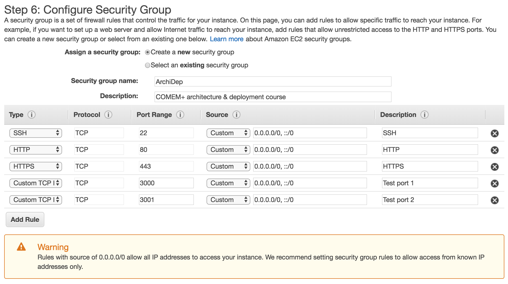

# COMEM+ Architecture & Deployment Exercises

<!-- START doctoc generated TOC please keep comment here to allow auto update -->
<!-- DON'T EDIT THIS SECTION, INSTEAD RE-RUN doctoc TO UPDATE -->

- [Version control](#version-control)
  - [Collaborative exercise (graded)](#collaborative-exercise-graded)
  - [Clone a repository from a server](#clone-a-repository-from-a-server)
  - [Push a repository to a server](#push-a-repository-to-a-server)
- [Basic deployment](#basic-deployment)
  - [Run your own virtual server on Amazon Web Services](#run-your-own-virtual-server-on-amazon-web-services)
  - [Run a simple PHP application on the server](#run-a-simple-php-application-on-the-server)
    - [Upload it with Git](#upload-it-with-git)

<!-- END doctoc generated TOC please keep comment here to allow auto update -->

## Version control

### Collaborative exercise (graded)

Follow the instructions in the [exercise repository][php-todo-ex].

### Clone a repository from a server

The goal of this exercise is to demonstrate how to retrieve a project's source code with Git while connected to a remote server.

Perform the following tasks:

* Connect to the `archidep-2018.media` exercise server with SSH.
* Clone your team's solution repository from the collaborative exercise somewhere in your home directory.
  * If you have not completed the collaborative exercise, you can try doing the same with the [base repository][php-todo-ex].

### Push a repository to a server

The goal of this exercise is to demonstrate how to push a project's source code to a server with Git, from your local machine.

Perform the following tasks:

* Connect to the `archidep-2018.media` exercise server with SSH.
* Create a new empty repository in your home directory.
  * *Hint:* use the `mkdir`, `cd` and `git init` commands.
* Switch to another branch in the repository.

  (This is necessary because Git will not let you push to a branch that is checked out (it could overwrite files).
  Since we want to push the master branch to the server later, you must switch to another branch first.)
  * *Hint:* use the `git checkout -b` command.
* Disconnect from the exercise server.
* Move into your team's solution repository from the collaborative exercise.
  * If you have not completed the collaborative exercise, you can clone the [base repository][php-todo-ex] instead with the `git clone` command, and move into that.
* Add a new remote pointing to the repository you created on the exercise server.
  * *Hint:* the command to add a remote is `git remote add <name> <url>`
  * *Hint:* the URL syntax for an SSH remote is `ssh://user@host/path/to/repo`
* Push the `master` branch to the new remote.
  * *Hint:* the syntax of the push command is `git push [origin] [branch]`
* Connect to the `archidep-2018.media` exercise server with SSH.
* Move into the repository you created earlier.
* Checkout the `master` branch and make sure your code is there (e.g. with `ls`).

## Basic deployment

### Run your own virtual server on Amazon Web Services

* Register an [AWS account](https://portal.aws.amazon.com/billing/signup#/start).
  * Apply for [AWS Educate](https://aws.amazon.com/education/awseducate/apply/) if you are a student.
* Access the [EC2 Dashboard](https://eu-west-1.console.aws.amazon.com/ec2).
* Select the **EU Ireland region** at the top right of the screen in the menu bar.
  It is the cheapest european region.
* (Optionally) [import your public key](https://eu-west-1.console.aws.amazon.com/ec2) under **Key Pairs** so that you don't have to create a new one.
* Go to [**Instances**](https://eu-west-1.console.aws.amazon.com/ec2) and **launch an instance**.
  * Step 1: Search and select the following Ubuntu AMI: `Ubuntu Server 18.04 LTS (HVM), SSD Volume Type`.
    Use the default 64-bit (x86).
  * Step 2: Select the `t2.micro` instance type.
  * Step 3: Leave the default instance details.
  * Step 4: Leave the default storage configuration.
  * Step 5: (Optionally) add a `Name` tag to easily identify your instance.
  * Step 6: Create a security group with the following inbound ports open: 22, 80, 443, 3000 & 3001.

    

    The security warning indicates that it's good practice
    to limit the IP addresses authorized to access your virtual server.
    You may do so if you wish, but it's not necessary for this course.
  * Step 7: Launch the virtual server.

    Select the public key you imported or create a new one.
    If you create a new one, you will have to download it and use it to connect to the server.
* TODO: allocate & associate IP address
* TODO: connect with SSH
* TODO: add the course's key to the ubuntu user's authorized keys

### Run a simple PHP application on the server

* Install & configure MySQL.
* Install PHP.
* Upload the todolist with SFTP.
* Run it with the PHP development server on port 3000.

#### Upload it with Git

* Create a bare repository on the server.
* Add a remote in your local repository.
* Push the code to the server.
* Checkout the code on the server.
* Run it with the PHP development server on port 3000.

[php-todo-ex]: https://github.com/MediaComem/comem-archidep-php-todo-exercise
