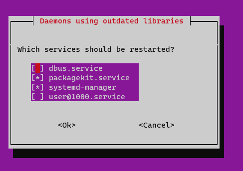

# System Administration Cheatsheet

Useful commands to manage a Unix system.

<!-- START doctoc generated TOC please keep comment here to allow auto update -->
<!-- DON'T EDIT THIS SECTION, INSTEAD RE-RUN doctoc TO UPDATE -->

- [Legend](#legend)
- [How to I connect to my server with SSH? (`ssh`)](#how-to-i-connect-to-my-server-with-ssh-ssh)
- [Who am I? (`whoami` & `id`)](#who-am-i-whoami--id)
- [How do I change my password? (`passwd`)](#how-do-i-change-my-password-passwd)
- [Administration](#administration)
  - [How do I change my username? (`usermod`)](#how-do-i-change-my-username-usermod)
  - [How do I create another user? (`useradd`)](#how-do-i-create-another-user-useradd)
  - [How do I find and kill a naughty process? (`ps`, `kill`)](#how-do-i-find-and-kill-a-naughty-process-ps-kill)
  - [The changes to my systemd service are not taken into account! (`systemctl daemon-reload`)](#the-changes-to-my-systemd-service-are-not-taken-into-account-systemctl-daemon-reload)
  - [My systemd service is not working! (`systemctl status` & `journalctl`)](#my-systemd-service-is-not-working-systemctl-status--journalctl)
- [Installing & upgrading](#installing--upgrading)
  - [How do I know what is installed? (`apt list`)](#how-do-i-know-what-is-installed-apt-list)
  - [How do I find new stuff to install? (`apt search`, `apt info`, `apt show`)](#how-do-i-find-new-stuff-to-install-apt-search-apt-info-apt-show)
  - [How do I install stuff? (`apt install`)](#how-do-i-install-stuff-apt-install)
  - [How do I keep my server up-to-date? (`apt update`, `apt upgrade` & `apt full-upgrade`)](#how-do-i-keep-my-server-up-to-date-apt-update-apt-upgrade--apt-full-upgrade)
    - [:boom: Daemons using outdated libraries](#boom-daemons-using-outdated-libraries)
    - [:boom: System restart required](#boom-system-restart-required)
  - [How do I get rid of stuff? (`apt remove` & `apt autoremove`)](#how-do-i-get-rid-of-stuff-apt-remove--apt-autoremove)
  - [What about `apt-get` and `apt-cache`?](#what-about-apt-get-and-apt-cache)
- [My `post-receive` Git hook is not executing!](#my-post-receive-git-hook-is-not-executing)
- [Add swap space to your cloud server](#add-swap-space-to-your-cloud-server)

<!-- END doctoc generated TOC please keep comment here to allow auto update -->

## Legend

Parts of this guide are annotated with the following icons:

- :warning: **Critically important information**
- :gem: Tips.
- :space_invader: More advanced tips on how to save some time.
- :books: Additional information that you can read if you want to know more
  about the commands and tools mentioned.
- :boom: Troubleshooting tips: how to fix common problems you might encounter.

## How to I connect to my server with SSH? (`ssh`)

Connect to the server at the IP address `W.X.Y.Z` as the `john_doe` user:

```bash
$> ssh john_doe@W.X.Y.Z
```

Connect to the server at the domain `example.com` as the `john_doe` user:

```bash
$> ssh john_doe@example.com
```

## Who am I? (`whoami` & `id`)

If you don't remember who you are currently logged in (and have forgotten that
this information is generally displayed at the very start of your prompt), you
can use the `whoami` command:

```bash
$> whoami
jde
```

You can also use the `id` command which also shows the GID (**g**roup **ID**) of
your user's main group, and also the other groups your user may belong to:

```bash
$> id
uid=1000(jde) gid=1000(jde) groups=1000(jde),4(adm),24(cdrom),27(sudo),30(dip),105(lxd)
```

## How do I change my password? (`passwd`)

```bash
$> passwd
```

## Administration

You must be an administrator (have `sudo` access) to perform the following
operations.

### How do I change my username? (`usermod`)

The following command renames the `oldname` user account into `newname` and also
renames the user's home directory at the same time:

```bash
$> sudo usermod --login newname --home /home/newname --move-home oldname
```

You also have to rename the associated group:

```bash
$> sudo groupmod --new-name newname oldname
```

### How do I create another user? (`useradd`)

```bash
$> useradd --create-home --shell /bin/bash jane_doe
```

### How do I find and kill a naughty process? (`ps`, `kill`)

You might need this if you lost your SSH connection after you launched a process
which listens on a port, e.g. 3000. If the process still runs, the port is no
longer available. This could happen, for example, in the ["Deploy a PHP
application with SFTP" exercise][sftp-deploy-ex].

Find the process with `ps` and `grep`:

```bash
$> ps -ef | grep php
root     20942     1  0 Dec06 ?        00:00:24 php-fpm: master process (/etc/php/7.2/fpm/php-fpm.conf)
www-data 20960 20942  0 Dec06 ?        00:00:00 php-fpm: pool www
www-data 20961 20942  0 Dec06 ?        00:00:00 php-fpm: pool www
john_doe 26378 26365  0 10:02 pts/0    00:00:00 php -S 0.0.0.0:3000
```

In this example based on the ["Deploy a PHP application with SFTP"
exercise][sftp-deploy-ex], the process that interests you is the fourth one,
which was launched by the `php -S 0.0.0.0:3000` command as shown in the last
column, and has the Process ID `26378`. The other PHP processes are unrelated to
what you were doing, so you should not touch them.

Now that you have the ID of the naughty process, you can kill it:

```bash
$> kill 26378
```

If you check the list of processes again, it should no longer be there. If it
does not want to die, you can kill it more violently:

```bash
$> kill -KILL 26378
```

### The changes to my systemd service are not taken into account! (`systemctl daemon-reload`)

Every time you change a systemd unit file, you must tell systemd to reload its
configuration with the following command:

```bash
sudo systemctl daemon-reload
```

You should also restart your service. Assuming it is defined by the file
`/etc/systemd/system/foo.service`, you can do so with the following command:

```bash
sudo systemctl restart foo
```

### My systemd service is not working! (`systemctl status` & `journalctl`)

Assuming your service is defined by the file `/etc/systemd/system/foo.service`,
you should first check its status with the following command:

```bash
sudo systemctl status foo
```

This shows you whether your service is active (running) and whether it is
enabled (to restart at boot). When there is a problem, it may also show you the
error that caused to the service to fail to start.

If you cannot find a clear problem from the status information, you should look
at the system logs for that service:

```bash
sudo journalctl -u foo
```

Not all services log there, however. If `journalctl` displays no log entries,
you should look in the standard Linux log directory `/var/log` for a file or a
directory named after your service. For example, nginx stores its error logs in
`/var/log/nginx/error.log` by default.

If your service cannot start, you should be able to find an error from one of these sources.

## Installing & upgrading

You must be an administrator (have `sudo` access) to perform some of the
following operations.

### How do I know what is installed? (`apt list`)

List all installed packages:

```bash
$> apt list --installed
Listing...
accountsservice/bionic,now 0.6.45-1ubuntu1 amd64 [installed]
acl/bionic,now 2.2.52-3build1 amd64 [installed]
acpid/bionic,now 1:2.0.28-1ubuntu1 amd64 [installed]
...
```

Find something more specific by combining with `grep`:

```bash
$> apt list --installed | grep ssh
libssh-4/noble,now 0.10.6-2build2 amd64 [installed,automatic]
openssh-client/noble-updates,now 1:9.6p1-3ubuntu13.5 amd64 [installed,automatic]
openssh-server/noble-updates,now 1:9.6p1-3ubuntu13.5 amd64 [installed]
openssh-sftp-server/noble-updates,now 1:9.6p1-3ubuntu13.5 amd64 [installed]
ssh-import-id/noble,now 5.11-0ubuntu2 all [installed]
```

### How do I find new stuff to install? (`apt search`, `apt info`, `apt show`)

Search for packages by name:

```bash
$> apt search tldr
Sorting... Done
Full Text Search... Done
...

tealdeer/noble 1.6.1-4build2 amd64
  simplified, example based and community-driven man pages
```

Find out more about a package with `apt info` or `apt show` (equivalent):

```bash
$> apt info tealdeer
Package: tealdeer
Version: 1.6.1-4build2
...
Installed-Size: 3,124 kB
Depends: libc6 (>= 2.34), libgcc-s1 (>= 4.2), libssl3t64 (>= 3.0.0)
Homepage: https://github.com/dbrgn/tealdeer/
...
Description: simplified, example based and community-driven man pages
 tealdeer is a very fast CLI implementation of tldr, the collaborative
 cheatsheets of console commands.
 .
 The executable is named tldr.
```

### How do I install stuff? (`apt install`)

Install a new package:

```bash
$> sudo apt install cowsay
Reading package lists... Done
Building dependency tree
Reading state information... Done
The following NEW packages will be installed:
  cowsay
0 upgraded, 1 newly installed, 0 to remove and 4 not upgraded.
Need to get 17.7 kB of archives.
After this operation, 89.1 kB of additional disk space will be used.
```

> :books: More complex packages with list their dependencies and ask you to
> confirm that you really want to install everything.

If the package provides a command, you can then use it to make sure your
installation worked:

```bash
$> cowsay hello
 _______
< hello >
 -------
        \   ^__^
         \  (oo)\_______
            (__)\       )\/\
                ||----w |
                ||     ||
```

### How do I keep my server up-to-date? (`apt update`, `apt upgrade` & `apt full-upgrade`)

You might have noticed that the `list` and `show` commands are quite fast.
That's because they **don't fetch any data from the network**: the package lists
and package information is stored locally on the computer.

Of course, **this local information becomes out of date** as new package
versions are released to the official package repositories. You can update your
local information with `apt update` (which requires superuser privileges):

```bash
$> sudo apt update
Hit:1 http://azure.archive.ubuntu.com/ubuntu noble InRelease
Get:2 http://azure.archive.ubuntu.com/ubuntu noble-updates InRelease [126 kB]
Hit:3 http://azure.archive.ubuntu.com/ubuntu noble-backports InRelease
Get:4 http://azure.archive.ubuntu.com/ubuntu noble-security InRelease [126 kB]
Get:5 http://azure.archive.ubuntu.com/ubuntu noble-updates/main amd64 Packages [538 kB]
Get:6 http://azure.archive.ubuntu.com/ubuntu noble-updates/main Translation-en [132 kB]
Get:7 http://azure.archive.ubuntu.com/ubuntu noble-security/main amd64 Packages [382 kB]
Get:8 http://azure.archive.ubuntu.com/ubuntu noble-security/main Translation-en [84.0 kB]
Fetched 1,388 kB in 1s (1,855 kB/s)
Reading package lists... Done
Building dependency tree... Done
Reading state information... Done
2 packages can be upgraded. Run 'apt list --upgradable' to see them.
```

You now have up-to-date information about all available packages. You can list
available upgrades with the `apt list` command:

```bash
$> apt list --upgradable
Listing... Done
cloud-init/noble-updates 24.3.1-0ubuntu0~24.04.2 all [upgradable from: 24.2-0ubuntu1~24.04.2]
mdadm/noble-updates 4.3-1ubuntu2.1 amd64 [upgradable from: 4.3-1ubuntu2]
```

When you have packages to upgrade, you could of course manually `apt install`
each of them, but there are also two helpful commands that can do it for you:

* `apt upgrade`

  This command will upgrade all packages that have new versions, installing any
  new dependencies that may be required.

  However, it will behave conservatively and **never remove packages that are
  currently installed**. This is to avoid problems in case new versions of your
  installed packages have widely different dependencies.
* `apt full-upgrade`

  This command will do the same as `apt upgrade`, but in addition, it will
  automatically remove any packages that were dependencies of previous versions
  of your packages but are no longer needed by the new versions.

The second is "more dangerous" as you have to make sure that none of the removed
packages will impact your computer. Use it with caution.

> :warning: **A word of caution:** do not install or upgrade packages without at
> least a basic understanding of what they do and how they might be used by your
> operating system and applications. Otherwise you risk breaking your system.

#### :boom: Daemons using outdated libraries

When you install or upgrade a package, it *may* prompt you to reboot and/or to
restart outdated daemons (i.e. background services):



Simply select "Ok" by pressing the Tab key, then press Enter to confirm.

> :books: This happens either because you have installed a new background
> service, or because your Linux distribution uses [unattended
> upgrades](linux-unattended-upgrades): a tool that automatically installs daily
> security upgrades on your server without human intervention. Sometimes, some
> of the background services running on your server need to be restarted for
> upgrades to be applied.
>
> Rebooting your server would also have the effect of restarting these services
> and applying the security upgrades.

#### :boom: System restart required

Some packages can be upgraded in place. Other packages may **require the
computer to be restarted** for the upgrade to take effect.

When that is the case, there will be a warning on the shell every time you
connect:

```bash
$> ssh jde@archidep.ch
Welcome to Ubuntu
...
**** System restart required ***
```

This means that the upgrade process will only be complete once you restart the
computer with `sudo reboot`.

### How do I get rid of stuff? (`apt remove` & `apt autoremove`)

Uninstall a package:

```bash
$> sudo apt remove cowsay
Reading package lists... Done
Building dependency tree... Done
Reading state information... Done
The following packages will be REMOVED:
  cowsay
0 upgraded, 0 newly installed, 1 to remove and 2 not upgraded.
After this operation, 93.2 kB disk space will be freed.
Do you want to continue? [Y/n] y
(Reading database ... 64682 files and directories currently installed.)
Removing cowsay (3.03+dfsg2-8) ...
Processing triggers for man-db (2.12.0-4build2) ...
```

> :gem: This command will uninstall binaries but not configuration files. Use
> `apt purge <name>` to also remove the configuration files.

The `apt autoremove` command cleans up packages that were previously required
but are no longer useful. Most of the time, there will probably be nothing to
remove:

```bash
$> sudo apt autoremove
Reading package lists... Done
Building dependency tree... Done
Reading state information... Done
0 upgraded, 0 newly installed, 0 to remove and 2 not upgraded.
```

> :gem: It's good practice to run `apt autoremove` after an upgrade and reboot,
> to make sure there are no unused packages taking up space on the computer.

### What about `apt-get` and `apt-cache`?

The `apt` command is actually a higher-level frontend to the older and
lower-level `apt-get` and `apt-cache` command. `apt` is simpler to user, but you
will find many examples of these older commands on the internet.

They are mostly equivalent:

`apt` command      | older equivalent
:---               | :---
`apt list`         | `dpkg -l`
`apt search`       | `apt-cache search`
`apt install`      | `apt-get install`
`apt update`       | `apt-get update`
`apt upgrade`      | `apt-get upgrade`
`apt full-upgrade` | `apt-get dist-upgrade`

> :gem: You can also see these equivalent commands with `man apt`.

## My `post-receive` Git hook is not executing!

When you push to a remote (`foo` in this example), you may get this message:

```bash
$> git push foo main
Everything up-to-date
```

This means that you have no new commits to push. Therefore the `post-receive`
hook is not triggered since nothing new was received by the repository on the
server.

You need to make and commit a change before you push, so that new commits will
be sent.

> If you have no changes to make and just want to test your hook, you may also
> create an empty commit with the following command:
>
> ```bash
> git commit --allow-empty -m "Test hook"
> ```
>
> This will give you a new commit to push without actually making a change.

## Add swap space to your cloud server

The cloud servers used in this course do not have enough memory (RAM) to
run/compile many things at once. But you can easily add **swap space** to solve
this issue.

> [Swap
> space](https://web.mit.edu/rhel-doc/5/RHEL-5-manual/Deployment_Guide-en-US/ch-swapspace.html)
> in Linux is used when there is no more available physical memory (RAM). If the
> system needs more memory resources and the RAM is full, inactive pages in
> memory are moved to the swap space (on disk).

Adding 2 gigabytes of swap space should be enough for our purposes.

Run the following commands to make sure you disable any previous swap file you
might have created during the exercises:

```bash
# (It's okay if this command produces an error.)
$> sudo swapoff /swapfile
$> sudo rm -f /swapfile
```

Use the following commands to create and mount a 2-gigabyte swap file:

```bash
$> sudo fallocate -l 2G /swapfile
$> sudo chmod 600 /swapfile
$> sudo mkswap /swapfile
Setting up swapspace version 1, size = 2 GiB (2147479552 bytes)
no label, UUID=3c263053-41cc-4757-0000-13de0644cf97
$> sudo swapon /swapfile
```

You can verify that the swap space is correctly mounted by displaying available
memory with the `free -h` command. You should see the `Swap` line indicating the
amount of swap space you have added:

```bash
$> free -h
              total        used        free      shared  buff/cache   available
Mem:          914Mi       404Mi       316Mi        31Mi       193Mi       331Mi
Swap:         2.0Gi       200Mi       1.8Gi
```

This swap space is temporary by default and will only last until your reboot
your server. To make it permanent, you must tell your server to mount it on
boot.

You can see the currently configured mounts with this command (the output may
not be exactly the same):

```bash
$> cat /etc/fstab
# CLOUD_IMG: This file was created/modified by the Cloud Image build process
UUID=b1983cef-43a3-46ac-0000-b5e06a61c9fd       /        ext4   defaults,discard        0 1
UUID=0BC7-0000  /boot/efi       vfat    umask=0077      0 1
/dev/disk/cloud/azure_resource-part1    /mnt    auto    defaults,nofail,x-systemd.requires=cloud-init.service,comment=cloudconfig       0       2
```

:warning: :warning: :warning: **WARNING: BE VERY CAREFUL TO EXECUTE THE
FOLLOWING COMMAND EXACTLY AS IS.** _(Corrupting your `/etc/fstab` file can
prevent your server from rebooting.)_ :warning: :warning: :warning:

To make the swap space permanent, execute the following command to add the
appropriate line to your server's `/etc/fstab` file:

```bash
$> echo "/swapfile none swap sw 0 0" | sudo tee -a /etc/fstab
```

This line tells your server to mount the swap file you have created as swap
space on boot. You should see the new line at the end of the `/etc/fstab` file
if you display its contents again:

```bash
$> cat /etc/fstab
# CLOUD_IMG: This file was created/modified by the Cloud Image build process
UUID=b1983cef-43a3-46ac-0000-b5e06a61c9fd       /        ext4   defaults,discard        0 1
UUID=0BC7-08EF  /boot/efi       vfat    umask=0077      0 1
/dev/disk/cloud/azure_resource-part1    /mnt    auto    defaults,nofail,x-systemd.requires=cloud-init.service,comment=cloudconfig       0       2
/swapfile none swap sw 0 0
```

You can run the following command to check that you did not make any mistakes.
It's okay if you have a couple of warnings about the swap file. These are
expected since you've just added it and have not rebooted yet.

```bash
$> sudo findmnt --verify --verbose
/
   [ ] target exists
   [ ] FS options: discard,commit=30,errors=remount-ro
   [ ] UUID=bf171e20-4158-4861-0000-1443ece8c413 translated to /dev/sda1
   [ ] source /dev/sda1 exists
   [ ] FS type is ext4
...
none
   [W] non-bind mount source /swapfile is a directory or regular file
   [ ] FS type is swap
   [W] your fstab has been modified, but systemd still uses the old version;
       use 'systemctl daemon-reload' to reload

0 parse errors, 0 errors, 2 warnings
```

**IF everything looks ok**, reboot your server:

```bash
$> sudo reboot
```

Reconnect to your server over SSH and run the `free -h` command again. The swap
space should still be enabled after reboot:

```bash
$> free -h
              total        used        free      shared  buff/cache   available
Mem:          914Mi       404Mi       316Mi        31Mi       193Mi       331Mi
Swap:         2.0Gi       200Mi       1.8Gi
```

> You can also see the currently available swap space and how much is used
> with the `htop` command which shows it as the `Swp` bar at the top (you can quit
> it with `q` once it is open).
>
> For more information, see the [fstab Linux man
> page](https://man7.org/linux/man-pages/man5/fstab.5.html) and [How to Add Swap
> Space on Ubuntu
> 20.04](https://www.digitalocean.com/community/tutorials/how-to-add-swap-space-on-ubuntu-20-04).

[sftp-deploy-ex]: ./ex/sftp-deployment.md
