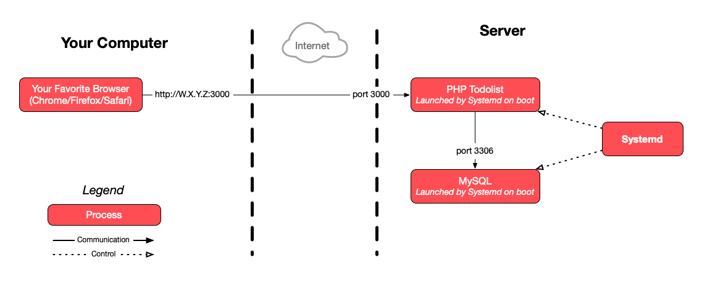
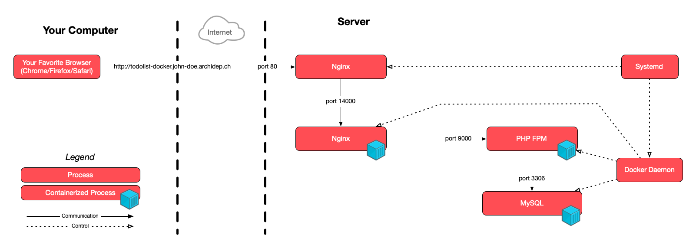

# Test Matter

This guide describes the concepts you must know for this course's written evaluation.
It also indicates what you do not need to remember by heart.

<!-- START doctoc generated TOC please keep comment here to allow auto update -->
<!-- DON'T EDIT THIS SECTION, INSTEAD RE-RUN doctoc TO UPDATE -->

- [Plan](#plan)
  - [Introduction](#introduction)
  - [Version control](#version-control)
  - [Security](#security)
  - [Basic deployment](#basic-deployment)
  - [Advanced deployment](#advanced-deployment)
  - [Automated deployment](#automated-deployment)
  - [Managed Deployments](#managed-deployments)
- [Exercices](#exercices)
- [Architecture](#architecture)
  - [Examples](#examples)

<!-- END doctoc generated TOC please keep comment here to allow auto update -->

## Plan

### Introduction

  - [Command line](https://mediacomem.github.io/comem-archidep/2023-2024/subjects/cli?home=MediaComem%2Fcomem-archidep%23readme)

    You must know:

    - What a command line interface is, what a command is, and general command syntax.
    - What the Unix paths `.`, `..` and `~` are.
    - The difference between a relative and an absolute path.
    - What the following commands do and their basic syntax (not their options): `cd`, `ls`, `pwd`, `touch`, `mkdir`, `cat`.
    - What the `PATH` is and how it works.

    You do not need to know:

    - The history of computer interfaces.
    - Vim or nano usage.
    - The specifics of particular commands.

  - [Shell scripting](https://mediacomem.github.io/comem-archidep/2023-2024/subjects/shell-scripting?home=MediaComem%2Fcomem-archidep%23readme)

    You must know:

    - What a shell script is.
    - What a shebang is.

    You do not need to know:

    - The shell script basics.

  - [Secure Shell (SSH)](https://mediacomem.github.io/comem-archidep/2023-2024/subjects/ssh?home=MediaComem%2Fcomem-archidep%23readme)

    You must know:

    - What SSH is and what is is used for.
    - The fact that establishing the secure channel and authenticating are 2 separate processes.
    - The basic syntax of the SSH command: `ssh user@hostname`.
    - The difference between password authentication and public key authentication,
      and how to use a private and public key pair in the context of SSH authentication.
    - That when SSH warns you that host authenticity cannot be established the
      first time you connect to a server, it is your responsibility to verify
      that the server's public key is the correct one before answering yes.
      Otherwise, you expose yourself to a Man-in-the-Middle (MitM) attack.

    You do not need to know:

    - How various cryptographic techniques are used to establish SSH's secure
      channel.
    - The syntax of the `scp` command
    - How to use an SSH agent.

### Version control

  - [Version control with Git](https://mediacomem.github.io/comem-archidep/2023-2024/subjects/git?home=MediaComem%2Fcomem-archidep%23readme)

    You must know:

    - What version control is.
    - What Git is and what its basic components are
      (the Git directory, the staging area and the working directory).
    - The basic Git workflow.
    - The purpose (but not the syntax or options) of the main Git subcommands used to perform that workflow:
      - `git checkout`
      - `git add`
      - `git commit`
    - The purpose (but not the syntax or options) of the other basic Git subcommands:
      - `git init`
      - `git log`
      - `git status`
    - How to ignore files with Git.

    You do not need to know:

    - The history of version control systems.
    - Other Git subcommands and their syntax.
    - The global ignore file.

  - [Git branching](https://mediacomem.github.io/comem-archidep/2023-2024/subjects/git-branching?home=MediaComem%2Fcomem-archidep%23readme)

    You must know:

    - What Git branching is and why it is useful.
    - That any repository has a main branch (usually called `main` or `master`).

    You do not need to know:

    - How to work with branches.
    - How to manage merge conflicts.

  - [Collaborating with Git](https://mediacomem.github.io/comem-archidep/2023-2024/subjects/git-collaborating?home=MediaComem%2Fcomem-archidep%23readme)

    You must know:

    - What a Git remote is.
    - The purpose (but not the syntax or options) of the Git subcommands used to work with remotes:
      - `git clone`
      - `git push`
      - `git pull`
    - The reasons why GitHub may refuse a push
      (either your repository is out of date,
      or you have a divergent history that would not result in a fast-forward).

    You do not need to know:

    - The precise syntax of the Git subcommands.

### Security

  - [Open Web Application Security Project][owasp]

    You must know what is the goal of the OWASP organization.

  - [OWASP Top 10 - The Ten Most Critical Web Application Security Risks][owasp-top10]

    You must know:

    - That the OWASP Top 10 list exists and that it lists the ten most critical web application security risks.

    You do not need to know:

    - The list of attacks or the details of those attacks.

  - The Root Image Gallery security demonstration

    You must know:

    - Why it's not a good idea to run a web application (or any application in
      general) as `root`.

  - The CSRF security demonstration

    You must know:

    - That the OWASP organization has resouces to help you know about and
      protect against attacks on web applications.

    You do not need to know:

    - The specifics of the CSRF attack or the demonstration made during the
      course. (Although it is a good thing to know, and the attack is
      [documented by OWASP](https://owasp.org/www-community/attacks/csrf).)

### Basic deployment

  - [Cloud computing](https://mediacomem.github.io/comem-archidep/2023-2024/subjects/cloud?home=MediaComem%2Fcomem-archidep%23readme)

    You must know:

    - What a client and a server is.
    - The difference between types of web hosting
      (shared hosting, dedicated hosting and virtual hosting).
    - What cloud computing is and why it is useful.
    - What a public cloud is.
    - What are the 3 most popular cloud service models (IaaS, PaaS and SaaS),
      what the difference between them are, and what are their advantages and disadvantages.

    You do not need to know:

    - What are private clouds, hybrid clouds or other cloud deployment models.
    - The FaaS and MBaaS service models.
    - The diagrams on the "How does IaaS/PaaS/FaaS/MBaaS work?" slides.
    - Service-oriented architecture (SOA), microservices or serverless computing.

  - [Linux](https://mediacomem.github.io/comem-archidep/2023-2024/subjects/linux?home=MediaComem%2Fcomem-archidep%23readme)

    You must know:

    - What Linux is and how it relates to Unix.
    - That Ubuntu is a Linux operating system.

    You do not need to know:

    - The history of Unix or Linux distributions.

  - [Unix basics & administration](https://mediacomem.github.io/comem-archidep/2023-2024/subjects/unix-admin?home=MediaComem%2Fcomem-archidep%23readme)

    You must know:

    - That Linux uses a case-sensitive file system by default.
    - That Unix-like systems use a rooted file system and that the path of the root directory is `/`.
    - What are users, groups and the superuser in a Unix-like system.
    - How file permissions are represented (`r`, `w`, `x` and the concept of owner, group and others).
    - What the `sudo` command is and how to use it.
    - What the `/etc/sudoers` file is in principle (not its syntax).
    - What the `chmod` and `chown` commands are in principle (not their syntax or options).

    You do not need to know:

    - The various types of file systems.
    - The `df` command, common Unix directories or Unix file types.
    - The syntax of the `/etc/sudoers` file.
    - The `su` command.
    - Unix user database files, user management commands, login users or system users.
    - The syntax of the `chmod` and `chown` commands (e.g. symbolic and octal modes).

  - [Unix processes](https://mediacomem.github.io/comem-archidep/2023-2024/subjects/unix-processes?home=MediaComem%2Fcomem-archidep%23readme)

    You must know:

    - What a process is.
    - What a process ID is.
    - What an exit status is and what is the difference between and exit status
      of zero and a non-zero exit status.
    - What a Unix pipeline is and the syntax used to pipe commands together.
    - What a Unix signal is and what the `kill` command does.

    You do not need to know:

    - The `ps`, `top`, `htop` and `free` commands.
    - How to retrieve the exit status from code.
    - What a Unix stream is or what are the 3 standard streams (standard input,
      standard output and standard error).
    - What stream redirection is.
    - The commands used in the pipeline exercise.
    - The list of Unix signals, or how to trap signals.

  - [Unix networking](https://mediacomem.github.io/comem-archidep/2023-2024/subjects/unix-networking?home=MediaComem%2Fcomem-archidep%23readme)

    You must know:

    - What HTTP and TCP are and how they are related.
    - What an IP address and a port is, and how they are related to TCP.
    - What is the hostname `localhost` and the IP address `127.0.0.1`.
    - What are the standard HTTP(S) ports (80 and 443).
    - What a well-known port or system port is and how they are different from other ports.
    - What the Domain Name System (DNS) is.

    You do not need to know:

    - IP networks, subnetworks, reserved address spaces or network address translation.
    - The list of registered port numbers (except ports 80 and 443).
    - The Unix networking commands (`ip`, `ping`, etc).

  - [APT](https://mediacomem.github.io/comem-archidep/2023-2024/subjects/apt?home=MediaComem%2Fcomem-archidep%23readme)
    You must know:

    - What APT is.

    You do not need to know:

    - The other package managers.
    - How to use the `apt` command line.

### Advanced deployment

  - [Twelve-factor app][12factor]

    You must know:

    - Why it is a good practice to store configuration in the environment rather
      than in code (factor 3).

    You do not need to know:

    - The other 11 factors.

  - [Unix environment variables](https://mediacomem.github.io/comem-archidep/2023-2024/subjects/unix-env-vars?home=MediaComem%2Fcomem-archidep%23readme)

    You must know:

    - What environment variables are and why they are useful.

    You do not need to know:

    - How to manage them.

  - [Linux process management](https://mediacomem.github.io/comem-archidep/2023-2024/subjects/linux-process-management?home=MediaComem%2Fcomem-archidep%23readme)

    You must know:

    - What a process manager is and that operating systems usually have one built in.
    - That Systemd is the standard process management tool on many Linux systems like Ubuntu.
    - That Systemd uses unit files to configure process management.
    - That you can use Systemd to control processes (start them, stop them, restart them, etc).

    You do not need to know:

    - The list of process managers or lightweight process managers.
    - The syntax of unit files or their location.
    - The syntax of systemd commands (`systemctl` and `journalctl`).

  - [Domain Name System (DNS)](https://mediacomem.github.io/comem-archidep/2023-2024/subjects/dns?home=MediaComem%2Fcomem-archidep%23readme)

    You must know:

    - What the Domain Name System (DNS) is.
    - What a DNS zone and a DNS zone file is.

    You do not need to know:

    - The syntax of DNS zone files and records.
    - How manage DNS on Gandi.

  - [Reverse proxying](https://mediacomem.github.io/comem-archidep/2023-2024/subjects/reverse-proxy?home=MediaComem%2Fcomem-archidep%23readme)

    You must know

    - What a reverse proxy is.
    - The main uses of a reverse proxy (hiding internal architecture or
      multi-component websites, SSL termination and load balancing).
    - That nginx is a web server and reverse proxy.

    You do not need to know:

    - What tunneling proxies, gateways or forward proxies are.
    - Other uses of reverse proxies (e.g. caching or optimization).
    - The paths to nginx configuration files or their syntax and directives.
    - That nginx uses configuration files and the difference between an
      available and an enabled configuration (i.e. how to use the
      `sites-available` and `sites-enabled` directories).

  - [TLS/SSL certificates](https://mediacomem.github.io/comem-archidep/2023-2024/subjects/ssl?home=MediaComem%2Fcomem-archidep%23readme)

    You must know:

    - What a TLS certificate is and what is is used for.
    - Why a TLS certificate is considered valid or invalid.
    - What a self-signed TLS certificate is.
    - What a chain of trust is in the context of TLS certificates.
    - What a root TLS certificate is.
      - What a trusted root certificate is.
    - What domain validation is.
      - At least one method of domain validation.
    - What Let's Encrypt and Certbot are in principle.

    You do not need to know:

    - The commands to generate or inspect TLS certificates.
    - How to configure nginx to use one.
    - About purchasing TLS certificates.

### Automated deployment

  - [Git hooks](https://mediacomem.github.io/comem-archidep/2023-2024/subjects/git-hooks?home=MediaComem%2Fcomem-archidep%23readme)

    You must know:

    - What a Git hook is.
    - When the `post-receive` hook is executed.

    You do not not need to know:

    - The list of Git hooks.
    - How to create a Git hook.

### Managed Deployments
  - [Platform-as-a-Service (PaaS)](https://mediacomem.github.io/comem-archidep/2023-2024/subjects/paas/?home=MediaComem%2Fcomem-archidep%23readme#1)

    You must know:

    - What Netlify is and how the platform works on principle.
    - What Render is and how the platform works on principle.
    - That you can configure environment variables for your Render applications.

    You do not need to know:

    - The getting started procedure.
    - The precise steps to configure environment variables.

  - [Docker](https://mediacomem.github.io/comem-archidep/2023-2024/subjects/docker/?home=MediaComem%2Fcomem-archidep%23readme#1)

    You must know:

    - The difference between a Virtual Machine and a Container
    - What a Docker Image is
    - What a Docker Container is.
    - The different parts of a Docker workflow.
    - What a Dockerfile is and what the `FROM`, `WORKDIR`, `COPY` and `CMD` instruction do.

    You do not need to know:

    - Other Dockerfile instructions.
    - Private Docker Image registries.

  - [Docker Compose](https://mediacomem.github.io/comem-archidep/2023-2024/subjects/docker/?home=MediaComem%2Fcomem-archidep%23readme#1)

    You must know:

    - The Docker philosophy.
    - What is the purpose of Docker Compose.
    - What a Compose file is in principle.
      - What is a Compose service.
    - What you can do with the Docker Compose commands (manage services).

    You do not need to know:

    - The syntax of Docker Compose commands and options.
    - The syntax of Compose files.

## Exercices

> The exercises of this course illustrate the theoretical concepts.
> You should understand the concepts behind what you did during the exercises,
> but you do not need to remember the exact commands used.

You must know how to deploy a PHP web application on a cloud platform
with the Infrastructure-as-a-Service (IaaS) service model,
which you put in practice during the following exercises:

- [Deploy a PHP application with SFTP](ex/sftp-deployment.md) [(architecture)](ex/sftp-deployment.md#architecture)
- [Deploy a PHP application with Git](ex/git-clone-deployment.md) [(architecture)](ex/git-clone-deployment.md#architecture)
- [Configure a PHP application through environment variables](ex/config-through-environment.md) [(architecture)](ex/config-through-environment.md#architecture)
- [Manage a PHP application with systemd as a Process Manager](ex/systemd-deployment.md) [(architecture)](ex/systemd-deployment.md#architecture)
- [Configure a domain name](ex/dns-configuration.md) [(architecture)](ex/dns-configuration.md#architecture)
- [Deploy a PHP application with nginx and the FastCGI process manager](ex/nginx-php-fpm-deployment.md) [(architecture)](ex/nginx-php-fpm-deployment.md#architecture)

You must understand how to use a reverse proxy to deploy several web sites or
applications on the same server and use other features such as SSL termination,
hiding multiple components or scaling, which you put in practice during the
following exercises:

- [Deploy a static site with nginx](ex/nginx-static-deployment.md) [(architecture)](ex/nginx-static-deployment.md#architecture)
- [Deploy a PHP application with nginx and the FastCGI process manager](ex/nginx-php-fpm-deployment.md) [(architecture)](ex/nginx-php-fpm-deployment.md#architecture)
- [Deploy WOPR, a Sinatra & Svelte web application with a Redis database](ex/wopr-deployment.md) [(architecture)](ex/wopr-deployment.md#books-architecture)
- [Deploy a multi-component web application with nginx](./ex/revprod-deployment.md) [(architecture)](ex/revprod-deployment.md#architecture)
- [Horizontally scale a web application with nginx as a load balancer](./ex/fibscale-deployment.md) [(architecture)](ex/fibscale-deployment.md#architecture)

You must understand how to set up automated deployments with Git hooks,
which you put in practice during the following exercises:

- [Set up an automated deployment with Git hooks](ex/git-automated-deployment.md) [(architecture)](ex/git-automated-deployment.md#architecture)
- [Deploy WOPR, a Sinatra & Svelte web application with a Redis database](ex/wopr-deployment.md) [(architecture)](ex/wopr-deployment.md#books-architecture)

You must understand how to deploy various applications to a cloud platform
with the Platform-as-a-Service (PaaS) service model, which you put in practice
during the following exercises:

- [Deploy a static site to Netlify](ex/netlify-static-deployment.md)
- [Deploy web applications with a database to Render](ex/render-database-deployment.md)

You must understand how to containerize various applications with Docker and
define a portable, easily deployable architecture with Docker Compose.

- [Containerize a static site using Docker](ex/docker-static.md)
- [Deploy a web application with Docker Compose](ex/docker-compose-todolist.md)

## Architecture

You must be capable of drawing a simple architecture diagram representing the
main processes involved in the deployments you have performed during the course,
and how they communicate or affect each other. Such a diagram should contain:

- The processes directly related to running and exposing the deployed
  application or website (e.g. the application, the reverse proxy).
- Processes that manage other processes (e.g. systemd).
- Communication between processes (e.g. the application accesses the database),
  and communication between processes and the outside world (e.g. a browser
  makes a request on a port which is handled by a specific process).

  > You do not need to know port numbers by heart except the two standard
  > HTTP(S) port. Other port numbers will be provided.

- Control relationships between processes (e.g. systemd manages the
  application).

You do not need to represent:

- Short-lived processes (e.g. short-lived commands executed to set up the
  deployment).
- Processes related to accessing your server (e.g. your terminal, SSH-related
  processes).
- The commands used to run each process.
- The configuration files involed.

You do not need to know how to represent a deployment using the PHP FastCGI
Process Manager (PHP-FPM).

When drawing processes, you can simplify by assuming that each program runs only
one process when executed.

### Examples

This is a simple architecture diagram representing the deployment performend in
the [_Deploy a PHP application with SFTP_](ex/sftp-deployment.md) exercise
(assuming the PHP development server running the todolist is listening on port
3000 and nothing else is deployed on the server):

This is a simple architecture diagram representing the deployment performed in
the [_Manage a PHP application with systemd as a Process
Manager_](ex/systemd-deployment.md) exercise (assuming nothing else is deployed
on the server):

This is a simple architecture diagram representing the deployment performed in
the [_Deploy a PHP application with Docker
Compose_](ex/docker-compose-todolist.md) exercise (assuming nothing else is
deployed on the server):

Check out the **architecture** links in the list of exercises for more examples
of architecture diagrams.

[12factor]: https://12factor.net
[owasp]: https://www.owasp.org/
[owasp-top10]: https://owasp.org/www-project-top-ten/
