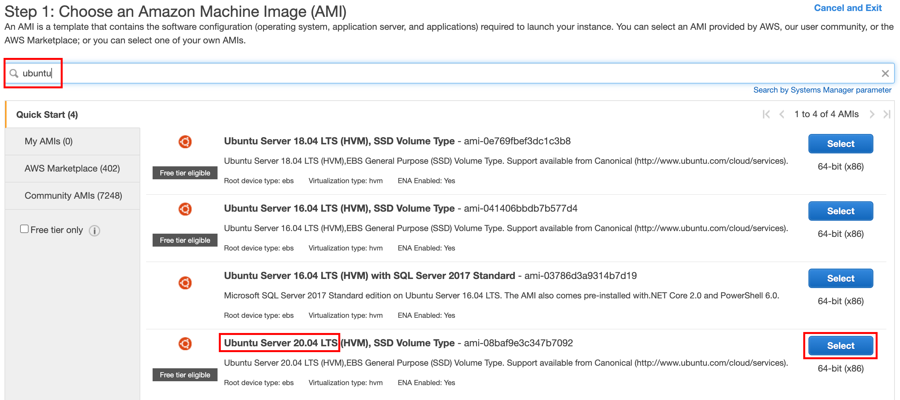

# Run your own virtual server on Amazon Web Services

This guide describes how to run a virtual server appropriate for the COMEM+ Architecture & Deployment course on the Amazon Web Services cloud platform.

<!-- START doctoc generated TOC please keep comment here to allow auto update -->
<!-- DON'T EDIT THIS SECTION, INSTEAD RE-RUN doctoc TO UPDATE -->


- [Apply for AWS Educate](#apply-for-aws-educate)
- [Launch a virtual server](#launch-a-virtual-server)
- [Associate an Elastic IP address with your virtual server](#associate-an-elastic-ip-address-with-your-virtual-server)
- [Configure your virtual server](#configure-your-virtual-server)
- [End result](#end-result)
- [Note: saving AWS Educate credits](#note-saving-aws-educate-credits)

<!-- END doctoc generated TOC please keep comment here to allow auto update -->


## Apply for AWS Educate

Apply for [AWS Educate](https://aws.amazon.com/education/awseducate/apply/),
which will provide you with free AWS resources as a student. Note that your
request must be approved manually, which may take a few days.

You will receive an email to complete the registration process once your
application has been approved.

> If you have a credit card, you may instead register a [standard AWS
> account](https://portal.aws.amazon.com/billing/signup#/start).
>
> You will be able to run a small *free* server that is sufficient for the needs
> of this course.


## Launch a virtual server

Once you have your AWS account, you can launch the virtual server you will be
using for the rest of the course.

* Access the EC2 Dashboard.

  If you are a student:

  * Log in to the third-party platform of AWS's educational partner, Vocareum.
    You should have received a link by email, or you can find it on the AWS
    Educate website once logged in.
  * Access the **AWS Console** from Vocareum. There should be a link in the home
    page.
  * Once you are in the AWS Console, find the **Services** menu at the top, and
    select the **EC2** service.

  > If you have a standard account with a credit card, you can follow [this
  > link](https://eu-west-1.console.aws.amazon.com/ec2) and log in normally.
* Most of the AWS resources you will use must be located in a
  [region](https://docs.aws.amazon.com/AmazonRDS/latest/UserGuide/Concepts.RegionsAndAvailabilityZones.html).

  If you are student, you probably only have access to one region. Use whatever
  region is available to you, usually **US East (N. Virginia)**, codenamed
  `us-east-1`.

  If you have standard account, you may select the **EU Ireland region**, the
  cheapest European region.

  
* [Import your public key](https://eu-west-1.console.aws.amazon.com/ec2) under
  **Key Pairs**.

  You can display your public key by running the following command in your
  terminal: `cat ~/.ssh/id_rsa.pub`.

  

  > This will allow you to connect to your virtual server over SSH once it's
  > launched.
* Go to [**Instances**](https://eu-west-1.console.aws.amazon.com/ec2) and
  **launch an instance**.

  

  > Launching an instance basically means creating a new virtual server in the
  > AWS infrastructure. You will have full root access to the server once it's
  > launched.

  * **Step 1:** Search and select the following Ubuntu AMI: `Ubuntu Server 18.04
    LTS (HVM), SSD Volume Type`. Use the default 64-bit (x86) version.

    
  * **Step 2:** Select the `t3.micro` instance type.

    
  * **Step 3:** Leave the default instance details.
  * **Step 4:** Leave the default storage configuration.
  * **Step 5:** Add a `Name` tag to easily identify your instance.

    
  * **Step 6:** Create a security group with the following inbound ports open: 22, 80, 443, 3000 & 3001.

    

    > What you are doing here is configuring the AWS firewall to allow incoming
    > traffic to your virtual server on specific ports. If you do not do this,
    > it will not be reachable from outside the AWS network. For example, for a
    > web application running on your virtual server to be reachable, ports 80
    > (HTTP) and 443 (HTTPS) must accept incoming requests. Port 22 is for SSH
    > connections. Ports 3000 & 3001 will be used in various exercises.

    > You may ignore the security warning. It indicates that it's good practice
    > to limit the IP addresses authorized to access your virtual server. For
    > the purposes of this course, it's simpler to allow anyone to connect from
    > any source IP address (which is what `0.0.0.0, ::/0` means).
  * **Step 7:** Launch the virtual server.

    

    Select the public key you imported.

    


## Associate an Elastic IP address with your virtual server

When you launch a new EC2 instance, it gets a random IP address. This IP address
may change every time you restart the server, which is not practical.

[Elastic IP
addresses](https://docs.aws.amazon.com/AWSEC2/latest/UserGuide/elastic-ip-addresses-eip.html)
are static IPv4 addresses for cloud computing. You can obtain one and associate
it to your virtual server for free. That way your server will have a fixed IP
address which persists across restarts.

* Go to **Elastic IPs** in the menu, and allocate a new IP address.

  
* Select the new IP address and associate it.

  

  Select the instance you just launched and its private IP address
  (*the values will _not be the same_ as in this screenshot*):

  

  Your instance now has a fixed public IP address on the Internet.


## Configure your virtual server

* Connect to your new instance over SSH.

  By default, the Ubuntu image you selected when you launched the server creates
  an `ubuntu` user.

  Assuming the instance's public IP address is `2.3.4.5` (replace with the
  elastic IP address you allocated):

  ```bash
  $> ssh ubuntu@2.3.4.5
  ```

  > You should be able to connect without a password. This works because you
  > gave your public SSH key to Amazon and selected it when you configured the
  > virtual server. It was automatically put in the `ubuntu` user's
  > `~/.ssh/authorized_keys` file when the server was launched, which allows you
  > to authenticate using your private SSH key.
* Once you are connected as `ubuntu`, run the following command to give the
  teacher access to your instance (be sure to copy the whole line):

  ```bash
  $> echo "ssh-rsa AAAAB3NzaC1yc2EAAAADAQABAAABAQCxDHpiwKjBPEQsxuYw6nQ4lA/gH9h00QkpVIptLewXFcO/hH8Dir+xvXWfiWe5J/dqAu76jYxDnlmtTyeKGHXRQExhKaX82Qu/krrnKbEotuRqp0hiDFzRLWuHAJ7ms5taDaJUQlu4YIOKsc87BkZz6DIcHRcGiNEnSi6iwhJGRjrP0IfQHtnilLypUfmru9SSNdedYdIIffgAcxJLu2ypC6pmEuV1VFBO1dZC40lP5e051ybbGH/Py1jk0hfjh1QP/W8sbiDsRkNaPYxT3X7CO751EHJKHQLMpCOed8zs9pU4KN6vXvCSj0Ppy0uPODE6cBpEjzYtHfbMz0EBCiGT comem-archidep" | sudo tee --append /home/ubuntu/.ssh/authorized_keys
  ```

  > This adds the teacher's public SSH key to the `ubuntu` user's
  > `~/.ssh/authorized_keys`, allowing the teacher to also authenticate to your
  > virtual server with his private SSH key.
* Create your own user and set a password. Assuming your username is `john_doe`
  (replace with your actual name):

  ```bash
  $> sudo useradd -m john_doe

  $> sudo passwd john_doe
  Enter new UNIX password:
  Retype new UNIX password:
  passwd: password updated successfully
  ```
* Set your new user's shell to Bash (instead of the default Bourne shell):

  ```bash
  $> sudo usermod -s /bin/bash john_doe
  ```
* Make your new user an administrator by adding it to the `sudo` group:

  ```bash
  $> sudo usermod -a -G sudo john_doe
  ```
* Copy the `ubuntu` user's authorized SSH keys file to your new user and fix its
  permissions:

  ```bash
  $> sudo mkdir -p /home/john_doe/.ssh

  $> sudo chown john_doe:john_doe /home/john_doe/.ssh

  $> sudo chmod 700 /home/john_doe/.ssh

  $> sudo cp /home/ubuntu/.ssh/authorized_keys /home/john_doe/.ssh/authorized_keys

  $> sudo chown john_doe:john_doe /home/john_doe/.ssh/authorized_keys
  ```

  > This will allow you to use the same private SSH key to authenticate as your
  > new user. The `chmod` (**ch**ange **mod**e, i.e. permissions) and `chown`
  > (**ch**ange **own**ership) commands are used to set the correct permissions
  > on the file, as SSH will refuse to read an `authorized_keys` file that is
  > accessible to other users.
  >
  > You will learn about Unix users, groups and permissions later in the course.
* Disconnect once you are done:

  ```bash
  $> exit
  ```
* Reconnect as your own user (again, replace `john_doe` and `2.3.4.5` by the appropriate values):

  ```bash
  $> ssh john_doe@2.3.4.5
  ```
* Change your hostname (note that you cannot use the `_` character in a hostname, use `-` instead):

  ```bash
  $> sudo hostname john-doe.archidep.online
  ```

  Also save your new hostname to the `/etc/hostname` file so that it will persist when you reboot the server:

  ```bash
  $> echo "john-doe.archidep.online" | sudo tee /etc/hostname
  ```
* Reboot the server.

  ```bash
  $> sudo reboot
  ```

* *Once the server has restarted* (it might take a couple of minutes), check
  that you can still connect and that your hostname is correct:

  ```bash
  $> ssh john_doe@2.3.4.5
  Welcome to Ubuntu 18.04.1 LTS
  ...

  $> hostname
  john-doe.archidep.online
  ```
* Send your instance's public IP address (the Elastic IP address you allocated)
  to the teacher.


## End result


> [PDF version](aws-setup.pdf).


## Note: saving AWS Educate credits

In order to spend as few AWS Educate credits as possible, you may stop your EC2
instance when you are done working, then re-start it when you need it again:


**Do NOT terminate the instance**, as that will delete all your data.

> Your EBS storage volume and unattached Elastic IP Address will still consume
> credits with a stopped instance, but at about half the rate for the suggested
> `t3.micro` instance with 8 gigabytes of storage.
