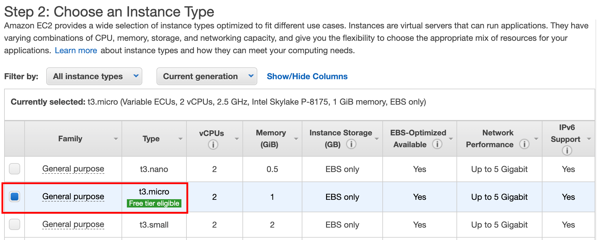
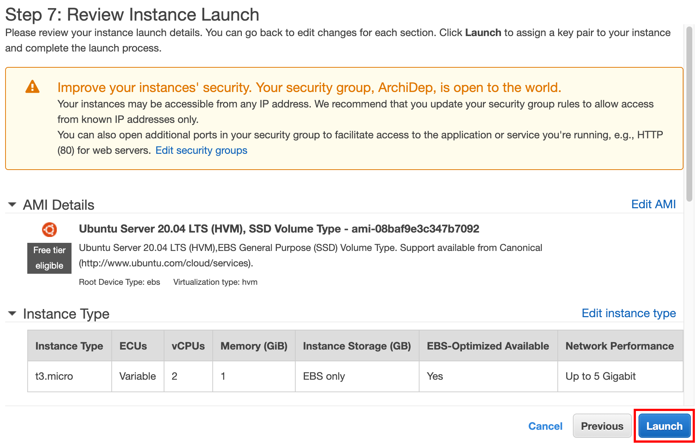

# Run your own virtual server on Amazon Web Services

This guide describes how to run a virtual server appropriate for the COMEM+ Architecture & Deployment course on the Amazon Web Services cloud platform.

<!-- START doctoc -->
<!-- END doctoc -->

* Apply for [AWS Educate](https://aws.amazon.com/education/awseducate/apply/) if you are a student.
  * If you have a credit card, you can register a [standard AWS account](https://portal.aws.amazon.com/billing/signup#/start) instead.

    You will be able to run a small *free* server that is sufficient for the needs of this course.
* Access the [EC2 Dashboard](https://eu-west-1.console.aws.amazon.com/ec2).
* Select the **EU Ireland region** if you have a standard account at the top right of the screen in the menu bar.
  It is the cheapest european region.

  If you have a student account, you can use whatever region is available to you instead.

  
* [Import your public key](https://eu-west-1.console.aws.amazon.com/ec2) under **Key Pairs** so that you don't have to create a new one.

  You can display your public key by running the following command in your terminal: `cat ~/.ssh/id_rsa.pub`.

  

  This will make it simpler for you to connect to your virtual server once it's launched.
* Go to [**Instances**](https://eu-west-1.console.aws.amazon.com/ec2) and **launch an instance**.

  
  * **Step 1:** Search and select the following Ubuntu AMI: `Ubuntu Server 18.04 LTS (HVM), SSD Volume Type`.
    Use the default 64-bit (x86) version.

    
  * **Step 2:** Select the `t2.micro` instance type.

    
  * **Step 3:** Leave the default instance details.
  * **Step 4:** Leave the default storage configuration.
  * **Step 5:** Add a `Name` tag to easily identify your instance.

    
  * **Step 6:** Create a security group with the following inbound ports open: 22, 80, 443, 3000 & 3001.

    

    The security warning indicates that it's good practice
    to limit the IP addresses authorized to access your virtual server.
    You may do so if you wish, but it's not necessary for this course.
  * **Step 7:** Launch the virtual server.

    

    Select the public key you imported.

    
* Go to **Elastic IPs** in the menu, and allocate a new IP address.
* Select the new IP address and associate it.

  

  Select the instance you just launched and its private IP address
  (*the values will _not be the same_ as in this screenshot*):

  

  Your instance now has a fixed public IP address on the Internet.
* Connect to your new instance over SSH.

  By default, the selected instance type creates an `ubuntu` user.

  Assuming the instance's public IP address is `2.2.2.2` (replace with the elastic IP address you allocated):

  ```bash
  $> ssh ubuntu@2.2.2.2
  ```
* Once you are connected as `ubuntu`, run the following command to give the teacher access to your instance (be sure to copy the whole line):

  ```bash
  $> echo "ssh-rsa AAAAB3NzaC1yc2EAAAADAQABAAAEAQC4kSxG07ffvlSRaQkiq3j14gSz9Fm8eCREGBBOJQ9O2BUj64qUw2m7hYIP+m0vdl81uBg0TAl1Hp0GO/g3SuVRbrbM6Rms5RSTIcfQyErMKU2asJIjNjWsJoHMlAaOrHATKWEm2C48c4XuBnemzrT0bIddpElggfHZg95Xo9GAYWpAeHT+LJAJLPYsh+m2QGOI9SEcFXfcKSIeuDoSIA0nrIF3FXkjKYZAj3HhPFGi+S2P3eJO3ss/bJ61lCT0fsij/ZFWms2aGWMKEOAFcxBgFc4DGU9lC5XmVdquJvgebKJVydXQ92G/Vxo6KoAr+UWPUpI4lM7mYrqMdF5hTxcJj+OkXXBjjqO+4YGBhQMr3ayXd5g+GXM+ZBNv5B26anB4M39fzK8jlSQJ3MBiylsFW3CxpWOJcZ3Po4fmPdHI1JCsxNf1IZNyRGjl1NyQF9ANRi0xViy56LrewcKCD2IImVLa0WIikl9KcQnvpjACNT55P3lPadmTeUZhYPxNweIpRYrw6JjKKwBA5HX+vzFursZAnTOjhgxV0SXI1gQSWHpd+Rk1iKnWBbK9rQORb98/W6a/t+u9evv2gm3m5SXou+DdM5D936ERoI2DZMBplKxkNLzMeBUZoyVDSAAmjL2jwnHLomYP1GrHf7ZQGSnqPCvFAchVtoTwLjGzY5aixnxZZVD6q49tKLutDO1ZX9XSa1/E3WjFBDZbnIqFYMqHJM8Xo8PFKCCD3de9gGHomeA2giOAJ1bPv4tkE3IDfvOuzvLWrAOFweihNvTcSHjLOwfDac88RXJ0oruNOEUaf6Z7xLzPE92XJTx9tW+voRJguqVjKW/S5MlSFJzbQYnKc063t+hTCnDZB+GdSuJi9W+mAIrzm8Gl4CvQprYJ4HrbPZjcBpvNZH3VzDZdLDQwjiGTzJXRC2GZh95ksPvBNbatsuEbiKmzJxB74n1/7A+5JzB43dAZRIaqQR7Xv3jHOM5tLw65Q2Km9nG9vqqxZMdbjqCpMg81wEB0uUX6fncjOCG11Hc7DDoHPyS6y9wZaxOQS5w3ksURDJfx6a3Skl3FCKKlABHrLO2KCcZ0dxFb0xkzF7wX/isGQgTyjDFbj1NpSt2aFwnq7TSBWX0TSikAi/ZTLmnI5EJEe1FyQlqFB2nXX5YLz1lTaDQtw0BQozTL9icarDi/9qtkuQM0V8leaHawiEBYAb8omgWauQWBt+FoQTQqTgM/Uko+ts2oWA1ecg9Y9zmmKASL3DceBWXIFJs9LwWQ8JgDtC3SBhYHdgbCZbVdGqXRbXBSjrHVd815g/0NnEluwGxudzYjhG2nLblLC+ngAaqKBJu9z5wKF/GYbBzcCHdO7fhjdPrr ArchiDep" | sudo tee --append /home/ubuntu/.ssh/authorized_keys
  ```
* Create your own user.
  Assuming your username is `john_doe` (replace with your actual name):

  ```bash
  $> sudo useradd -m john_doe

  $> sudo passwd john_doe
  Enter new UNIX password:
  Retype new UNIX password:
  passwd: password updated successfully
  ```

  Make your new user an administrator by adding it to the `sudo` group:

  ```bash
  $> sudo usermod -a -G sudo john_doe
  ```

  Copy the `ubuntu` user's SSH authorized keys to your new user:

  ```bash
  $> sudo mkdir -p /home/john_doe/.ssh

  $> sudo chown john_doe:john_doe /home/john_doe/.ssh

  $> sudo chmod 700 /home/john_doe/.ssh

  $> sudo cp /home/ubuntu/.ssh/authorized_keys /home/john_doe/.ssh/authorized_keys

  $> sudo chown john_doe:john_doe /home/john_doe/.ssh/authorized_keys
  ```

  Disconnect once you are done:

  ```bash
  $> exit
  ```
* Reconnect as your own user (again, replace `john_doe` and `2.2.2.2` by the appropriate values):

  ```bash
  $> ssh john_doe@2.2.2.2
  ```
* Change your hostname (note that you cannot use the `_` character in a hostname, use `-` instead):

  ```bash
  $> sudo hostname john-doe.archidep-2018.media
  ```

  Also save your new hostname to the `/etc/hostname` file so that it will persist when you reboot the server:

  ```bash
  $> echo "john-doe.archidep-2018.media" | sudo tee /etc/hostname
  ```
* Reboot the server.

  ```bash
  $> sudo reboot
  ```

  *After a couple of minutes*, check that you can still connect and that your hostname is correct:

  ```bash
  $> ssh john_doe@2.2.2.2
  Welcome to Ubuntu 18.04.1 LTS
  ...

  $> hostname
  john-doe.archidep-2018.media
  ```
* Send your instance's public IP address to the teacher.
