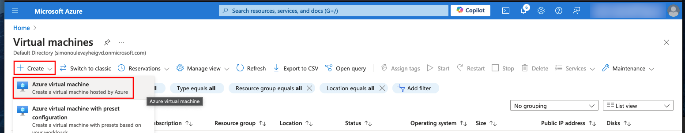
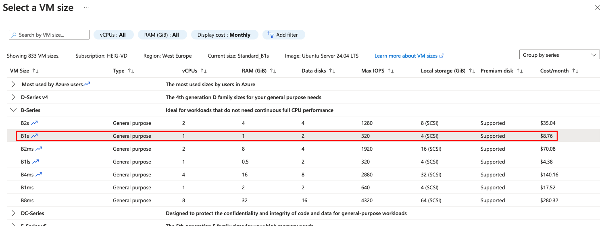
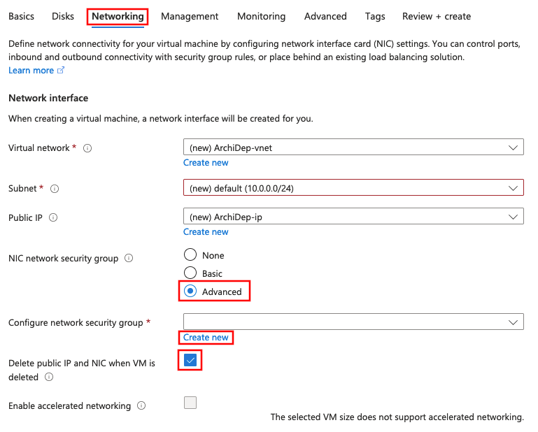

# Run your own virtual server on Microsoft Azure

This guide describes how to run a virtual server appropriate for the Media
Engineering Architecture & Deployment course on the [Microsoft
Azure](https://azure.microsoft.com) cloud platform.

<!-- START doctoc generated TOC please keep comment here to allow auto update -->
<!-- DON'T EDIT THIS SECTION, INSTEAD RE-RUN doctoc TO UPDATE -->

- [Legend](#legend)
- [:exclamation: Apply to Azure for Students](#exclamation-apply-to-azure-for-students)
- [:exclamation: Get your public SSH key](#exclamation-get-your-public-ssh-key)
- [:exclamation: Launch a virtual server](#exclamation-launch-a-virtual-server)
- [:question: (Optionally) get your machine's public SSH key](#question-optionally-get-your-machines-public-ssh-key)
- [:exclamation: Configure your virtual server](#exclamation-configure-your-virtual-server)
  - [:exclamation: Connect to your new virtual machine over SSH](#exclamation-connect-to-your-new-virtual-machine-over-ssh)
  - [:exclamation: Give the teacher access to your virtual machine](#exclamation-give-the-teacher-access-to-your-virtual-machine)
  - [:exclamation: Change the hostname of your virtual machine](#exclamation-change-the-hostname-of-your-virtual-machine)
  - [:exclamation: Reboot the server](#exclamation-reboot-the-server)
  - [:exclamation: Add swap space to your virtual server](#exclamation-add-swap-space-to-your-virtual-server)
- [:exclamation: Finish](#exclamation-finish)
- [:checkered_flag: What have I done?](#checkered_flag-what-have-i-done)
- [:boom: Troubleshooting](#boom-troubleshooting)
  - [:boom: Azure does not accept by SSH public key](#boom-azure-does-not-accept-by-ssh-public-key)

<!-- END doctoc generated TOC please keep comment here to allow auto update -->

## Legend

Parts of this guide are annotated with the following icons:

- :exclamation: A task you **MUST** perform to complete the exercise.
- :question: An optional step that you _may_ perform to make sure that
  everything is working correctly.
- :warning: **Critically important information about the exercise.**
- :gem: Tips on the exercise, reminders about previous exercises, or
  explanations about how this exercise differs from the previous one.
- :space_invader: More advanced tips on how to save some time. Challenges.
- :books: Additional information about the exercise or the commands and tools
  used.
- :checkered_flag: The end of the exercise.
  - :classical_building: The architecture of what you deployed during the
    exercise.
- :boom: Troubleshooting tips: how to fix common problems you might encounter.

## :exclamation: Apply to Azure for Students

Apply to [Azure for Students](https://azure.microsoft.com/en-us/free/students/)
**with your `@hes-so.ch` email address**, which will provide you with free
Azure resources as a student.


## :exclamation: Get your public SSH key

You can display your public SSH key in your terminal with the following command:

```bash
$> cat ~/.ssh/id_e25519.pub
```

> :gem: If you have an older SSH client, you may want to try displaying the
> contents of `~/.ssh/id_rsa.pub` instead.

You should copy the output of this command. You will need it later.

## :exclamation: Launch a virtual server

Once you have your Azure account, you can launch the virtual server you will be
using for the rest of the course.

- Access the [Azure portal](https://portal.azure.com) and go to the **Virtual
  machines** section:

  

- Create a new virtual machine, i.e. a new virtual server in the Microsoft Azure
  infrastructure:

  

  - In the **Basics** settings, configure the **virtual machine details** (the
    machine's name, region, image and size):

    

    Be sure to select the **Ubuntu 24.04** image and the **B1s** size. You can
    select this size from the complete list of VM sizes:

    

    > :gem: Any region will do. Closer to where you are (or where your customers
    > are) will reduce latency, and the North/West European regions are among
    > the cheapest.

    Under the **Administrator account** settings, choose a username. For
    example, if your name is "John Doe", you might choose `jde` as a short,
    easy-to-type username.

    > :warning: **Your Unix username MUST NOT** contain spaces, accented
    > characters (e.g. `é`), hyphens (`-`) or dots (`.`). If you use the same
    > name later in the course as a subdomain, it **MUST NOT** contain any
    > underscores (`_`). We suggest you choose a name that starts with a letter
    > (a-z) and contains only alphanumeric characters (a-z and 0-9).
    >
    > :gem: Choose a username that is simple to type because you will need to
    > type it often. If necessary, you can [change it
    > later](https://github.com/MediaComem/comem-archidep/blob/main/SYSADMIN-CHEATSHEET.md#how-do-i-change-my-username).

    Select **SSH public key** authentication, set the source to **Use existing
    public key**, and paste your public SSH key (the one you copied earlier) in
    the text area.

    

    Under **inbound port rules**, make sure the **SSH (22)** port is
    allowed:

    

    > :books: You may ignore the security warning. It indicates that it's good
    > practice to limit the IP addresses authorized to access your virtual
    > server. For the purposes of this course, it's simpler to allow anyone to
    > connect from any source IP address.

  - In the **Disks** settings, select a cheaper disk than the default. We won't
    need that much I/O performance:

    
  - In the **Networking** settings, select the **Advanced** security group
    option, and create a new security group:

    

    Add two inbound rules, one for **HTTP** and one for **HTTPS**:

    

    Add two other inbound rules, one for **port 3000** and one for **port
    3001**:

    

    The final security group settings should look something like this:

    

    > :books: What you are doing here is configuring the Azure firewall to allow
    > incoming traffic to your virtual server on specific ports. If you do not
    > do this, it will not be reachable from outside the Azure network. For
    > example, for a web application running on your virtual server to be
    > reachable, ports 80 (HTTP) and 443 (HTTPS) must accept incoming requests.
    > Port 22 is for SSH connections. Ports 3000 and 3001 will be used in
    > various exercises.

  - Use the default **Management**, **Monitoring**, **Advanced** and **Tags**
    settings.
  - Review and create your virtual machine.
  - Once your deployment is complete, go to the virtual machine source:

    

  - Find your machine's public IP address in the virtual machine's information:

    

## :question: (Optionally) get your machine's public SSH key

When you connect to your virtual machine over SSH for the first time, you will
get the usual warning that its authenticity cannot be verified:

```
The authenticity of host '20.71.227.143 (20.71.227.143)' can't be established.
ECDSA key fingerprint is SHA256:0TORCgUgzrPGeDHzV5fGAarkpGpc5Nbkhb7q2dbG0OA.
Are you sure you want to continue connecting (yes/no/[fingerprint])?
```

To protect yourself from [man-in-the-middle
attacks](https://en.wikipedia.org/wiki/Man-in-the-middle_attack), you can obtain
the SSH host key fingerprints from your virtual machine before attempting to
connect. That way, you will be able to see if the key fingerprint in the warning
matches one of your virtual machine's keys.

To do this, you need to install the [Azure
CLI](https://docs.microsoft.com/en-us/cli/azure/install-azure-cli). Once you
have it installed and have logged in, you can run the following command (adapt
the resource group and name options to your configuration if necessary):

```bash
$> az vm run-command invoke \
     --resource-group ArchiDep_group \
     --name ArchiDep \
     --command-id RunShellScript \
     --scripts "find /etc/ssh -name '*.pub' -exec ssh-keygen -l -f {} \;"
```

After a while, it should print the response:

```
{
  "value": [
    {
      "code": "ProvisioningState/succeeded",
      "displayStatus": "Provisioning succeeded",
      "level": "Info",
      "message": "Enable succeeded: \n[stdout]\n256 SHA256:IKNmtqj1OKCP4gyErlaQkBbn26gB0ofV3fLkw14yokg root@ArchiDep (ED25519)\n1024 SHA256:mUJQmHnMkGeqbxrRjRrBCJYzxyFYIlwKx/R54eLi4ds root@ArchiDep (DSA)\n3072 SHA256:RGxd9jZfWrUUynsVNGmngD78AaZGcQNT4iHjwX6cK2c root@ArchiDep (RSA)\n256 SHA256:0TORCgUgzrPGeDHzV5fGAarkpGpc5Nbkhb7q2dbG0OA root@ArchiDep (ECDSA)\n\n[stderr]\n",
      "time": null
    }
  ]
}
```

Your machine's public key fingerprints are in the `message` property, separated
by encoded new lines (`\n`).

> :books: You can skip this step if you consider the risk and impact of an
> attack low enough.
>
> Understand that if you simply answer "yes" when the SSH client warns you, you
> are exposing yourself to a potential man-in-the-middle attack. In all
> likelihood, no one is trying to hack your Azure virtual machine for this
> course, but the possibility exists.
>
> Since you are using public key authentication and not password authentication,
> your credentials should not be compromised (you will not send a password and
> your private key will not leave your computer). However, anything you do on
> that server could potentially be read and modified by an attacker if he
> manages to intercept the initial connection.

## :exclamation: Configure your virtual server

You will now connect to your Azure virtual machine and configure some things for
purposes of the course.

### :exclamation: Connect to your new virtual machine over SSH

Assuming the virtual machine's public IP address is `W.X.Y.Z` (replace with the
IP address you copied from your virtual machine's information), and the
administrator account you created is `john_doe`, you can connect with this
command:

```bash
$> ssh john_doe@W.X.Y.Z
```

> :books: You should be able to connect without a password. This works because
> you gave your public SSH key to Azure when creating your virtual server. It
> was automatically put in your user's `~/.ssh/authorized_keys` file when the
> server was launched, which allows you to authenticate using your private SSH
> key.

### :exclamation: Give the teacher access to your virtual machine

Once you are connected, run the following command to give the teacher access to
your virtual machine (be sure to copy the whole line and to replace `john_doe`
with your username):

```bash
$> echo "ssh-ed25519 AAAAC3NzaC1lZDI1NTE5AAAAINYObb+SKAKmRiIME+bxHLRL7w8Wl2Wdjm4pr7WvaXqS archidep" | sudo tee --append /home/jde/.ssh/authorized_keys
```

> :books: This adds the teacher's public SSH key to your user's
> `~/.ssh/authorized_keys`, allowing the teacher to also authenticate to your
> virtual server with his private SSH key to help debug issues.

### :exclamation: Change the hostname of your virtual machine

Choose a hostname for your virtual machine, a subdomain of `archidep.ch`. For
example: `john-doe.archidep.ch`, `jdoe.archidep.ch` or
`my-precious.archidep.ch`. Make sure not to pick the same name as someone else
in the class. Again, you might want to keep it short because you will have to
type it often during the course.

> :warning: You should not use underscores (`_`) in a hostname, use hyphens
> (`-`) instead.

```bash
$> sudo hostname john-doe.archidep.ch
```

Also save your new hostname to the `/etc/hostname` file so that it will persist
when you reboot the server:

```bash
$> echo "john-doe.archidep.ch" | sudo tee /etc/hostname
```

> :books: The hostname is the name of your virtual server. It can be any URL. It
> often identifies a machine in an organization with the format
> `<machine-name>.<organization>.<tld>` (e.g. `unix-box.google.com`).
>
> For the purposes of this course, we will be using the `archidep.ch` domain, so
> it makes sense to use a subdomain corresponding to yourself
> (`john-doe.archidep.ch`) as the hostname.

### :exclamation: Reboot the server

```bash
$> sudo reboot
```

_Once the server has restarted_ (it might take a couple of minutes), check that
you can still connect and that your hostname is correct:

```bash
$> ssh john_doe@W.X.Y.Z
Welcome to Ubuntu 24.04 LTS
...

$> hostname
john-doe.archidep.ch
```

### :exclamation: Add swap space to your virtual server

Follow [this
guide](https://github.com/MediaComem/comem-archidep/blob/main/SYSADMIN-CHEATSHEET.md#add-swap-space-to-your-cloud-server)
to add more swap space to your server. This will help prevent memory issues
during the various deployment exercises.

## :exclamation: Finish

Send your virtual server's **public IP address** and the **username of your
administrator account** to both teachers.

> :gem: If you connect to your server using `ssh john_doe@W.X.Y.Z`, then
> `john_doe` is your username and `W.X.Y.Z` is your public IP address.

## :checkered_flag: What have I done?

You have used a popular Infrastructure-as-a-Service (IaaS) cloud service
(Microsoft Azure) to set up a virtual machine for your own use. You are renting
this virtual machine for a monthly fee (using your free education credits).

You have used what you have learned about the command line and SSH to connect to
this virtual machine and perform some basic setup steps in preparation for
future deployment exercises.

## :boom: Troubleshooting

Here's a few tips about some problems you may encounter during this exercise.

### :boom: Azure does not accept by SSH public key

Azure requires that [SSH keys of type RSA have at least 2048
bits](https://docs.microsoft.com/en-us/azure/virtual-machines/linux/mac-create-ssh-keys#supported-ssh-key-formats).
If your existing key is not accepted by Azure when pasting it in the
administrator account settings of your virtual server later, you may need to
generate a new one with enough bits:

    ssh-keygen -m PEM -t rsa -b 4096

:warning: **ATTENTION!** If you already have an RSA key, this command will ask
you if you want to overwrite it with the new one. If you do, the old key will be
**PERMANENTLY LOST**. (You will need to put your public key on GitHub again and
everywhere else you may have used it.)
