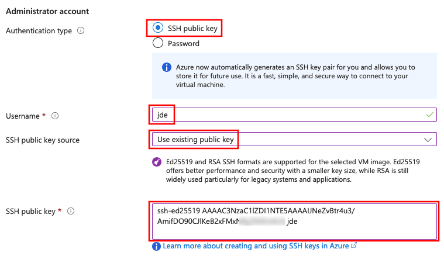
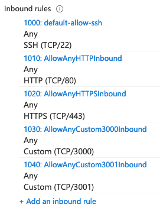

# Run your own virtual server on Microsoft Azure

This guide describes how to run a virtual server appropriate for the COMEM+
Architecture & Deployment course on the [Microsoft
Azure](https://azure.microsoft.com) cloud platform.

<!-- START doctoc generated TOC please keep comment here to allow auto update -->
<!-- DON'T EDIT THIS SECTION, INSTEAD RE-RUN doctoc TO UPDATE -->

- [Apply to Azure for Students](#apply-to-azure-for-students)
- [Get your public SSH key](#get-your-public-ssh-key)
- [Launch a virtual server](#launch-a-virtual-server)
- [(Optional) Get your instance's public SSH key](#optional-get-your-instances-public-ssh-key)
- [Configure your virtual server](#configure-your-virtual-server)

<!-- END doctoc generated TOC please keep comment here to allow auto update -->


## Apply to Azure for Students

Apply to [Azure for Students](https://azure.microsoft.com/en-us/free/students/)
**with your `@hes-so.ch` email address**, which will provide you with free
Azure resources as a student.


## Get your public SSH key

You can display your public SSH key in your terminal with the following command:

```bash
$> cat ~/.ssh/id_rsa.pub
```

You should copy the output of this command. You will need it later.

> Azure requires an [SSH key of type RSA with at least 2048
> bits](https://docs.microsoft.com/en-us/azure/virtual-machines/linux/mac-create-ssh-keys#supported-ssh-key-formats).
> If your existing key is not accepted by Azure when pasting it in the
> administrator account settings of your virtual server later, you may need to
> generate a new one with enough bits:
>
>     ssh-keygen -m PEM -t rsa -b 4096
>
> **WARNING:** if you already have an RSA key, this command will ask you if you
> want to overwrite it with the new one. If you do, the old key will be
> permanently lost. (You will need to put your public key on GitHub again and
> everywhere else you may have used it.)


## Launch a virtual server

Once you have your Azure account, you can launch the virtual server you will be
using for the rest of the course.

* Access the [Azure portal](https://portal.azure.com) and go to the **Virtual
  machines** section:

  
* Create a new virtual machine, i.e. a new virtual server in the Microsoft Azure
  infrastructure:

  

  * In the **Basics** settings, configure the **instance details**: the
    machine's name, region, image and size:

    

    Be sure to select the **Ubuntu 20.04** image and the **B1s** size. You can
    select this size from the complete list of VM sizes:

    

    > Any region will do. Closer to where you are (or where your customers are)
    > will reduce latency, and the North/West European regions are among the
    > cheapest.

    Under the **Administrator account** settings, choose a username, for example
    `john_doe`.

    > **WARNING:** your Unix username should not contain spaces, accented
    > characters (e.g. `é`), hyphens (`-`) or dots (`.`). It should start with a
    > letter (a-z) and contain only alphanumeric characters (a-z and 0-9) and
    > underscores (`_`).

    Select **SSH public key** authentication, set the source to **Use existing
    public key**, and paste your public SSH key (the one you copied earlier) in
    the text area.

    

    Under **inbound port rules**, make sure the **SSH (22)** port is
    allowed:

    

    > You may ignore the security warning. It indicates that it's good practice
    > to limit the IP addresses authorized to access your virtual server. For
    > the purposes of this course, it's simpler to allow anyone to connect from
    > any source IP address.
  * Use the default **Disks** settings.
  * In the **Networking** settings, select the **Advanced** security group
    option, and create a new security group:

    

    Add two inbound rules, one for **HTTP** and one for **HTTPS**:

    

    Add two other inbound rules, one for **port 3000** and one for **port
    3001**:

    

    The final security group settings should look something like this:

    

    > What you are doing here is configuring the Azure firewall to allow
    > incoming traffic to your virtual server on specific ports. If you do not
    > do this, it will not be reachable from outside the Azure network. For
    > example, for a web application running on your virtual server to be
    > reachable, ports 80 (HTTP) and 443 (HTTPS) must accept incoming requests.
    > Port 22 is for SSH connections. Ports 3000 & 3001 will be used in various
    > exercises.
  * Use the default **Management**, **Advanced** and **Tags** settings.
  * Review and create your virtual machine.
  * Once your deployment is complete, go to the virtual machine source:

    
  * Find your machine's public IP address in the virtual machine's information:

    


## (Optional) Get your instance's public SSH key

When you connect to your instance over SSH for the first time, you will get the
usual warning that its authenticity cannot be verified:

```
The authenticity of host '20.71.227.143 (20.71.227.143)' can't be established.
ECDSA key fingerprint is SHA256:0000000000000000000000000000000000000000000.
Are you sure you want to continue connecting (yes/no/[fingerprint])?
```

To protect yourself from [man-in-the-middle
attacks](https://en.wikipedia.org/wiki/Man-in-the-middle_attack), you can obtain
the SSH host key fingerprints from your instance before attempting to connect.
That way, you will be able to see if the key fingerprint in the warning matches
one of your instance's keys.

To do this, you need to install the [Azure
CLI](https://docs.microsoft.com/en-us/cli/azure/install-azure-cli). Once you
have it installed and have logged in, you can run the following command (adapt
the resource group and name options to your configuration if necessary):

```bash
$> az vm run-command invoke \
     --resource-group ArchiDep_group \
     --name ArchiDep \
     --command-id RunShellScript \
     --scripts "find /etc/ssh -name '*.pub' -exec ssh-keygen -l -f {} \;"
```

After a while, it should print the response:

```
{
  "value": [
    {
      "code": "ProvisioningState/succeeded",
      "displayStatus": "Provisioning succeeded",
      "level": "Info",
      "message": "Enable succeeded: \n[stdout]\n256 SHA256:IKNmtqj1OKCP4gyErlaQkBbn26gB0ofV3fLkw14yokg root@ArchiDep (ED25519)\n1024 SHA256:mUJQmHnMkGeqbxrRjRrBCJYzxyFYIlwKx/R54eLi4ds root@ArchiDep (DSA)\n3072 SHA256:RGxd9jZfWrUUynsVNGmngD78AaZGcQNT4iHjwX6cK2c root@ArchiDep (RSA)\n256 SHA256:0TORCgUgzrPGeDHzV5fGAarkpGpc5Nbkhb7q2dbG0OA root@ArchiDep (ECDSA)\n\n[stderr]\n",
      "time": null
    }
  ]
}
```

Your machine's public key fingerprints are in the `message` property, separated
by encoded new lines (`\n`).

> You can skip this step if you consider the risk and impact of an attack low
> enough.
>
> Understand that if you simply answer "yes" when the SSH client warns you, you
> are exposing yourself to a potential man-in-the-middle attack. In all
> likelihood, no one is trying to hack your Azure instance for this course, but
> the possibility exists.
>
> Since you are using public key authentication and not password authentication,
> your credentials should not be compromised (you will not send a password and
> your private key will not leave your computer). However, anything you do on
> that server could potentially be read and modified by an attacker if he
> manages to intercept the initial connection.


## Configure your virtual server

* Connect to your new instance over SSH.

  Assuming the instance's public IP address is `W.X.Y.Z` (replace with the IP
  address you copied from your virtual machine's information), and the
  administrator account you created is `john_doe`, you can connect with this
  command:

  ```bash
  $> ssh john_doe@W.X.Y.Z
  ```

  > You should be able to connect without a password. This works because you
  > gave your public SSH key to Azure when creating your virtual server. It was
  > automatically put in your user's `~/.ssh/authorized_keys` file when the
  > server was launched, which allows you to authenticate using your private SSH
  > key.
* Once you are connected, run the following command to give the teacher access
  to your instance (be sure to copy the whole line and to replace `john_doe`
  with your username):

  ```bash
  $> echo "ssh-rsa AAAAB3NzaC1yc2EAAAADAQABAAABAQCxDHpiwKjBPEQsxuYw6nQ4lA/gH9h00QkpVIptLewXFcO/hH8Dir+xvXWfiWe5J/dqAu76jYxDnlmtTyeKGHXRQExhKaX82Qu/krrnKbEotuRqp0hiDFzRLWuHAJ7ms5taDaJUQlu4YIOKsc87BkZz6DIcHRcGiNEnSi6iwhJGRjrP0IfQHtnilLypUfmru9SSNdedYdIIffgAcxJLu2ypC6pmEuV1VFBO1dZC40lP5e051ybbGH/Py1jk0hfjh1QP/W8sbiDsRkNaPYxT3X7CO751EHJKHQLMpCOed8zs9pU4KN6vXvCSj0Ppy0uPODE6cBpEjzYtHfbMz0EBCiGT comem-archidep" | sudo tee --append /home/john_doe/.ssh/authorized_keys
  ```

  > This adds the teacher's public SSH key to your user's
  > `~/.ssh/authorized_keys`, allowing the teacher to also authenticate to your
  > virtual server with his private SSH key to help debug issues.
* Change the hostname of your server.

  **WARNING:** you should not use underscores (`_`) in a hostname, use hyphens
  (`-`) instead.

  ```bash
  $> sudo hostname john-doe.archidep.tech
  ```

  Also save your new hostname to the `/etc/hostname` file so that it will
  persist when you reboot the server:

  ```bash
  $> echo "john-doe.archidep.tech" | sudo tee /etc/hostname
  ```

  > The hostname is the name of your virtual server. It can be any URL. It often
  > identifies a machine in an organization with the format
  > `<machine-name>.<organization>.<tld>` (e.g. `unix-box.google.com`).
  >
  > For the purposes of this course, we will be using the `archidep.tech`
  > domain, so it makes sense to use a subdomain corresponding to yourself
  > (`john-doe.archidep.tech`) as the hostname.
* Reboot the server.

  ```bash
  $> sudo reboot
  ```

* *Once the server has restarted* (it might take a couple of minutes), check
  that you can still connect and that your hostname is correct:

  ```bash
  $> ssh john_doe@W.X.Y.Z
  Welcome to Ubuntu 20.04 LTS
  ...

  $> hostname
  john-doe.archidep.tech
  ```
* Send your virtual server's **public IP address** and the **username of your
  administrator account** to the teacher.
