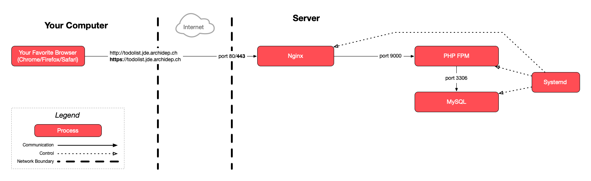

# Provision an SSL certificate using Certbot by Let's Encrypt

The goal of this exercice is to provision a [Let's Encrypt][letsencrypt] [SSL
certificate][certificate] for an application deployed in previous exercices
using [Certbot][certbot].

<!-- START doctoc generated TOC please keep comment here to allow auto update -->
<!-- DON'T EDIT THIS SECTION, INSTEAD RE-RUN doctoc TO UPDATE -->

- [Legend](#legend)
- [:gem: Requirements](#gem-requirements)
- [:exclamation: Install Certbot](#exclamation-install-certbot)
- [:exclamation: Obtain a TLS certificate from Let's Encrypt](#exclamation-obtain-a-tls-certificate-from-lets-encrypt)
- [:checkered_flag: What have I done?](#checkered_flag-what-have-i-done)
  - [:classical_building: Architecture](#classical_building-architecture)
- [:boom: Troubleshooting](#boom-troubleshooting)
  - [:boom: No names were found in your configuration files](#boom-no-names-were-found-in-your-configuration-files)

<!-- END doctoc generated TOC please keep comment here to allow auto update -->

## Legend

Parts of this guide are annotated with the following icons:

- :exclamation: A task you **MUST** perform to complete the exercise.
- :question: An optional step that you _may_ perform to make sure that
  everything is working correctly.
- :warning: **Critically important information about the exercise.**
- :gem: Tips on the exercise, reminders about previous exercises, or
  explanations about how this exercise differs from the previous one.
- :space_invader: More advanced tips on how to save some time. Challenges.
- :books: Additional information about the exercise or the commands and tools
  used.
- :checkered_flag: The end of the exercise.
  - :classical_building: The architecture of what you deployed during the
    exercise.
- :boom: Troubleshooting tips: how to fix common problems you might encounter.

## :gem: Requirements

This exercise assumes that you have deployed at least one web site or
application during previous exercices, and that you have configured nginx to
serve it.

## :exclamation: Install Certbot

Install Certbot with the following command:

```bash
sudo apt install certbot python3-certbot-nginx
```

## :exclamation: Obtain a TLS certificate from Let's Encrypt

Follow the [instructions for nginx and Linux
(snap)](https://certbot.eff.org/instructions?ws=nginx&os=snap) **starting
at step 6**:

> :gem: When the instructions ask you to "Choose how you'd like to run Certbot",
> you can choose the simplest option which is to "get a certificate and have
> Certbot edit your Nginx configuration automatically to serve it".

Once you are done, your web site or application should be accessible over HTTPS.

You should take a look at your nginx site configuration file(s) in the
`/etc/nginx/sites-available` directory, to see the changes Certbot has made.

## :checkered_flag: What have I done?

You have run Certbot to request a [TLS][tls] certificate from the Let's Encrypt
[certificate authority (CA)][ca].

Before issuing a certificate, Let's Encrypt (or any other certificate authority)
requires [domain validation][domain-validation], i.e. you must provide some
proof that you control the server reachable at the certificate's domain name.
Since you have run Certbot on your server, it has automatically provided that
proof by asking Let's Encrypt to perform an [HTTP challenge][http-challenge],
and then completing the challenge by providing the appropriate file through
nginx.

Certbot saved the certificate it obtained from Let's Encrypt somewhere into the
`/etc/letsencrypt` directory. It then modified your nginx site's configuration
file to use that certificate.

> :books: Certbot has been able to automatically do all these things for you
> because you have run it with administrative privileges by prefixing it with
> `sudo`.

Because the modified nginx configuration for your site now listens on port 443
for HTTPS and provides a valid TLS certificate, your todolist is now accessible
with an `https://` instead of an `http://` URL, and the TLS protocol is used to
encrypt communications between your browser and the server.

### :classical_building: Architecture

This is a simplified architecture of the main running processes and
communication flow at the end of this exercise:



> [Architecture PDF version](certbot-deployment-architecture.pdf).

The only thing that has changed compared to [the previous
exercise](./nginx-php-fpm-deployment.md#architecture) is that you are now
accessing your application over an encrypted HTTPS/TLS connection instead of
insecure HTTP.

## :boom: Troubleshooting

Here's a few tips about some problems you may encounter during this exercise.

### :boom: No names were found in your configuration files

If Certbot tells you that you that "No names were found in your configuration
files" but you have nginx sites that are configured, this may be because you
have an underscore character (`_`) in your subdomains, e.g.
`john_doe.archidep.ch`.

Although many tools support it, [underscore are technically not allowed in
domain
names](https://www.ssl.com/faqs/underscores-not-allowed-in-domain-names/). You
will have to change your subdomain for Certbot to recognize it as valid.

There are two things you need to do:

* Log back into [Gandi.net][gandi] and add a new A record for
  your Azure VM just like you did during the [Configure a domain
  name](https://github.com/MediaComem/comem-archidep/blob/main/ex/dns-configuration.md)
  exercise.

  This time, use `john-doe` instead of `john_doe` and `*.john-doe` instead of
  `*.john_doe` (or something shorter like `jde` and `*.jde` as long as it does
  not conflict with anyone else's subdomain), with the same IP address as before
  (the public IP address of your Azure VM).
* Replace your old subdomain by the new one in all your nginx configuration
  files, for example:

  ```bash
  $> sudo nano /etc/nginx/sites-available/clock
  $> sudo nano /etc/nginx/sites-available/revprod
  $> sudo nano /etc/nginx/sites-available/todolist
  ```

  Then test and reload the nginx configuration with:

  ```bash
  $> sudo nginx -t
  $> sudo nginx -s reload
  ```

Make sure your sites work at their new address. If they do, the `certbot`
command should now also detect them.

> :gem: It may take a few minutes for the new DNS entries to propagate. If you
> are sure the new DNS entries are correct but it doesn't work, try again a
> little while later.

[ca]: https://en.wikipedia.org/wiki/Certificate_authority
[certbot]: https://certbot.eff.org
[certificate]: https://en.wikipedia.org/wiki/Public_key_certificate
[domain-validation]: https://en.wikipedia.org/wiki/Domain-validated_certificate
[gandi]: https://www.gandi.net
[http-challenge]: https://letsencrypt.org/docs/challenge-types/#http-01-challenge
[letsencrypt]: https://letsencrypt.org
[tls]: https://en.wikipedia.org/wiki/Transport_Layer_Security
