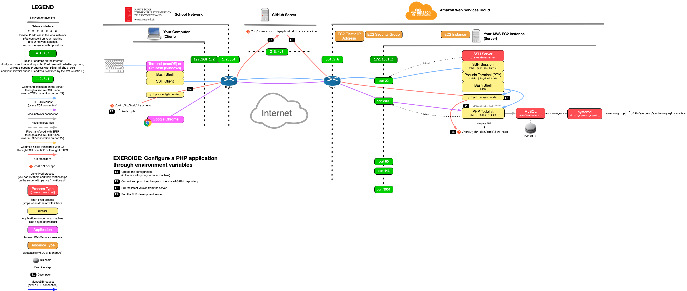

# Configure a PHP application through environment variables

The goal of this exercise is to improve the configuration step of the [previous
exercise](git-clone-deployment.md) by using environment variables instead of
hardcoded configuration values.

<!-- START doctoc generated TOC please keep comment here to allow auto update -->
<!-- DON'T EDIT THIS SECTION, INSTEAD RE-RUN doctoc TO UPDATE -->


- [Setup](#setup)
- [Update the configuration](#update-the-configuration)
- [Pull the latest version from the server](#pull-the-latest-version-from-the-server)
- [Run the PHP development server](#run-the-php-development-server)
- [What have I done?](#what-have-i-done)
- [End result](#end-result)

<!-- END doctoc generated TOC please keep comment here to allow auto update -->


## Setup

Make sure you have done the [previous exercise](git-clone-deployment.md) and the
[Git
collaboration](https://github.com/MediaComem/comem-archidep-php-todo-exercise)
exercise first.

Stop your `php -S` command if it is still running.

> **Reminder:** You can use Ctrl-C to stop any command currently running in your
> terminal.


## Update the configuration

**On your local machine (NOT on the server):** clone the repository if you do
not have it already:

```bash
$> cd /path/to/projects
$> git clone https://github.com/MyUser/comem-archidep-php-todo-exercise.git
```

> Make sure that you are cloning a repository that belongs to you, because you
> are going to modify it. [Fork](https://guides.github.com/activities/forking/)
> one of your colleagues' repositories if necessary.

Modify the first few lines of `index.php` to take configuration values from the
environment if available.

For example, instead of:

```php
define('BASE_URL', '/');
```

Use this:

```php
define('BASE_URL', getenv('TODOLIST_BASE_URL') ?: '/');
```

With this code, the `BASE_URL` variable will be equal to the value of the
`TODOLIST_BASE_URL` environment variable if it has been set, or it will default
to `/` if the environment variable is not available. (This is accomplished using
the [PHP shorthand ternary operator `?:`][php-shorthand-comparisons].)

Do **NOT** set a default value for the password, as it is a bad practice to
hardcode sensitive values (as mentionned in the [Config section of The
Twelve-Factor App](https://12factor.net/config)). The definition of the
`DB_PASS` variable should have no default and look like this:

```php
define('DB_PASS', getenv('TODOLIST_DB_PASS'));
```

Make sure to update the definitions of all other variables (`DB_USER`,
`DB_NAME`, `DB_HOST` and `DB_PORT`) to take their value from the environment,
with an appropriate default value.

> **Hint:** Regarding the default values, you may assume that for a typical
> deployment, a MySQL database server is available on the host machine itself
> (`127.0.0.1`) and exposed on the default MySQL port (`3306`).

**Commit and push your changes** to the remote repository on GitHub.


## Pull the latest version from the server

**Connect to your server** and go into the cloned repository from the previous
exercise (`~/todolist-repo` if you followed the instructions to the letter).

You probably made manual configuration changes during the previous exercise. You
must discard them with the `git restore <file>` command. This will remove any
uncommitted changes and restore the latest version of the file that was
committed in the repository:

```bash
$> git restore index.php
```

You can now pull the latest version of the code from GitHub.

> **Reminder:** The command to pull the latest changes is `git pull <remote>
> <branch>`. If you do not remember the name(s) of your remote(s), you can list
> them with the `git remote` command (or with `git remote -v` to also see their
> URLs).


## Run the PHP development server

Still in the cloned repository, run a PHP development server on port 3000. Note
that this time you must now provide the appropriate configuration through
environment variables:

* You must provide the `TODOLIST_DB_PASS` environment variable which has no
  default value.
* If the default values you have hardcoded for other variables are not suitable
  for your server's environment, you must also provided the corresponding
  environment variables with suitable values.

> **Reminder:** You can execute a command with additional environment variables
> using the following syntax: `EXAMPLE="value" ANOTHER="one" command arg1 arg2`.

You (and everybody else) should be able to access the application in a browser
at the correct IP address and port (e.g. `W.X.Y.Z:3000`) and it should work.


## What have I done?

You have made your application configurable through the environment, as
recommended in the [Config section of The Twelve-Factor
App](https://12factor.net/config).

This means that you no longer need to make any changes to the code before
deploying your application to any new environment. It can now be deployed
*anywhere*, on any server or on any developer's local machine, without changing
a single line of code.

You simply need to set the appropriate environment variables when running it,
and the application will use that configuration instead of the hardcoded
defaults. For example, if you are deploying the application on a server where
the MySQL database server is exposed on a non-standard port like `5000`, simply
set the `TODOLIST_DB_PORT` variable, and the application will happily connect to
it.


## End result



> [PDF version](config-through-environment.pdf).


[php-shorthand-comparisons]: https://stitcher.io/blog/shorthand-comparisons-in-php
[php-todolist]: https://github.com/MediaComem/comem-archidep-php-todo-exercise
