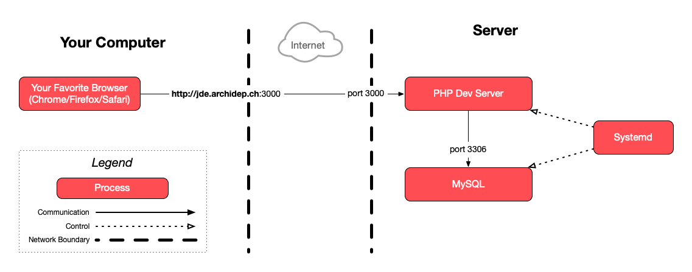

# Domain Name Configuration

The goal of this exercise is to set up a real domain name for your application.

<!-- START doctoc generated TOC please keep comment here to allow auto update -->
<!-- DON'T EDIT THIS SECTION, INSTEAD RE-RUN doctoc TO UPDATE -->

- [Legend](#legend)
- [:gem: Requirements](#gem-requirements)
- [:exclamation: Choose your subdomain](#exclamation-choose-your-subdomain)
- [:exclamation: Configure a DNS zone with Gandi.net](#exclamation-configure-a-dns-zone-with-gandinet)
- [:exclamation: Access the domain name](#exclamation-access-the-domain-name)
- [:question: Adapt your server's hostname](#question-adapt-your-servers-hostname)
- [:checkered_flag: What have I done?](#checkered_flag-what-have-i-done)
  - [:classical_building: Architecture](#classical_building-architecture)
- [:boom: Troubleshooting](#boom-troubleshooting)
  - [:boom: I used the wrong IP address and then fixed it, but it doesn't work](#boom-i-used-the-wrong-ip-address-and-then-fixed-it-but-it-doesnt-work)

<!-- END doctoc generated TOC please keep comment here to allow auto update -->

## Legend

Parts of this guide are annotated with the following icons:

- :exclamation: A task you **MUST** perform to complete the exercise.
- :question: An optional step that you _may_ perform to make sure that
  everything is working correctly.
- :warning: **Critically important information about the exercise.**
- :gem: Tips on the exercise, reminders about previous exercises, or
  explanations about how this exercise differs from the previous one.
- :space_invader: More advanced tips on how to save some time. Challenges.
- :books: Additional information about the exercise or the commands and tools
  used.
- :checkered_flag: The end of the exercise.
  - :classical_building: The architecture of what you deployed during the
    exercise.
- :boom: Troubleshooting tips: how to fix common problems you might encounter.

## :gem: Requirements

Make sure you have completed the [previous exercise](systemd-deployment.md).

## :exclamation: Choose your subdomain

In this exercise, you will configure actual subdomains in the worldwide DNS
system to point to your server. You must now choose your personal subdomain for
this course.

First, select one of the following domains depending on your class:

* Students of the M51/1 class should use `archidep.ch`.
* Students of the M51/2 class should use `archidep2.ch`.

Then, choose a subdomain of that domain. For example, you may use the same name
as your Unix user (e.g. `jde`), although you **MUST** replace any
underscores (`_`) by hyphens (`-`) if you have any.
Alternatively, you can call your server whatever you want, e.g. `my-precious`,
as long as it does not conflict with the names chosen by the other students.

For example, your full subdomain should look like `jde.archidep.ch` or
`jde.archidep2.ch`. Proceed with the next steps once you have decided what it
is.

## :exclamation: Configure a DNS zone with Gandi.net

* Connect to [Gandi.net](https://gandi.net) with the user account provided to
  you by the teacher.
* Go under the "Domain" tab in the left menu and select `archidep.ch` or
  `archidep2.ch` depending on your class (`archidep.ch` for M51/1 and
  `archidep2.ch` for M51/2).
* Go under the "DNS Records" tab in the domain's top menu.
* Add two new `A` records to map subdomains to **your server's public IP
  address**:

  1. Assuming your personal subdomain for the course is `jde.archidep.ch`,
     you should use `jde` as the **name of the DNS record**.
  2. Then, create a wildcard subdomain using `*.jde` as the **name of the
    DNS record**, and the same IP address. This will direct any second-level
    subdomain like `foo.jde.archidep.ch` to your server.

Assuming your server's IP address is `W.X.Y.Z` and your username is `jde`,
you should have the following DNS records (among others) in the domain's zone
file:

```
*.jde 1800 IN A W.X.Y.Z
jde 1800 IN A W.X.Y.Z
```

## :exclamation: Access the domain name

Once you have configured it correctly, you (and everybody else) should be able
to access the todolist application at http://jde.archidep.ch:3000 in
your browser (if you have completed the previous exercises).

> :gem: You might have to wait a few minutes for the change to take effect.
> especially if you make a mistake in configuring the DNS record and then fix
> it. This is because DNS records are cached for a time (the TTL you
> configured), by all intermediaries and also by your machine.

## :question: Adapt your server's hostname

When you originally ran your Microsoft Azure server, you were asked to [set a
hostname](https://github.com/MediaComem/comem-archidep/blob/main/ex/azure-setup.md#exclamation-change-the-hostname-of-your-virtual-machine)
. This hostname is purely informative: it is displayed in the prompt when you
connect over SSH but otherwise has no impact on anything else.

However, for consistency, it is recommended that you adapt your hostname
to match your personal subdomain.

So if you chose, for example, `jde.archidep.ch`, run the following commands
 to update the hostname on your server:

```bash
$> sudo hostname jde.archidep.ch
$> echo "jde.archidep.ch" | sudo tee /etc/hostname
```

## :checkered_flag: What have I done?

You have created a mapping in the [domain name system][dns] between your custom
subdomain (e.g. `jde.archidep.ch`) and the IP address of your server.

You have done this by modifying the [DNS zone file][dns-zone-file] for the
course's domain (`archidep.ch`). When a computer requests to know the IP
address for your subdomain, the [DNS name servers][dns-name-server] of the
domain provider (gandi.net) will give them the IP address in the mapping you
have configured.

This allows your applications and websites to be accessible through a
human-friendly domain name instead of an IP address.

### :classical_building: Architecture

This is a simplified architecture of the main running processes and
communication flow at the end of this exercise:



> [Architecture PDF version](dns-configuration-architecture.pdf).

The only thing that has changed compared to [the previous
exercise](./systemd-deployment.md#architecture) is that you are now using a
domain name instead of an IP address to reach your application.

## :boom: Troubleshooting

Here's a few tips about some problems you may encounter during this exercise.

### :boom: I used the wrong IP address and then fixed it, but it doesn't work

DNS records are cached for a time (the TTL you configured). Your machine has
this cache, and all intermediary DNS servers also have it. When you change an
existing DNS entry that you have already consulted in your browser, you have to
wait for the TTL to expire on your machine and all intermediaries before the
changes take effect.

> :gem: In the meantime, you can simply create a new DNS entry. For example, if
> you created `jde.archidep.ch`, you can create `jde-2.archidep.ch`.
> This new entry will work immediately. The old one you fixed will work
> eventually once the cache has cleared.

[dns]: https://en.wikipedia.org/wiki/Domain_Name_System
[dns-name-server]: https://en.wikipedia.org/wiki/Name_server
[dns-zone-file]: https://en.wikipedia.org/wiki/Zone_file
[systemd]: https://en.wikipedia.org/wiki/Systemd
