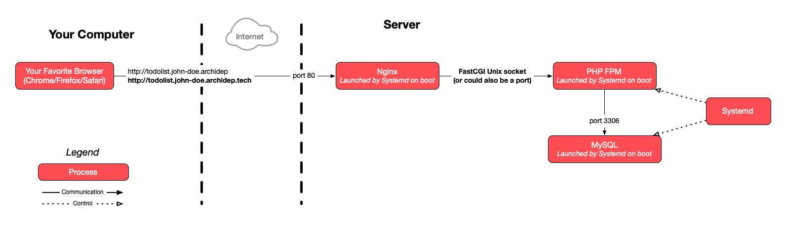

# Deploy the PHP todolist with Docker Compose

The goal of this exercise is to learn to deploy a multi-container web
application with Docker Compose. You will create a portable Compose file that
can be used to deploy the same containers on both your local machine and your
cloud server.

<!-- START doctoc -->
<!-- END doctoc -->


## Legend

Parts of this guide are annotated with the following icons:

- :exclamation: A task you **MUST** perform to complete the exercise.
- :question: An optional step that you _may_ perform to make sure that
  everything is working correctly.
- :warning: **Critically important information about the exercise.**
- :gem: Tips on the exercise, reminders about previous exercises, or
  explanations about how this exercise differs from the previous one.
- :space_invader: More advanced tips on how to save some time.
- :books: Additional information about the exercise or the commands and tools
  used.
- :checkered_flag: The end of the exercise.
  - :classical_building: The architecture of what you deployed during the
    exercise.
- :boom: Troubleshooting tips: how to fix common problems you might encounter.


## :gem: Your best friends

Your inescapable references for this exercise are the following documents:

* The [**Dockerfile reference**][dockerfile-reference], which describes the
  commands you can use in a `Dockerfile`.
* The [**Compose file reference**][compose-file-reference], which describes the
  Compose file format.


## :exclamation: Make sure you have everything you need

* You need to have [Docker Desktop][docker-desktop] installed, which you should if
  you have performed the [previous Docker exercise](./docker-static.md).
* You need an up-to-date PHP todolist. Move to your the PHP todolist repository
  **on your local machine**:

  ```bash
  $> cd /path/to/todolist
  ```

  **If you performed the [Render deployment
  exercise](https://github.com/MediaComem/comem-archidep/blob/main/ex/render-database-deployment.md)**,
  switch back to the `main` (or `master`) branch:

  ```bash
  $> git checkout main  # (or master)
  ```

  > :books: In the Render deployment exercise, a `Dockerfile` was provided for
  > you, In this exercise, you will write one yourself, step by step.

  Make sure your `index.php` file supports configuration through environment
  variables. If you performed the [relevant
  exercise](./config-through-environment.md) earlier in the course, the definition
  of the database connection parameters at the top should look something like
  this:

  ```php
  // Database connection parameters.
  define('DB_USER', getenv('TODOLIST_DB_USER') ?: 'todolist');
  define('DB_PASS', getenv('TODOLIST_DB_PASS'));
  define('DB_NAME', getenv('TODOLIST_DB_NAME') ?: 'todolist');
  define('DB_HOST', getenv('TODOLIST_DB_HOST') ?: '127.0.0.1');
  define('DB_PORT', getenv('TODOLIST_DB_PORT') ?: '3306');
  ```

  If that's not the case, adapt the `index.php` file, then commit and push your
  changes.


## :exclamation: Create a compose file to deploy the PHP todolist application

Take a look at the [architecture of the PHP todolist deployment with nginx and
the FastCGI process manager]:



Aside from Systemd, your server-side deployment is composed of 3 processes:

* Nginx, the **reverse proxy**.
* The PHP todolist, the **application** itself.
* A MySQL **database** server.

In a Compose deployment, you want to isolate them as separate services as per
the Docker philosophy. Therefore, your goal is to write a Compose file defining
3 services.

Start by naming these services. Choose a naming convention:

* Some people prefer to name each service after the tool that will be running in
  the container, for example: `nginx`, `php`, `mysql`.
* Other prefer a more semantic naming convention: `reverse-proxy`, `application`
  and `database` (or `rp`, `app` and `db` if you are feeling terse).

> :gem: You will sometimes use these names on the command line when running
> Compose commands, e.g. `docker compose up app`, so [choose
> wisely](https://martinfowler.com/bliki/TwoHardThings.html).

The basic structure of your Compose file will be something like:

```yml
services:
  rp:
    # define the reverse proxy service
  app:
    # define the application service
  db:
    # define the database service
```

### :exclamation: Define the database service

Let's start from the bottom up: the first service you will run is the
**database**.

Create a `compose.yml` file in the PHP todolist repository with the following
(incomplete) contents for now:

```yml
services:
  db:
```

If you remember the very first [PHP todolist SFTP deployment
exercise](./sftp-deployment.md), you had to do a few things to set up the
database:

1. Install the MySQL database server with `sudo apt install mysql-server`.
1. Perform the base configuration with `sudo mysql_secure_installation`. This
   includes:
   * Setting the MySQL root password.
   * Various other security-related settings.
1. Intialize the todolist database by running the PHP todolist's SQL script with
   `sudo mysql < todolist.sql`.

You will now learn to do the same in a Docker container with Docker Compose.

There is an [official MySQL Docker image][mysql-docker-image] which provides you
with a fully functional and configurable MySQL database server container. That
takes care of step 1 and most of step 2.

Look at the **Environment Variables** section of the image's documentation. It
describes a few variables you will find useful. As part of step 2, you manually
configured the MySQL root password in the original deployment exercise. With
this Docker image, you will do that simply by setting the `$MYSQL_ROOT_PASSWORD`
environment variable in the container. The root password will then be
automatically set for you when the container starts.

> :books: When running a container manually, you set environment variables with
> the `-e VAR=VALUE` or `--env VAR=VALUE` options, e.g. `docker run -e
> MYSQL_ROOT_PASSWORD=changeme mysql:8.3.0`. But you will not be doing that in
> this exercise. You will describe the configuration of the database service in
> the Compose file, and Docker Compose will run the container for you.

During step 3, you then executed the PHP todolist's `todolist.sql` script. For
the purposes of this exercise, this script can be divided into two sections:

* The [database creation, user creation & privileges
  configuration](https://github.com/MediaComem/comem-archidep-php-todo-exercise/blob/83415041ddec4e61dffa5ccf7317d9d5ff1fc3aa/todolist.sql#L1-L8):

  ```sql
  CREATE DATABASE IF NOT EXISTS todolist;
  CREATE USER IF NOT EXISTS 'todolist'@'localhost' IDENTIFIED WITH mysql_native_password BY 'chAngeMeN0w!';
  GRANT ALL PRIVILEGES ON todolist.* TO 'todolist'@'localhost' ;
  ```
* The [creation of the database
  structure](https://github.com/MediaComem/comem-archidep-php-todo-exercise/blob/83415041ddec4e61dffa5ccf7317d9d5ff1fc3aa/todolist.sql#L10-L18):

  ```sql
  USE todolist;

  CREATE TABLE IF NOT EXISTS `todo` (
    `id` bigint(20) NOT NULL AUTO_INCREMENT,
    `title` varchar(2048) NOT NULL,
    `done` tinyint(1) NOT NULL DEFAULT '0',
    `created_at` timestamp NOT NULL DEFAULT CURRENT_TIMESTAMP,
    PRIMARY KEY (`id`)
  );
  ```

If you read **Environment Variables** section of the MySQL Docker image's
documentation again, you will notice that there are 3 environment variables you
can set that will take care of the first part of the setup for you:

* Setting `$MYSQL_DATABASE` will automatically create a database with that name.
* Setting `$MYSQL_USER` and `$MYSQL_PASSWORD` will automatically create a user
  with access to that database.

Simply by settings these environment variables, the container will perform the
required setup when it starts for the first time.

That leaves only the creation of the database structure. This cannot simply be
done by setting an environment variable, since this part is not generic: it is
completely dependent on the specific application you are deploying.

So you need to run the second part of the `todolist.sql` script in the context
of the MySQL database server running in the container. How?

Read the **Initializing a fresh instance** section of the MySQL Docker image's
documentation. It explains that any script you place in the
`/docker-entrypoint-initdb.d` directory of the container will be executed when
the MySQL database server is initialized the first time the container starts.

This means that you simply have to put the `todolist.sql` script in this
directory, and it will be magically run for you!

But you only need to run the second part, what about skipping the first part
(the database and user creation)? Luckily, the `todolist.sql` script uses `IF
NOT EXISTS` in its queries. Since the MySQL database and user will already be
created automatically by the container when it starts, the `todolist.sql` script
will simply skip creating what is already there. It can actually be run as it
is, without any changes.

There is one last thing that you did not actually do yourself during the
original deployment exercise, but was done for you when you installed the MySQL
server. As indicated in the architecture diagram: MySQL is managed by Systemd,
meaning, which will automatically start it when your server starts, and restart
it if it crashes. You also want this with your Compose deployment, at least for
production deployments.

> :books: When running containers with Docker Compose, the Docker daemon will
> assume the responsibility of managing the containers, e.g. starting and
> restarting them, depending on how you define your Compose services. The Docker
> daemon itself will be managed by Systemd.

So, let's recap what you need to define your MySQL Compose service:

* Use the official MySQL Docker image.
* Set a number of environment variables to perform the necessary setup (database
  and user creation).
* Execute the `todolist.sql` script when the database server is initialized.
* Restart the database server automatically when there is an issue.

You can now write the database service definition in your Compose file. Here's a
few pointers:

What                      | Documentation
:------------------------ | :----------------------------------------
Use the official image    | [`image`][compose-file-image]
Set environment variables | [`environment`][compose-file-environment]
Restart automatically     | [`restart`][compose-file-restart]
Execute `todolist.sql`    | [`volumes`][compose-file-volumes]

Read the documentation and fill in the definition fo your `db` service:

```yml
services:
  db:
    image: # ...
    environment: # ...
    restart: #...
    volumes: # ...
```

Here are a few things you want to watch out for:

* When setting the `image` key, be sure to select a version, either a very
  specific version (`MAJOR.MINOR.PATCH`, e.g. `1.2.3`) or a more general version
  (`MAJOR.MINOR`/`MAJOR`, e.g. `1.2` or `1`) if the Docker image supports it.

  **DO NOT** use the `latest` image (which is used implicitly if you do not set
  a version). Using the `latest` image means that a totally different (and maybe
  unsupported) version of the image may be used at different points in time,
  potentially breaking your deployment.
* When setting variables with the `environment` key, **DO NOT** hardcode
  sensitive secrets like passwords in the Compose file. Having secrets in your repositories is a bad security practice.

  There are [several ways to set environment variables with
  Compose](https://docs.docker.com/compose/environment-variables/set-environment-variables/).
  One of the cleanest ways when it comes to your repository is to create a
  `.env` file with your sensitive variables:

  ```
  # .env
  MYSQL_ROOT_PASSWORD=my-secret-root-password
  MYSQL_PASSWORD=my-secret-user-password
  ```

  **Add this file to your repository's [`.gitignore` file][gitignore]** to make
  sure it is not committed:

  ```bash
  $> echo .env >> .gitignore
  $> git add .gitignore
  $> git commit -m "Ignore .env file"
  ```

  Docker Compose will automatically read the `.env` file in the working
  directory and fill in the variables for you:

  ```yml
  services:
    example-service:
      environment:
        VAR1: value1  # hardcoded value
        VAR2:         # no value, will be read from .env or the environment
  ```
* When you specify volume mounts, whether they are files or directories, the
  mounts are **read-write** by default, meaning that the process running inside
  the container can modify the file and/or directories you are mounting from the
  host. But you can configure them to be **read-only** instead.

  When you mount a file or a directory inside a container, always ask yourself
  the following question: does the container need to modify this file or
  directory to work? If no, mount it as read-only to minimize the attack surface
  of your container. Better safe than sorry.


## TMP: final result

```yml
services:
  # Reverse proxy
  rp:
    image: nginx:1.25.3-alpine
    depends_on:
      - app
    ports:
      - "8080:80"
    restart: always
    volumes:
      - ./nginx.conf:/etc/nginx/nginx.conf:ro

  # Application
  app:
    image: todolist/app
    build: .
    depends_on:
      - db
    environment:
      TODOLIST_DB_PASS: changeme
      TODOLIST_DB_HOST: db
    restart: always

  # Database
  db:
    image: mysql:8.3.0
    environment:
      MYSQL_ROOT_PASSWORD: changeme
      MYSQL_DATABASE: todolist
      MYSQL_USER: todolist
      MYSQL_PASSWORD: changeme
    restart: always
    volumes:
      - ./todolist.sql:/docker-entrypoint-initdb.d/todolist.sql:ro
```


[compose-file-environment]: https://docs.docker.com/compose/compose-file/05-services/#environment
[compose-file-image]: https://docs.docker.com/compose/compose-file/05-services/#image
[compose-file-reference]: https://docs.docker.com/compose/compose-file/
[compose-file-restart]: https://docs.docker.com/compose/compose-file/05-services/#restart
[compose-file-volumes]: https://docs.docker.com/compose/compose-file/05-services/#volumes
[docker-desktop]: https://www.docker.com/products/docker-desktop/
[dockerfile-reference]: https://docs.docker.com/engine/reference/builder/
[gitignore]: https://git-scm.com/docs/gitignore
[mysql-docker-image]: https://hub.docker.com/_/mysql
[php-fpm-ex-architecture]: https://github.com/MediaComem/comem-archidep/blob/main/ex/nginx-php-fpm-deployment.md#classical_building-architecture
[php-todolist-sql]: https://github.com/MediaComem/comem-archidep-php-todo-exercise/blob/main/todolist.sql
