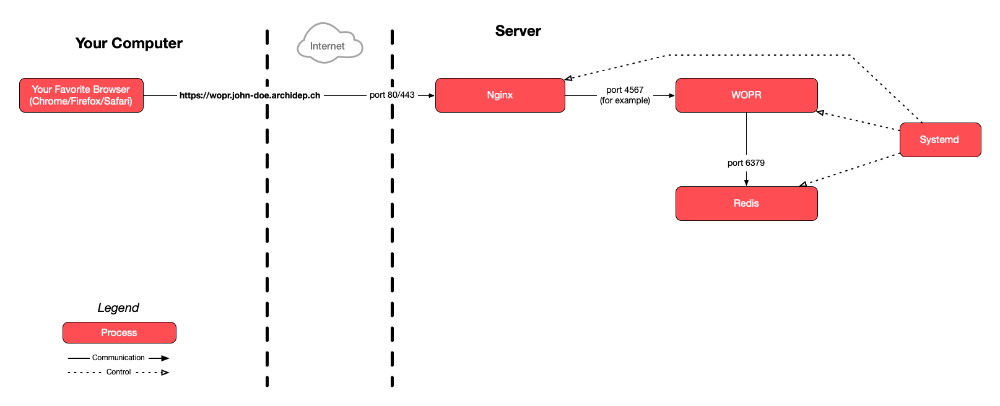

# Deploy a more complex web application with Docker Compose

The goal of this exercise is to learn to deploy a multi-container web
application with Docker Compose. You will create a portable Compose file that
can be used to deploy the same containers on both your local machine and your
cloud server.

<!-- START doctoc generated TOC please keep comment here to allow auto update -->
<!-- DON'T EDIT THIS SECTION, INSTEAD RE-RUN doctoc TO UPDATE -->

- [Legend](#legend)
- [:gem: Meet the new boss, same as the old boss](#gem-meet-the-new-boss-same-as-the-old-boss)
- [:gem: Make sure you have everything you need](#gem-make-sure-you-have-everything-you-need)
- [:gem: Spot the differences](#gem-spot-the-differences)
- [:exclamation: Create the Compose file](#exclamation-create-the-compose-file)
- [:exclamation: Define the database service](#exclamation-define-the-database-service)
- [:exclamation: Define the application service](#exclamation-define-the-application-service)
  - [:exclamation: Write a multi-stage Dockerfile](#exclamation-write-a-multi-stage-dockerfile)
    - [:exclamation: Write the first build stage](#exclamation-write-the-first-build-stage)
    - [:exclamation: Write the final build stage](#exclamation-write-the-final-build-stage)
  - [:exclamation: Add a `.dockerignore` file](#exclamation-add-a-dockerignore-file)
  - [:question: Build your Docker image](#question-build-your-docker-image)
  - [:exclamation: Write the application service](#exclamation-write-the-application-service)
- [:exclamation: Define the reverse proxy service](#exclamation-define-the-reverse-proxy-service)
- [:exclamation: Run the Compose project](#exclamation-run-the-compose-project)
- [:exclamation: Deploy it on your cloud server](#exclamation-deploy-it-on-your-cloud-server)
- [:checkered_flag: What have I done?](#checkered_flag-what-have-i-done)

<!-- END doctoc generated TOC please keep comment here to allow auto update -->


## Legend

Parts of this guide are annotated with the following icons:

- :exclamation: A task you **MUST** perform to complete the exercise.
- :question: An optional step that you _may_ perform to make sure that
  everything is working correctly.
- :warning: **Critically important information about the exercise.**
- :gem: Tips on the exercise, reminders about previous exercises, or
  explanations about how this exercise differs from the previous one.
- :space_invader: More advanced tips on how to save some time.
- :books: Additional information about the exercise or the commands and tools
  used.
- :checkered_flag: The end of the exercise.
  - :classical_building: The architecture of what you deployed during the
    exercise.
- :boom: Troubleshooting tips: how to fix common problems you might encounter.


## :gem: Meet the new boss, same as the old boss

This exercise is basically the same as the [previous Docker Compose
exercise](./docker-compose-todolist.md), but it illustrates how to deploy a
slightly more complex application than the PHP todolist with Docker Compose,
namely the [WOPR application you deployed during another
exercise](./wopr-deployment.md).

Since the basic structure of the exercise is the same, this exercise will only
list what is different.


## :gem: Make sure you have everything you need

You need a fork of the [WOPR repo][wopr-repo], which you should already have if
you performed the [WOPR deployment exercise](./wopr-deployment.md).

Make sure you have a clone of this fork somewhere **on your local machine**, and
also **on your cloud server**. Likewise, you should already have them somewhere.


## :gem: Spot the differences

The architecture of the WOPR application is basically the same as the PHP
todolist's. There are basically 3 components:

* The reverse proxy.
* The WOPR application.
* The database.



The main differences are:

* Where the PHP todolist only used PHP, WOPR is an application using two
  technology stacks:
  * [Ruby][ruby] for the backend.
  * [Node.js][node] to compile the JavaScript frontend.
* The database is [Redis][redis] instead of MySQL.

You may think that since there are 2 parts to the application, a Ruby backend
and a JavaScript frontend, you need to run 2 isolated containers for them.
However, the JavaScript frontend, once compiled, is composed of purely static
files. The Ruby backend knows how to serve these static files to the client's
browser, where the JavaScript is executed. There is no need for an extra
container for the frontend's static files.

So, our Compose file for the WOPR application will look something like this:

```yml
name: wopr

services:
  rp:
    image: # ...
    depends_on: # ...
    ports: # ...
    restart: # ...
    volumes: # ...
  app:
    image: # ...
    build: # ...
    depends_on: # ...
    environment: # ...
    restart: # ...
  db:
    image: # ...
    restart: # ...
```


## :exclamation: Create the Compose file

Let's create this Compose file.


## :exclamation: Define the database service

Compare to the [previous exercise](./docker-compose-todolist.md), you of course
want to use a Docker image to run [Redis][redis] instead of MySQL, since that is
the database required by the WOPR application.

The database service is simpler to define this time, because Redis is a
key-value [NoSQL][nosql] database which is:

* Schemaless: you do not need to create the database structure in advance before
  using it.
* Without authentication by default. You *can* set up authentication, of course,
  but the default configuration is not to have it.

This means that the [official `redis` Docker image][redis-docker-image] requires
basically no configuration, so you can omit the `environment` key compare to the
[previous exercise](./docker-compose-todolist.md).

Move into the WOPR repository **on your local machine** and add a `compose.yml`
file with the following contents:

```yml
name: wopr

services:
  db:
    image: # ...
    restart: # ...
```

Fill in the blanks!

> :space_invader: Use an Alpine-based image for a smaller footprint.


## :exclamation: Define the application service

This is that part that is more involved than in the previous exercise. The WOPR
application is more complex than the PHP todolist. As previously mentioned, it
has two technology stacks: Ruby and Node.js.

However, Docker images are intended to be lightweight and as simple as possible
by design. You will find [an official `ruby` Docker image][ruby-docker-image]
and [an official `node` Docker image][node-docker-image], but there is no
"official Ruby & Node.js image".

You could make such an image with both Ruby and Node.js yourself (and someone
may already have done and published it on Docker Hub), but that's not really the
Docker philosophy.

### :exclamation: Write a multi-stage Dockerfile

Enter [Docker multi-stage builds][docker-multi-stage].

A Dockerfile may actually contain **more than one `FROM` command** and use
multiple base images:

* Each `FROM` instruction can use a **different base**, and each of them begins
  a new stage of the build.
* You can **selectively copy artifacts from one stage to another**, leaving
  behind everything you don't want in the final image.

This is great! Not only will it allow us to use both Ruby and Node.js in the
process of building our final Docker image, but it will also allow us to get rid
of what we do not need in the final image (in this case: the Node.js
dependencies required to build the frontend).

Add a `Dockerfile` to your local WOPR repository:

```Dockerfile
# First stage: build the frontend
FROM ... AS build

...

# Final stage: build the application
FROM ...

...
```

Note that the first staged is **named** "build" by adding `AS build` after the
first `FROM` command. This will allow you to reference it in the final build
stage later.

Now fill in the blanks.

#### :exclamation: Write the first build stage

First, complete the [`FROM` command][dockerfile-from] of the first stage to use
the [official `node` Docker image][node-docker-image].

> :space_invader: Use an Alpine-based image for a smaller footprint.

If you read [WOPR's documentation][wopr-repo], there are two commands related to
building the frontend: `npm ci`, which installs the required Node.js
dependencies; and `npm run build`, which builds the frontend's static files.
That's what you need to put in a [`RUN` command][dockerfile-run] in the first
stage.

Of course, to run these commands, the image will need the WOPR application's
files, so you'll need a [`COPY` command][dockerfile-copy] first.

It's also good practice to define a working directory with the [`WORKDIR`
command][dockerfile-workdir] so you know where the files are during the build.
You can use any directory, for example `/app`. This `WORKDIR` command should
come before both the `COPY` and `RUN` commands, so that the latter are run in
the context of the specified working directory.

#### :exclamation: Write the final build stage

Complete the `FROM` command of the final build stage to use the [official `ruby`
Docker image][ruby-docker-image]. Use an Alpine-based image for a smaller
footprint.

> :warning: Use Ruby 3.2.x and not the latest Ruby 3.3.x. There is currently a
> bug with Ruby 3.3.x on some processor architectures which will cause a
> segmentation fault when you try to run your image.

Define a `WORKDIR` like in the previous build.

Like in the first Docker exercise, you want to [create a dedicated group and
user](./docker-static.md#exclamation-create-a-group-and-user) to avoid
`root`-related security issues. You can do so with the following `RUN` command:

```Dockerfile
RUN addgroup -S wopr && adduser -S wopr -G wopr && \
    chown -R wopr:wopr /app
```

> :gem: The above `RUN` command assumes that you have chosen `/app` as your
> `WORKDIR`. Change it if necessary.

To set up the backend, you basically have one command to run as per [WOPR's
documentation][wopr-repo]: `bundle install`. Put that in a `RUN` command in the
final stage.

Of course, this command needs the application's files, so add the appropriate
`COPY` command before the `RUN` command.

> :gem: Read the [`COPY` command's documentation][dockerfile-copy] and be sure
> to use the `--chown` option. You want the copied files to be owned by the
> dedicated `wopr` user and group you just created.

Some of the WOPR application's dependencies need to be compiled, so you need to
install compilation tools [like you did during the WOPR
exercise](./wopr-deployment.md#exclamation-install-compilation-tools). Add one
of the following commands at the beginning of the final stage (it needs to be
before running `bundle install`):

```Dockerfile
RUN apk add --no-cache build-base
```

There's one last thing you need to do. When you performed the original WOPR
exercise, the `npm run build` command created the `public` directory containing
the frontend's compiled files. But now that you have a multi-stage Dockerfile,
the two stage builds are isolated by default. So the final stage is missing the
result of the first stage.

You need to manually copy over the result from the first build stage into the
final stage:

```Dockerfile
COPY --chown=wopr:wopr --from=build /app/public/ ./public/
```

> :gem: The above `COPY` command assumes that you chose `/app` as your
> `WORKDIR`. Change it if necessary.
>
> :books: The `chown` option of the `COPY` command, named after Unix's
> equivalent `chown` command, sets the ownership of the copied files in the
> target stage. In this case, you want all the files to be owned by the
> dedicated `wopr` user and group you created earlier.

One last thing: your image must actually run the WOPR application. Reading
[WOPR's documentation][wopr-repo], you might remember that the command to do so
is `bundle exec ruby app.rb`.

Add the appropriate [`CMD` command][dockerfile-cmd] at the end of the final
build stage to run the application.

### :exclamation: Add a `.dockerignore` file

Do not forget to add a `.dockerignore` file to the WOPR repository. The main
artifacts you want to ignore in this case are the `node_modules` and the
`public` directories.

### :question: Build your Docker image

If you have written the Dockerfile correctly, you should be able to build it
without errors:

```bash
$> docker build -t wopr/app .
```

### :exclamation: Write the application service

You can now add the WOPR application service to the Compose file:

...
```yml
name: wopr

services:
  app:
    image: # ...
    build: # ...
    depends_on: # ...
    environment: # ...
    restart: # ...
  # ...
```

On principle, this is the same as [during the previous exercise](./docker-compose-todolist.md#exclamation-write-the-application-service).

The only real difference is that instead of setting the `$TODOLIST_DB_HOST` and
`$TODOLIST_DB_PASS` (and optionally other) variables, you need to set the
`$WOPR_REDIS_URL` variable as per [WOPR's documented
configuration][wopr-repo#configuration].

The value needs to be a Redis connection URL in the format
`redis://<host>:<port>`. You can replace `<host>` with `db`, like in the
previous exercise, and replace `<port>` by Redis's default 6379 port (or remove
`:<port>` altogether, which will use the default).


## :exclamation: Define the reverse proxy service

The reverse proxy service is basically the same as [in the previous
exercise](./docker-compose-todolist.md#exclamation-write-the-reverse-proxy-service):

```yml
services:
  rp:
    image: # ...
    ports: # ...
    depends_on: # ...
    restart: #...
    volumes: #...
  # ...
```

The only difference is that the nginx site configuration is really simple since
there is no FastCGI madness. All that is needed is to proxy requests to the
application service:

```conf
server {
  listen 0.0.0.0:80;
  server_name _;

  location / {
    proxy_pass http://app:4567;
  }
}
```

Choose a different port to publish the reverse proxy service, say `14000`.


## :exclamation: Run the Compose project

You now have the whole Compose architecture for this exercise: the database, the
application, and the reverse proxy.

All that's left to do is run it:

```bash
$> docker compose up --build --detach rp
```

You should see your services running:

```bash
$> docker compose ps
NAME         IMAGE                 COMMAND                  SERVICE   CREATED         STATUS         PORTS
wopr-app-1   wopr/app              "bundle exec ruby ap…"   app       8 seconds ago   Up 7 seconds
wopr-db-1    redis:7.2.4-alpine    "docker-entrypoint.s…"   db        10 hours ago    Up 6 minutes   6379/tcp
wopr-rp-1    nginx:1.25.3-alpine   "/docker-entrypoint.…"   rp        8 seconds ago   Up 7 seconds   0.0.0.0:14000->80/tcp
```

> :boom: If not everything is running, you might want to stop everything with
> `docker compose down` and run the project in the foreground with `docker
> compose up --build rp`. It will be easier to see errors that way. Otherwise
> you can use `docker compose logs`.

Assuming you chose port `14000` and that you have configured everything
correctly, you should be able to use the WOPR application at
http://localhost:14000!

Yay! 🎉


## :exclamation: Deploy it on your cloud server

The final deployment step of this exercise is basically [the same as in the
previous
exercise](./docker-compose-todolist.md#exclamation-deploy-it-on-your-cloud-server),
except that:

* You must of course use the WOPR repositories on your local machine, GitHub and
  your cloud server instead of the PHP todolist repositories.
* You have already installed Docker on your cloud server, so no need to do it
  again.
* An `.env` file is not required for WOPR since there is no sensitive value in
  the configuration (although you could use one to make the project more
  configurable).
* Choose another `server_name`, e.g. `wopr-docker.john-doe.archidep.ch`, and
  another nginx site configuration file name, e.g. `wopr-docker`.

If you follow the previous exercise's instructions and take these changes into
account, you should be able to easily replicate your Compose WOPR deployment on
your cloud server and access it at http://wopr-docker.john-doe.archidep.ch!


## :checkered_flag: What have I done?

You have learned how to build and deploy a more complex multi-stack web
application with Docker and Docker Compose. As you can see, a project can use
any number of technologies; between multi-stage Dockerfile builds and
multi-container Compose projects, Docker and Docker Compose have you covered.


[docker-multi-stage]: https://docs.docker.com/build/building/multi-stage/
[dockerfile-cmd]: https://docs.docker.com/engine/reference/builder/#cmd
[dockerfile-copy]: https://docs.docker.com/engine/reference/builder/#copy
[dockerfile-from]: https://docs.docker.com/engine/reference/builder/#from
[dockerfile-run]: https://docs.docker.com/engine/reference/builder/#run
[dockerfile-workdir]: https://docs.docker.com/engine/reference/builder/#workdir
[node]: https://nodejs.org
[node-docker-image]: https://hub.docker.com/_/node
[nosql]: https://en.wikipedia.org/wiki/NoSQL
[redis]: https://redis.io
[redis-docker-image]: https://hub.docker.com/_/redis
[ruby]: https://www.ruby-lang.org
[ruby-docker-image]: https://hub.docker.com/_/ruby
[wopr-repo]: https://github.com/MediaComem/comem-wopr
