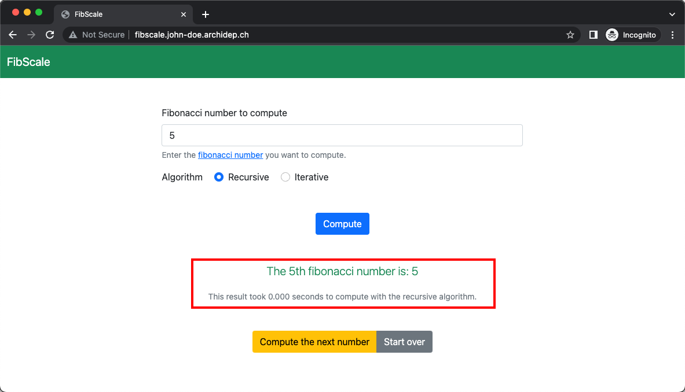
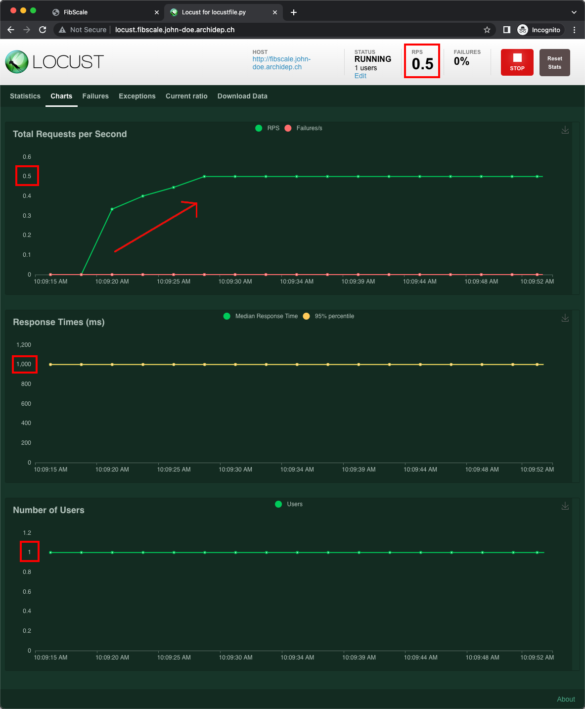
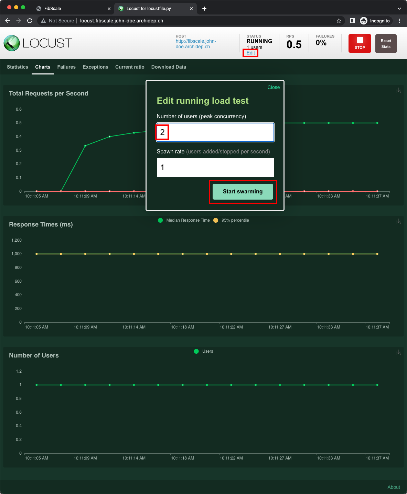
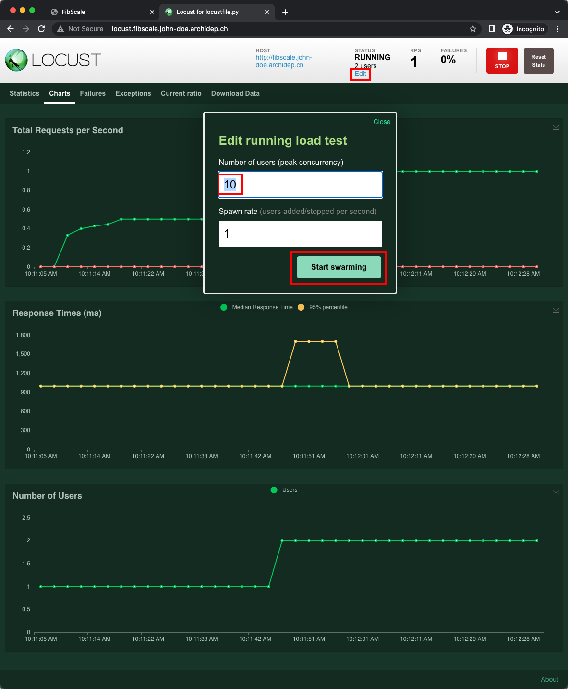
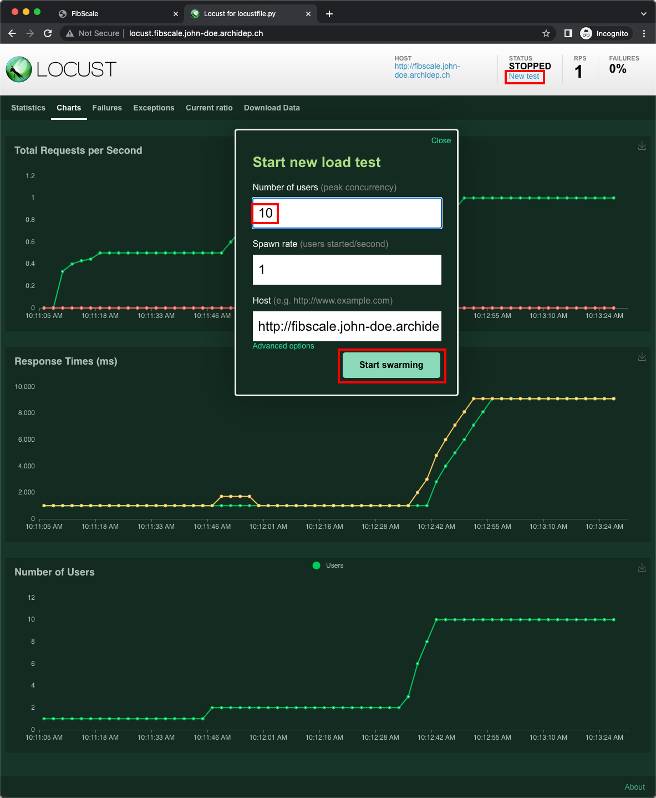
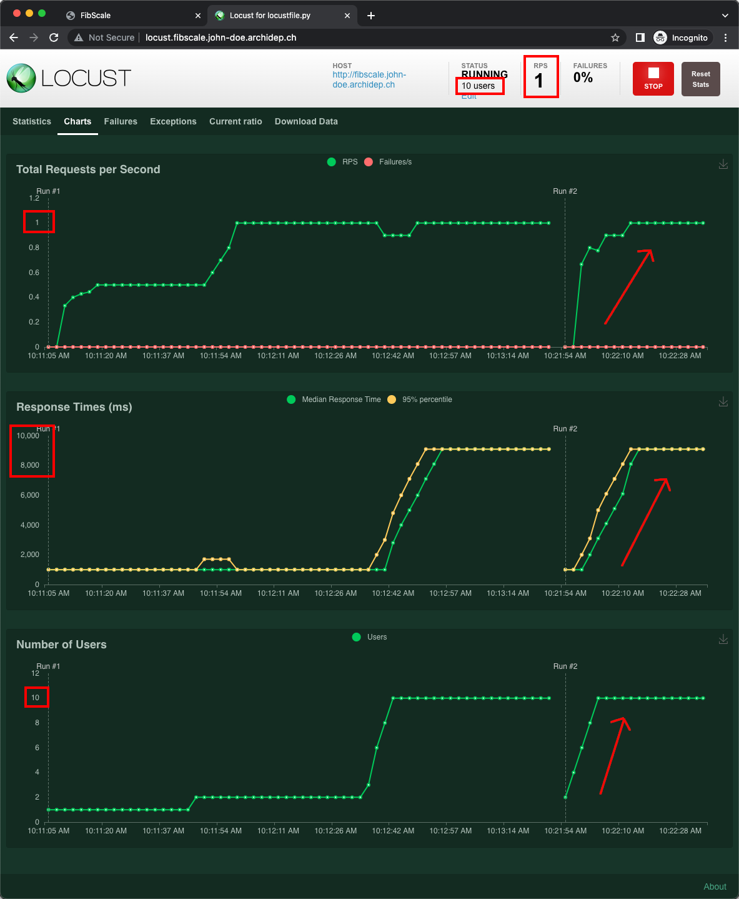
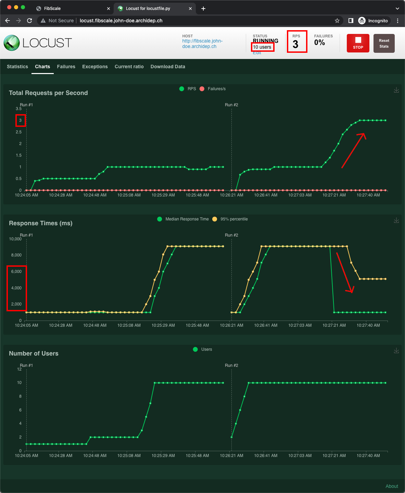
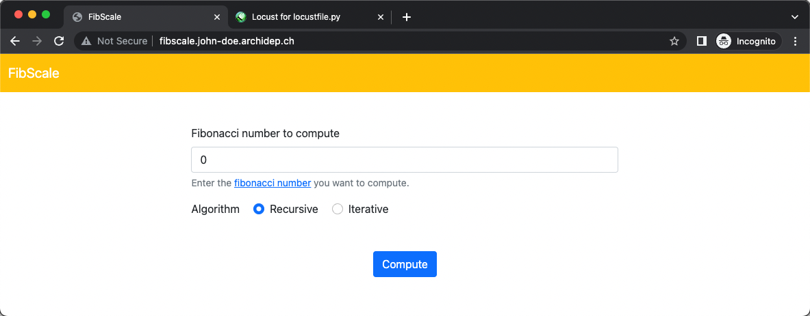

# Horizontally scale a web application with nginx as a load balancer

The goal of this exercise is to show how a web application can be
[scaled][scaling] to handle a growing amount of work by using Systemd unit
templates and configuring nginx as a [load balancer][load-balancing].

This guide assumes that you are familiar with [reverse proxying][slides], that
you have nginx installed and running on a server, and that you have a DNS
wildcard entry preconfigured to make various subdomains
(`*.john-doe.archidep.ch` in this guide) point to that server.

<!-- START doctoc generated TOC please keep comment here to allow auto update -->
<!-- DON'T EDIT THIS SECTION, INSTEAD RE-RUN doctoc TO UPDATE -->

- [Legend](#legend)
- [:gem: The application](#gem-the-application)
- [:exclamation: Requirements](#exclamation-requirements)
- [:exclamation: Deploy the application](#exclamation-deploy-the-application)
- [:exclamation: Artificially slow down the application](#exclamation-artificially-slow-down-the-application)
- [:exclamation: Load-testing the application](#exclamation-load-testing-the-application)
  - [:exclamation: Deploy a Locust instance](#exclamation-deploy-a-locust-instance)
  - [:exclamation: Start load-testing the application with a small number of users](#exclamation-start-load-testing-the-application-with-a-small-number-of-users)
  - [Increase the load](#increase-the-load)
- [:gem: What to do?](#gem-what-to-do)
- [:exclamation: Horizontally scale the FibScale application](#exclamation-horizontally-scale-the-fibscale-application)
  - [:exclamation: Transform the FibScale Systemd unit into a template](#exclamation-transform-the-fibscale-systemd-unit-into-a-template)
  - [:exclamation: Load-test the new FibScale service](#exclamation-load-test-the-new-fibscale-service)
  - [:exclamation: Spin up more instance of the FibScale application](#exclamation-spin-up-more-instance-of-the-fibscale-application)
  - [:exclamation: Configure nginx to balance the load among the available FibScale instances](#exclamation-configure-nginx-to-balance-the-load-among-the-available-fibscale-instances)
- [:books: Not the solution to all your problems](#books-not-the-solution-to-all-your-problems)
- [:checkered_flag: What have I done?](#checkered_flag-what-have-i-done)
  - [:classical_building: Architecture](#classical_building-architecture)
  - [:books: Why is the iterative algorithm much faster?](#books-why-is-the-iterative-algorithm-much-faster)

<!-- END doctoc generated TOC please keep comment here to allow auto update -->

## Legend

Parts of this guide are annotated with the following icons:

- :exclamation: A task you **MUST** perform to complete the exercise.
- :question: An optional step that you _may_ perform to make sure that
  everything is working correctly.
- :warning: **Critically important information about the exercise.**
- :gem: Tips on the exercise, reminders about previous exercises, or
  explanations about how this exercise differs from the previous one.
- :space_invader: More advanced tips on how to save some time.
- :books: Additional information about the exercise or the commands and tools
  used.
- :checkered_flag: The end of the exercise.
  - :classical_building: The architecture of what you deployed during the
    exercise.
- :boom: Troubleshooting tips: how to fix common problems you might encounter.

## :gem: The application

The application you will deploy is [**FibScale**][fibscale], a web application
that computes [Fibonacci numbers][fib].

## :exclamation: Requirements

The following requirements should be installed on your server:

- [Ruby][ruby] 2.7.x or 3.x and compilation tools

  You can install those by running the following commands:

  ```bash
  $> sudo apt update
  $> sudo apt install ruby-full build-essential
  ```
- [Bundler][bundler], a command-line tool that downloads Ruby gems (i.e.
  packages)

  Once your have Ruby installed, you can install Bundler with the `gem` command:

  ```bash
  $> sudo gem install bundler
  ```

> :gem: You can check that everything has been correctly installed with the
> following commands:
>
> ```bash
> # Ruby 3.x will be installed by default on Ubuntu 22.04:
> $> ruby --version
> ruby 3.0.2p107 (2021-07-07 revision 0db68f0233) [x86_64-linux-gnu]
>
> # Ruby 2.7.x will be installed by default On Ubuntu 20.04:
> $> ruby --version
> ruby 2.7.0p0 (2019-12-25 revision 647ee6f091) [x86_64-linux-gnu]
>
> # The same version of Bundler should be installed regardless of the Ruby version:
> $> bundle --version
> Bundler version 2.4.3
> ```

## :exclamation: Deploy the application

Let's start by deploying the application and seeing it in action. Clone the
repository on your server and install the required dependencies:

```bash
cd
git clone https://github.com/MediaComem/fibscale.git
cd fibscale
bundle config set --local deployment 'true'
bundle install
```

Create a Systemd unit file named `/etc/systemd/system/fibscale.service` (e.g.
with `nano`) to execute the application:

```conf
[Unit]
Description=Fibonacci calculator

[Service]
ExecStart=/usr/local/bin/bundle exec ruby fibscale.rb
WorkingDirectory=/home/john_doe/fibscale
Environment="FIBSCALE_PORT=4202"
User=john_doe
Restart=on-failure

[Install]
WantedBy=multi-user.target
```

> :gem: Replace `john_doe` with your name in the `WorkingDirectory` and `User`
> options.

Enable and start your new service:

```bash
$> sudo systemctl enable fibscale
$> sudo systemctl start fibscale
```

> :gem: You can check that it is running with `sudo systemctl status fibscale`.

Create the nginx site configuration `/etc/nginx/sites-available/fibscale` (e.g.
with `nano`) to expose this component:

```conf
server {
  listen 80;
  server_name fibscale.john-doe.archidep.ch;

  location / {
    proxy_pass http://127.0.0.1:4202;
  }
}
```

> :gem: Replace `john-doe` with your name in the `server_name` directive.

Enable that configuration with the following command:

```bash
$> sudo ln -s /etc/nginx/sites-available/fibscale /etc/nginx/sites-enabled/fibscale
```

Check and reload nginx's configuration:

```bash
$> sudo nginx -t
$> sudo nginx -s reload
```

You should now be able to access the FibScale application at
http://fibscale.john-doe.archidep.ch and see how it works.


As you can see, FibScale will compute Fibonacci numbers using various
algorithms, and display how much time each computation took.



## :exclamation: Artificially slow down the application

To better show the benefits of scaling, we will configure the FibScale
application to simulate each computation being very slow. As you can see in [its
documentation][fibscale-config], you can do that by setting the
`$FIBSCALE_DELAY` environment variable to a number of seconds. Each computation
will be artificially delayed by that amount of time.

Once our application is slower, we will see how we can make it faster.

> :books: **Why not compute a very high Fibonacci number instead of adding a
> fake delay?**
>
> If you have played with the application, you may have noticed that the higher
> the Fibonacci number you try to compute, the more time it takes with the
> recursive algorithm. For example, computing the 37th Fibonacci number with the
> recursive algorithm usually takes more than 3 seconds with the Azure servers
> recommended for this course.
>
> Why then introduce an artificial delay instead of simply computing a high
> Fibonacci number?
>
> Because scaling an application is a complex task and is done differently
> depending on the cause of the slowdown (e.g. CPU-bound or I/O-bound). If we
> slow down the computation by consuming more CPU (i.e. computing a high
> Fibonacci number), we may hit the limits of our server's CPU(s). By
> artificially slowing down computation without consuming more CPU or other
> resources, we can simplify the demonstration and concentrate on configuring
> load balancing with nginx.
>
> For more information, see [the additional explanations at the end of the
> exercise](#not-the-solution-to-all-your-problems).

Add the following line to the `[Service]` section of the
`/etc/systemd/system/fibscale.service` Systemd unit file:

```conf
Environment="FIBSCALE_DELAY=1"
```

Reload the Systemd configuration and restart your service:

```bash
$> sudo systemctl daemon-reload
$> sudo systemctl restart fibscale
```

Test the application at http://fibscale.john-doe.archidep.ch again and
observe that every computation now takes at least one second.


We now have a simulation of a slow application. Or do we? As the saying goes:

* **Don't guess, measure!**

## :exclamation: Load-testing the application

You will use [Locust][locust], an open-source [load testing][load-testing] tool
written in Python, and use it to measure the performance of the FibScale
application. **Load testing** is the process of putting demand on a system and
measuring its response time. In this case, we will simulate multiple users
trying to use FibScale concurrently, add see how much time it takes for each
user to get a response.

### :exclamation: Deploy a Locust instance

To install Locust, you need [Python][python] 3 and [pip][pip], a Python package
manager, installed on your server. You can do that with the following commands:

```bash
$> sudo apt install python3 python3-pip
```

> :gem: APT may tell you that these packages are already installed. That's fine.

You can then install Locust with pip:

```bash
$> sudo pip3 install locust
```

This will add the `locust` command to your system:

```bash
$> locust -V
locust 2.14.2
```

To use Locust, you would normally [write a locustfile][locustfile] describing a
load testing scenario, i.e. users and their behavior as they access your
application. Fortunately for you, the FibScale application already comes with
a [pre-configured locustfile][fibscale-locustfile] which simulates a user that
requests the computation of the 100th Fibonacci number every second.

As [Locust's documentation][locust-getting-started] states, you simply need to
run the `locust` command in a directory containing a locustfile named
`locustfile.py`, and Locust will be ready to run your load testing scenario.

Let's create a Systemd unit file named
`/etc/systemd/system/fibscale-locust.service` that does just that:

```conf
[Unit]
Description=Locust instance to test FibScale
After=fibscale.service

[Service]
ExecStart=/usr/local/bin/locust
WorkingDirectory=/home/john_doe/fibscale
User=john_doe
Restart=on-failure

[Install]
WantedBy=multi-user.target
```

> :gem: Replace `john_doe` with your name in the `WorkingDirectory` and `User`
> options.

Enable and start your new service:

```bash
$> sudo systemctl enable fibscale-locust
$> sudo systemctl start fibscale-locust
```

> :gem: You can check that it is running with `sudo systemctl status
> fibscale-locust`.

Create the nginx site configuration file
`/etc/nginx/sites-available/fibscale-locust` to expose Locust, which listens on
port 8089 by default:

```conf
server {
  listen 80;
  server_name locust.fibscale.john-doe.archidep.ch;

  location / {
    proxy_pass http://127.0.0.1:8089;
  }
}
```

> :gem: Replace `john-doe` with your name in the `server_name` directive.

Enable that configuration with the following command:

```bash
$> sudo ln -s /etc/nginx/sites-available/fibscale-locust /etc/nginx/sites-enabled/fibscale-locust
```

Check and reload nginx's configuration:

```bash
$> sudo nginx -t
$> sudo nginx -s reload
```

You should now be able to access Locust at
http://locust.fibscale.john-doe.archidep.ch.

### :exclamation: Start load-testing the application with a small number of users

The **Host** field tells Locust what the base URL for the load testing scenario
is. Enter the address of FibScale: `http://fibscale.john-doe.archidep.ch`. Set
the **Number of users** to 1 and the **Spawn rate** to 1 for now, and run the
scenario.


The **Statistics** tab shows basic numbers about the number of requests made (in
total and per second) and how much time they take


The **Charts** tab is more interesting: it shows the same information as line
charts.



You should quickly see the number of requests per second (RPS) stabilizing at
~0.5, which is what we would expect with 1 user: the user requests the
computation of the 100th Fibonacci number, which takes about 1 second with our
artificial delay in place, and we can see that in the response time chart. Then
the user waits 1 second before repeating the request as defined by the load
testing scenario. Our single users ends up making 1 request every 2 seconds,
which is 0.5 RPS.

Click the **Edit** button in the top bar and change the **Number of users** to 2
without changing the spawn rate.



With 2 users making a request every 2 seconds each, you should see the number of
requests per seconds stabilizing at ~1. Everything is as we expect so far.


### Increase the load

Now change the **Number of users** to 10 and leave the **Spawn rate** to 1. This
will add 8 more users to our existing 2.



> :books: The spawn rate is the number of new users added every second, meaning
> that it will take 8 seconds (1 per new user) to reach our target number of 10
> users starting from the 2 we already have.

The number of requests per second should remain unchanged while the response
time should increase to ~9 seconds.


Try computing a Fibonacci number yourself again. You will have to wait a while
for a result because the application is busy responding to the simulated Locust
users.

Why is that?

The FibScale application has been deliberately implemented so that it runs in a
single execution thread on one CPU core, meaning **it can only serve one request
at a time**. As soon as the computation of a Fibonacci number starts for one of
our users, the 9 other users have to wait until that is done. Then the
computation starts for the second user, and the remaining users have to wait in
line again.

```
computation 1  --1s--
computation 2        --1s--
computation 3              --1s--
computation 4                    --1s--
computation 5                          --1s--
computation 6                                --1s--
computation 7                                      --1s--
computation 8                                            --1s--
computation 9                                                  --1s--
               ------------------------------------------------------ 9s total
```

In the end , each user ends up waiting for about 9 seconds before getting a
response.

You may now **stop** the load testing scenario.


## :gem: What to do?

Our application is far too slow and the user experience is horrible. We have to
speed it up!

Let's assume that:

* We don't know Ruby and cannot find a way to speed up the application by
  changing its implementation.
* The slowness is not caused by a lack of resources on the server (CPU, memory
  or I/O performance).

> :books: These assumptions do not necessarily represent every real-world
> scenario, but since they are true for this exercise, it will allow us to
> perform scaling on our single server.

If we have resources to spare on the server, and one instance of the FibScale
application cannot serve enough users at the same time, let's **spin up more
instances** and see what happens.

## :exclamation: Horizontally scale the FibScale application

First, stop and disable the `fibscale` service:

```bash
sudo systemctl stop fibscale
sudo systemctl disable fibscale
```

To run multiple instances of FibScale, you could create separate Systemd
services, but Systemd also supports **unit templates**, i.e. units that can be
started multiple times based on a template.

### :exclamation: Transform the FibScale Systemd unit into a template

To turn the `fibscale` service into a template, you must rename the
`fibscale.service` file to `fibscale@.service`:

```bash
$> sudo mv /etc/systemd/system/fibscale.service /etc/systemd/system/fibscale@.service
```

When a template is started, it will have access to the **instance parameter**
named `%i`. You can use that parameter in the template definition, e.g. to
pass it to the application or change the port the application listens on.

Modify `/etc/systemd/system/fibscale@.service` as follows:

- Remove the `[Install]` section and the `WantedBy` option it contains. We will
  no longer start the `fibscale` service directly once it is a template.
- Add the `%i` parameter at the end of the description.
- Add the `%i` parameter at the end of the `ExecStart` command to pass it to the
  FibScale application.

  > :gem: As you can see in [FibScale's documentation][fibscale-config], passing
  > an integer to the application will change the color of its navbar to help
  > identify different instances.

- Change the value of the `$FIBSCALE_PORT` environment variable from the fixed
  port `4202` to the dynamic port `4200%i`. Since we intend on running multiple
  instances of the FibScale application, they need to listen on different ports
  (e.g. 42001, 42002).
- Add a `PartOf=fibscales.target` option to the `[Unit]` section. A Systemd
  **target** is a group of units. This `fibscales.target` group does not exist
  yet, but we will soon create it.

The new version of the service template should look something like this:

```conf
[Unit]
Description=Fibonacci calculator instance %i
PartOf=fibscales.target

[Service]
ExecStart=/usr/local/bin/bundle exec ruby fibscale.rb %i
WorkingDirectory=/home/john_doe/fibscale
Environment="FIBSCALE_PORT=4200%i"
Environment="FIBSCALE_DELAY=1"
User=john_doe
Restart=on-failure
```

Let's now create the Systemd target file `/etc/systemd/system/fibscales.target`
file with the following contents:

```conf
[Unit]
Description=Fibonacci calculator cluster
Requires=fibscale@1.service

[Install]
WantedBy=multi-user.target
```

This will run **one instance** of our templated `fibscale@` unit with the
instance parameter `1`, resulting in a service named **`fibscale@1`**.

Enable and start the target just like you would a service:

```bash
$> sudo systemctl enable fibscales.target
$> sudo systemctl start fibscales.target
```

You can check the status of a target like you would a service:

```bash
$> sudo systemctl status fibscales.target
```

You can also check the status of each individual instance:

```bash
$> sudo systemctl status fibscale@1
```

Now that FibScale is up and running again, update the nginx site configuration
file `/etc/nginx/sites-available/fibscale` to support multiple FibScale
instances. There is only one for now, but we will add more soon enough.

You need to define an [nginx **upstream**][nginx-upstream] which is a group of
servers, basically a list of addresses where our FibScale applications can be
reached. We only have one service running for now, `fibscale@1`. Since the
instance parameter `%i` has the value `1` and we set the value of the
`$FIBSCALE_PORT` environment variable to `4200%i`, that instance of the service
listens on port `42001`. Let's define that upstream and **update the
`proxy_pass` directive** to point to it:

```conf
# Group of FibScale applications.
upstream fibscale {
  server 127.0.0.1:42001;
}

server {
  listen 80;
  server_name fibscale.john-doe.archidep.ch;

  location / {
    # Proxy to the upstream.
    proxy_pass http://fibscale;
  }
}
```

Test and reload nginx's configuration:

```bash
$> sudo nginx -t
$> sudo nginx -s reload
```

Access the FibScale application at http://fibscale.john-doe.archidep.ch again,
and note that the navbar has changed color (because of the instance parameter
passed as argument).


### :exclamation: Load-test the new FibScale service

Access Locust at http://locust.fibscale.john-doe.archidep.ch and run the same
load testing scenario as before: test the **Host**
http://fibscale.john-doe.archidep.test with the **Number of users** set to 10
and the **Spawn rate** set to 1.



You should see similar numbers as before. After all, we haven't really changed
anything yet: there is still only one FibScale application responding to
requests.



### :exclamation: Spin up more instance of the FibScale application

To launch more instances of the FibScale application, simply update the
`/etc/systemd/system/fibscales.target` file to run more instances of the
service. Let's run three:

```conf
[Unit]
Description=Fibonacci calculator cluster
Requires=fibscale@1.service fibscale@2.service fibscale@3.service

[Install]
WantedBy=multi-user.target
```

To take these changes into account, reload the Systemd configuration and start
the `fibscales.target` group again (no need to restart it):

```bash
$> sudo systemctl daemon-reload
$> sudo systemctl start fibscales.target
```

You should then be able to check the status of each instance separately:

```bash
$> sudo systemctl status fibscale@1
$> sudo systemctl status fibscale@2
$> sudo systemctl status fibscale@3
```

You should not see any change in Locust yet, because nginx is not yet aware of
the additional instances.

### :exclamation: Configure nginx to balance the load among the available FibScale instances

Update the `upstream` definition in the nginx site configuration file
`/etc/nginx/sites-availble/fibscale` to add your new FibScale instances. Since
the instance parameter `%i` is `2` and `3` for our 2 new instances, we know
they're listening on ports `42002` and `42003`:

```conf
upstream fibscale {
  server 127.0.0.1:42001;
  server 127.0.0.1:42002;
  server 127.0.0.1:42003;
}
```

Test and reload nginx's configuration:

```bash
$> sudo nginx -t
$> sudo nginx -s reload
```

Check Locust again and you should quickly see the number of requests per second
increase to 3 and the response time decrease.



If you access the FibScale application at http://fibscale.john-doe.archidep.ch
and reload the page a few times, you will see that the navbar changes color,
indicating that nginx correctly distributes your requests to the 3 FibScale
instances.




Now that the load is distributed among the 3 instances, our users' computations
are executed 3 at a time in parallel. For the same number of requests, it will
only take a third of the time compared to before.

```
computation 1  --1s--
computation 2  --1s--
computation 3  --1s--
computation 4        --1s--
computation 5        --1s--
computation 6        --1s--
computation 7              --1s--
computation 8              --1s--
computation 9              --1s--
               ------------------ 3s total
```

## :books: Not the solution to all your problems

This exercise is intended as a demonstration of how to perform load balancing
with nginx. But horizontal scaling is not necessarily a silver bullet for all
your performance problems, especially on a single server.

Actually, **deploying more instances of your application on the same server may
even make the problem worse** depending on the cause!

Three of the main causes of performance issues are: using too much CPU, not
having enough memory, performing too much I/O (input/output, e.g. disk access).
Whether horizontal scaling will work depends on the cause and on many other
factors:

- If your application is slow because it uses **too much CPU** (e.g. it makes
  many complex calculations), **increasing the number of instances may not
  increase performance**. It **may even decrease** it if your server's CPU
  core(s) becomes overloaded. It will depend on the following factors:

  - Does your server have only one CPU core?

    If you are running a CPU-bound application on a machine with one CPU core,
    **spinning up multiple instances of the application will only increase
    performance as long as you have CPU capacity to spare**.

    Once CPU usage reaches 100%, running more instances is unlikely to improve
    performance because one core cannot run things parallel. It can run things
    concurrently using [multithreading][multithreading], but that will probably
    not be enough change the overall throughput. Performance will start
    decreasing as you add more instances.
  - Does your server have multiple CPU cores?

    - Is the application single-threaded (i.e. it can only serve one request at
      a time)? (This depends on which programming language it is implemented in
      and how it is implemented.)

      In this case, spinning up more instances will probably increase
      performance because the different cores can execute your code in parallel.
      But it will depend on how many instances you launch and on the other
      programs that may also be consuming CPU capacity on your server. At some
      point all of the CPU cores will be working at 100% capacity. Spinning up
      more instances then will only make the application (and the whole server)
      slower.

    - Is the application already parallelizing its work (i.e. a single instance
      executes natively on multiple CPU cores)?

      In this case, spinning up more instance will only increase performance as
      long as you have CPU capacity to spare (i.e. all CPU cores are not yet at
      100% usage). Once all CPU cores are fully utilized, running more instances
      will only make the application (and the whole server) slower.
- If your application is slow because it consumes **too much memory** (e.g. it
  keeps references to a lot of data structures in memory), **spinning up
  multiple instances may increase performance IF your server has memory capacity
  to spare**.

  If the memory usage is already close to 100%, the only thing you will achieve
  by spinning up more instances of your application is to bring down your whole
  server due to a lack of memory.
- If your application is **slow due to I/O** (e.g. it regularly stores/retrieves
  data from disk or from a database), **increasing the number of instances may
  increase performance, but only IF the I/O work can be parallelized**, which
  depends entirely on what kind of work it is.

  File access can be parallelized up to a point, but at some point there will be
  too many accesses for your server's hard drive (or even SSD) to keep up.

  Database servers are designed for concurrent access and can get the most out
  of your hardware, but again there is a limit, especially if it's running on
  the same server as your application. At some point, running more instances
  will slow everything down.
- Running the load testing tool (Locust) on the same server as the application
  your are testing is actually a rather bad idea. As you increase the load,
  Locust itself will start consuming CPU and memory to simulate users. This will
  slow down your server and make your application slower than it would normally
  be.

Regardless of the reason why your application is slow, you also have to make
sure that your implementation supports concurrency (concurrent access to files,
to the database, etc) before you start spinning multiple instances.

Once you reach the limits of a single server, you will have to launch other
servers and run new instances of your application on those servers. In this
exercise, you have configured an nginx `upstream` that only contacts `127.0.0.1`
(your server itself), but nothing prevents you from pointing to other IP
addresses (or domain names) to spread the work among multiple servers. Of
course, in this case you have to make sure that your application supports being
distributed across multiple servers.

If you are very successful and reach 10,000+ concurrent clients, nginx may also
become a bottleneck in your architecture and you may have to set up load
balancing at the DNS level.

In summary: **performance is a very complex issue**. Again, before setting up
anything: **don't guess, measure!**

For your information, the FibScale application is very easy to scale
horizontally on a single server because it consumes little CPU (at least when
using the iterative algorithm) and is neither memory-bound or I/O bound. Its
slowness in this exercise is artificially caused by a [call to Ruby's `sleep`
function](https://github.com/AlphaHydrae/fibscale/blob/00dba541f53468c94b239b692372a714f5b919e1/fibscale.rb#L84).
This consumes neither CPU nor memory, and does not perform any I/O.

Also, since each computation of a Fibonacci number is independent of the others,
and there is no shared resource to access (e.g. a database), there is no issue
with running multiple instances. They never need to talk to each other or
synchronize access to anything.

> :gem: Also **be careful of issues such as [rate limiting][rate-limiting] and
> [(D)DOS][dos] protection when load-testing**. Load tests can look a lot like a
> DOS attack. You may inadvertently be banned by your cloud provider if you're
> not careful.

## :checkered_flag: What have I done?

You have installed a web application and identified a performance problem by
using [Locust][locust], a [load testing][load-testing] tool, to measure the
average response time to clients.

To improve the user experience, you have performed [horizontal
scaling][scalability] of your application by spinning up multiple instances and
[load balancing incoming requests][load-balancing] to these various instances
through nginx. This allows new instances to serve new clients while others are
busy, increasing the overall throughput and decreasing the response time for
each client.

### :classical_building: Architecture

This is a simplified architecture of the main running processes and
communication flow at the end of this exercise (after completing [all previous
course exercises][archidep-exercises]):


> [Simplified architecture PDF version](fibscale-deployment-simplified.pdf).

### :books: Why is the iterative algorithm much faster?

For those interested in programming, FibScale implements two algorithms to
compute Fibonacci numbers:

* The naive [recursive
  algorithm](https://github.com/AlphaHydrae/fibscale/blob/00dba541f53468c94b239b692372a714f5b919e1/fibscale.rb#L140-L151).
* The [iterative
  algorithm](https://github.com/AlphaHydrae/fibscale/blob/00dba541f53468c94b239b692372a714f5b919e1/fibscale.rb#L153-L163).

We call the recursive algorithm "naive" because although it is an easier
implementation to understand and implement, it has **exponential [time
complexity][time-complexity]** (and [space complexity][space-complexity]) of
`O(2^n)` because each function call produces two [recursive][recursion] function
calls. This means that it takes exponentially more time and memory to compute
Fibonacci numbers as you increase the number. This is why FibScale will refuse
to compute a Fibonacci number higher than 40 with the recursive algorithm
because that might hog your server's CPU for too long or exhaust its memory.

The iterative algorithm uses a smarter implementation that avoids the
exponential time complexity of the naive recursive algorithm by remembering each
computed Fibonacci number as it moves along. This algorithm has a time
complexity of `O(n)`, meaning the time increase is linear instead of
exponential. Since it uses a fixed number of variables and does not use
recursion, it has a space complexity of `O(1)`, meaning it consumes a fixed
amount of memory regardless of which Fibonacci number you are computing.

Read the articles [Program for Fibonacci
numbers](https://www.geeksforgeeks.org/program-for-nth-fibonacci-number/) and
[Fibonacci series in C](https://www.scaler.com/topics/fibonacci-series-in-c/)
for more detailed explanations.

[archidep-exercises]: https://github.com/MediaComem/comem-archidep#exercises
[bundler]: https://bundler.io
[curl]: https://linuxize.com/post/curl-command-examples/
[dos]: https://en.wikipedia.org/wiki/Denial-of-service_attack
[fib]: https://en.wikipedia.org/wiki/Fibonacci_number
[fibscale]: https://github.com/MediaComem/fibscale
[fibscale-config]: https://github.com/MediaComem/fibscale#configuration
[fibscale-locustfile]: https://github.com/AlphaHydrae/fibscale/blob/main/locustfile.py
[load-balancing]: https://en.wikipedia.org/wiki/Load_balancing_(computing)
[load-testing]: https://en.wikipedia.org/wiki/Load_testing
[locust]: https://locust.io
[locust-getting-started]: http://docs.locust.io/en/stable/quickstart.html
[locustfile]: http://docs.locust.io/en/stable/writing-a-locustfile.html
[multithreading]: https://en.wikipedia.org/wiki/Multithreading_(computer_architecture)
[nginx-upstream]: http://nginx.org/en/docs/http/ngx_http_upstream_module.html
[pip]: https://pypi.org/project/pip/
[python]: https://www.python.org
[rate-limiting]: https://en.wikipedia.org/wiki/Rate_limiting
[recursion]: https://en.wikipedia.org/wiki/Recursion
[ruby]: https://www.ruby-lang.org
[rbenv]: https://github.com/rbenv/rbenv
[scaling]: https://en.wikipedia.org/wiki/Scalability
[space-complexity]: https://en.wikipedia.org/wiki/Space_complexity
[time-complexity]: https://en.wikipedia.org/wiki/Time_complexity
