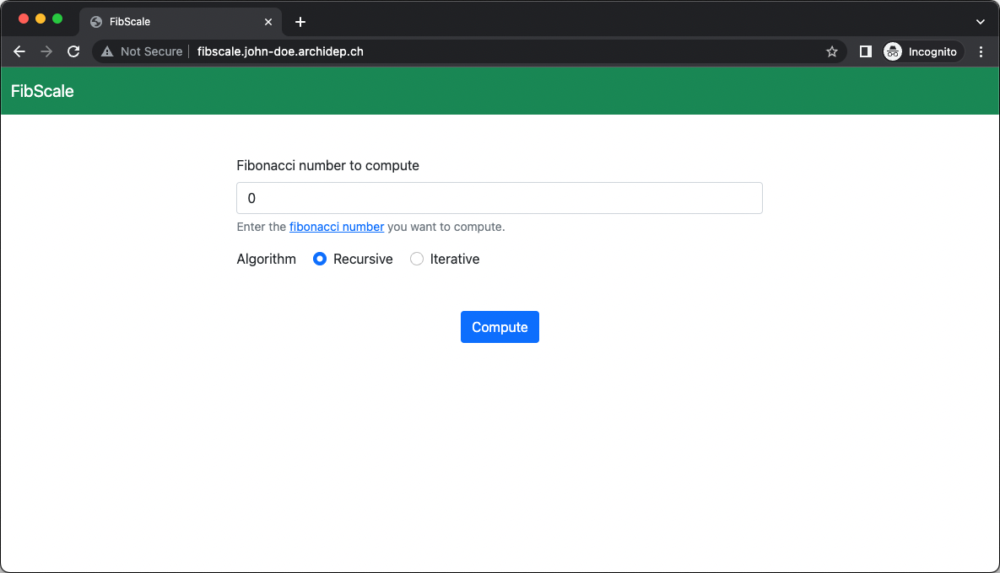
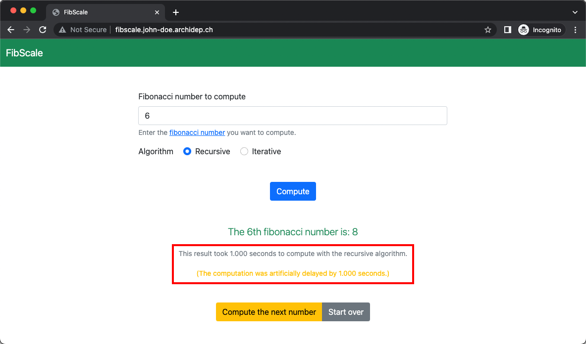
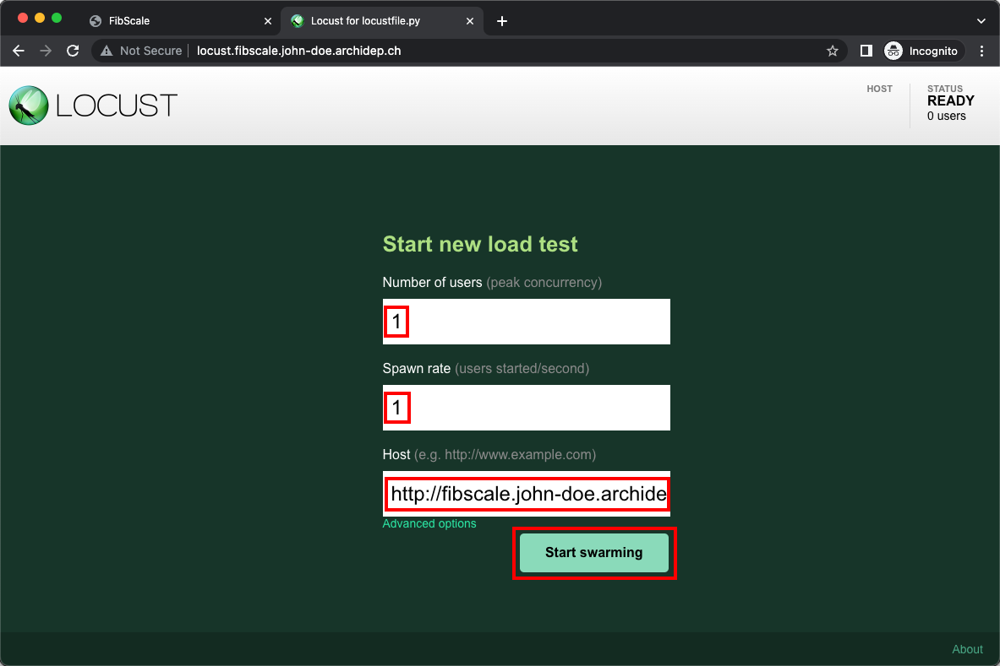
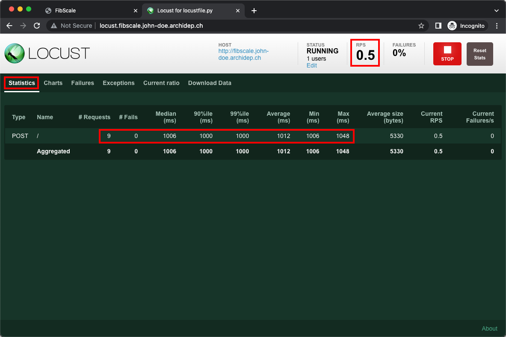
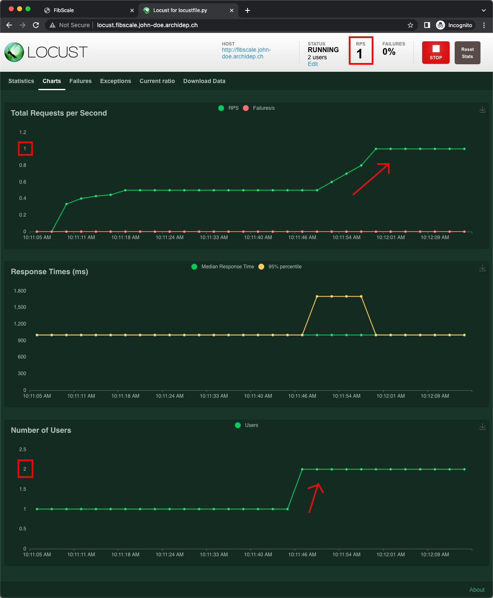
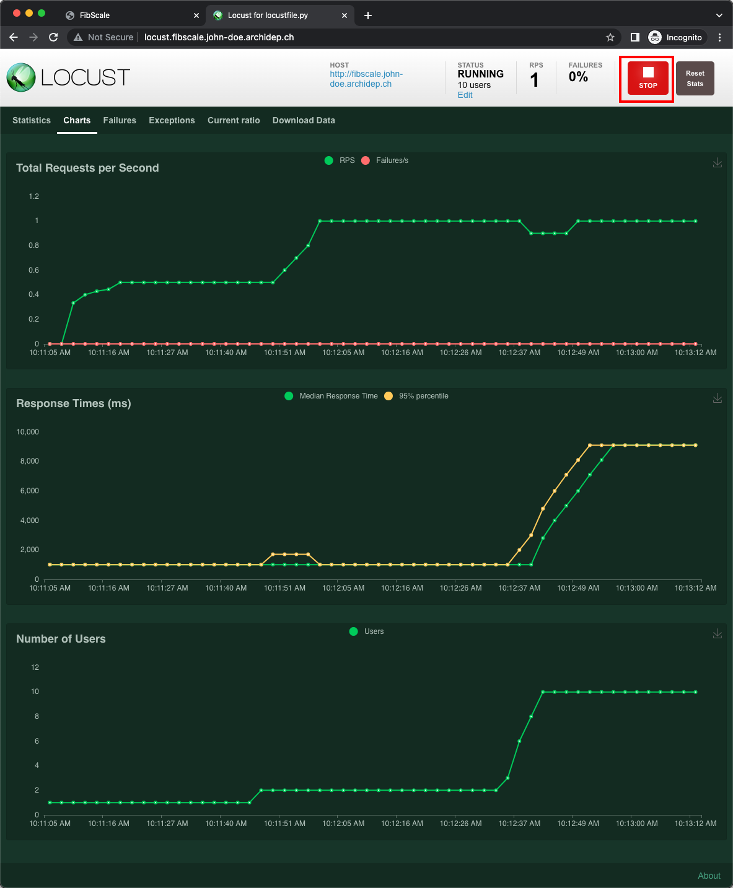
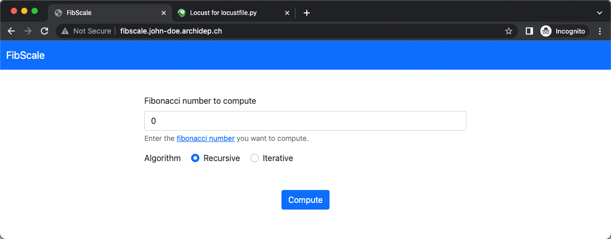
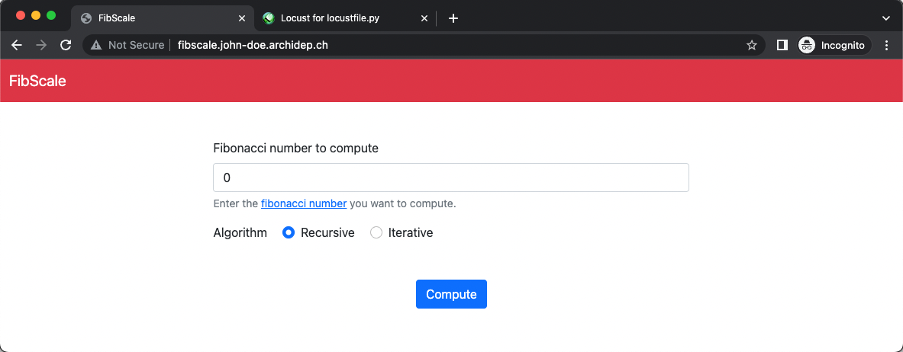

# Horizontally scale a web application with nginx as a load balancer

The goal of this exercise is to show how a web application can be
[scaled][scaling] to handle a growing amount of work by using Systemd unit
templates and configuring nginx as a [load balancer][load-balancing].

This guide assumes that you are familiar with [reverse proxying][slides], that
you have nginx installed and running on a server, and that you have a DNS
wildcard entry preconfigured to make various subdomains
(`*.john-doe.archidep.ch` in this guide) point to that server.

<!-- START doctoc generated TOC please keep comment here to allow auto update -->
<!-- DON'T EDIT THIS SECTION, INSTEAD RE-RUN doctoc TO UPDATE -->

- [Requirements](#requirements)
- [The application](#the-application)
- [Deploy the application](#deploy-the-application)
- [Artificially slow down the application](#artificially-slow-down-the-application)
- [Load-testing the application](#load-testing-the-application)
  - [Deploy a Locust instance](#deploy-a-locust-instance)
  - [Start load-testing the application with a small number of users](#start-load-testing-the-application-with-a-small-number-of-users)
  - [Increase the load](#increase-the-load)
- [What to do?](#what-to-do)
- [Horizontally scale the FibScale application](#horizontally-scale-the-fibscale-application)
  - [Transform the FibScale Systemd unit into a template](#transform-the-fibscale-systemd-unit-into-a-template)
  - [Load-test the new FibScale service](#load-test-the-new-fibscale-service)
  - [Spin up more instance of the FibScale application](#spin-up-more-instance-of-the-fibscale-application)
  - [Configure nginx to balance the load among the available FibScale instances](#configure-nginx-to-balance-the-load-among-the-available-fibscale-instances)
- [Not the solution to all your problems](#not-the-solution-to-all-your-problems)
- [Architecture](#architecture)

<!-- END doctoc generated TOC please keep comment here to allow auto update -->

## Requirements

The following requirements should be installed on your server:

- [Ruby][ruby] 2.7.x or 3.x and compilation tools
- [Bundler][bundler], a command-line tool that downloads Ruby gems (i.e.
  packages)

The installation method for these requirements will differ depending on your Ubuntu version.
You can see what it is with the following command:

```bash
$> lsb_release -a
No LSB modules are available.
Distributor ID:	Ubuntu
Description:	Ubuntu 20.04.5 LTS
**Release:	20.04**
Codename:	focal
```

### Ubuntu 22.04

  You can install those by running the following commands:

  ```bash
  $> sudo apt update
  $> sudo apt install ruby-full build-essential
  ```


  Once your have Ruby installed, you can install Bundler with the `gem` command:

  ```bash
  $> sudo gem install bundler
  ```
### Ubuntu 20.04

Things are a bit more complicated with this version of Ubuntu. The ruby packages from apt installs gems in restricted folders like `usr/bin` or `var/lib/gems`. Bundler does not like root privileges and you should avoid changing permissions on these folders. We will therefore be using a rbenv, a Ruby environment manager that will install all the requirements in your home folder.

Rbenv is a lightweight command-line tool that allows you to easily switch Ruby versions. By default, rbenv doesn’t handle installing Ruby. We’ll use ruby-build to do that. It is available as a standalone program and as a plugin for [rbenv][rbenv].
The ruby-build script installs Ruby from the source. To be able to build Ruby, install the required libraries and compilers:

```bash
$> sudo apt update
$> sudo apt install git curl autoconf bison build-essential \
    libssl-dev libyaml-dev libreadline6-dev zlib1g-dev \
    libncurses5-dev libffi-dev libgdbm6 libgdbm-dev libdb-dev
```

The simplest way to install the rbenv tool is to use the installation shell script. Run the following [curl][curl] and execute the script. **You should usually be careful when running shell scripts straight from the interwebs**:

```bash
$> curl -fsSL https://github.com/rbenv/rbenv-installer/raw/HEAD/bin/rbenv-installer | bash
```

The script clones both rbenv and ruby-build repositories from GitHub to the ``~/.rbenv`` directory. The installer script also calls another script that verifies the installation. The output of the script will look something like below:

```bash
Running doctor script to verify installation...
Checking for `rbenv' in PATH: not found
  You seem to have rbenv installed in `/home/john_doe/.rbenv/bin', but that
  directory is not present in PATH. Please add it to PATH by configuring
  your `~/.bashrc', `~/.zshrc', or `~/.config/fish/config.fish'.
```

Indeed, the rbenv installation script does not configure our ``PATH`` environment variable with the location of the rbenv executables. You can configure the new PATH either by editing ``.bashrc`` or running the following commands:

```bash
$> echo 'export PATH="$HOME/.rbenv/bin:$PATH"' >> ~/.bashrc
$> echo 'eval "$(rbenv init -)"' >> ~/.bashrc
$> source ~/.bashrc
```

Make sure rbenv is installed by running:
```bash
$> rbenv -v
rbenv 1.2.0-52-g61747c0
```

rbenv allows you to install different versions of Ruby and switch between them on-demand. You can see the list of available versions by running ``rbenv install -l``.

For this exercise you will install Ruby 3.2.0:

```bash
$> rbenv install 3.2.0
Installing ruby-3.2.0
```

**This will take a while**

Once this is done, you must tell rbenv that you want to use this version of Ruby as a global installation. You can do so by running:

```bash
$> rbenv global 3.2.0
```

You can **finally** install Bundler at this point:

```bash
$> gem install bundler
```

## The application

The application you will deploy is [**FibScale**][fibscale], a web application
that computes [Fibonacci numbers][fib].

## Deploy the application

Let's start by deploying the application and seeing it in action. Clone the
repository on your server and install the required dependencies:

```bash
cd
git clone https://github.com/MediaComem/fibscale.git
cd fibscale
bundle install
```

Create a Systemd unit file named `/etc/systemd/system/fibscale.service` (e.g.
with `nano`) to execute the application:

```conf
[Unit]
Description=Fibonacci calculator

[Service]
ExecStart=/usr/local/bin/bundle exec ruby fibscale.rb
WorkingDirectory=/home/john_doe/fibscale
Environment="FIBSCALE_PORT=4202"
User=john_doe
Restart=on-failure

[Install]
WantedBy=multi-user.target
```

> If you installed Bundler using the Ubuntu 20.04 installation instructions, the path the executable will be different. Replace the first part of the `ExecStart` option with the output of the following command: `which bundle`

> Replace `john_doe` with your name in the `WorkingDirectory` and `User`
> options.

Enable and start your new service:

```bash
$> sudo systemctl enable fibscale
$> sudo systemctl start fibscale
```

> You can check that it is running with `sudo systemctl status fibscale`.

Create the nginx site configuration `/etc/nginx/sites-available/fibscale` (e.g.
with `nano`) to expose this component:

```conf
# /etc/nginx/sites-available/fibscale

server {
  listen 80;
  server_name fibscale.john-doe.archidep.ch;

  location / {
    proxy_pass http://127.0.0.1:4202;
  }
}
```

> Replace `john-doe` with your name in the `server_name` directive.

Enable that configuration with the following command:

```bash
$> sudo ln -s /etc/nginx/sites-available/fibscale /etc/nginx/sites-enabled/fibscale
```

Check and reload nginx's configuration:

```bash
$> sudo nginx -t
$> sudo nginx -s reload
```

You should now be able to access the FibScale application at
http://fibscale.john-doe.archidep.ch and see how it works.



As you can see, FibScale will compute Fibonacci numbers using various
algorithms, and display how much time each computation took.


## Artificially slow down the application

To better show the benefits of scaling, we will configure the FibScale
application to simulate each computation being very slow. As you can see in [its
documentation][fibscale-config], you can do that by setting the
`$FIBSCALE_DELAY` environment variable to a number of seconds. Each computation
will be artificially delayed by that amount of time.

> **Why not compute a very high Fibonacci number instead of adding a fake
> delay?**
>
> Because scaling an application is a complex task and is done differently
> depending on the cause of the slowdown (e.g. CPU-bound or I/O-bound). By
> artificially slowing down computation without consuming CPU or other
> resources, we can simplify the demonstration and concentrate on configuring
> load balancing with nginx.

Add the following line to the `[Service]` section of the
`/etc/systemd/system/fibscale.service` Systemd unit file:

```conf
Environment="FIBSCALE_DELAY=1"
```

Reload the Systemd configuration and restart your service:

```bash
$> sudo systemctl daemon-reload
$> sudo systemctl restart fibscale
```

Test the application at http://fibscale.john-doe.archidep.ch again and
observe that every computation now takes at least one second.



We now have a simulation of a slow application. Or do we? As the saying goes,
**don't guess, measure!**

## Load-testing the application

You will use [Locust][locust], an open-source [load testing][load-testing] tool
written in Python, and use it to measure the performance of the FibScale
application. **Load testing** is the process of putting demand on a system and
measuring its response. In this case, we will simulate multiple users trying to
use FibScale concurrently, add see how much time it takes for each user to get a
response.

### Deploy a Locust instance

To install Locust, you need [Python][python] 3 and [pip][pip], a Python package
manager, installed on your server. You can do that with the following commands:

```bash
$> sudo apt install python3 python3-pip
```

You can then install Locust with pip:

```bash
$> sudo pip3 install locust
```

This will add the `locust` command to your system:

```bash
$> locust -V
locust 2.6.1
```

To use Locust, you would normally [write a locustfile][locustfile] describing a
load testing scenario, i.e. users and their behavior as they access your
application. Fortunately for you, the FibScale application already comes with
a [pre-configured locustfile][fibscale-locustfile] which simulates a user that
requests the computation of the 100th Fibonacci number every second.

As [Locust's documentation][locust-getting-started] states, you simply need to
run the `locust` command in a directory containing a locustfile named
`locustfile.py`, and Locust will be ready to run your load testing scenario.

Let's create a Systemd unit file named
`/etc/systemd/system/fibscale-locust.service` that does just that:

```conf
[Unit]
Description=Locust instance to test FibScale
After=fibscale.service

[Service]
ExecStart=/usr/local/bin/locust
WorkingDirectory=/home/john_doe/fibscale
User=john_doe
Restart=on-failure

[Install]
WantedBy=multi-user.target
```

> Replace `john_doe` with your name in the `WorkingDirectory` and `User`
> options.

Enable and start your new service:

```bash
$> sudo systemctl enable fibscale-locust
$> sudo systemctl start fibscale-locust
```

> You can check that it is running with `sudo systemctl status fibscale-locust`.

Create the nginx site configuration file
`/etc/nginx/sites-available/fibscale-locust` to expose Locust, which listens on
port 8089 by default:

```conf
server {
  listen 80;
  server_name locust.fibscale.john-doe.archidep.ch;

  location / {
    proxy_pass http://127.0.0.1:8089;
  }
}
```

> Replace `john-doe` with your name in the `server_name` directive.

Enable that configuration with the following command:

```bash
$> sudo ln -s /etc/nginx/sites-available/fibscale-locust /etc/nginx/sites-enabled/fibscale-locust
```

Check and reload nginx's configuration:

```bash
$> sudo nginx -t
$> sudo nginx -s reload
```

You should now be able to access Locust at
http://locust.fibscale.john-doe.archidep.ch.

### Start load-testing the application with a small number of users

The **Host** field tells Locust what the base URL for the load testing scenario
is. Enter the address of FibScale: `http://fibscale.john-doe.archidep.ch`. Set
the **Number of users** to 1 and the **Spawn rate** to 1 for now, and run the
scenario.



The **Statistics** tab shows basic numbers about the number of requests made (in
total and per second) and how much time they take



The **Charts** tab is more interesting: it shows the same information as line
charts.


You should quickly see the number of requests per second (RPS) stabilizing at
~0.5, which is what we would expect with 1 user: the user requests the
computation of the 100th Fibonacci number, which takes about 1 second with our
artificial delay in place, and we can see that in the response time chart. Then
the user waits 1 second before repeating the request as defined by the load
testing scenario. Our single users ends up making 1 request every 2 seconds,
which is 0.5 RPS.

Click the **Edit** button in the top bar and change the **Number of users** to 2
without changing the spawn rate.


With 2 users making a request every 2 seconds each, you should see the number of
requests per seconds stabilizing at ~1. Everything is as we expect so far.



### Increase the load

Now change the **Number of users** to 10 and leave the **Spawn rate** to 1. This
will add 8 more users to our existing 2.


> The spawn rate is the number of new users added every second, meaning that it
> will take 8 seconds (1 per new user) to reach our target number of 10 users
> starting from the 2 we already have.

The number of requests per second should remain unchanged while the response
time should increase to ~9 seconds.


Why is that?

The FibScale application has been deliberately implemented so that it runs in a
single execution thread, meaning **it can only serve one request at a time**. As
soon as the computation of a Fibonacci number starts for one of our users, the 9
other users have to wait until that is done. Then the computation starts for the
second user, and the remaining users have to wait in line again.

```
computation 1  --1s--
computation 2        --1s--
computation 3              --1s--
computation 4                    --1s--
computation 5                          --1s--
computation 6                                --1s--
computation 7                                      --1s--
computation 8                                            --1s--
computation 9                                                  --1s--
               ------------------------------------------------------ 9s total
```

In the end, each user ends up waiting for about 9 seconds before getting a
response.

You may now **stop** the load testing scenario.



## What to do?

Let's assume that we cannot speed up the application itself, and that its
slowness is not caused by a lack of resources on the server (CPU, memory or
I/O performance).

> These assumptions are not meant to represent a real-world scenario, but it
> will allow us to perform scaling on our single server.

If we have resources to spare on the server, and one instance of the FibScale
application cannot serve enough users at the same time, let's **spin up more
instances** and see what happens.

## Horizontally scale the FibScale application

First, stop and disable the `fibscale` service:

```bash
sudo systemctl stop fibscale
sudo systemctl disable fibscale
```

To run multiple instances of FibScale, you could create separate Systemd
services, but Systemd also supports **unit templates**, i.e. units that can be
started multiple times based on a template.

### Transform the FibScale Systemd unit into a template

To turn the `fibscale` service into a template, you must rename the
`fibscale.service` file to `fibscale@.service`:

```bash
$> sudo mv /etc/systemd/system/fibscale.service /etc/systemd/system/fibscale@.service
```

When a template is started, it will have access to the **instance parameter**
named `%i`. You can use that parameter in the template definition, e.g. to
pass it to the application or change the port the application listens on.

Modify `/etc/systemd/system/fibscale@.service` as follows:

- Remove the `[Install]` section (and the `WantedBy` option it contains). We
  will no longer start the `fibscale` service directly once it is a template.
- Add the `%i` parameter at the end of the description.
- Add the `%i` parameter at the end of the `ExecStart` command to pass it to the
  FibScale application.

  > As you can see in [FibScale's documentation][fibscale-config], passing an
  > integer to the application will change the color of its navbar to help
  > identify different instances.

- Change the value of the `$FIBSCALE_PORT` environment variable from the fixed
  port `4202` to the dynamic port `4200%i`. Since we intend on running multiple
  instances of the FibScale application, they need to listen on different ports.
- Add a `PartOf=fibscales.target` option to the `[Unit]` section. A Systemd
  **target** is a group of units. This `fibscales.target` group does not exist
  yet, but we will soon create it.

The new version of the service template should look something like this:

```conf
[Unit]
Description=Fibonacci calculator instance %i
PartOf=fibscales.target

[Service]
ExecStart=/usr/local/bin/bundle exec ruby fibscale.rb %i
WorkingDirectory=/home/john_doe/fibscale
Environment="FIBSCALE_PORT=4200%i"
Environment="FIBSCALE_DELAY=1"
User=john_doe
Restart=on-failure
```

Let's now create the Systemd target file `/etc/systemd/system/fibscales.target`
file with the following contents:

```conf
[Unit]
Description=Fibscale calculator cluster
Requires=fibscale@1.service

[Install]
WantedBy=multi-user.target
```

This will run one instance of our templated `fibscale@` unit with the instance
parameter `1`, resulting in a service named `fibscale@1`.

Enable and start the target just like you would a service:

```bash
$> sudo systemctl enable fibscales.target
$> sudo systemctl start fibscales.target
```

You can check the status of a target like you would a service:

```bash
$> sudo systemctl status fibscales.target
```

You can also check the status of the individual instances:

```bash
$> sudo systemctl status fibscale@1
```

Now that FibScale is up and running again, update the nginx site configuration
file `/etc/nginx/sites-available/fibscale` to support multiple FibScale
instances. There is only one for now, but we will add more soon enough.

You need to define an [nginx **upstream**][nginx-upstream] which is a group of
servers, basically a list of addresses where our FibScale applications can be
reached. We only have one service running for now, `fibscale@1`. Since the
instance parameter `%i` has the value `1` and we set the value of the
`$FIBSCALE_PORT` environment variable to `4200%i`, that instance of the service
listens on port `42001`. Let's define that upstream and update the `proxy_pass`
directive to point to it:

```conf
# Group of FibScale applications.
upstream fibscale {
  server 127.0.0.1:42001;
}

server {
  listen 80;
  server_name fibscale.john-doe.archidep.ch;

  location / {
    # Proxy to the upstream.
    proxy_pass http://fibscale;
  }
}
```

Test and reload nginx's configuration:

```bash
$> sudo nginx -t
$> sudo nginx -s reload
```

Access the FibScale application at http://fibscale.john-doe.archidep.ch again,
and note that the navbar has changed color (because of the instance parameter
passed as argument).



### Load-test the new FibScale service

Access Locust at http://locust.fibscale.john-doe.archidep.ch and run the same
load testing scenario as before: test the **Host**
http://fibscale.john-doe.archidep.test with the **Number of users** set to 10
and the **Spawn rate** set to 1.


You should see similar numbers as before. After all, we haven't really changed
anything yet.


### Spin up more instance of the FibScale application

To launch more instances of the FibScale application, simply update the
`/etc/systemd/system/fibscales.target` file to run more instances of the
service:

```conf
[Unit]
Description=Fibscale calculator cluster
Requires=fibscale@1.service fibscale@2.service fibscale@3.service

[Install]
WantedBy=multi-user.target
```

To take these changes into account, reload the Systemd configuration and start
the `fibscales.target` group again (no need to restart it):

```bash
$> sudo systemctl daemon-reload
$> sudo systemctl start fibscales.target
```

You should be able to check the status of each instance separately:

```bash
$> sudo systemctl status fibscale@1
$> sudo systemctl status fibscale@2
$> sudo systemctl status fibscale@3
```

You should not see any change in Locust yet, because nginx is not yet aware of
the additional instances.

### Configure nginx to balance the load among the available FibScale instances

Update the `upstream` definition in the nginx site configuration file
`/etc/nginx/sites-availble/fibscale` to add your new FibScale instances. Since
the instance parameter `%i` is `2` and `3` for our 2 new instances, we know
they're listening on ports `42002` and `42003`:

```conf
upstream fibscale {
  server 127.0.0.1:42001;
  server 127.0.0.1:42002;
  server 127.0.0.1:42003;
}
```

Test and reload nginx's configuration:

```bash
$> sudo nginx -t
$> sudo nginx -s reload
```

Check Locust again and you should quickly see the number of requests per second
increase to 3 and the response time decrease.


If you access the FibScale application at http://fibscale.john-doe.archidep.ch
and reload the page a few times, you will see that the navbar changes color,
indicating that nginx correctly distributes your requests to the 3 FibScale
instances.





Now that the load is distributed among the 3 instances, our users' computations
are executed 3 at a time in parallel. For the same number of requests, it will
only take a third of the time compared to before.

```
computation 1  --1s--
computation 2  --1s--
computation 3  --1s--
computation 4        --1s--
computation 5        --1s--
computation 6        --1s--
computation 7              --1s--
computation 8              --1s--
computation 9              --1s--
               ------------------ 3s total
```

## Not the solution to all your problems

This exercise is intended as a demonstration of how to perform load balancing
with nginx. It is not a silver bullet for all your performance problems.

Deploying more instances of your application on the same server may not solve
your problem depending on the cause. It may even make it worse!

- If your application is slow because it uses too much CPU, increasing the
  number of instances may not increase performance. It may even decrease it if
  your server's CPU(s) becomes overloaded.

  The situation will also be very different depending on the number of CPUs and
  CPU cores your server has. Performance is a complex issue. Again, don't guess,
  measure!

- If your application is I/O-bound, increasing the number of instances may
  increase performance, but only if the I/O work can be parallelized, which
  depends entirely on what kind of work it is.
- Running the load testing tool (Locust) on the same server as the application
  your are testing is not a good idea. As you increase the load, Locust itself
  will start consuming CPU and memory resources, slowing down your server and
  making your application slower than it would normally be.

> Also be careful of issues such as [rate limiting][rate-limiting] and
> [(D)DOS][dos] protection when load-testing. Load tests can look a lot like a
> DOS attack. You may inadvertently be banned by your cloud provider if you're
> not careful.

## Architecture

This is a simplified architecture of the main running processes and
communication flow at the end of this exercise (after completing [all previous
course exercises][archidep-exercises]):


> [Simplified architecture PDF version](fibscale-deployment-simplified.pdf).

[archidep-exercises]: https://github.com/MediaComem/comem-archidep#exercises
[bundler]: https://bundler.io
[curl]: https://linuxize.com/post/curl-command-examples/
[dos]: https://en.wikipedia.org/wiki/Denial-of-service_attack
[fib]: https://en.wikipedia.org/wiki/Fibonacci_number
[fibscale]: https://github.com/MediaComem/fibscale
[fibscale-config]: https://github.com/MediaComem/fibscale#configuration
[fibscale-locustfile]: https://github.com/AlphaHydrae/fibscale/blob/main/locustfile.py
[load-balancing]: https://en.wikipedia.org/wiki/Load_balancing_(computing)
[load-testing]: https://en.wikipedia.org/wiki/Load_testing
[locust]: https://locust.io
[locust-getting-started]: http://docs.locust.io/en/stable/quickstart.html
[locustfile]: http://docs.locust.io/en/stable/writing-a-locustfile.html
[nginx-upstream]: http://nginx.org/en/docs/http/ngx_http_upstream_module.html
[pip]: https://pypi.org/project/pip/
[python]: https://www.python.org
[rate-limiting]: https://en.wikipedia.org/wiki/Rate_limiting
[ruby]: https://www.ruby-lang.org
[rbenv]: https://github.com/rbenv/rbenv
[scaling]: https://en.wikipedia.org/wiki/Scalability
