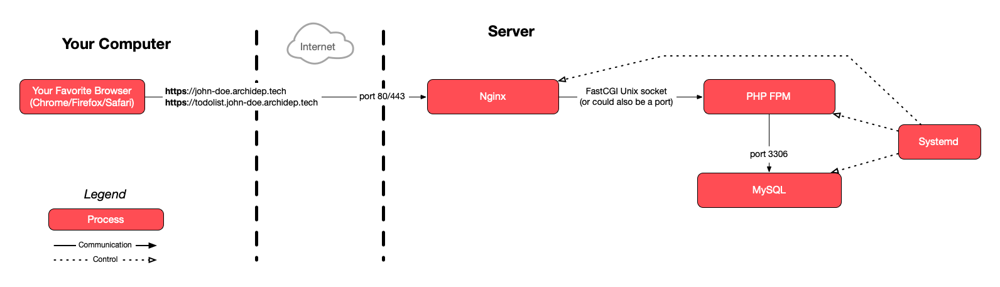
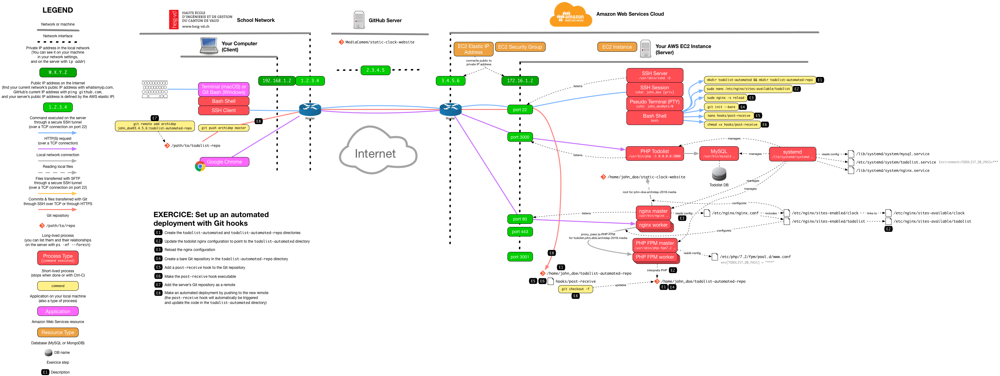

# Set up an automated deployment with Git hooks

This guide describes how to automatically deploy a PHP application when pushing commits to a server.

It assumes that you have performed the previous [nginx & PHP FPM exercise][php-fpm-ex].

<!-- START doctoc generated TOC please keep comment here to allow auto update -->
<!-- DON'T EDIT THIS SECTION, INSTEAD RE-RUN doctoc TO UPDATE -->

- [Legend](#legend)
- [:gem: Requirements](#gem-requirements)
- [:exclamation: Set up directories](#exclamation-set-up-directories)
- [:exclamation: Update the todolist nginx configuration](#exclamation-update-the-todolist-nginx-configuration)
- [:exclamation: Create a bare Git repository on the server](#exclamation-create-a-bare-git-repository-on-the-server)
  - [:exclamation: Add a `post-receive` hook to the Git repository](#exclamation-add-a-post-receive-hook-to-the-git-repository)
- [:exclamation: Add the server's Git repository as a remote](#exclamation-add-the-servers-git-repository-as-a-remote)
- [:exclamation: Trigger an automated deployment](#exclamation-trigger-an-automated-deployment)
- [:exclamation: Commit a change to the project and deploy it](#exclamation-commit-a-change-to-the-project-and-deploy-it)
- [:checkered_flag: What have I done?](#checkered_flag-what-have-i-done)
  - [:classical_building: Architecture](#classical_building-architecture)

<!-- END doctoc generated TOC please keep comment here to allow auto update -->

## Legend

Parts of this guide are annotated with the following icons:

- :exclamation: A task you **MUST** perform to complete the exercise.
- :question: An optional step that you _may_ perform to make sure that
  everything is working correctly.
- :warning: **Critically important information about the exercise.**
- :gem: Tips on the exercise, reminders about previous exercises, or
  explanations about how this exercise differs from the previous one.
- :space_invader: More advanced tips on how to save some time.
- :books: Additional information about the exercise or the commands and tools
  used.
- :checkered_flag: The end of the exercise.
  - :classical_building: The architecture of what you deployed during the
    exercise.
- :boom: Troubleshooting tips: how to fix common problems you might encounter.

## :gem: Requirements

This exercise assumes that you have deployed the PHP todolist application with
PHP-FPM during previous exercices.

## :exclamation: Set up directories

**Connect to your server.**

Create two directories, `todolist-automated` and `todolist-automated-repo`, in your home directory:

```bash
$> cd
$> mkdir todolist-automated
$> mkdir todolist-automated-repo
```

The `todolist-automated-repo` directory will be the Git repository, Later you
will add it as a remote in your local Git repository, so that you can push
commits to it.

The `todolist-automated` directory will contain the currently deployed version
of the code. The goal is that every time you push commits to the repository,
this directory is automatically updated.

## :exclamation: Update the todolist nginx configuration

In previous exercises you configured nginx to serve the PHP application from the
`todolist-repo` directory. Edit that configuration:

```bash
$> sudo nano /etc/nginx/sites-available/todolist
```

Change `todolist-repo` to `todolist-automated` so that nginx looks for files in
the correct directory.

Tell nginx to reload its configuration:

```bash
$> sudo nginx -s reload
```

The site at http://todolist.john-doe.archidep.ch should not work anymore You
should get a `404 Not Found` error from nginx since there are no files in the
`todolist-automated` directory yet.

## :exclamation: Create a bare Git repository on the server

Git will not let you push commits to a normal repository with a working tree,
so you need to use a bare repository instead, with only its Git directory:

```bash
$> cd ~/todolist-automated-repo
$> git init --bare
Initialized empty Git repository in /home/john_doe/todolist-automated-repo/
```

> :books: A bare repository is a repository with only a Git directory and no
> working tree. The project's files are not checked out. It's used mostly on
> servers for sharing or automation. Read [What is a bare repository?][git-bare]
> for more information.

### :exclamation: Add a `post-receive` hook to the Git repository

Copy this script and replace `john_doe` by your username:

```
#!/usr/bin/env bash
set -e

echo Checking out latest version...
export GIT_DIR=/home/john_doe/todolist-automated-repo
export GIT_WORK_TREE=/home/john_doe/todolist-automated
git checkout -f main
cd "$GIT_WORK_TREE"

echo Deployment successful
```

This script will take the latest version of the code in the
`todolist-automated-repo` repository and checkout a working tree in the
`todolist-automated` directory (the one nginx is serving files out of).

:warning: If your repo has a `master` branch instead of a `main` branch, replace
`main` by `master` in the `git checkout -f main` command in your hook.

> :books: Remember that a Git repository has several parts: [the Git directory
> where the project's history is stored, and the working tree which contains the
> current version of the files you are working
> on][git-dir-work-tree].
>
> Normally, when you use the `git checkout` command in a Git repository, it will
> use the `.git` directory of the repository as the Git directory, and the
> repository itself as the working tree.
>
> By setting the `GIT_DIR` environment variable, you are instructing Git to use
> a different Git directory which could be anywhere (in this case, it is the
> bare repository you created earlier).
>
> By setting the `GIT_WORK_TREE` environment variable, you are instructing Git
> to use a different directory as the working tree. The files will be checked
> out there.

Open the `post-receive` file in the repository's `hooks` directory:

```bash
$> nano hooks/post-receive
```

Paste the contents. Exit with `Ctrl-X` and save when prompted.

Make the hook executable:

```bash
$> chmod +x hooks/post-receive
```

Make sure the permissions of the hook are correct:

```bash
$> ls -l hooks/post-receive
-rwxrwxr-x 1 john_doe john_doe 239 Jan 10 20:55 hooks/post-receive
```

> :gem: It should have the `x` (e**x**ecute) permission for owner, group and
> others.

## :exclamation: Add the server's Git repository as a remote

**Disconnect from the server. The following steps happen on your local
machine.**

Go to the PHP todolist repository on your local machine:

```bash
$> cd /path/to/projects/comem-archidep-php-todo-exercise
```

As you have already seen with GitHub, Git can communicate over SSH. This is not
limited to GitHub: you can define a remote using an SSH URL that points to your
own server.

Add an [SSH remote][git-ssh-protocol] to the bare repository you created earlier
(replace `john_doe` with your username and `W.X.Y.Z` with your server's IP
address):

```bash
$> git remote add archidep john_doe@W.X.Y.Z:todolist-automated-repo
```

> :books: The format of the remote URL is `<user>@<ip-address>:<relative-path>`.
> Git can connect to your server over SSH using public key authentication just
> like when you use the `ssh` command. It will then look for a repository at the
> path you have specified, relative to your home directory.

## :exclamation: Trigger an automated deployment

From your local machine, push the latest version of the `main` branch to the remote on your server:

```bash
$> git push archidep main
Enumerating objects: 36, done.
Counting objects: 100% (36/36), done.
Delta compression using up to 8 threads
Compressing objects: 100% (19/19), done.
Writing objects: 100% (36/36), 15.09 KiB | 15.09 MiB/s, done.
Total 36 (delta 16), reused 36 (delta 16)

remote: Checking out latest version...
remote: Deployment successful

To W.X.Y.Z:todolist-automated-repo
 * [new branch]      main -> main
```

:warning: If your repo has a `master` branch instead of a `main` branch, replace
`main` by `master` in the `git push archidep main` command in your hook.

> :gem: If you have set up your `post-receive` hook correctly, you will see the
> output of its `echo` commands displayed when you run `git push`. In the above
> example, they are the two lines starting with `remote:`.

The site at http://todolist.john-doe.archidep.ch should work again.

Additionally, if you **connect to the server**,
the `todolist-automated` directory should contain the latest version of the project's files,
as checked out by the `post-receive` hook:

```bash
$> ls ~/todolist-automated
LICENSE.txt  README.md  images  index.php  todolist.sql  update.sh
```

## :exclamation: Commit a change to the project and deploy it

**On your local machine,** make a visible change to the project's `index.php` file.

> :gem: For example, look for the `<strong>TodoList</strong>` tag in the
> `<header>` and change the title.

Commit and push your changes:

```bash
$> git add .

$> git commit -m "Change title"

$> git push archidep main
...
remote: Checking out latest version...
remote: Deployment successful
To W.X.Y.Z:todolist-automated-repo
   4ea6994..2faf028  main -> main
```

Visit http://todolist.john-doe.archidep.ch again. Your changes should have
been deployed automatically!

## :checkered_flag: What have I done?

You have create a bare Git repository on your server and pushed the PHP todolist
to that repository. You have set up a Git hook: a shell script that is
automatically executed every time a new commit is pushed. This script deploy the
new version of the todolist by copying the new version to the correct directory.

This allows you to deploy new versions by simply pushing to the repository
on your server. You could add any command you wanted to your deployment script.

### :classical_building: Architecture

This is a simplified architecture of the main running processes and
communication flow at the end of this exercise. Note that it has not changed
compared to [the previous exercises](./certbot-deployment.md#architecture) since
we have neither created any new processes nor changed how they communicate:



> [Simplified architecture PDF version](certbot-deployment-simplified.pdf).

The following diagram is a more detailed representation also including the
short-lived processes run during the exercise:



> [Detailed architecture PDF version](git-automated-deployment.pdf).

[git-bare]: https://www.saintsjd.com/2011/01/what-is-a-bare-git-repository/
[git-dir-work-tree]: https://mediacomem.github.io/comem-archidep/2023-2024/subjects/git/?home=MediaComem%2Fcomem-archidep%23readme#15
[git-ssh-protocol]: https://git-scm.com/book/en/v2/Git-on-the-Server-The-Protocols#_the_ssh_protocol
[php-fpm-ex]: nginx-php-fpm-deployment.md
