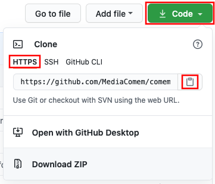
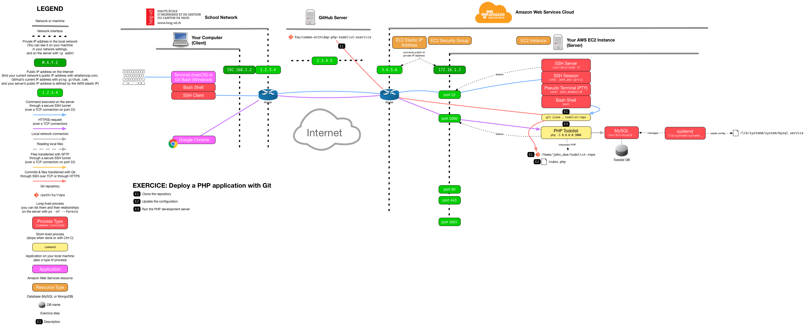

# Deploy a PHP application with Git

The goal of this exercise is to deploy a PHP application much like the [previous
exercise](sftp-deployment.md), but using Git to put the code on the server
instead of SFTP.

<!-- START doctoc generated TOC please keep comment here to allow auto update -->
<!-- DON'T EDIT THIS SECTION, INSTEAD RE-RUN doctoc TO UPDATE -->


- [Setup](#setup)
- [Clone the repository](#clone-the-repository)
- [Update the configuration](#update-the-configuration)
- [Run the PHP development server](#run-the-php-development-server)
- [What have I done?](#what-have-i-done)
- [End result](#end-result)

<!-- END doctoc generated TOC please keep comment here to allow auto update -->


## Setup

Make sure you have done the [previous exercise](sftp-deployment.md) and the [Git
collaboration](https://github.com/MediaComem/comem-archidep-php-todo-exercise)
exercise first. If you were not Bob during the collaboration exercise (i.e. the
person who owns the fork), create your own fork of the repository so that you
can modify it independently.

Stop your `php -S` command if it is still running.


## Clone the repository

Instead of manually uploading files through SFTP, you will connect to the server
through SSH and clone the repository from GitHub.

Copy your repository's public HTTP URL.



> **Why the HTTP and not the SSH URL?** As long as your repository is public, it
> is simpler to use the HTTP URL to clone it, since it requires no credentials.
>
> To clone the repository with the SSH URL from your server, you need to have
> SSH public key authentication set up on your server the same way you did on
> your local machine. You would need to generate an SSH key pair on the server,
> and add its public key to your GitHub account (or to the repository's Deploy
> Keys).

While connected to your server, you need to clone the repository somewhere. For
example, you could clone it to the `todolist-repo` directory in your home
directory.

> **Reminder:** The command to clone a Git repository is `git clone <url>
> [<directory-name>]`. The directory name is optional, and defaults to the last
> component of the URL's path without the ".git" extension.
>
> For example, if the clone URL is "https://github.com/bob/awesome-repo.git",
> the directory will be named "awesome-repo" by default, unless you specify
> another name with the `<directory-name>` argument.


## Update the configuration

Since your configuration is still hardcoded, you need to update the first few
lines of `index.php` with the same configuration as for the previous exercise
(`BASE_URL`, `DB_USER`, `DB_PASS`, etc).

Go into the cloned repository on the server and edit `index.php` with nano or
Vim, or edit it on your machine and overwrite it with FileZilla, as you prefer.
Make sure the configuration is appropriate to your server's environment.


## Run the PHP development server

Run a PHP development server on port 3000 like you did during the previous
exercise, but do it in the cloned repository this time:

```bash
$> php -S 0.0.0.0:3000
```

You (and everybody else) should be able to access the application in a browser
at the correct IP address and port (e.g. `W.X.Y.Z:3000`).


## What have I done?

You are now transfering code to your deployment environment (your server) using
a version control tool (Git) instead of manually, as recommended in the
[Codebase section of The Twelve-Factory App](https://12factor.net/codebase).
Always deploying from the same codebase makes it less likely that you will make
a mistake like:

* Copying an outdated version of the codebase from the wrong directory.
* Forgetting to upload some of the modified files when you upload them by hand.

Using Git now also allows you to use Git commands like `git pull` to easily pull
the latest changes from the repository.


## End result



> [PDF version](git-clone-deployment.pdf).


[php-todolist]: https://github.com/MediaComem/comem-archidep-php-todo-exercise
