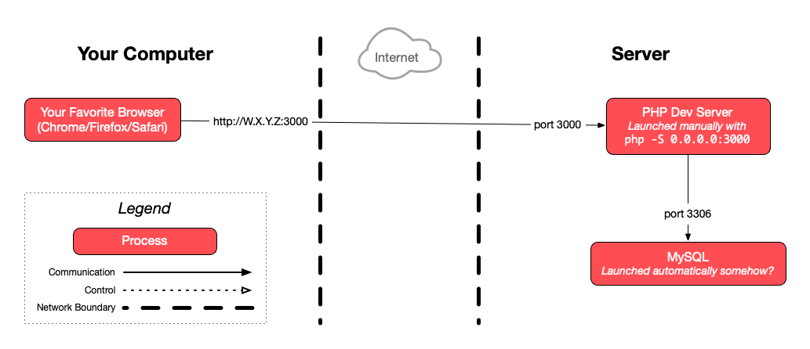

# Deploy a PHP application with Git

The goal of this exercise is to deploy a PHP application much like the [previous
exercise](sftp-deployment.md), but using Git to put the code on the server
instead of SFTP.

<!-- START doctoc generated TOC please keep comment here to allow auto update -->
<!-- DON'T EDIT THIS SECTION, INSTEAD RE-RUN doctoc TO UPDATE -->

- [Legend](#legend)
- [:gem: Requirements](#gem-requirements)
- [:exclamation: Use your own repository](#exclamation-use-your-own-repository)
- [:exclamation: Clone the repository](#exclamation-clone-the-repository)
- [:exclamation: Update the configuration](#exclamation-update-the-configuration)
- [:exclamation: Run the PHP development server](#exclamation-run-the-php-development-server)
- [:checkered_flag: What have I done?](#checkered_flag-what-have-i-done)
  - [:classical_building: Architecture](#classical_building-architecture)

<!-- END doctoc generated TOC please keep comment here to allow auto update -->

## Legend

Parts of this guide are annotated with the following icons:

- :exclamation: A task you **MUST** perform to complete the exercise.
- :question: An optional step that you _may_ perform to make sure that
  everything is working correctly.
- :warning: **Critically important information about the exercise.**
- :gem: Tips on the exercise, reminders about previous exercises, or
  explanations about how this exercise differs from the previous one.
- :space_invader: More advanced tips on how to save some time. Challenges.
- :books: Additional information about the exercise or the commands and tools
  used.
- :checkered_flag: The end of the exercise.
  - :classical_building: The architecture of what you deployed during the
    exercise.
- :boom: Troubleshooting tips: how to fix common problems you might encounter.

## :gem: Requirements

Make sure you have completed the [previous exercise](sftp-deployment.md) and the
[Git
collaboration](https://github.com/MediaComem/comem-archidep-php-todo-exercise)
exercise first.

Stop your `php -S` command if it is still running.

> :gem: You can use Ctrl-C to stop any command currently running in your
> terminal.

## :exclamation: Use your own repository

If you were not Bob during the collaboration exercise (i.e. the person who owns
the repository), [create your own fork of the repository][github-fork] so that
you can modify it independently.

## :exclamation: Clone the repository

Instead of manually uploading files through SFTP, you will connect to the server
through SSH and clone the repository from GitHub.

Copy your repository's public HTTP URL:


> :books: **Why the HTTP and not the SSH URL?** As long as your repository is
> public, it is simpler to use the HTTP URL to clone it, since it requires no
> credentials.
>
> To clone the repository with the SSH URL from your server, you would need to
> have SSH public key authentication set up on your server the same way you did
> on your local machine. You would need to generate an SSH key pair on the
> server, and add its public key to your GitHub account (or to the repository's
> Deploy Keys). Or you would need to put your own personal SSH key pair on the
> server, which would make it vulnerable in the event the server is compromised.

While connected to your server, you need to clone the repository somewhere. For
example, you could clone it to the `todolist-repo` directory in your home
directory.

> :gem: The command to clone a Git repository is `git clone <url>
> [<directory-name>]`. The directory name is optional, and defaults to the last
> component of the URL's path without the ".git" extension. For example:
>
> * `git clone https://github.com/bob/awesome-repo.git` will create a directory
>   named "awesome-repo".
> * `git clone https://github.com/bob/awesome-repo.git foo` will create a
>   directory named "foo".

## :exclamation: Update the configuration

Since your configuration is still hardcoded, you need to update the first few
lines of `index.php` with the same configuration as for the previous exercise
(`BASE_URL`, `DB_USER`, `DB_PASS`, etc).

There are several ways you can do this:

* Clone the repository locally (if you haven't already), make the change on your
  local machine and commit and push it to GitHub. Then connect to your server,
  move into the cloned repository and pull the latest changes from GitHub.
* Go into the cloned repository on the server and edit `index.php` with nano or
  Vim, or edit it on your machine and overwrite it with FileZilla, as you
  prefer.

In both cases, make sure the configuration fits your server's environment.

## :exclamation: Run the PHP development server

Run a PHP development server on port 3000 like you did during the previous
exercise, but do it in the cloned repository this time:

```bash
$> php -S 0.0.0.0:3000
```

You (and everybody else) should be able to access the application in a browser
at the correct IP address and port (e.g. `W.X.Y.Z:3000`).

## :checkered_flag: What have I done?

You are now transfering code to your deployment environment (your server) using
a version control tool (Git) instead of manually, as recommended in the
[Codebase section of The Twelve-Factory App](https://12factor.net/codebase).
Always deploying from the same codebase makes it less likely that you will make
a mistake like:

- Copying an outdated version of the codebase from the wrong directory.
- Forgetting to upload some of the modified files when you upload them by hand.

Using Git now also allows you to use Git commands like `git pull` to easily pull
the latest changes from the repository.

### :classical_building: Architecture

This is a simplified architecture of the main running processes and
communication flow at the end of this exercise. Note that it has not changed
compared to [the previous exercise](./sftp-deployment.md#architecture) since we
have neither created any new processes nor changed how they communicate:



> [Architecture PDF version](sftp-deployment-architecture.pdf).

[github-fork]: https://docs.github.com/en/get-started/quickstart/fork-a-repo
[php-todolist]: https://github.com/MediaComem/comem-archidep-php-todo-exercise
