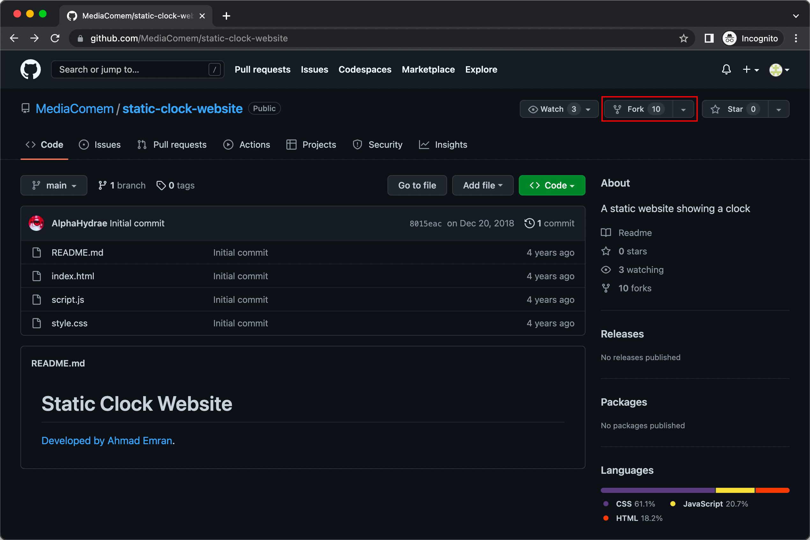
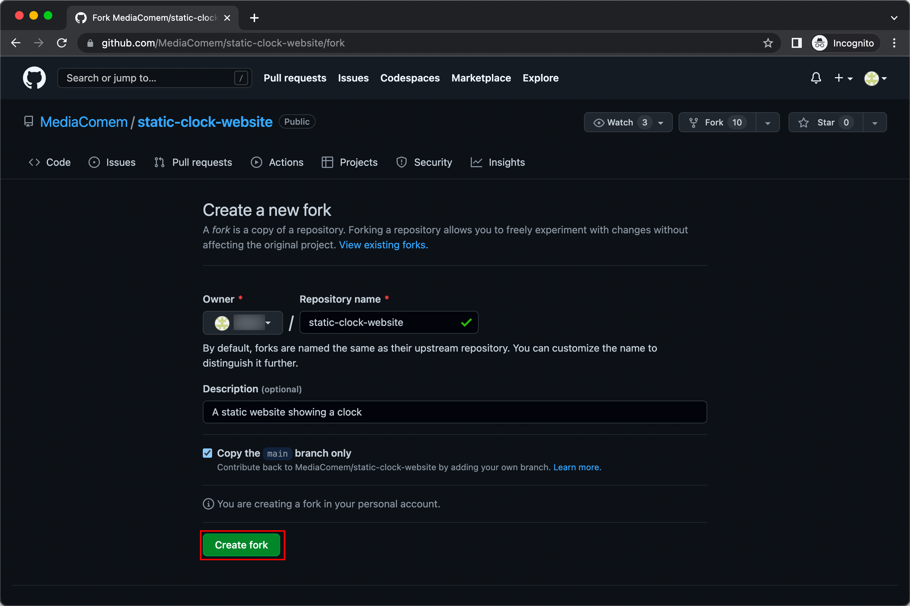
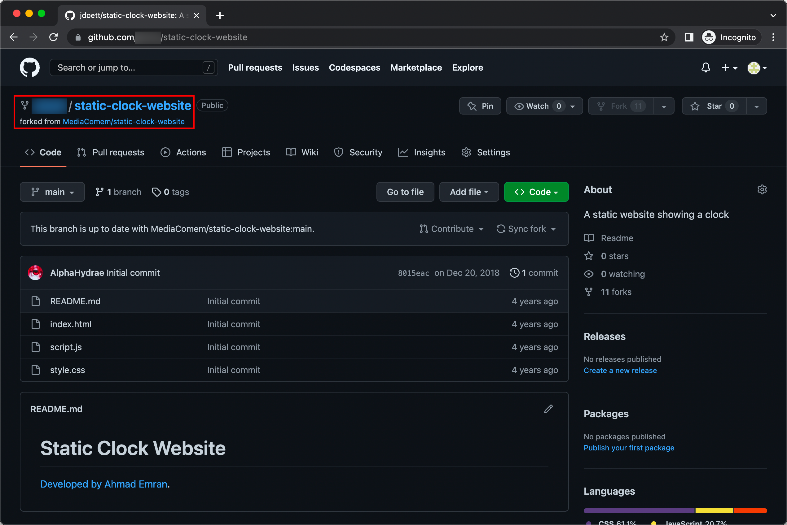
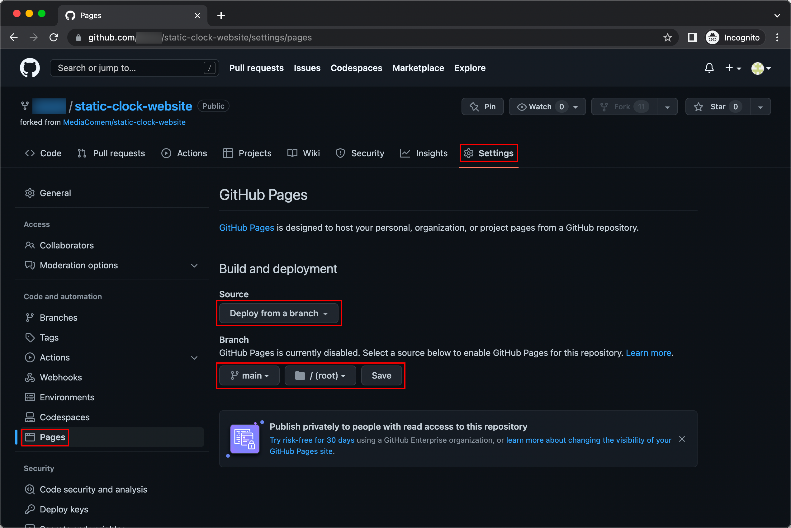

# Deploy static sites to GitHub Pages

The goal of this exercice is to deploy a **static website** (only HTML,
JavaScript and CSS) on [GitHub Pages][github-pages], a static site hosting
service, instead of your own server in the Infrastructure-as-a-Service (IaaS)
Microsoft Azure Web Services cloud.

<!-- START doctoc generated TOC please keep comment here to allow auto update -->
<!-- DON'T EDIT THIS SECTION, INSTEAD RE-RUN doctoc TO UPDATE -->

- [Legend](#legend)
- [:exclamation: Fork the clock project](#exclamation-fork-the-clock-project)
- [:exclamation: Configure GitHub Pages](#exclamation-configure-github-pages)
  - [:exclamation: What else?](#exclamation-what-else)
- [:exclamation: Make a change to test the automated deployment](#exclamation-make-a-change-to-test-the-automated-deployment)
- [:checkered_flag: What have I done?](#checkered_flag-what-have-i-done)

<!-- END doctoc generated TOC please keep comment here to allow auto update -->

## Legend

Parts of this guide are annotated with the following icons:

- :exclamation: A task you **MUST** perform to complete the exercise.
- :question: An optional step that you _may_ perform to make sure that
  everything is working correctly.
- :warning: **Critically important information about the exercise.**
- :gem: Tips on the exercise, reminders about previous exercises, or
  explanations about how this exercise differs from the previous one.
- :space_invader: More advanced tips on how to save some time. Challenges.
- :books: Additional information about the exercise or the commands and tools
  used.
- :checkered_flag: The end of the exercise.
  - :classical_building: The architecture of what you deployed during the
    exercise.
- :boom: Troubleshooting tips: how to fix common problems you might encounter.

## :exclamation: Fork the clock project

Fork the [static clock website repository][static-clock-repo]:

Once that is done, you should have your own copy of the clock repository
under your GitHub username:

## :exclamation: Configure GitHub Pages

Go the the **Pages Settings** and configure GitHub Pages to deploy the **root of
the `main` branch**:

Save the changes.

### :exclamation: What else?

You're done! It's as simple as that.

You should be able to access your deployed static website at
https://johndoe.github.io/static-clock-website (replacing `johndoe` with your
GitHub username).

> :gem: It may take a couple of minutes for the site to become available.

## :exclamation: Make a change to test the automated deployment

If you push a new commit to your repository (or make one on GitHub), you
can see that the new version will be automatically deployed!

> :gem: It can take a couple of minutes for new commits to be deployed by GitHub
> Pages.

## :checkered_flag: What have I done?

In this exercise, you have deployed a static website to GitHub Pages, a static
site hosting service and a type of PaaS platform, using nothing but the web
interface provided by GitHub. You did not have to do any of the following:

- Hosting
- Reverse proxying
- TLS encryption
- Automated deployments
- Domain name

GitHub Pages is **free** for public repositories. Read [their
documentation][github-pages-docs] for more information.

[github-pages]: https://pages.github.com
[github-pages-docs]: https://docs.github.com/en/pages/getting-started-with-github-pages/about-github-pages
[static-clock-repo]: https://github.com/MediaComem/static-clock-website
