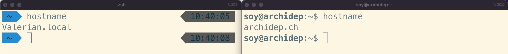
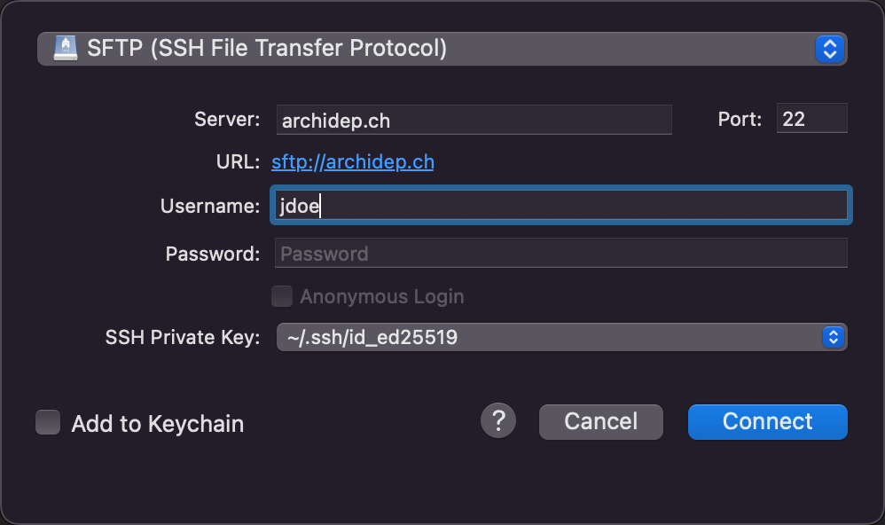

# Hello SSH

In this series of exercises, you will learn to use the `ssh` command to connect
to a remote server, and how to copy files to and from such a server using
various tools.

<!-- START doctoc generated TOC please keep comment here to allow auto update -->
<!-- DON'T EDIT THIS SECTION, INSTEAD RE-RUN doctoc TO UPDATE -->

- [Legend](#legend)
- [:exclamation: Connect to the exercise server](#exclamation-connect-to-the-exercise-server)
- [:question: Spot the difference](#question-spot-the-difference)
- [:exclamation: Copy a file with the `scp` command](#exclamation-copy-a-file-with-the-scp-command)
- [:exclamation: Copy a file using the SFTP protocol](#exclamation-copy-a-file-using-the-sftp-protocol)
- [:exclamation: Set up public key authentication](#exclamation-set-up-public-key-authentication)
  - [:question: Do I already have a key pair?](#question-do-i-already-have-a-key-pair)
  - [:books: The `ssh-keygen` command](#books-the-ssh-keygen-command)
  - [:exclamation: Generate a private-public key pair](#exclamation-generate-a-private-public-key-pair)
  - [:exclamation: Use `ssh-copy-id` to copy your public key to the server](#exclamation-use-ssh-copy-id-to-copy-your-public-key-to-the-server)
  - [:question: The `authorized_keys` file](#question-the-authorized_keys-file)
- [:exclamation: Configure your SFTP application to use public key authentication](#exclamation-configure-your-sftp-application-to-use-public-key-authentication)
- [:space_invader: SSH agent](#space_invader-ssh-agent)
  - [:space_invader: Running an SSH agent](#space_invader-running-an-ssh-agent)
  - [:space_invader: Using the SSH agent](#space_invader-using-the-ssh-agent)
- [:checkered_flag: What have I done?](#checkered_flag-what-have-i-done)

<!-- END doctoc generated TOC please keep comment here to allow auto update -->

## Legend

Parts of this guide are annotated with the following icons:

- :exclamation: A task you **MUST** perform to complete the exercise.
- :question: An optional step that you _may_ perform to make sure that
  everything is working correctly.
- :warning: **Critically important information about the exercise.**
- :gem: Tips on the exercise, reminders about previous exercises, or
  explanations about how this exercise differs from the previous one.
- :space_invader: More advanced tips on how to save some time.
- :books: Additional information about the exercise or the commands and tools
  used.
- :checkered_flag: The end of the exercise.
- :boom: Troubleshooting tips: how to fix common problems you might encounter.

## :exclamation: Connect to the exercise server

An SSH exercise server has been prepared so that you can learn to use the `ssh`
command and other SSH-based tools. You should have received a username and
password for this course by email.

As we've seen, the basic syntax of the SSH command is as follows:

```bash
$> ssh <username>@<hostname>
```

To connect to the server:

* Determine the SSH command to connect to the exercise server. Replace the
  `<username>` placeholder by the username you received in your email, and the
  `<hostname>` placeholder by `archidep.ch`.
* Execute that command in your console.
* Since you are probably connecting to this server for the first time,
  you should get the initial SSH connection warning indicating that the
  authenticity of the host cannot be established.

  Before accepting, you should verify that the key fingerprint in the warning
  message corresponds to one of the keys provided by the teacher.

  > :books: Answering yes without checking the key fingerprint exposes you to a
  > potential man-in-the-middle attack. An attacker could make you connect to a
  > compromised server and then intercept all traffic going through the SSH
  > connexion, including your password.
* Enter or paste your password when prompted.

  > :books: The password's characters will not appear as you type or after
  > pasting. This is a feature, not a bug. Passwords are not displayed to make
  > it harder for someone looking over your shoulder to read them.

You should now be connected to the server. You should see a welcome banner
giving you some information about the server's operating system, and the prompt
should have changed. Any command you type is now executed on the remote server.

## :question: Spot the difference

Run the following commands on the server:

* [`hostname`][hostname-command]
* [`whoami`][whoami-command]

Open another console and run these commands again. Since this is a fresh
console, they will be executed on your local machine this time. Observe the
difference in output when you are connected to the server or running the
commands on your local machine.



Another interesting command to run to see the difference between your machine
and the server is the [`uname` command][uname-command]. Try running it on the
server and your machine. Read the documentation and try some of its options to
get more information about your machine and the server.

> :gem: If you want to quickly run a command on a remote server with SSH and
> immediately disconnect, you can do so by providing more arguments to the
> SSH command:
>
>     $> ssh <username>@<hostname> [command]
>
> For example, assuming your username is `jdoe`, open a new console and execute
> the following commands:
>
>     $> ssh jdoe@archidep.ch hostname
>     $> hostname

## :exclamation: Copy a file with the `scp` command

**Disconnect from the server** (with the `exit` command) or open a new console
to run commands on your local machine.

Create a simple text file (using the following command or with your favorite
text editor):

```bash
$> echo World > hello.txt
```

All Unix systems have a [`cp` (**c**o**p**y) command][cp-command] that copies a
file locally. Try it now:

```bash
$> cp hello.txt hello2.txt
```

Observe that the file has been copied (either by listing the files in your
console with the following command, or simply by looking at the directory in
your file explorer):

```bash
$> ls
hello.txt
hello2.txt
...
```

The [`scp` (**s**ecure **c**o**p**y) command][scp-command] works in principle
like the `cp` command, except that it can copy files to and from other computers
that have an SSH server running, using SSH to transfer the files. It reuses part
of the same syntax as the `ssh` command to connect to an SSH server. Try running
this command now (replacing `jdoe` with your username on the SSH exercise
server):

```bash
$> scp hello.txt jdoe@archidep.ch:hello.txt
hello.txt 100% 4 0.6KB/s 00:00
```

This command copies your local `hello.txt` file to the home directory of the
`jdoe` user account on the remote computer.

To check that the file has indeed been copied, connect to your server
and use some of the commands you have learned so far:

```bash
$> ssh jdoe@archidep.ch

$ ls
hello.txt
...

$ cat hello.txt
World

$ exit
```

You can also copy files from the remote computer to your local computer:

```bash
$> scp jdoe@archidep.ch:hello.txt hello3.txt
hello.txt 100% 4 5.7KB/s 00:00

$> cat hello3.txt
World
```

> :gem: Here's a few additional examples of how to use the `scp` command:
>
> * `scp foo.txt jdoe@192.168.50.4:bar.txt`
>
>   Copy the local file `foo.txt` to a file named `bar.txt` in `jdoe`'s home
>   directory on the remote computer.
> * `scp foo.txt jdoe@192.168.50.4:`
>
>   Copy the file to `jdoe`'s home directory with the same file name.
> * `scp foo.txt jdoe@192.168.50.4:/tmp/foo.txt`
>
>   Copy the file to the absolute path `/tmp/foo.txt` on the remote computer.
> * `scp jdoe@192.168.50.4:foo.txt jsmith@192.168.50.5:bar.txt`
>
>   Copy the file from one remote computer to another.
> * `scp -r foo jdoe@192.168.50.4:foo`
>
>   **R**ecursively (the `-r` option) copy the contents of directory `foo` to
>   the remote computer (a [recursive][recursion] copy means that the directory
>   and all its subdirectories are copied).

## :exclamation: Copy a file using the SFTP protocol

[SFTP][sftp] is an alternative to the original [FTP][ftp] protocol to transfer
files. Since FTP is [insecure][ftp-security] (e.g. passwords are sent
unencrypted), SFTP is an alternative that goes through SSH's secure channel and
therefore poses fewer security risks.

Most modern FTP clients support SFTP. Here's a couple:

* [FileZilla][filezilla]
* [WinSCP][winscp]
* [Cyberduck][cyberduck]

Many code editors also have SFTP support available through plugins.

Install one of these applications (or use your favorite SFTP application if you
already have one) and connect to the SSH exercise server. You will need to
configure a connection with the following information:

* **Protocol:** SFTP
* **Host, hostname or server address:** `archidep.ch`
* **Username**: the username you received by email
* **Password**: the password you received by email
* **Port:** 22 (the standard SSH port)

> :gem: How to use these parameters depends on which application you use. They
> may not be named exactly like this.

For example, here's how to do it with Cyberduck:


> :books: When connecting for the first time, the application may issue the same
> initial connection warning as when you connect using the command line. Be sure
> to check the key fingerprint.

Once you have successfully connected to the server, copy another file to the
server using the SFTP application this time. These applications will usually
allow you to drag-and-drop files to and from the server. Play with it a bit and
see what you can do.

Now you know another way to copy files over SSH.

## :exclamation: Set up public key authentication

The goal of this step is to generate a public/private key pair on your machine
and to configure SSH to use public key authentication instead of password
authentication on the SSH exercise server.

This will improve security and avoid having to type your password on each SSH
connection.

### :question: Do I already have a key pair?

By default, SSH keys are stored in the `.ssh` directory in your home directory:

```bash
$> ls ~/.ssh
id_ed25519  id_25519.pub
```

If you have the `id_25519` and `id_25519.pub` files, you're good to go, since
SSH expects to find your main [Ed25519][eddsa] private key at
`~/.ssh/id_ed25519`. You might also have a default key pair using another
algorithm, such as an [ECDSA][ecdsa] key pair with files named `id_ecdsa` and
`id_ecdsa.pub`, or an [RSA][rsa] key pair with files named `id_rsa` and
`id_rsa.pub` if your system has an older SSH client.

> :gem: On Windows, you can toggle the display of hidden files in the View tab
> of the explorer to access your `.ssh` directory manually. On macOS, type `open
> ~/.ssh` in your Terminal or use the `Cmd-Shift-.` shortcut to display hidden
> files. On most Linux distributions, the file manager will have an option to
> show hidden files under its menu.

If the directory doesn't exist or is empty, you don't have a key pair yet.

> :books: You may have a key with a different name, e.g. `github_rsa` &
> `github_rsa.pub`, as it is sometimes generated by some software. You can use
> this key if you want, but since it doesn't have the default name, you will
> have to add a `-i ~/.ssh/github_rsa` option to all your SSH commands.
> Generating a new key with the default name for command line use would probably
> be easier.

### :books: The `ssh-keygen` command

The `ssh-keygen` command is usually installed along with SSH and can generate a
key pair for you. It will ask you a couple of questions about the key:

* Where do you want to save it? Simply press enter to use the proposed default
  location (`~/.ssh/id_ed25519` for an Ed25519 key, `~/.ssh/id_rsa` for an RSA
  key, etc).
* What password do you want to protect the key with? Enter a password or simply
  press enter to use no password.

> **Should I protect my key with a password?**
>
> If you enter no password, your key will be stored in the clear. This will be
> convenient as you will not have to enter a password when you use it. However,
> any malicious code you allow to run on your machine could easily steal it.
>
> If your key is protected by a password, you can run an [SSH agent][ssh-agent]
> to unlock it only once per session instead of every time you use it.

### :exclamation: Generate a private-public key pair

:warning: **Perform this step on your local machine, not on the SSH exercise
server.**

If you do not already have a key pair, you should generate one for the rest of
the exercise and the course. Simply running `ssh-keygen` with no arguments will
ask you the required information and generate a new key pair using your SSH
client's default algorithm:

```bash
$> ssh-keygen
Generating public/private rsa key pair.
Enter file in which to save the key (/home/jdoe/.ssh/id_rsa):
Created directory '/home/jdoe/.ssh'.
Enter passphrase (empty for no passphrase):
Enter same passphrase again:
Your identification has been saved in /home/jdoe/.ssh/id_rsa.
Your public key has been saved in /home/jdoe/.ssh/id_rsa.pub.
The key fingerprint is:
SHA256:MmwL9n4KOUCuLoyvGJ7nWRDXjTSGAXO8AcCNVqmDJH0 jdoe@497820feb22a
The key's randomart image is:
+---[RSA 2048]----+
|.o===oo+         |
|.=.oE++ +        |
|= oo .oo .       |
|.=  oo           |
|  +.o = S        |
| . o.= +         |
|=   +.o          |
|*o..o+  .        |
|+*+o  oo         |
+----[SHA256]-----+
```

> :gem: If you choose to enter a passphrase, you will not see anything in your
> terminal when you type it. This is intentional, so that no one looking over
> your shoulder can read it.

You can verify that a key has indeed been created by listing the contents of the
SSH directory:

```bash
$> ls ~/.ssh
id_ed25519 id_25519.pub
```

### :exclamation: Use `ssh-copy-id` to copy your public key to the server

The `ssh-copy-id` command uses the same syntax as the `ssh` command to connect
to another computer (e.g. `ssh-copy-id jdoe@example.com`). Instead of opening a
new shell, however, it will **copy your local public key(s) to your user
account's `authorized_keys` file** on the target computer.

Execute that command now (replacing `jdoe` with your username):

```bash
$> ssh-copy-id jdoe@archidep.ch
```

You will probably have to enter your password, so that `ssh-copy-id` can log in
and copy your key. But once that is done, **SSH should switch to public key
authentication** and you should not have to enter your password again to log in.
SSH will use your private key to authenticate you instead. (You may have to
enter your private key's password though, if it is protected by one.)

> :books: Once you have set up public key authentication for an SSH server, that
> server is in posession of your public key. Your SSH client can then use your
> private key to prove that you are the owner of this public key, using the
> mathematical relationship between the two. Your private key is never sent to
> the server during this process.

Connect with the `ssh` command again to see public key authentication in action:

```bash
$> ssh jdoe@archidep.ch
```

If it worked, the connection should now open without asking for a password. Your
user account is still secured: authentication was performed transparently by
your SSH client, using your private key.

### :question: The `authorized_keys` file

**Now that you are connected to the server,** you can check that your public key
was added to your user's `authorized_keys` file:

```bash
$> ls ~/.ssh
authorized_keys

$> cat ~/.ssh/authorized_keys
ssh-rsa AAAAB3NzaC1yc2EAA... example
```

When your SSH client connects to the SSH server, the server will look for your
public key (or keys) in this file and ask the SSH client to prove that it owns
one of the keys (using the corresponding private key which rests on your local
machine) using asymmetric cryptography.

The private key is never transmitted, and this new authentication process is
transparent, handled automatically for you by the SSH client and server, hence
why you no longer have to enter a password.

> :books: You can also create the `authorized_keys` file manually. Note that
> both the file and its parent directory must have permissions that make it
> accessible only to your user account, or the SSH server will refuse to use it
> for security reasons. The following commands can set up the file on the target
> machine:
>
>     $> mkdir -p ~/.ssh && chmod 700 ~/.ssh
>     $> touch ~/.ssh/authorized_keys && chmod 600 ~/.ssh/authorized_keys
>
> The [`chmod` command][chmod] changes the permission of files. We will learn
> more about this command later on in the course.


## :exclamation: Configure your SFTP application to use public key authentication

Most SFTP applications also support SSH public key authentication instead of
password authentication. Open the SFTP application you used earlier, find out
how to replace your password by public key authentication, and try it.

You can remove your password once you have selected your private key, since
public key authentication will be used instead of your password.

> :gem: You will need to provide the SFTP application with the location of your
> **private key**. The application will use the private key to prove that it
> owns the public key located in the server's `authorized_keys` file.

For example, Cyberduck allows you to select your default key file:



> :gem: On macOS, depending on which application you use, you may not see hidden
> files and directories (file names starting with a dot `.`) when browsing the
> file system. Use the `Cmd-Shift-.` shortcut to display them. On Windows, you
> can toggle the display of hidden files in the View tab of the explorer. On
> most Linux distributions, the file manager will have an option to show hidden
> files under its menu.


## :space_invader: SSH agent

If you use a **private key that is password-protected**, you lose part of the
convenience of public key authentication: you don't have to enter a password to
authenticate to the server, but **you still have to enter the key's password**
to unlock it.

> :gem: If you did not set a passphrase when generating your key, you can also
> [add a passphrase
> afterwards](https://docs.github.com/en/authentication/connecting-to-github-with-ssh/working-with-ssh-key-passphrases).

The `ssh-agent` command can help you there. It runs a helper program that will
let you unlock your private key(s) once, then use it multiple times without
entering the password again each time.

### :space_invader: Running an SSH agent

There are several ways to run an SSH agent:

* [How to use ssh-agent for authentication on Linux /
  Unix](https://www.cyberciti.biz/faq/how-to-use-ssh-agent-for-authentication-on-linux-unix/)
* [Generating a new SSH key and adding it to the ssh-agent
  (GitHub)][ssh-agent-run-github]
* [Single sign-on using SSH][ssh-agent-run]

You may already have an SSH agent running. Run the `ssh-add -l` command to
**l**ist (`-l`) unlocked keys:

* If you get an error message, it probably means that SSH agent is not running,
  for example:

  ```bash
  $> ssh-add -l
  Could not open a connection to your authentication agent.
  ```
* If it tells you that you have no identities, it means that SSH agent is
  running but that you have not unlocked any keys yet:

  ```bash
  $> ssh-add -l
  The agent has no identities.
  ```

If SSH agent is not already running, follow one of the guides above or run an
agent and have it start a new shell for you:

```bash
$> ssh-agent bash
```

> The advantage of this last technique is that the agent will automatically quit
> when you exit the shell, which is good since it's not necessarily a good idea
> to keep an SSH agent running forever [for security
> reasons][ssh-agent-security].

### :space_invader: Using the SSH agent

The associated `ssh-add` command will take your default private key (e.g.
`~/.ssh/id_25519`) and prompt you for your password to unlock it:

```bash
$> ssh-add
Enter passphrase for /Users/jdoe/.ssh/id_25519:
Identity added: /Users/jdoe/.ssh/id_25519 (/Users/jdoe/.ssh/id_25519)
```

The **unlocked key** is now **kept in memory by the agent**. The `ssh` command
(and other SSH-related commands like `scp`) will not prompt you for that key's
password as long as the agent keeps running.

If you want to load another key than the default one, you can specify its path:

```bash
$> ssh-add /path/to/custom_id_25519
```


## :checkered_flag: What have I done?

You have learned to use the `ssh` command to connect to a remote server, and
also to use the SSH protocol through other tools such as `scp` or your favorite
SFTP client to copy files.

You have learned to configure and use public key authentication instead of the
less secure password-based authentication mechanism.

If you are more security-minded, you may have also learned to protect your
private key with a passphrase and to use SSH agent to make it more convenient to
use SSH.


[chmod]: https://linux.die.net/man/1/chmod
[cp-command]: https://linuxize.com/post/cp-command-in-linux/
[cyberduck]: https://cyberduck.io
[ecdsa]: https://en.wikipedia.org/wiki/Elliptic_Curve_Digital_Signature_Algorithm
[eddsa]: https://en.wikipedia.org/wiki/EdDSA
[filezilla]: https://filezilla-project.org/
[ftp]: https://en.wikipedia.org/wiki/File_Transfer_Protocol
[ftp-security]: https://en.wikipedia.org/wiki/File_Transfer_Protocol#Security
[hostname-command]: https://man7.org/linux/man-pages/man1/hostname.1.html
[recursion]: https://en.wikipedia.org/wiki/Recursion
[rsa]: https://en.wikipedia.org/wiki/RSA_(cryptosystem)
[scp-command]: https://linuxize.com/post/how-to-use-scp-command-to-securely-transfer-files/
[sftp]: https://en.wikipedia.org/wiki/SSH_File_Transfer_Protocol
[ssh-agent]: https://kb.iu.edu/d/aeww
[ssh-agent-run]: https://www.ssh.com/ssh/agent
[ssh-agent-run-github]: https://help.github.com/articles/generating-a-new-ssh-key-and-adding-it-to-the-ssh-agent/
[ssh-agent-security]: https://www.commandprompt.com/blog/security_considerations_while_using_ssh-agent/
[uname-command]: https://linuxhint.com/linux-uname-command-tutorial/
[whoami-command]: https://man7.org/linux/man-pages/man1/whoami.1.html
[winscp]: https://winscp.net
