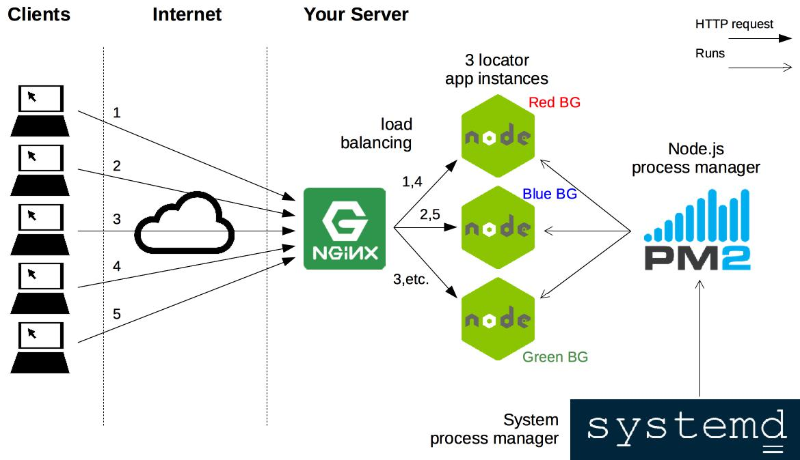

# Configure nginx as a load balancer for a Node.js application run with PM2

The goal of this exercise is to use [PM2][pm2], a Node.js process manager, to
deploy three instances of a Node.js web application on your server, and to
configure nginx as a load balancer to distribute incoming traffic to these three
instances.

<!-- START doctoc generated TOC please keep comment here to allow auto update -->
<!-- DON'T EDIT THIS SECTION, INSTEAD RE-RUN doctoc TO UPDATE -->

- [Goal](#goal)
- [Requirements](#requirements)
- [:exclamation: Install the application on your server](#install-the-application-on-your-server)
- [:exclamation: Run the application with PM2](#run-the-application-with-pm2)
  - [:exclamation: Install PM2](#install-pm2)
  - [:exclamation: Run three instances of the application](#run-three-instances-of-the-application)
  - [:exclamation: Configure systemd to run PM2](#configure-systemd-to-run-pm2)
- [:exclamation: Configure nginx as a load balancer](#configure-nginx-as-a-load-balancer)
- [:exclamation: Make sure it works](#the-end)

<!-- END doctoc generated TOC please keep comment here to allow auto update -->

## Goal

The application you must deploy is an [IP address locator][locator]. Its source
code is [available on GitHub][locator-repo].

**:warning:** The main feature of the application (geolocating IP addresses) may
not work due to rate limiting issues. However, it is deployable and still
illustrates the load balancing capabilities of nginx.

When a proper load balancing configuration is performed, nginx should direct
your request to one of three application instances, each with a different
background color, every time you refresh the page. (This does not work on the
Heroku deployment linked above.)



> Setting up a load balancer allows your application to serve more clients.
> Since there are three instances available to respond to requests, it can in
> theory respond to three times as many requests in parallel.

## Requirements

You must have [Node.js][node] version 10+ installed on your server.

## :exclamation: Install the application on your server

Follow the instructions in the [GitHub repository's README][locator-readme] to
install the application on your server:

- Clone the repository.
- Install its dependencies.

## :exclamation: Run the application with PM2

[PM2][pm2] is a process manager dedicated to running Node.js applications.

You will configure PM2 to run three instances of the locator application on
three different ports, then configure systemd to run PM2 automatically on
startup.

### :exclamation: Install PM2

To install **PM2** on your server, execute the following command:

```bash
$> sudo npm install -g pm2
```

### :exclamation: Run three instances of the application

Read [PM2's ecosystem file documentation][pm2-ecosystem].

Create a PM2 ecosystem file to run three instances of your application on three
different ports and with three different background colors. You can do this by
setting the correct environment variables for each instance. Read the [locator's
configuration documentation][locator-config] to find the correct variables to
set.

> - :gem: The `script` key in the PM2 ecosystem file defines the file PM2 will
>   execute to launch the application. Look at the `start` script in the
>   application's `package.json` file to find the right file to execute.
> - :gem: The `watch` key should be false or be removed. Watching is for
>   development, when you want the application to automatically reload its code
>   if it changes. You do not want this for a production deployment, as it might
>   take a few seconds to restart, during which clients will get errors.

Once your ecosystem file is ready, run it with PM2.

### :exclamation: Configure systemd to run PM2

PM2 can automatically create a systemd service for you. Follow [PM2's startup
hook documentation][pm2-startup].

You will need to install the hook, then save your process list.

## :exclamation: Configure nginx as a load balancer

Create an nginx site configuration file that does the following:

- Serve the site on the subdomain `locator.jde.archidep.ch` (replacing
  `jde` with your username).
- Use the path to the locator application's `public` directory as the site's
  root.
- Configure load balancing to your three instances. You will find an example of
  a load balancing nginx configuration in the [reverse proxying
  slides][nginx-slides].

Once you have your configuration in place and enabled, tell nginx to reload its
configuration.

## :exclamation: Make sure it works

Make sure the load balancing works (you should see a different color each time
you refresh your locator page).

[locator]: https://load-balanceable-locator.herokuapp.com
[locator-config]: https://github.com/MediaComem/load-balanceable-locator#configuration
[locator-readme]: https://github.com/MediaComem/load-balanceable-locator#readme
[locator-repo]: https://github.com/MediaComem/load-balanceable-locator
[nginx-slides]: https://mediacomem.github.io/comem-archidep/2020-2021/subjects/reverse-proxy/?home=MediaComem%2Fcomem-archidep%23readme#30
[node]: https://nodejs.org
[one-chat-room-ex]: ./one-chat-room-deployment.md
[pm2]: http://pm2.keymetrics.io
[pm2-ecosystem]: https://pm2.keymetrics.io/docs/usage/application-declaration/
[pm2-startup]: https://pm2.io/docs/runtime/guide/startup-hook/
