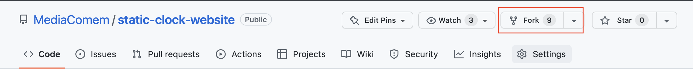

<!-- START doctoc generated TOC please keep comment here to allow auto update -->
<!-- DON'T EDIT THIS SECTION, INSTEAD RE-RUN doctoc TO UPDATE -->

- [Deploy static sites to Netlify](#deploy-static-sites-to-netlify)
  - [Legend](#legend)
  - [:gem: Requirements](#gem-requirements)
  - [:exclamation: Fork and clone the clock project](#exclamation-fork-and-clone-the-clock-project)
  - [:exclamation: Create a Netlify account](#exclamation-create-a-netlify-account)
    - [:books: What is Netlify?](#books-what-is-netlify)
  - [:exclamation: Install Node.js and the Netlify CLI](#exclamation-install-nodejs-and-the-netlify-cli)
    - [:exclamation: Install Node.js](#exclamation-install-nodejs)
    - [:books: What is Node?](#books-what-is-node)
    - [:question: Check Node.js installation](#question-check-nodejs-installation)
    - [:exclamation: Install Netlify CLI using NPM](#exclamation-install-netlify-cli-using-npm)
    - [:books: What is NPM](#books-what-is-npm)
    - [:exclamation: Authenticate Netlify CLI](#exclamation-authenticate-netlify-cli)
  - [:exclamation: Launch!](#exclamation-launch)
  - [:checkered_flag: What have I done?](#checkered_flag-what-have-i-done)

<!-- END doctoc generated TOC please keep comment here to allow auto update -->

# Deploy static sites to Netlify

The goal of this exercice is to deploy a static website (only HTML, JavaScript and CSS) on the Netlify PaaS instead of your own server in the Infrastructure-as-a-Service (IaaS) Microsoft Azure Web Services cloud.

## Legend

Parts of this guide are annotated with the following icons:

- :exclamation: A task you **MUST** perform to complete the exercise.
- :question: An optional step that you _may_ perform to make sure that
  everything is working correctly.
- :warning: **Critically important information about the exercise.**
- :gem: Tips on the exercise, reminders about previous exercises, or
  explanations about how this exercise differs from the previous one.
- :space_invader: More advanced tips on how to save some time.
- :books: Additional information about the exercise or the commands and tools
  used.
- :checkered_flag: The end of the exercise.
  - :classical_building: The architecture of what you deployed during the
    exercise.
- :boom: Troubleshooting tips: how to fix common problems you might encounter.

## :gem: Requirements
This exercise assumees that you are familiar with the command-line and git.

## :exclamation: Fork and clone the clock project

Fork the [static clock website repository][static-clock-repo]:


Clone **your fork** onto your machine and travel to the directory.

```bash
$> git clone https://github.com/username/static-clock-website.git
Cloning into 'static-clock-website'...
remote: Enumerating objects: 6, done.
remote: Total 6 (delta 0), reused 0 (delta 0), pack-reused 6
Receiving objects: 100% (6/6), done.

$> cd static-clock-website
```


## :exclamation: Create a Netlify account

Go to the [Netlify signup page][netlify-signup] and create an account using GitHub:


Once you are done with the registration, you will be asked to deploy your first project. You can try either try it out or skip this step:


### :books: What is Netlify?
[Netlify][netlify] is a popular hosting platform for static sites, which are websites that are composed of HTML, CSS, and JavaScript files that are served to the client exactly as they are stored on the server. Netlify provides a range of features and tools to help developers build, deploy, and manage static sites, including:

- **Continuous deployment**: Netlify automatically builds and deploys your static site whenever you push updates to a repository. This makes it easy to keep your site up to date without having to manually build and deploy it.

- **SSL/TLS certificates**: Netlify provides free SSL/TLS certificates to secure your site with HTTPS.

- **Global CDN**: Netlify uses a global content delivery network (CDN) to serve your static site from locations around the world, which can improve the performance and availability of your site.

Overall, Netlify is a powerful and convenient platform for hosting and managing static sites, with a range of features that make it easy to build, deploy, and optimize your project.

You will be using the Netlify CLI to deploy your site. With the Netlify CLI, you can create new sites, deploy updates to your existing sites, set up continuous deployment, manage your team's access to sites, and more,  directly from the command-line.

## :exclamation: Install Node.js and the Netlify CLI

### :exclamation: Install Node.js
For this exercise you will be using a command-line tool created by Netlify. You will need to install Node.js to use this CLI. The easiest way to do so, is to head to the [Node.js Downloads][node-downloads] and choose the appropriate installer for your machine.

### :books: What is Node?
[Node.js][node] is a JavaScript runtime built on Chrome's V8 JavaScript engine. It allows developers to execute JavaScript code on the server side, rather than just in a web browser. This enables the creation of server-side applications with JavaScript, which was previously not possible. Node.js also includes a large and growing library of open-source packages (called "modules") that can be easily installed and used in Node.js applications, making it easy to add functionality without having to build it from scratch. Node.js has become popular for creating web servers and building scalable network applications, as it is able to handle a large number of concurrent connections with high throughput. It is often used in combination with other tools and frameworks, such as Express.js, to build web applications and APIs.

>:space_invader: Installing Node.js this way can cause headaches down the road. It is good practice to use version managers instead. One of the main benefits is the ability to easily switch between different versions of Node.js. This is particularly useful when working on projects that require a specific version of Node.js, or when testing how a project works with different versions of Node.js. A version manager also allows you to have multiple versions of Node.js installed on the same machine, which can be useful for developing and testing applications that need to support multiple versions of Node.js. Here are a few Node version managers:
> - [nvm][nvm]
> - [n][n]
> - [volta][volta]
> - [asdf][asdf] (can be used for multiple runtimes)

### :question: Check Node.js installation
To make sure Node.js is installed, try the following:

```bash
$> node -v
v18.12.1
```

### :exclamation: Install Netlify CLI using NPM

```bash
$> npm install -g netlify-cli
added 1437 packages, and audited 1438 packages in 15s
```

:question: You can check the installation by executing:

```bash
$> netlify -v
netlify-cli/12.5.0 darwin-arm64 node-v18.12.1
```

### :books: What is NPM
[NPM][npm] (short for Node Package Manager) is a package manager for JavaScript. It is the default package manager for Node.js. NPM provides a way to install and manage packages (libraries, frameworks, tools, etc.) that you can use in your own projects. When you install a package using NPM, it installs the package in the current working directory, in a subdirectory called `node_modules`. If you want to use the package in your project, you can import it in your code.

In this case, you installed a global module, since you want to access the Netlify CLI from anywhere. Global modules are installed globally, which means they are available to use in any project on your computer. You can install a global module using the `-g` flag with the `npm install` command.

### :exclamation: Authenticate Netlify CLI
You need to link the Netlify CLI to your Netlify account. To do so, run:

```bash
$> netlify login
Logging into your Netlify account...
Opening https://app.netlify.com/authorize?response_type=ticket&ticket=0b81336689cba2392265b135549df0e7
⠴ Waiting for authorization...
```
This will open a page in your browser window asking you to authorize the Netlify CLI to access your account:


Once you click **authorize**, you should see the following in your Terminal:

```bash
You are now logged into your Netlify account!
Run netlify status for account details
To see all available commands run: netlify help
```

## :exclamation: Launch!

## :checkered_flag: What have I done?

[asdf]: https://asdf-vm.com
[n]:https://github.com/tj/n
[netlify]: https://www.netlify.com/
[netlify-cli]: https://docs.netlify.com/cli/get-started/
[netlify-signup]: https://app.netlify.com/signup
[node]: https://nodejs.org/en/
[node-downloads]: https://nodejs.org/en/download/
[npm]: https://www.npmjs.com/
[nvm]: https://github.com/nvm-sh/nvm
[static-clock-repo]: https://github.com/MediaComem/static-clock-website
[volta]: https://github.com/volta-cli/volta
