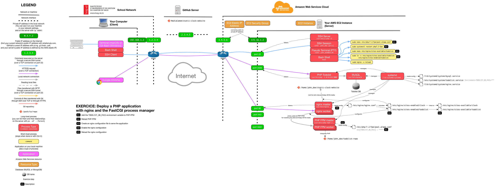

# Deploy a PHP website with nginx and the FastCGI process manager

This guide describes how to deploy the same [PHP Todolist][repo] as in previous
exercises, but this time behind nginx acting a reverse proxy, and with the
[FastCGI Process Manager (FPM)][php-fpm] instead of the [PHP development
server][php-dev-server], which is much more suitable for a production
deployment.

This guide assumes that you are familiar with [reverse proxying][slides], that
you have nginx installed, and that you have done the [DNS exercise][dns-ex] and
the [systemd exercise][systemd-ex].

<!-- START doctoc generated TOC please keep comment here to allow auto update -->
<!-- DON'T EDIT THIS SECTION, INSTEAD RE-RUN doctoc TO UPDATE -->

- [Using PHP FPM instead of the PHP development server](#using-php-fpm-instead-of-the-php-development-server)
- [Add a the `TODOLIST_DB_PASS` environment variable to PHP FPM](#add-a-the-todolist_db_pass-environment-variable-to-php-fpm)
  - [Reload PHP FPM](#reload-php-fpm)
- [Create an nginx configuration file to serve the application](#create-an-nginx-configuration-file-to-serve-the-application)
  - [Enable the nginx configuration](#enable-the-nginx-configuration)
  - [Reload the nginx configuration](#reload-the-nginx-configuration)
- [See it in action](#see-it-in-action)
- [What have I done?](#what-have-i-done)
- [End result](#end-result)

<!-- END doctoc generated TOC please keep comment here to allow auto update -->


## Using PHP FPM instead of the PHP development server

When you did the [systemd exercise][systemd-ex], you used the PHP development
server (with the command `/usr/bin/php -S 0.0.0.0:3000`). As [its documentation
states][php-dev-server], it is meant for development, not to be used on a
production server. One of the main reasons it's a bad idea to use it on a server
is beacuse it is **single-threaded**, and can only serve *one request at a
time*.

During the [SFTP exercise][sftp-ex], you installed the `php-fpm` package,
which provides the [FastCGI Process Manager (FPM)][php-fpm].

It is both a **process manager** and a **FastCGI server**:

* It will run multiple PHP processes to be able to serve requests from multiple
  clients at the same time.
* A web server (such as nginx) can ask it to execute PHP files using the
  [FastCGI protocol][fastcgi].

> Use the following command for more information on how PHP FPM manages
> processes (for version 7.4):
>
>     $> grep -A 50 -m 1 "child processes" /etc/php/7.4/fpm/pool.d/www.conf

The `php-fpm` package is integrated with systemd out of the box (its service
file is `/lib/systemd/system/php7.4-fpm.service` for version 7.4). It should
already be running:

```bash
$> sudo systemctl status php7.4-fpm
● php7.4-fpm.service - The PHP 7.4 FastCGI Process Manager
   Loaded: loaded (/lib/systemd/system/php7.4-fpm.service; enabled; vendor preset: enabled)
   Active: active (running) since Thu 2019-01-10 17:58:07 UTC; 27min ago
   ...
```


## Add a the `TODOLIST_DB_PASS` environment variable to PHP FPM

The PHP todolist application requires the `TODOLIST_DB_PASS` environment
variable to successfully connect to its database. You previously set that
variable in the systemd service file you created during the [systemd
exercise][systemd-ex]: `/etc/systemd/system/todolist.service`.

In this exercise, systemd will no longer be running your application directly.
It runs [PHP FPM][php-fpm], which will in turn run your application. By default,
PHP FPM does not pass environment variables from systemd to the application.
Therefore, you need to configure PHP-FPM to add this variable to your
application's environment.

The PHP FPM configuration file which determines how processes are launched is
`/etc/php/7.4/fpm/pool.d/www.conf` (for version 7.4). Edit this file:

```bash
$> sudo nano /etc/php/7.4/fpm/pool.d/www.conf
```

Find the environment section which looks like this:

```
; Pass environment variables like LD_LIBRARY_PATH. All $VARIABLEs are taken from
; the current environment.
; Default Value: clean env
;env[HOSTNAME] = $HOSTNAME
;env[PATH] = /usr/local/bin:/usr/bin:/bin
;env[TMP] = /tmp
;env[TMPDIR] = /tmp
;env[TEMP] = /tmp
```

> **Hint:** you can use `Ctrl-W` in nano to search for text. For example, search
> for `env[` in this file.

Add a line to define the `TODOLIST_DB_PASS` variable with the correct value.

> **Hint:** you can quote the value with double quotes (`"`) if it contains
> whitespace or special characters. Also, be sure to remove the leading `;`
> which makes the line a comment.

### Reload PHP FPM

For the change to take effect, you must restart the PHP FPM service:

```bash
$> sudo systemctl restart php7.4-fpm
```

Make sure it is still running:

```bash
$> sudo systemctl status php7.4-fpm
● php7.4-fpm.service - The PHP 7.4 FastCGI Process Manager
   Loaded: loaded (/lib/systemd/system/php7.4-fpm.service; enabled; vendor preset: enabled)
   Active: active (running) since Thu 2019-01-10 17:58:07 UTC; 3s ago
   ...
```

> If it is no longer running, you may have corrupted the configuration file.


## Create an nginx configuration file to serve the application

Create an nginx configuration file named `todolist` for the application. Put it
in nginx's `/etc/nginx/sites-available` directory like in the previous exercise.

In this exercise, you want to configure nginx as a reverse proxy: when it
receives a request for the PHP todolist, it should proxy it to PHP FPM (in other
words, nginx should ask PHP FPM to execute the application's PHP code; nginx
itself does not know how to execute PHP code).

You can start with the [reverse proxy
configuration](https://mediacomem.github.io/comem-archidep/2021-2022/subjects/reverse-proxy/?home=MediaComem%2Fcomem-archidep%23readme#29),
but you need to make the following changes:

* Like in the previous exercise, adapt the server name and root directory.

  > **Hint:** you can use the existing `todolist-repo` directory you have been
  > using in previous PHP todolist exercises. There is no need to clone another
  > copy.
  >
  > **Hint:** in the DNS exercise, you should have configured a wildcard domain
  > name like `*.john-doe.archidep.online`. This means that any subdomain you
  > want under `john-doe.archidep.online`, for example
  > `todolist.john-doe.archidep.online`, should reach your server.
* PHP FPM uses the [FastCGI protocol][fastcgi] to receive requests to execute
  PHP code. This means that you cannot use [nginx's `proxy_pass`
  directive][nginx-proxy-pass] to define your proxy since it works with the HTTP
  protocol. Instead, you must **replace** it with two other directives:

  * You must configure nginx to set various FastCGI parameters. You could do
    this yourself, but nginx helpfully provides a configuration snippet which
    you can simply include like this:

    ```
    include snippets/fastcgi-php.conf;
    ```

    > This will include the file `/etc/nginx/snippets/fastcgi-php.conf`, which
    > will in turn include `/etc/nginx/fastcgi.conf`. If you want to know what
    > is required to make nginx properly proxy a request with the FastCGI
    > protocol, you can look at the contents of these two files.
  * You must tell nginx to proxy requests with the FastCGI protocol, and where
    to proxy them to, with its [`fastcgi_pass` directive][nginx-fastcgi-pass].
    This allows you to proxy requests either to a domain and IP address (e.g.
    `localhost:9000`) or to a [Unix domain socket][unix-socket] (a special kind
    of Unix file which allows bidirectional communication between processes on
    the same machine by reading and writing to it).

    By default, PHP FPM is configured to listen on a Unix socket which is
    located at `/var/run/php/php7.4-fpm.sock` (for version 7.4). Therefore,
    according to the [documentation][nginx-fastcgi-pass], you should configure a
    FastCGI proxy to `unix:/var/run/php/php7.4-fpm.sock`.

    This will make nginx proxy HTTP requests to PHP FPM through the Unix socket.
    PHP FPM will then execute the PHP code and give the result to nginx, which
    will send it back to the client in the HTTP response.

    > PHP FPM either listens on a port or on a Unix socket depending on its
    > configuration. You can check the `/etc/php/7.4/fpm/pool.d/www.conf` file
    > and look for the `listen = ...` option which should be near the top.
    >
    > You can use the following command to quickly find the `listen` option and
    > print it along with the few lines preceding it: `grep -B 10 -m 1 "listen
    > =" /etc/php/7.4/fpm/pool.d/www.conf`.

### Enable the nginx configuration

Enable the `todolist` configuration by creating the correct symbolic link:

```bash
$> sudo ln -s /etc/nginx/sites-available/todolist /etc/nginx/sites-enabled/todolist
```

Make sure the symbolic link points to the correct file:

```bash
$> ls -l /etc/nginx/sites-enabled/todolist
lrwxrwxrwx 1 root root 32 Jan 10 17:07 /etc/nginx/sites-enabled/todolist -> /etc/nginx/sites-available/todolist
```

### Reload the nginx configuration

Check whether the changes you have made are valid:

```bash
$> sudo nginx -t
nginx: the configuration file /etc/nginx/nginx.conf syntax is ok
nginx: configuration file /etc/nginx/nginx.conf test is successful
```

Tell nginx to reload its configuration:

```bash
$> sudo nginx -s reload
```


## See it in action

Visit http://todolist.john-doe.archidep.online (replacing `john-doe` with your
username) and you should see the PHP todolist working.


## What have I done?

You have replaced the [PHP development server][php-dev-server] you had been
using until now with [PHP FPM][php-fpm], a production-grade PHP process manager
and FastCGI implementation which is much more optimized and supports concurrent
requests. This means, among other things, that many more clients can now access
the PHP todolist at the same time without having to wait on each other.

You have also configured nginx to act as a reverse proxy, forwarding requests
for the PHP todolist application to PHP FPM. When it receives an HTTP request,
nginx will forward it to PHP FPM using the FastCGI protocol. PHP FPM will
execute your application's PHP code and give the result to nginx, which will
send it back to the client. The communication flow looks something like this:

    Browser ↔ Nginx ↔ PHP FPM ↔ PHP todolist

This is a bit more complex than what you had before:

    Browser ↔ PHP development server ↔ PHP todolist

But on the other hand, you are using PHP FPM which is much more suitable for a
production deployment. You are also using nginx, which allows you to deploy
other applications and websites on the same server in addition to the PHP
todolist.

In real production deployments, you will often find several processes plugged
together to achieve the same goal. Here, nginx receives and dispatches the
clients' requests, while PHP FPM manages your PHP application(s), and your
application does what it's supposed to do. This allows each process to focus on
one thing and do it well. The PHP todolist application does not have to know
about the other applications and websites that might be running on the server.


## End result



> [PDF version](nginx-php-fpm-deployment.pdf).


[dns-ex]: dns-configuration.md
[fastcgi]: https://en.wikipedia.org/wiki/FastCGI
[php-dev-server]: http://php.net/manual/en/features.commandline.webserver.php
[php-fpm]: http://php.net/manual/en/install.fpm.php
[repo]: https://github.com/MediaComem/comem-archidep-php-todo-exercise
[nginx-ex]: nginx-static-deployment.md
[nginx-fastcgi-pass]: http://nginx.org/en/docs/http/ngx_http_fastcgi_module.html#fastcgi_pass
[nginx-proxy-pass]: http://nginx.org/en/docs/http/ngx_http_proxy_module.html#proxy_pass
[slides]: https://mediacomem.github.io/comem-archidep/2021-2022/subjects/reverse-proxy/?home=MediaComem%2Fcomem-archidep%23readme#1
[sftp-ex]: sftp-deployment.md
[systemd-ex]: systemd-deployment.md
[unix-socket]: https://en.wikipedia.org/wiki/Unix_domain_socket
