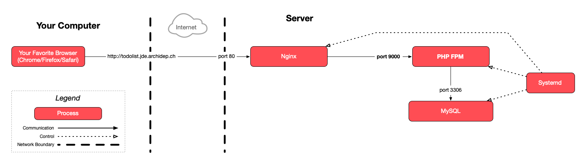

# Deploy a PHP website with nginx and the FastCGI process manager

This guide describes how to deploy the same [PHP Todolist][repo] as in previous
exercises, but this time behind nginx acting a reverse proxy, and with the
[FastCGI Process Manager (FPM)][php-fpm] instead of the [PHP development
server][php-dev-server], which is much more suitable for a production
deployment.

<!-- START doctoc generated TOC please keep comment here to allow auto update -->
<!-- DON'T EDIT THIS SECTION, INSTEAD RE-RUN doctoc TO UPDATE -->

- [Legend](#legend)
- [:gem: Requirements](#gem-requirements)
- [:warning: Identify your PHP FPM version](#warning-identify-your-php-fpm-version)
- [:books: Using PHP FPM instead of the PHP development server](#books-using-php-fpm-instead-of-the-php-development-server)
- [:exclamation: Configure PHP FPM to listen on a port](#exclamation-configure-php-fpm-to-listen-on-a-port)
  - [:question: Optional: check something is listening on port 9000](#question-optional-check-something-is-listening-on-port-9000)
- [:exclamation: Add a the `TODOLIST_DB_PASS` environment variable to PHP FPM](#exclamation-add-a-the-todolist_db_pass-environment-variable-to-php-fpm)
  - [:exclamation: Reload PHP FPM](#exclamation-reload-php-fpm)
- [:exclamation: Create an nginx configuration file to serve the application](#exclamation-create-an-nginx-configuration-file-to-serve-the-application)
  - [:exclamation: Enable the nginx configuration](#exclamation-enable-the-nginx-configuration)
  - [:exclamation: Reload the nginx configuration](#exclamation-reload-the-nginx-configuration)
- [:exclamation: See it in action](#exclamation-see-it-in-action)
- [:checkered_flag: What have I done?](#checkered_flag-what-have-i-done)
  - [:classical_building: Architecture](#classical_building-architecture)

<!-- END doctoc generated TOC please keep comment here to allow auto update -->

## Legend

Parts of this guide are annotated with the following icons:

- :exclamation: A task you **MUST** perform to complete the exercise.
- :question: An optional step that you _may_ perform to make sure that
  everything is working correctly.
- :warning: **Critically important information about the exercise.**
- :gem: Tips on the exercise, reminders about previous exercises, or
  explanations about how this exercise differs from the previous one.
- :space_invader: More advanced tips on how to save some time. Challenges.
- :books: Additional information about the exercise or the commands and tools
  used.
- :checkered_flag: The end of the exercise.
  - :classical_building: The architecture of what you deployed during the
    exercise.
- :boom: Troubleshooting tips: how to fix common problems you might encounter.

## :gem: Requirements

This guide assumes that you are familiar with [reverse proxying][slides], that
you have nginx installed, and that you have done the [DNS exercise][dns-ex] and
the [systemd exercise][systemd-ex].

## :warning: Identify your PHP FPM version

During this exercise, you will use a package and service called `php-fpm` that
you installed on your server back during the first deployment exercise. The
version of `php-fpm` running on your server will depend on which Ubuntu version
you chose when configuring your Azure instance. It will likely be `7.4` for
Ubuntu 20.04 or `8.1` for Ubuntu 22.04.

You can check which version you have by running either of the following
commands:

```bash
$> ls /etc/php
8.1

$> dpkg --list | grep php-fpm
ii  php-fpm   2:8.1+92ubuntu1   ...
```

In this case, the output indicates that version `8.1` is installed. The
remaining sections of the exercise assume that this is the case. **If not**, you
will need to **modify the commands containing the version number accordingly**,
for example replace `8.1` by `7.4` in every command (if that is the version you
have installed).

## :books: Using PHP FPM instead of the PHP development server

When you did the [systemd exercise][systemd-ex], you used the PHP development
server (with the command `/usr/bin/php -S 0.0.0.0:3000`). As [its documentation
states][php-dev-server], it is meant for development, not to be used on a
production server. One of the main reasons it's a bad idea to use it on a server
is beacuse it is **single-threaded**, and can only serve _one request at a
time_.

During the [SFTP exercise][sftp-ex], you installed the `php-fpm` package,
which provides the PHP [FastCGI Process Manager (FPM)][php-fpm].

PHP FPM is both a **process manager** and a **FastCGI server**:

- It will run multiple PHP processes to be able to serve requests from multiple
  clients at the same time.
- A web server (such as nginx) can ask it to execute PHP files using the
  [FastCGI protocol][fastcgi].

> :gem: Use the following command for more information on how PHP FPM manages
> processes (for version 8.1):
>
>     $> grep -A 50 -m 1 "child processes" /etc/php/8.1/fpm/pool.d/www.conf

The `php-fpm` package is integrated with systemd out of the box (its service
file is `/lib/systemd/system/php8.1-fpm.service` for version 8.1). It should
already be running:

```bash
$> sudo systemctl status php8.1-fpm
● php8.1-fpm.service - The PHP 8.1 FastCGI Process Manager
   Loaded: loaded (/lib/systemd/system/php8.1-fpm.service; enabled; vendor preset: enabled)
   Active: active (running) since Thu 2019-01-10 17:58:07 UTC; 27min ago
   ...
```

## :exclamation: Configure PHP FPM to listen on a port

The PHP [FastCGI Process Manager (FPM)][php-fpm] can accept connections either
on a local TCP port or by default through a Unix domain socket.

> :books: A [Unix domain socket][unix-socket] is a special kind of Unix file
> (denoted by the type `s` when listed by `ls -l`) which allows bidirectional
> communication between processes on the same machine by writing to and reading
> from that file.

Because we've been making TCP (HTTP/SSH/SFTP) connections so far, we'll
configure PHP FPM to also listen on a port rather than a domain socket for
consistency.

You will need to edit the PHP FPM web configuration file which you can find at
`/etc/php/8.1/fpm/pool.d/www.conf` (for version 8.1). Edit this file:

```bash
$> sudo nano /etc/php/8.1/fpm/pool.d/www.conf
```

Find the section configuring the listening address (the `listen = ...` key):

```
; The address on which to accept FastCGI requests.
; Valid syntaxes are:
;   'ip.add.re.ss:port'    - to listen on a TCP socket to a specific IPv4 address on
;                            a specific port;
;   '[ip:6:addr:ess]:port' - to listen on a TCP socket to a specific IPv6 address on
;                            a specific port;
;   'port'                 - to listen on a TCP socket to all addresses
;                            (IPv6 and IPv4-mapped) on a specific port;
;   '/path/to/unix/socket' - to listen on a unix socket.
; Note: This value is mandatory.
listen = /run/php/php8.1-fpm.sock
```

> :gem: You can search for a specific word in nano by typing the `Ctrl-W`
> shortcut, then typing your word (e.g. "listen") and finally pressing the
> `Enter` key. This will scroll to the first occurrence of the word in the file.
> You can find further occurrences of the word by typing `Ctrl-W` followed by
> `Enter` again.

Remove the existing `listen = /run/php/php8.1-fpm.sock` line, or comment it by
adding a `;` comment character at the beginning of the line. Then add a new
`listen = 9000` line. This will instruct PHP FPM to listen on port 9000 rather
than using the Unix domain socket file:

```
; listen = /run/php/php8.1-fpm.sock
listen = 9000
```

> :books: Why port 9000, you ask? Why not? It does not matter which port you
> choose, as long as another process does not already listen on that port.

By default, PHP FPM will accept connections from anywhere, including outside the
server if the firewall lets the client through. For the sake of security, it is
better to configure PHP FPM to only accept local connections, i.e. from
processes running on the same machine like nginx.

Find the section configuring allowed clients (the `listen.allowed_clients = ...`
key). If it is commented, remove the leading `;` comment character, and make
sure the value is set to `127.0.0.1` (local clients only):

```
; List of addresses (IPv4/IPv6) of FastCGI clients which are allowed to connect.
; Equivalent to the FCGI_WEB_SERVER_ADDRS environment variable in the original
; PHP FCGI (5.2.2+). Makes sense only with a tcp listening socket. Each address
; must be separated by a comma. If this value is left blank, connections will be
; accepted from any ip address.
; Default Value: any
listen.allowed_clients = 127.0.0.1
```

For these changes to take effect, you must restart the PHP FPM service:

```bash
$> sudo systemctl restart php8.1-fpm
```

### :question: Optional: check something is listening on port 9000

Running the `ss -tlpn` command should confirm that there is indeed a process
listening on port 9000 on the server (the line indicating `*:9000` as the local
address and port):

```bash
$> ss -tlpn
State   Recv-Q  Send-Q  Local Address:Port  Peer Address:Port
LISTEN  0       128                 *:9000             *:*     (php-fpm)
LISTEN  0       80          127.0.0.1:3306       0.0.0.0:*     (mysqld)
LISTEN  0       128     127.0.0.53%lo:53         0.0.0.0:*     (systemd-resolve)
LISTEN  0       128           0.0.0.0:80         0.0.0.0:*     (nginx IPv4)
LISTEN  0       128              [::]:80            [::]:*     (nginx IPv6)
LISTEN  0       128           0.0.0.0:22         0.0.0.0:*     (sshd IPv4)
LISTEN  0       128              [::]:22            [::]:*     (sshd IPv6)
```

## :exclamation: Add a the `TODOLIST_DB_PASS` environment variable to PHP FPM

The PHP todolist application requires the `TODOLIST_DB_PASS` environment
variable to successfully connect to its database. You previously set that
variable in the systemd service file you created during the [systemd
exercise][systemd-ex]: `/etc/systemd/system/todolist.service`.

In this exercise, systemd will no longer be running your application directly.
It runs [PHP FPM][php-fpm], which will in turn execute your application's PHP
code. By default, PHP FPM does not pass environment variables from systemd to
the application. Therefore, you need to configure PHP-FPM to add this variable
to your application's environment.

Edit the PHP FPM web configuration file again:

```bash
$> sudo nano /etc/php/8.1/fpm/pool.d/www.conf
```

Find the environment section which looks like this:

```
; Pass environment variables like LD_LIBRARY_PATH. All $VARIABLEs are taken from
; the current environment.
; Default Value: clean env
;env[HOSTNAME] = $HOSTNAME
;env[PATH] = /usr/local/bin:/usr/bin:/bin
;env[TMP] = /tmp
;env[TMPDIR] = /tmp
;env[TEMP] = /tmp
```

Add a line to define the `TODOLIST_DB_PASS` variable with the correct value.

> :gem: Quote the value with double quotes (`"`) if it contains whitespace or
> special characters. Also, be sure to remove the leading `;` which makes the
> line a comment.

### :exclamation: Reload PHP FPM

For the change to take effect, you must restart the PHP FPM service:

```bash
$> sudo systemctl restart php8.1-fpm
```

Make sure it is still running:

```bash
$> sudo systemctl status php8.1-fpm
● php8.1-fpm.service - The PHP 8.1 FastCGI Process Manager
   Loaded: loaded (/lib/systemd/system/php8.1-fpm.service; enabled; vendor preset: enabled)
   Active: active (running) since Thu 2019-01-10 17:58:07 UTC; 3s ago
   ...
```

> :gem: If PHP FPM is no longer running, you may have corrupted the
> configuration file. If the problem is not clear in the output of the `status`
> command, check the entire logs with `sudo journalctl -u php8.1-fpm` to see if
> you can find more information.

## :exclamation: Create an nginx configuration file to serve the application

Create an nginx configuration file named `todolist` for the application. Put it
in nginx's `/etc/nginx/sites-available` directory like in the previous exercise.

In this exercise, you want to configure nginx as a reverse proxy: when it
receives a request for the PHP todolist, it should proxy it to PHP FPM (in other
words, nginx should ask PHP FPM to execute the application's PHP code, because
nginx itself does not know how to execute PHP code).

You can start with the [reverse proxy
configuration](https://mediacomem.github.io/comem-archidep/2024-2025/subjects/reverse-proxy/?home=MediaComem%2Fcomem-archidep%23readme#29),
but you need to make the following changes:

- Like in the previous exercise, adapt the server name and root directory.

  > :gem: you can use the existing `todolist-repo` directory you have been
  > using in previous PHP todolist exercises. There is no need to clone another
  > copy.
  >
  > :gem: in the DNS exercise, you should have configured a wildcard domain
  > name like `*.john-doe.archidep.ch`. This means that any subdomain you
  > want under `john-doe.archidep.ch`, for example
  > `todolist.john-doe.archidep.ch`, should reach your server.

- PHP FPM uses the [FastCGI protocol][fastcgi] to receive requests to execute
  PHP code. This means that you cannot use [nginx's `proxy_pass`
  directive][nginx-proxy-pass] to define your proxy since it works with the HTTP
  protocol. Instead, you must **replace** it with two other directives:

  - You must configure nginx to set various FastCGI parameters. You could do
    this yourself, but nginx helpfully provides a configuration snippet which
    you can simply include like this:

    ```
    include snippets/fastcgi-php.conf;
    ```

    > This will include the file `/etc/nginx/snippets/fastcgi-php.conf`, which
    > will in turn include `/etc/nginx/fastcgi.conf`. If you want to know what
    > is required to make nginx properly proxy a request with the FastCGI
    > protocol, you can look at the contents of these two files.

  - You must tell nginx to proxy requests with the FastCGI protocol, and where
    to proxy them to, with its [`fastcgi_pass` directive][nginx-fastcgi-pass].
    This allows you to proxy requests either to a domain and IP address (e.g.
    `localhost:9000`) or to a [Unix domain socket][unix-socket].

    You have previously configured PHP FPM to listen on a port. Therefore,
    according to the [documentation][nginx-fastcgi-pass], you should configure a
    FastCGI proxy to `localhost` or `127.0.0.1` (since PHP FPM is running on the
    same machine as nginx) and the same port you used in the PHP FPM web
    configuration file for the `listen` key.

    This will make nginx proxy HTTP requests to PHP FPM through that local port.
    PHP FPM will then execute the PHP code and give the result to nginx, which
    will send it back to the client in the HTTP response.

### :exclamation: Enable the nginx configuration

Enable the `todolist` configuration by creating the correct symbolic link:

```bash
$> sudo ln -s /etc/nginx/sites-available/todolist /etc/nginx/sites-enabled/todolist
```

Make sure the symbolic link points to the correct file:

```bash
$> ls -l /etc/nginx/sites-enabled/todolist
lrwxrwxrwx 1 root root 32 Jan 10 17:07 /etc/nginx/sites-enabled/todolist -> /etc/nginx/sites-available/todolist
```

### :exclamation: Reload the nginx configuration

Check whether the changes you have made are valid:

```bash
$> sudo nginx -t
nginx: the configuration file /etc/nginx/nginx.conf syntax is ok
nginx: configuration file /etc/nginx/nginx.conf test is successful
```

Tell nginx to reload its configuration:

```bash
$> sudo nginx -s reload
```

## :exclamation: See it in action

Visit http://todolist.john-doe.archidep.ch (replacing `john-doe` with your
username) and you should see the PHP todolist working.

## :checkered_flag: What have I done?

You have replaced the [PHP development server][php-dev-server] you had been
using until now with [PHP FPM][php-fpm], a production-grade PHP process manager
and FastCGI implementation which is much more optimized and supports concurrent
requests. This means, among other things, that many more clients can now access
the PHP todolist at the same time without having to wait on each other.

You have also configured nginx to act as a reverse proxy, forwarding requests
for the PHP todolist application to PHP FPM. When it receives an HTTP request,
nginx will forward it to PHP FPM using the FastCGI protocol. PHP FPM will
execute your application's PHP code and give the result to nginx, which will
send it back to the client. The communication flow looks something like this:

    Browser ↔ Nginx ↔ PHP FPM

This is a bit more complex than what you had before:

    Browser ↔ PHP development server

But on the other hand, you are using PHP FPM which is much more suitable for a
production deployment. You are also using nginx, which allows you to deploy
other applications and websites on the same server in addition to the PHP
todolist.

In real production deployments, you will often find several processes plugged
together to achieve the same goal. Here, nginx receives and dispatches the
clients' requests, while PHP FPM manages your PHP application(s), and your
application does what it's supposed to do. This allows each process to focus on
one thing and do it well. The PHP todolist application does not have to know
about the other applications and websites that might be running on the server.

### :classical_building: Architecture

This is a simplified architecture of the main running processes and
communication flow at the end of this exercise:



> [Architecture PDF version](nginx-php-fpm-deployment-architecture.pdf).

[dns-ex]: dns-configuration.md
[fastcgi]: https://en.wikipedia.org/wiki/FastCGI
[php-dev-server]: http://php.net/manual/en/features.commandline.webserver.php
[php-fpm]: http://php.net/manual/en/install.fpm.php
[repo]: https://github.com/MediaComem/comem-archidep-php-todo-exercise
[nginx-ex]: nginx-static-deployment.md
[nginx-fastcgi-pass]: http://nginx.org/en/docs/http/ngx_http_fastcgi_module.html#fastcgi_pass
[nginx-proxy-pass]: http://nginx.org/en/docs/http/ngx_http_proxy_module.html#proxy_pass
[slides]: https://mediacomem.github.io/comem-archidep/2024-2025/subjects/reverse-proxy/?home=MediaComem%2Fcomem-archidep%23readme#1
[sftp-ex]: sftp-deployment.md
[systemd-ex]: systemd-deployment.md
[unix-socket]: https://en.wikipedia.org/wiki/Unix_domain_socket
