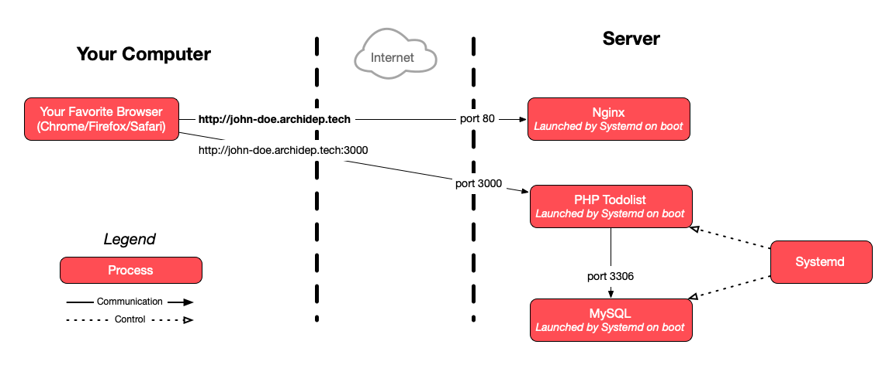
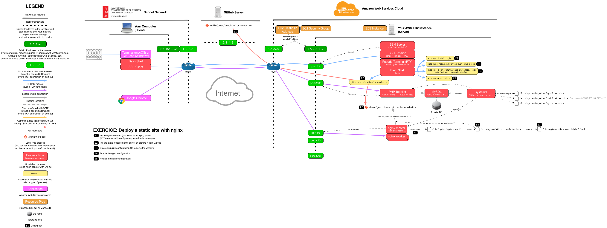

# Deploy a static site with nginx

The goal of this exercise is to deploy a static website (only HTML, JavaScript
and CSS) with [nginx][nginx].

<!-- START doctoc generated TOC please keep comment here to allow auto update -->
<!-- DON'T EDIT THIS SECTION, INSTEAD RE-RUN doctoc TO UPDATE -->

- [Legend](#legend)
- [:gem: Requirements](#gem-requirements)
- [:exclamation: Put the static website on the server](#exclamation-put-the-static-website-on-the-server)
- [:exclamation: Create an nginx configuration file to serve the website](#exclamation-create-an-nginx-configuration-file-to-serve-the-website)
  - [:exclamation: Enable the nginx configuration](#exclamation-enable-the-nginx-configuration)
  - [:exclamation: Reload the nginx configuration](#exclamation-reload-the-nginx-configuration)
- [:exclamation: See it in action](#exclamation-see-it-in-action)
- [:checkered_flag: What have I done?](#checkered_flag-what-have-i-done)
  - [:classical_building: Architecture](#classical_building-architecture)
- [:boom: Troubleshooting](#boom-troubleshooting)
  - [:boom: `[emerg] could not build the server_names_hash, you should increase server_names_hash_bucket_size`](#boom-emerg-could-not-build-the-server_names_hash-you-should-increase-server_names_hash_bucket_size)
  - [:boom: The nginx configuration is correct but I get an error page in the browser](#boom-the-nginx-configuration-is-correct-but-i-get-an-error-page-in-the-browser)
    - [:boom: 403 Forbidden](#boom-403-forbidden)
    - [:boom: 404 Not Found](#boom-404-not-found)

<!-- END doctoc generated TOC please keep comment here to allow auto update -->

## Legend

Parts of this guide are annotated with the following icons:

- :exclamation: A task you **MUST** perform to complete the exercise.
- :question: An optional step that you _may_ perform to make sure that
  everything is working correctly.
- :warning: **Critically important information about the exercise.**
- :gem: Tips on the exercise, reminders about previous exercises, or
  explanations about how this exercise differs from the previous one.
- :space_invader: More advanced tips on how to save some time.
- :books: Additional information about the exercise or the commands and tools
  used.
- :checkered_flag: The end of the exercise.
  - :classical_building: The architecture of what you deployed during the
    exercise.
- :boom: Troubleshooting tips: how to fix common problems you might encounter.

## :gem: Requirements

This guide assumes that you are familiar with [reverse proxying][slides] and
that you have completed the [previous DNS configuration exercise][previous-ex],
where you configured an A record for your server in the domain name system.

## :exclamation: Put the static website on the server

It is suggested that you use the provided [HTML, JavaScript and CSS
clock][repo], but you could deploy any other static HTML website.

**Connect to your server**, then clone the following repository into your home
directory: https://github.com/MediaComem/static-clock-website

Make sure the files are there:

```bash
$> ls static-clock-website
index.html  README.md  script.js  style.css
```

## :exclamation: Create an nginx configuration file to serve the website

Make sure you have nginx installed [as shown during the course][nginx-install].

Create an nginx configuration file for the website. You may name the file
`clock` and put it in nginx's `/etc/nginx/sites-available` directory. You can do
that with nano or Vim. You will need to use `sudo` as that directory is only
writable by `root`.

Take the static configuration that was [presented during the
course][nginx-static-conf] and put it in the file. You should modify it to:

- Use the subdomain you configured for your server during the previous DNS
  exercise (e.g. `john-doe.archidep.ch`).

  > :gem: This is done by customizing [nginx's `server_name`
  > directive](http://nginx.org/en/docs/http/server_names.html) in your `server`
  > block. Read [How nginx processes a
  > request](http://nginx.org/en/docs/http/request_processing.html) if you want
  > to know more.

- Serve the files in the repository you just cloned.

  > :gem: This is done by customizing [nginx's `root`
  > directive](http://nginx.org/en/docs/http/ngx_http_core_module.html#root).
  > You can learn more about it in the [Serving Static Content section of the
  > nginx Beginner's
  > Guide](http://nginx.org/en/docs/beginners_guide.html#static).

### :exclamation: Enable the nginx configuration

By default, configurations stored in the `sites-available` directory are
available, but not enabled.

> :books: Indeed, if you check what is included by the main
> `/etc/nginx/nginx.conf` file, you will see that `sites-enabled` is there, but
> not `sites-available`:
>
> ```bash
> $> cat /etc/nginx/nginx.conf | grep include
> include /etc/nginx/modules-enabled/*.conf;
> include /etc/nginx/mime.types;
> include /etc/nginx/conf.d/*.conf;
> include /etc/nginx/sites-enabled/*;
> ```
>
> :books: The command pipeline above uses `cat` and `grep` to print all the
> lines which contain the word "include" in the specified file.

To enable a configuration file, the convention is to create a symbolic link in
`sites-enabled`, which points to the actual configuration file in
`sites-available`. This allows you to work on your configuration for a while
before enabling it.

Enable the `clock` configuration by creating the correct symbolic link:

```bash
$> sudo ln -s /etc/nginx/sites-available/clock /etc/nginx/sites-enabled/clock
```

Make sure the symbolic link points to the correct file:

```bash
$> ls -l /etc/nginx/sites-enabled/clock
lrwxrwxrwx 1 root root 32 Jan 10 17:07 /etc/nginx/sites-enabled/clock -> /etc/nginx/sites-available/clock
```

### :exclamation: Reload the nginx configuration

Nginx does not automatically reload its configuration files when they change.

First, you should check whether the changes you have made are valid. The `nginx
-t` command loads all the nginx configuration (including files added with
`include`) and checks that they are valid:

```bash
$> sudo nginx -t
nginx: the configuration file /etc/nginx/nginx.conf syntax is ok
nginx: configuration file /etc/nginx/nginx.conf test is successful
```

> :gem: If an error occurs here, you may have made a mistake in the
> configuration. (See [Troubleshooting](#boom-troubleshooting) if you get an
> error about `server_names_hash_bucket_size`.)

Nginx reloads its configuration [when it receives the `HUP`
signal][nginx-signals]. You could find the process ID of the `nginx` master
process and send the signal with `kill -s HUP <ID>`. However, the `nginx`
command helpfully allows you to do that in a much simpler way:

```bash
$> sudo nginx -s reload
```

> You can also do the same thing through systemd with the following command:
> `sudo systemctl nginx reload`. This will also ask nginx to reload its
> configuration.

If the command indicates no errors, nginx should have reloaded its
configuration.

## :exclamation: See it in action

Visit the subdomain of your server, e.g. http://john-doe.archidep.ch
(replacing `john-doe` with your username) and you should see the website
working.

## :checkered_flag: What have I done?

You have configured nginx to act as a web server to serve static content (HTML,
JavaScript and CSS that can be sent unmodified to the client) under your custom
subdomain.

You can serve any static web content this way. You can also make nginx serve as
many separate websites as you want under different domains by creating multiple
configuration files with different `server_name` directives, all on the same
server (your Azure instance).

### :classical_building: Architecture

This is a simplified architecture of the main running processes and
communication flow at the end of this exercise:



> [Simplified architecture PDF version](nginx-static-deployment-simplified.pdf).

The following diagram is a more detailed representation also including the
short-lived processes run during the exercise:



> [Detailed architecture PDF version](nginx-static-deployment.pdf).

## :boom: Troubleshooting

Here's a few tips about some problems you may encounter during this exercise.

### :boom: `[emerg] could not build the server_names_hash, you should increase server_names_hash_bucket_size`

If you get an error about `server_names_hash_bucket_size`, it may be because
your domain name (the value of your `server_name` directive) is too long for
nginx's default settings.

In that case, edit the main nginx configuration with `sudo nano
/etc/nginx/nginx.conf` and add the following line **in the `http` section**:

```
server_names_hash_bucket_size 256;
```

### :boom: The nginx configuration is correct but I get an error page in the browser

If your nginx configuration is syntactically correct (i.e. `sudo nginx -t` shows
no error) but you still get an error page in the browser, you can take a look at
the nginx error log to see if it helps identify the issue:

```bash
$> sudo cat /var/log/nginx/error.log
```

Also take a look at the following subsections depending on the error you see in
your browser.

#### :boom: 403 Forbidden

If you get a 403 Forbidden error, it usually means that nginx has insufficient
permissions to access the directory you have specified with the `root` directive
(or the `index.html` file in that directory). Make sure that the `www-data` user
nginx is running as can access all the directories in the `root` you have
specified.

If you have Ubuntu 22+, this may be due to the fact that the permissions of your
Unix user's home directory are more restrictive than in the past. You can check
whether this is the case by listing all home directories with their permissions:

```bash
$> ls -la /home
total 16
drwxr-xr-x  4 root      root      4096 Oct 19 13:01 .
drwxr-xr-x 19 root      root      4096 Nov 23 11:23 ..
drwxr-x--- 15 john_doe  john_doe  4096 Nov 23 15:34 john_doe
```

If the permissions of your home directory are `drwxr-xr-x`, then this solution
does not apply to you. However, if the permissions are `drwxr-x---` like above,
then read on.

You should give permission to the `www-data` user (the user nginx runs as) to
access your home directory. You can do this by adding it to your group (replace
`john_doe` with your Unix username):

```bash
$> sudo usermod -a -G john_doe www-data
```

> :books: This is not necessarily the best solution from a security standpoint.
> It means that nginx will likely have read/execution access to all the
> directories and files owned by your user. This is probably more than it should
> have.
>
> The clean and secure solution would be to put the files in a dedicated
> directory with appropriate permissions, somewhere outside your home directory.
>
> For example, you could create a `/var/www/clock` directory owned by you and
> clone the repository there. If you don't want other users to access this
> directory, you could even restrict permissions further by making this
> directory owned by you and the `www-data` group (e.g. `sudo chown
> john_doe:www-data /var/www/clock`), and removing all permissions for other
> users (e.g. with `sudo chmod o-a /var/www/clock`).
>
> If you don't care about security at all `(ㆆ _ ㆆ)`, you can also simply
> revert the permissions of your home directory to what they would have been
> before, i.e. give access to everyone with `sudo chmod o+rx /home/john_doe`.

#### :boom: 404 Not Found

If you get a 404 Not Found error page, it usually means nginx cannot find a file
to serve (e.g. the `index.html` page) in the directory you have specified with
the `root` directive.

Are you sure that the value of your `root` directive is correct? Does that
directory actually exist?

[nginx]: http://nginx.org/
[nginx-install]: https://mediacomem.github.io/comem-archidep/2022-2023/subjects/reverse-proxy/?home=MediaComem%2Fcomem-archidep%23readme#18
[nginx-signals]: http://nginx.org/en/docs/control.html
[nginx-static]: https://docs.nginx.com/nginx/admin-guide/web-server/serving-static-content/
[nginx-static-conf]: https://mediacomem.github.io/comem-archidep/2022-2023/subjects/reverse-proxy/?home=MediaComem%2Fcomem-archidep%23readme#28
[previous-ex]: dns-configuration.md
[repo]: https://github.com/MediaComem/static-clock-website
[slides]: https://mediacomem.github.io/comem-archidep/2022-2023/subjects/reverse-proxy/?home=MediaComem%2Fcomem-archidep%23readme#1
