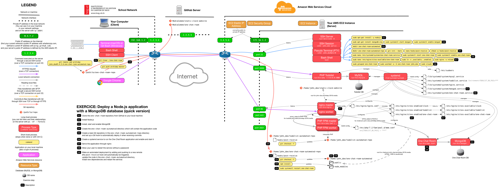

# Deploy a Node.js application with a MongoDB database

The goal of this exercice is to put in practice the knowledge acquired during previous exercices to deploy a new application from scratch on your server.

**This exercise is part of the course evaluation.**

<!-- START doctoc generated TOC please keep comment here to allow auto update -->
<!-- DON'T EDIT THIS SECTION, INSTEAD RE-RUN doctoc TO UPDATE -->


- [The goal](#the-goal)
  - [The application](#the-application)
- [Getting started](#getting-started)
- [Enable MongoDB to start at boot](#enable-mongodb-to-start-at-boot)
- [Create a systemd service](#create-a-systemd-service)
- [Serve the application through nginx](#serve-the-application-through-nginx)
- [Set up an automated deployment with Git hooks](#set-up-an-automated-deployment-with-git-hooks)
  - [Allow your user to restart the service without a password](#allow-your-user-to-restart-the-service-without-a-password)
  - [Test the automated deployment](#test-the-automated-deployment)
- [Complete the exercise](#complete-the-exercise)
- [End result](#end-result)

<!-- END doctoc generated TOC please keep comment here to allow auto update -->


## The goal

You must deploy the provided application in a similar way as the PHP todolist in previous exercises:

* You must install the language and database necessary to run the application,
  which are not the same as for the PHP todolist.
* You must run this application as a systemd service.
* You must serve this application through nginx acting as a reverse proxy.
* You must set up an automated deployment via Git hooks for this application.

Additionally:

* The application must be accessible **only through nginx**.
  It **must not** be exposed directly on a publicly accessible port
  (in the AWS virtual machines used in this course, the publicly accessible ports are 22, 80, 443, 3000 and 3001,
  some of them already used by SSH or nginx).

### The application

The application you must deploy is a [real-time chatroom demo][app].
Its code is [available on GitHub][repo].

It is developed with:

* [Node.js (server-side JavaScript)][node] for the backend
* [Vue.js (client-side JavaScript)][vue] for the frontend
* [MongoDB][mongo] for the database (a non-relational, [NoSQL][nosql] database)

You do not need to know any of these technologies,
as your goal is only to install and run the application, not modify it.


## Getting started

You should start by **forking** the [repository][repo] with the `Fork` button,
and use your own copy of the repository instead of the provided one.
This will make it easier for you to test the automated deployment at the end.

You may then want to start by performing the required setup as described in the [project's `README`][readme].
Where necessary, you will need to find installation instructions for Ubuntu (version 18.04 Bionic).

Before attempting to set up the systemd service, nginx configuration and automated deployment,
you might want to simply run the application manually to make sure it works.

You can do that with the following command on your server:

```bash
$> cd /path/to/application
$> PORT=3001 npm start
```

> We suggest you set the `PORT` environment variable to `3001` for this simple test,
> as that is one of the ports that should be open in your AWS virtual machine's firewall.

Visit http://1.2.3.4:3001 to check that it works (replacing `1.2.3.4` by your server's IP address).
Stop the application with `Ctrl-C` once you are done.

> Note that you did not need to configure database access credentials as with the PHP todolist.
> The application tries to connect to the `one-chat-room` MongoDB database [by default][default-db].
>
> It works out of the box for two reasons: MongoDB requires no user or password by default,
> and it's also a schema-less NoSQL database
> (databases and collections are created on-the-fly as they are accessed the first time).


## Enable MongoDB to start at boot

Run `sudo systemctl enable mongod`.


## Create a systemd service

Create and enable a systemd service file like in the [systemd exercise][systemd-ex],
with the following changes:

* Name the file `one-chat-room.service` instead of `todolist.service`.
* Update the `Description` parameter.
* Update the `ExecStart` parameter with the correct command to start the application
  (the production command indicated the the [project's `README`][readme]).

  * *Hint:* `ExecStart` only accepts absolute command paths.
    Use `which <command>` to find the absolute path of `<command>`.
* Update the `WorkingDirectory` parameter with the correct directory.
* Update the `Environment` parameter to set the `PORT` variable instead of the `TODOLIST_DB_PASS` variable.
  * *Hint:* you can use 3001 for tests (publicly accessible),
    but use 4000 (or any other port that is not exposed) to complete the exercice.
* Update the `After` parameter.
  * *Hint:* use `systemctl list-unit-files|grep mongo` to find the correct service.


## Serve the application through nginx

Create an nginx configuration to serve the application like in the [nginx PHP-FPM exercise][nginx-php-fpm-ex],
with the following changes:

* Skip all steps related to PHP FPM, since they are only valid for a PHP application.
* Name the nginx configuration file `one-chat-room` instead of `todolist`.
* Update the `server_name` directive to `chatroom.john-doe.archidep.online` instead of `todolist.john-doe.archidep.online`
  (replacing `john-doe` by your username).
* Update the `root` directive to the correct directory.
* Replace the `include` and `fastcgi_pass` directives by a `proxy_pass` directive.
  You can look at the example provided [presented during the course][nginx-rp-conf].
  Use the port number you configured at the previous step.


## Set up an automated deployment with Git hooks

Make it so that the application can be automatically deployed via a Git hook like in the [previous exercise][previous-ex],
with the following changes:

* Update the directory names (use `one-chat-room` instead of `todolist`).
* Update your `one-chat-room.service` systemd file to point to the new `one-chat-room-automated` directory.
  * Run `sudo systemctl daemon-reload` and `sudo systemctl restart one-chat-room` to restart the service.
* Update the `post-receive` hook.
  Compared to the PHP todolist, there are two additional steps which must be performed in the script for the application to run correctly:

  1. Dependencies must be installed with `npm install`.
  2. The systemd service must be restarted with `sudo systemctl restart one-chat-room`
     (Node.js code is not reinterpreted on-the-fly as with PHP; the process must be restarted so that the code is reloaded into memory).

### Allow your user to restart the service without a password

In order for the new `post-receive` hook to work,
your user must be able to run `sudo systemctl restart one-chat-room` without entering a password,
as that will not work well in a Git hook.

Create a `one-chat-room` Unix group:

```bash
$> sudo groupadd one-chat-room
```

Add your user to that group (replacing `john_doe` with your username):

```bash
$> sudo usermod -a -G one-chat-room john_doe
```

Make sure that your user has been added to the group successfully by looking for it in the `/etc/group` file:

```bash
$> cat /etc/group | grep one-chat-room
one-chat-room:x:1005:john_doe
```

Make sure your default editor is `nano` (or whichever you are more comfortable with):

```bash
$> sudo update-alternatives --config editor
```

Now you will edit the `sudoers` file to allow your user to run some specific commands without a password.

**WARNING: be VERY careful when editing the `sudoers` file, as you may corrupt your system if you introduce syntax errors.**

```bash
$> sudo visudo
```

Add the following line at the bottom of the file:

```
%one-chat-room ALL=(ALL:ALL) NOPASSWD: /bin/systemctl restart one-chat-room, /bin/systemctl status one-chat-room, /bin/systemctl start one-chat-room, /bin/systemctl stop one-chat-room
```

Exit with `Ctrl-X` and save when prompted.

> That line allows any user in the `one-chat-room` group to execute the listed commands with `sudo`
> without having to enter a password (hence the `NOPASSWD` option).

### Test the automated deployment

If you are using your own fork of the repository,
you can make and commit a change to test the automated deployment.

For example, the main title of the page is [in the file `views/components/app.pug`][one-chat-room-title].


## Complete the exercise

Send an email to the teacher with the URL to your deployed application.


## End result



> [PDF version](one-chat-room-deployment.pdf).


[app]: https://one-chat-room.herokuapp.com
[previous-ex]: git-automated-deployment.md
[default-db]: https://github.com/MediaComem/one-chat-room/blob/158d7ff1aaaf9bd760e395405c3e743e59f505e0/config.js#L4
[mongo]: https://www.mongodb.com
[nginx-php-fpm-ex]: nginx-php-fpm-deployment.md
[nginx-rp-conf]: https://mediacomem.github.io/comem-archidep/2020-2021/subjects/reverse-proxy/?home=MediaComem%2Fcomem-archidep%23readme#29
[node]: https://nodejs.org
[nosql]: https://en.wikipedia.org/wiki/NoSQL
[one-chat-room-title]: https://github.com/MediaComem/one-chat-room/blob/158d7ff1aaaf9bd760e395405c3e743e59f505e0/views/components/app.pug#L7
[readme]: https://github.com/mediacomem/one-chat-room#readme
[repo]: https://github.com/mediacomem/one-chat-room
[systemd-ex]: systemd-deployment.md
[vue]: https://vuejs.org
