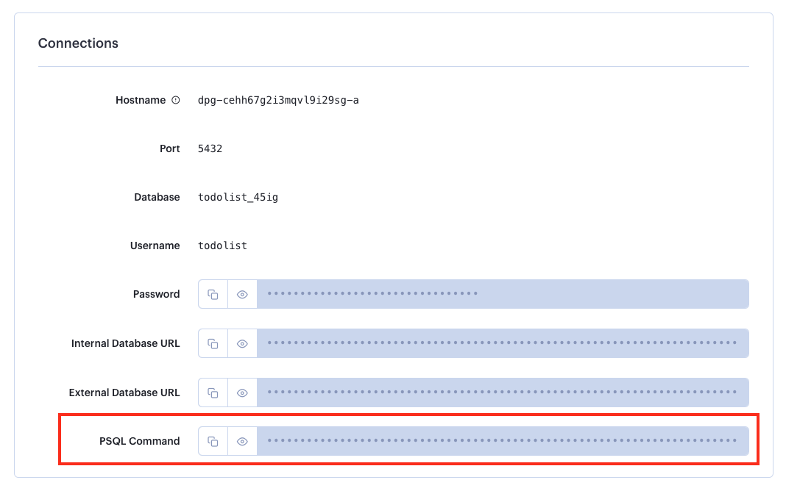

# Deploy web applications with a database to Render

The goal of this exercice is to deploy the same [PHP Todolist][repo] application as in previous exercises, but this time on the Render Platform-as-a-service (PaaS) cloud instead of your own server in the Infrastructure-as-a-Service (IaaS) Microsoft Azure Web Services cloud. This illustrates the difference between the two cloud service models.

<!-- START doctoc generated TOC please keep comment here to allow auto update -->
<!-- DON'T EDIT THIS SECTION, INSTEAD RE-RUN doctoc TO UPDATE -->

- [Legend](#legend)
- [:gem: Requirements](#gem-requirements)
- [:exclamation: Install PostgreSQL](#exclamation-install-postgresql)
  - [macOS](#macos)
  - [Windows](#windows)
- [:exclamation: Getting your Todolist fork up-to-date.](#exclamation-getting-your-todolist-fork-up-to-date)
  - [:exclamation: Add the upstream as a remote](#exclamation-add-the-upstream-as-a-remote)
  - [:exclamation: Fetch data from upstream](#exclamation-fetch-data-from-upstream)
  - [:exclamation: Push the new branch to GitHub](#exclamation-push-the-new-branch-to-github)
- [:exclamation: Create and configure a PostgreSQL Database on Render](#exclamation-create-and-configure-a-postgresql-database-on-render)
  - [:exclamation: Create a Render account](#exclamation-create-a-render-account)
  - [:exclamation: Create a PostgreSQL instance](#exclamation-create-a-postgresql-instance)
  - [:exclamation: Connect to the database and create tables](#exclamation-connect-to-the-database-and-create-tables)
- [:exclamation: Deploy the application](#exclamation-deploy-the-application)
  - [:exclamation: Create a Web Service](#exclamation-create-a-web-service)
  - [:exclamation: Define environment variables](#exclamation-define-environment-variables)
  - [:exclamation: Deploy the Web Service](#exclamation-deploy-the-web-service)
- [:checkered_flag: What have I done?](#checkered_flag-what-have-i-done)

<!-- END doctoc generated TOC please keep comment here to allow auto update -->

## Legend

Parts of this guide are annotated with the following icons:

- :exclamation: A task you **MUST** perform to complete the exercise.
- :question: An optional step that you _may_ perform to make sure that
  everything is working correctly.
- :warning: **Critically important information about the exercise.**
- :gem: Tips on the exercise, reminders about previous exercises, or
  explanations about how this exercise differs from the previous one.
- :space_invader: More advanced tips on how to save some time. Challenges.
- :books: Additional information about the exercise or the commands and tools
  used.
- :checkered_flag: The end of the exercise.
  - :classical_building: The architecture of what you deployed during the
    exercise.
- :boom: Troubleshooting tips: how to fix common problems you might encounter.

## :gem: Requirements

* [PostgreSQL][postgresql] 14.6

This guide assumes that you are familiar with [Git][git-slides] and that you
have a basic understanding of what a Platform-as-a-Service is.

:warning: **Work on your local machine, NOT your Azure server**. The goal of
this exercise is to deploy on [Render][render], not your own server, to
illustrate the difference between Platform-as-a-Service (PaaS) and
Infrastructure-as-a-Service (IaaS). Technically, you *could* do the exercise
from your server, but you would have to set up public key SSH authentication
all over again.

## :exclamation: Install PostgreSQL

PostgreSQL is a relational database management system that is very similar to
MySQL. We use it here because we can deploy it with one click on Render. Other
benefits of using PostgreSQL are performance, concurrency and SQL language
support. You will need to install PostgreSQL on your own machine in order to
access the remote instance hosted on Render using the `psql` command-line
interface. The installation procedure differs on macOS and Windows.

### macOS

To install PostgreSQL, you will be using [Homebrew][homebrew], the leading
package manager for Mac. You may install it directly from your terminal, by
entering:

```bash
$> /bin/bash -c "$(curl -fsSL https://raw.githubusercontent.com/Homebrew/install/HEAD/install.sh)"
```

Once this is done, you can easily install packages by writing `brew install`
followed by the name of the package:

```bash
$> brew install postgresql
```

Check that you have access to the `psql` command by entering:

```bash
$> psql --version
psql (PostgreSQL) 14.6 (Homebrew)
```
### Windows

Go to the [PostgreSQL downloads page][postgresql-downloads] and choose version
**14.6 for Windows x86-64**. Launch the installer and follow the installation
instructions. You can decide to install **only** the command-line tools. The
following instructions assume you installed Postgres in the default directory on
your C drive.

The installer does not take care of adding `psql` to your shell's path. You will
therefore add it manually. Open Git Bash and enter the following commands:

```bash
$> echo 'export PATH=$PATH:"/c/Program Files/PostgreSQL/14/bin/"' >> ~/.bashrc
$> source .bashrc
```

Check that you have access to the `psql` command by entering:

```bash
$> psql --version
psql (PostgreSQL) 14.6 (Homebrew)
```

## :exclamation: Getting your Todolist fork up-to-date.

When you started working on the Todolist application, you forked an existing
codebase from a GitHub repository. While you were working on your configuration,
the team with access to the original repository implemented the changes
necessary for a PaaS deployment in a branch called `docker-postgres`.

By default, your fork does not track changes from the original repo, which is
also commonly referred to as the **upstream**. Let's reconfigure our repository
so that it can fetch data from there.

:question: If you do not remember where the Todolist repository is stored on
your local machine, you can simply clone it again from GitHub by running `git
clone git@github.com:johndoe/comem-archidep-php-todo-exercise.git`. Don't
forget to replace `johndoe` with your GitHub username.

### :exclamation: Add the upstream as a remote

From the terminal, move into your repository and add the upstream repository as
a remote (this time, leave `MediaComem` in the URL, you *want* to use the
original URL and not your own):

```bash
$> cd comem-archidep-php-todo-exercise
$> git remote add upstream https://github.com/MediaComem/comem-archidep-php-todo-exercise.git
```

:gem: Unlike the [automated deployment exercise][automated-deployment-ex], you
will not be pushing to this remote. You couldn't anyway, as you are not a
collaborator on the upstream repository so you do not have the right to push.
Instead, you will use it to fetch up-to-date code from a branch.


### :exclamation: Fetch data from upstream

Fetch all commits from the upstream repository:

```bash
$> git fetch upstream
remote: Enumerating objects: 11, done.
remote: Counting objects: 100% (11/11), done.
remote: Compressing objects: 100% (6/6), done.
remote: Total 11 (delta 4), reused 11 (delta 4), pack-reused 0
Unpacking objects: 100% (11/11), 3.20 KiB | 545.00 KiB/s, done.
From https://github.com/MediaComem/comem-archidep-php-todo-exercise
 * [new branch]      docker-postgres -> upstream/docker-postgres
 * [new branch]      main            -> upstream/main
```

As you can see, this gives you access to upstream branches, including one called
`upstream/docker-postgres`. With the next command you will copy the content of
that upstream branch into your own branch.

```bash
$> git switch -c docker-postgres upstream/docker-postgres
branch 'docker-postgres' set up to track 'upstream/docker-postgres'.
Switched to a new branch 'docker-postgres'
```

This command will create a new branch in **your** local repository, based on the
contents of the upstream branch. This command automatically switches you to the
new branch. If you browse through the project in a code editor or by using
`cat`, you should now be able to see changes to `todolist.sql`, as well as a
mysterious new `Dockerfile`.

> :books: Docker is a tool designed to make it easier to create, deploy, and run
> applications by using containers. Containers allow a developer to package up
> an application with all of the parts it needs, such as libraries and other
> dependencies, and ship it all out as one package. A Dockerfile is a text file
> that contains instructions for how to build a Docker image. Docker is beyond
> the scope of this course, but you can learn more [on the Docker
> website][docker].

### :exclamation: Push the new branch to GitHub

 ```bash
 $> git push origin
 ...
  * [new branch]      docker-postgres -> docker-postgres
 ```

 You can go check on GitHub whether your new branch has been pushed, by
 displaying the branch dropdown:

 

:gem: Let's note that this whole step has nothing to do with PaaS deployments in
and of themselves. It is just a corollary of some code changes that had to be
made for the Todolist to work with Postgres and Docker.

## :exclamation: Create and configure a PostgreSQL Database on Render

Instead of manually configuring a Linux server, you will be provisioning a
couple of services on Render. The first is a PostgreSQL Database.

### :exclamation: Create a Render account

Start by creating a [new Render account][render-register]. If you chose to
register using GitHub, you will be able to skip linking these two accounts
together later:


### :exclamation: Create a PostgreSQL instance

Sign-in to your Render account and click the **new PostgreSQL** button:

 

:warning: **You can only have 1 active PostgreSQL deployment in the free Render
tier. If you want more, you gotta pay.**

This will take you to the following setup page, where you will need to
configure:

- A name for your deployment
- A name for the database
- A username
- The region where the database is deployed (pick the one closest to your
  customers).

**A password will be automatically generated for you.**


When you are done, click **Create Database** and your PostgreSQL database will
be provisioned automatically. Be patient, this process can take a few minutes.
Once it is deployed you will be taken to a page with information pertaining to
your new database and you should see the following:


### :exclamation: Connect to the database and create tables

At this point, you have a database. Congratulations. But you still need to set
its tables up. As you did in the first Todolist tutorial, you will be running
the `todolist.sql` script on the database, albeit remotely.

> :books: The script is a bit different because than the previous one because of
> two factors: First, we are using PostgreSQL instead of MySQL. Second, we do
> not need to create a database. As a matter of fact, this script is a bit
> simpler than the previous one.

Go back to your terminal and make sure you are in your repository and on the
`docker-postgres` branch:

```bash
$> git branch --show-current
docker-postgres
```

If not, check out the correct branch with the `git switch docker-postgres`
command.

Next, connect to your PostgreSQL database from the command line. On the Render
dashboard, you should be able to see a **Connections** section. This is where
all the connection information to your database lives. You will need this
information more than once, so keep this tab open.

The information you need to connect to the database shell is located in the
**PSQL Command** field. You can display or copy the contents of this field by
clicking the icons to the left of the hidden characters.



Copy and paste the command in your terminal. This will connect you directly to
the remote database deployed by Render.

```bash
$> PGPASSWORD=your_password psql -h your_host.frankfurt-postgres.render.com -U your_user your_database
psql (14.6 (Homebrew), server 15.1)
WARNING: psql major version 14, server major version 15.
         Some psql features might not work.
SSL connection (protocol: TLSv1.3, cipher: TLS_AES_128_GCM_SHA256, bits: 128, compression: off)
Type "help" for help.

your_database=>
```

You can now execute the `todolist.sql` file:

```bash
your_database=> \i todolist.sql

CREATE TABLE
```

> :gem: You can make sure the script worked by displaying all the `todo` table's
> columns:

> ```bash
> your_database=> \d+ todo
>
>    Column   |            Type             |             Default              | Storage  |
> ------------+-----------------------------+----------------------------------+----------
>  id         | integer                     | nextval('todo_id_seq'::regclass) | plain    |
>  title      | character varying(2048)     |                                  | extended |
>  done       | boolean                     | false                            | plain    |
>  created_at | timestamp without time zone | CURRENT_TIMESTAMP                | plain    |
>
> ```

Now quit the Postgres shell by entering `\q`.

## :exclamation: Deploy the application

Now that you have a database in place, it is time to deploy the web application
itself.

### :exclamation: Create a Web Service

From your Render dashboard, hover over the purple **"new"** button and select
**Web Service**.


Render web services need to be connected to a Git repository hosted either on
GitHub or GitLab. This step will allow you to automate deployments from your
codebase. Instead of manually setting up hooks like in the [Automated Deployment
exercise][automated-deployment-ex], you will rely on Render to take care of this
for you.

> :books: Similar to GitHub, [GitLab][Gitlab] is both version control platform
> that allows developers to manage and track changes to their codebase. They
> both use the Git version control system. Although they share the majority of
> their feature sets, GitLab can be self-hosted, which means that you can
> install and run it on your own servers. This can be useful for organizations
> that want to have more control over their infrastructure or that have specific
> security or compliance requirements.

If you are signed up using GitHub, you should see a list of all the repositories
that can be used to create a web service. If not, you will need to follow the
procedure to link your GitHub account to Render. Choose to appropriate
repository for the purposes of this deployment and click **connect**.


> :books: As you can see, you can connect any public Git repository to Render by
> entering an URL in the field below.

Once you have connected the repository, you will need to configure the
deployment. Make sure you set the following basic options up:

- A name for your web service.
- The region where the service is deployed (pick the one closest to your
  customers).
- The branch from your repository that should be deployed (`docker-postgres`).
- The runtime environment (should automagically have Docker selected).
- The pricing tier.


### :exclamation: Define environment variables

In addition to these basic options, we will directly set up our environment
variables on this page. Scroll down a bit and click the **Advanced** button.
From there, you can add an arbitrary amount of envionment variables. You will
use the following ones to connect you application to the PostgreSQL database you
created earlier. All of the values can be found in the connection panel of your
database's dashboard:

| Environment variable | Description                                               |
| :------------------- | :-------------------------------------------------------- |
| `DB_HOST`            | The host at which the PostgreSQL database can be reached. |
| `DB_PORT`            | The port at which the PostgreSQL database can be reached. |
| `DB_NAME`            | The name of the PostgreSQL database.                      |
| `DB_USER`            | The PostgreSQL user to connect as.                        |
| `DB_PASS`            | The password of the PostgreSQL user.                      |


> :books: You can also store secret files (like .env or .npmrc files and private
> keys) in Render. These files can be accessed during builds and in your code
> just like regular files. You can upload those right in this configuration
> panel or from the service's dashboard, post-deployment.

### :exclamation: Deploy the Web Service

Once you are done configuring your deployment, you may click the **Create Web
Service** button at the bottom of the page. This will take you to the deployment
page, where you will be able to follow along the logs and discover the domain
Render has attributed to your app.


Once the deployment has succeeded, you will be able to visit the todolist at the
URL provided Render. You may also use a custom domain by following [this
tutorial][render-custom-domains].

> :warning: **This is a free service, so there are some obvious limitations.**
>
> First, deploys are slooooooow. Second, bandwidth and running hours are
> limited. Third, your service will shut down if there is no activity for more
> than 15 minutes: This can cause a response delay of up to 30 seconds for the
> first request that comes in after a period of inactivity.
>
> Learn more about the limits of free Render accounts [here][render-limits].

## :checkered_flag: What have I done?

A whole lot! By using Render, GitHub and Docker, you automated a bunch of things
that were done manually in the previous exercises. Here's what was configured
for you:

- Process management with Docker & PHP-FPM
- Reverse proxying with nginx
- TLS/SSL encryption
- Automated deployment

But this isn't magic, it's building of the work of others:

- First, there's the `Dockerfile`. It may not seem like a whole lot, but if you
  look at the first line, you might notice that we are importing something from
  [`richarvey/nginx-php-fpm`][nginx-php-fpm]. This is actually a popular (and
  fairly complex) Dockerfile build by somebody else. This is what automatically
  sets up PHP-FPM and nginx for us.
- Second, there's Render: despite it's limitations in the free tier, we are
  getting free hosting, automated deployments and encryption.
- Finally, there's GitHub whose API allows the connection between your repo and
  Render to be very very easily configured.

> **"If I have seen further, it is by standing on the shoulders of giants."**
>
> - Isaac Newton

Most of the technology and software that we have used throughout this course has
been made possible by the contributions of others in the open community.
Consider how you can contribute to open source projects by submitting code,
writing documentation or reporting bugs and issues.


[automated-deployment-ex]: https://github.com/MediaComem/comem-archidep/blob/main/ex/git-automated-deployment.md
[docker]: https://www.docker.com/
[gitlab]: https://about.gitlab.com/
[git-slides]: https://mediacomem.github.io/comem-archidep/2024-2025/subjects/git/?home=MediaComem%2Fcomem-archidep%23readme#1
[homebrew]: https://brew.sh/
[nginx-php-fpm]: https://github.com/richarvey/nginx-php-fpm
[postgresql]: https://www.postgresql.org/
[postgresql-downloads]: https://www.enterprisedb.com/downloads/postgres-postgresql-downloads
[render]: https://render.com
[render-custom-domains]: https://render.com/docs/custom-domains
[render-limits]: https://render.com/docs/free#free-web-services
[render-register]: https://dashboard.render.com/register
[repo]: https://github.com/MediaComem/comem-archidep-php-todo-exercise
