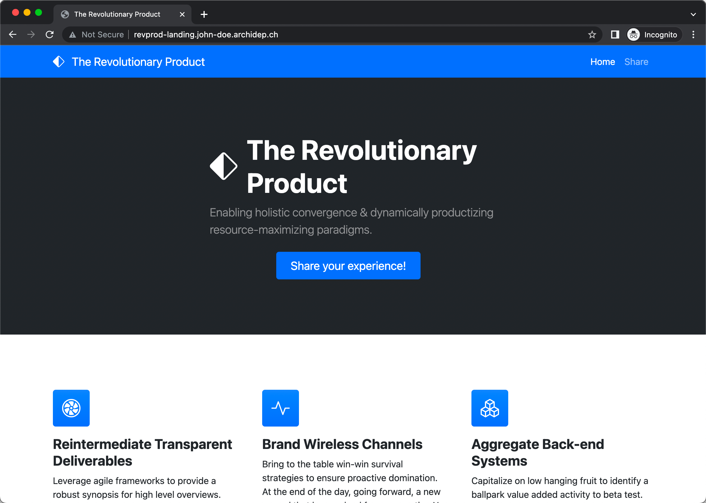
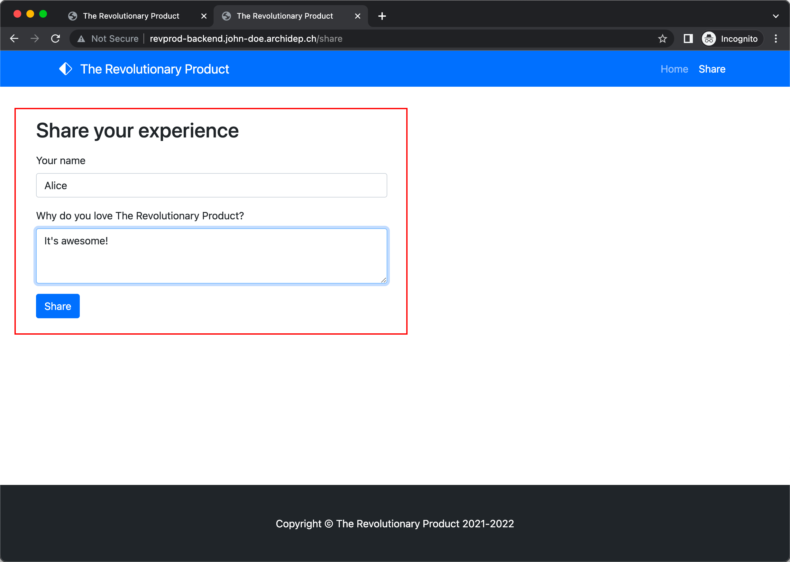
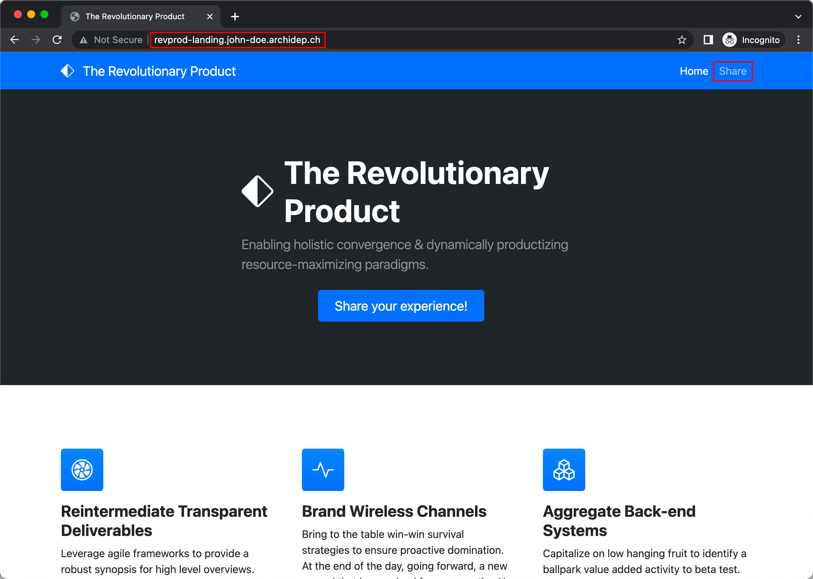
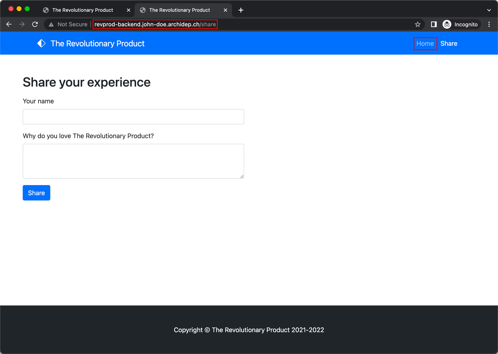
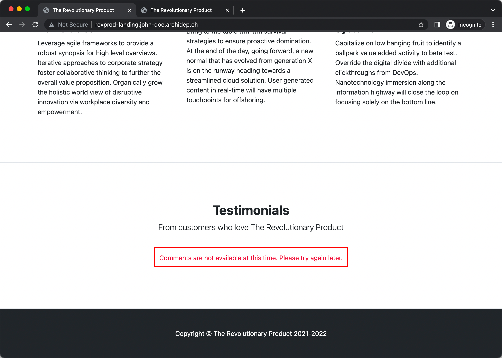
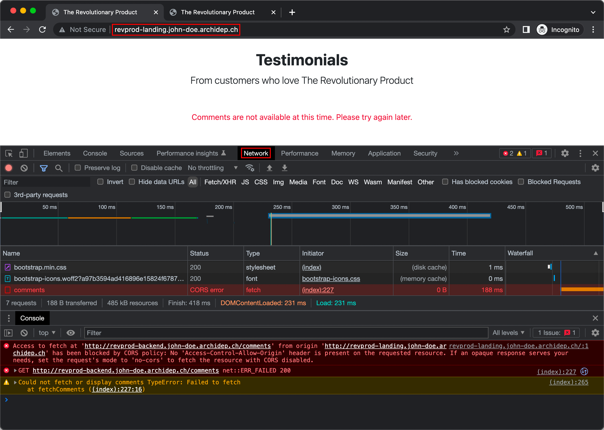
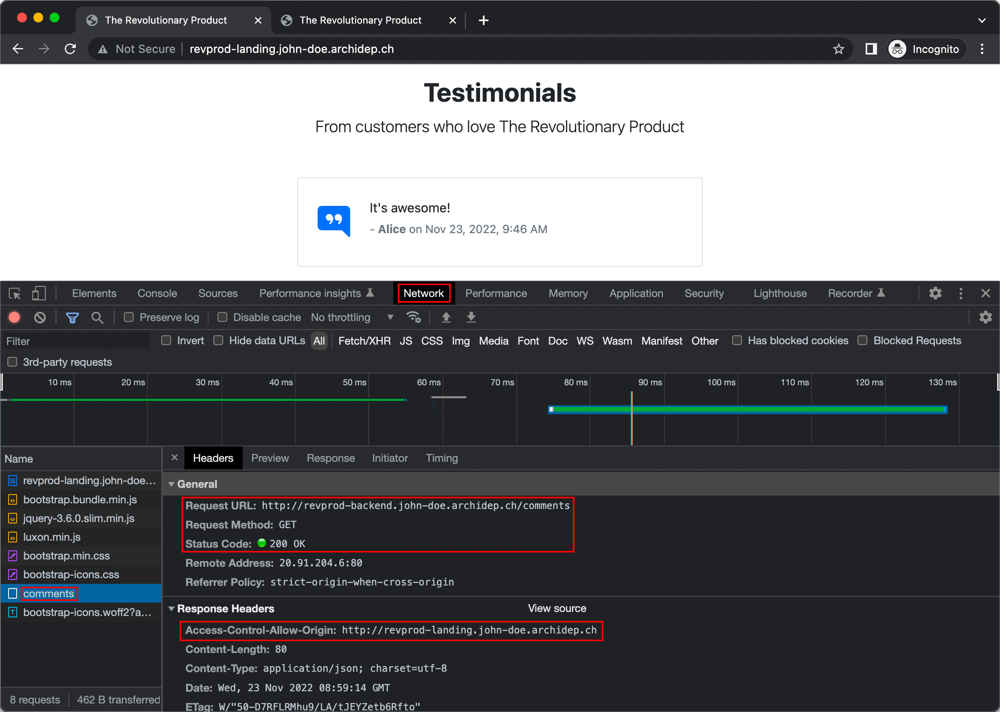
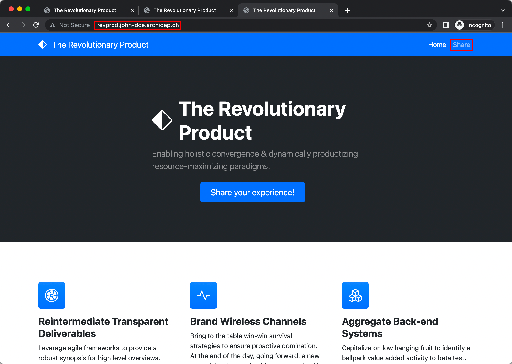
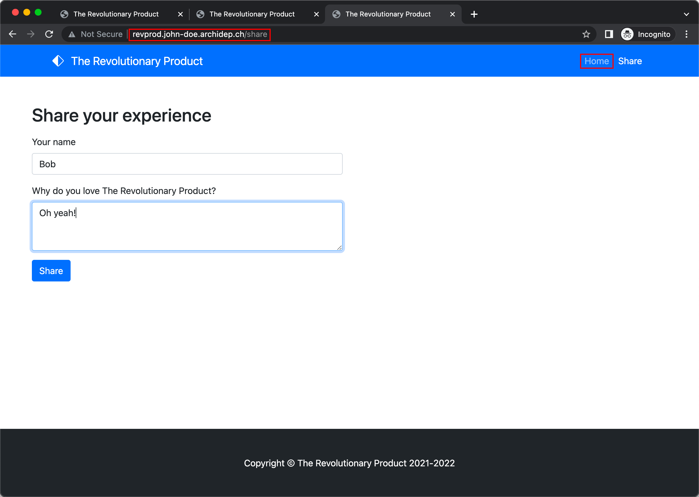
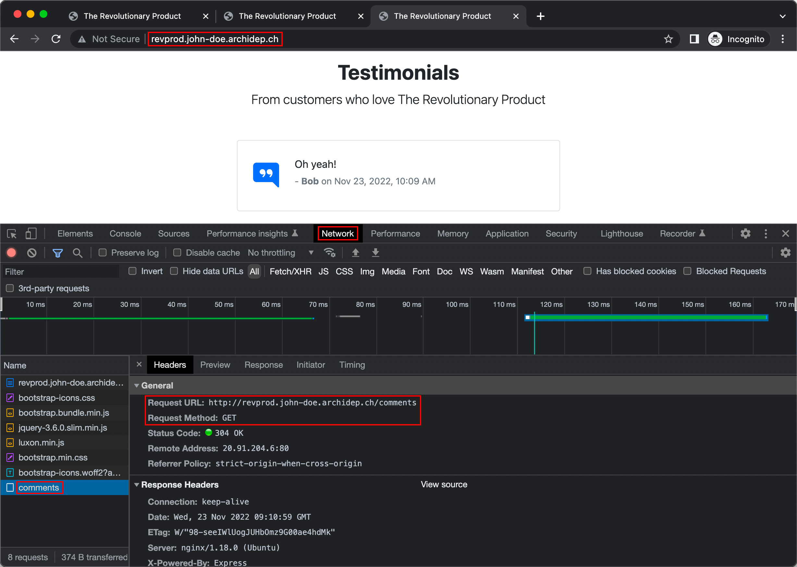

# Deploy a multi-component web application with nginx

The goal of this exercise is to understand the challenges of deploying a
multi-component web application, and how a reverse proxy like nginx can help.

This guide assumes that you are familiar with [reverse proxying][slides], that
you have nginx installed and running on a server, and that you have a DNS
wildcard entry preconfigured to make various subdomains
(`*.john-doe.archidep.tech` in this guide) point to that server.

<!-- START doctoc generated TOC please keep comment here to allow auto update -->
<!-- DON'T EDIT THIS SECTION, INSTEAD RE-RUN doctoc TO UPDATE -->

- [Requirements](#requirements)
- [The application](#the-application)
- [Deploy the components separately](#deploy-the-components-separately)
  - [Deploy the revprod landing page](#deploy-the-revprod-landing-page)
  - [Deploy the revprod backend](#deploy-the-revprod-backend)
- [It's not working!](#its-not-working)
- [Using Cross-Origin Request Sharing (CORS)](#using-cross-origin-request-sharing-cors)
  - [Disabling CORS](#disabling-cors)
- [Using nginx to make both components appear as a single website](#using-nginx-to-make-both-components-appear-as-a-single-website)
- [Troubleshooting](#troubleshooting)

<!-- END doctoc generated TOC please keep comment here to allow auto update -->

## Requirements

The following requirements should be installed on your server:

* [Node.js][node] 16.x ([installation instructions][node-install])

## The application

The application you will deploy is **Revprod**, a marketing web application
where customers can leave testimonials about **The Revolutionary Product**. This
application has been developed as two separate components:

* The [revprod landing
  page](https://github.com/MediaComem/revprod-landing-page): the main page of
  the application that describes the product and displays customers'
  testimonials.

  This component is basically a static page with no server-side logic. It loads
  testimonials from the backend using AJAX requests.
* The [revprod backend](https://github.com/MediaComem/revprod-backend): an
  application that allows customers to provide their testimonials.

  This component stores the customers' testimonials in an embedded file
  database.

> This separation is for the purposes of the exercise, but large applications
> are often split like this for various reasons.
>
> Some **advantages** of a multi-component application are that each component
> can be developed and deployed separately. Each componetn could be developed by
> a separate team, using their favorite programming language and tools, and each
> could deploy new versions of their component independently.
>
> The **disadvantages** are that it is more complex to manage the development
> and deployment of a multi-component application. Separate teams working
> together must agree on the API that the components use to communicate and not
> break that contract. On the deployment side, you have to make sure that you
> always deploy compatible versions of all components together.

## Deploy the components separately

Let's start by deploying the revprod backend and frontend separately at these
URLs (replacing `john-doe` with your name):

* `http://revprod-backend.john-doe.archidep.tech`
* `http://revprod-landing.john-doe.archidep.tech`

### Deploy the revprod landing page

Clone the landing page repository on your server and install the required
dependencies:

```bash
$> cd
$> git clone https://github.com/MediaComem/revprod-landing-page.git
$> cd revprod-landing-page
$> npm ci
```

Create a Systemd unit file named `/etc/systemd/system/revprod-landing.service`
(e.g. with `nano`) to execute this component:

```conf
[Unit]
Description=Landing page for The Revolutionary Product

[Service]
ExecStart=/usr/bin/node bin.js
WorkingDirectory=/home/john_doe/revprod-landing-page
Environment="REVPROD_LISTEN_PORT=4201"
# Public URL at which the backend can be accessed
Environment="REVPROD_BACKEND_BASE_URL=http://revprod-backend.john-doe.archidep.tech"
User=john_doe
Restart=on-failure

[Install]
WantedBy=multi-user.target
```

> Replace `john_doe` with your name in the `WorkingDirectory` and `User`
> options, as well as `john-doe` in the second `Environment` option indicating
> the URL of the landing page.

Enable and start your new service:

```bash
$> sudo systemctl enable revprod-landing
$> sudo systemctl start revprod-landing
```

> You can check that it is running with `sudo systemctl status revprod-landing`.

Create an nginx site configuration file
`/etc/nginx/sites-available/revprod-landing` (e.g. with `nano`) to expose this
component:

```conf
server {
  listen 80;
  server_name revprod-landing.john-doe.archidep.tech;
  root /home/john_doe/revprod-landing-page/public;

  location / {
    proxy_pass http://127.0.0.1:4201;
  }
}
```

> Replace `john-doe` with your name in the `server_name` directive, as well as
> `john_doe` in the `root` directive.

Enable that configuration with the following command:

```bash
$> sudo ln -s /etc/nginx/sites-available/revprod-landing /etc/nginx/sites-enabled/revprod-landing
```

Check and reload nginx's configuration:

```bash
$> sudo nginx -t
$> sudo nginx -s reload
```

You should then be able to access the revprod landing page at
http://revprod-landing.john-doe.archidep.tech.



### Deploy the revprod backend

Clone the backend repository on your server and install the required
dependencies:

```bash
$> cd
$> git clone https://github.com/MediaComem/revprod-backend.git
$> cd revprod-backend
$> npm ci
```

Create a Systemd unit file named `/etc/systemd/system/revprod-backend.service`
(e.g. with `nano`) to execute this component:

```conf
[Unit]
Description=Backend for The Revolutionary Product

[Service]
ExecStart=/usr/bin/node bin.js
WorkingDirectory=/home/john_doe/revprod-backend
Environment="REVPROD_LISTEN_PORT=4200"
# Public URL at which the frontend can be accessed
Environment="REVPROD_LANDING_PAGE_BASE_URL=http://revprod-landing.john-doe.archidep.tech"
User=john_doe
Restart=on-failure

[Install]
WantedBy=multi-user.target
```

> Replace `john_doe` with your name in the `WorkingDirectory` and `User`
> options, as well as `john-doe` in the second `Environment` option indicating
> the URL of the landing page.

Enable and start your new service:

```bash
$> sudo systemctl enable revprod-backend
$> sudo systemctl start revprod-backend
```

> You can check that it is running with `sudo systemctl status revprod-backend`.

Create an nginx site configuration file
`/etc/nginx/sites-available/revprod-backend` (e.g. with `nano`) to expose this
component:

```conf
server {
  listen 80;
  server_name revprod-backend.john-doe.archidep.tech;
  root /home/john_doe/revprod-backend/public;

  location / {
    proxy_pass http://127.0.0.1:4200;
  }
}
```

> Replace `john-doe` with your name in the `server_name` directive, as well as
> `john_doe` in the `root` directive.

Enable that configuration with the following command:

```bash
$> sudo ln -s /etc/nginx/sites-available/revprod-backend /etc/nginx/sites-enabled/revprod-backend
```

Check and reload nginx's configuration:

```bash
$> sudo nginx -t
$> sudo nginx -s reload
```

You should then be able to access the revprod backend at
http://revprod-backend.john-doe.archidep.tech.


Take the time to share your thoughts about The Revolutionary Product!



## It's not working!

If you have followed the instructions so far, you should be able to access the
revprod backend and landing page in your browser, you should be able to create
testimonials in the backend page.

Note that the URL switches from `http://revprod-landing.john-doe.archidep.tech`
to `http://revprod-backend.john-doe.archidep.tech` (and back) when you navigate
from the landing page to the Share page. The user can clearly see that these are
two separate sites.




But more importantly, **the testimonials are not displayed on the landing
page!**



If you open your browser's developer console, you should see an error that looks
something like this:

```
Cross-Origin Request Blocked: The Same Origin Policy disallows reading the
remote resource at http://revprod-backend.john-doe.archidep.tech/comments.
(Reason: CORS header ‘Access-Control-Allow-Origin’ missing). Status code: 200.
```



The landing page's AJAX request to fetch the comments from the backend has been
blocked by the browser because the request is to a different **origin**: the
landing page is at `http://revprod-landing.john-doe.archidep.tech` and is
attempting to access `http://revprod-backend.john-doe.archidep.tech` which is
another domain entirely.

This is called the [**Same-Origin Policy**][sop]. It is a critical security
mechanism that restricts how a document or script loaded by one origin can
interact with a resource from another origin.

It helps isolate potentially malicious documents, reducing possible attack
vectors. For example, it prevents a malicious website on the Internet from
running JS in a browser to read data from a third-party webmail service (which
the user is signed into) or a company intranet (which is protected from direct
access by the attacker by not having a public IP address) and relaying that data
to the attacker.

## Using Cross-Origin Request Sharing (CORS)

One way to solve this issue is with [Cross-Origin Request Sharing (CORS)][cors]:
the backend can use HTTP response headers to indicate to the frontend that it
can perform requests from a different origin.

> CORS relies on a mechanism by which browsers make a "preflight" request to the
> server hosting the cross-origin resource, in order to check that the server
> will permit the actual request.

The revprod backend already supports sending the appropriate CORS headers to
allow cross-origin requests. Update the Systemd unit file
`/etc/systemd/systemd/revprod-backend.service` for the backend and add the
[appropriate environment variables][revprod-backend-config] to the `[Service]`
section to enable CORS:

```conf
Environment="REVPROD_CORS=true"
Environment="REVPROD_CORS_ORIGINS=http://revprod-landing.john-doe.archidep.tech"
```

Reload the Systemd configuration and restart the backend service:

```bash
$> sudo systemctl daemon-reload
$> sudo systemctl restart revprod-backend
```

Refresh the revprod landing page at
http://revprod-landing.john-doe.archidep.tech again. The comments should work
this time!

If you look at your browser's developer console when refreshing the page, you
should see that the backend now sends the following header in the comments
response:

```
Access-Control-Allow-Origin: http://revprod-landing.john-doe.archidep.tech
```

Your browser knows to check this header and let the request through if the
origin matches.



### Disabling CORS

You should now disable CORS because we will explore another solution to this
problem during the rest of this exercise.

Update the Systemd unit file `/etc/systemd/systemd/revprod-backend.service` for
the backend and set the value of the `REVPROD_CORS` variable to false:

```conf
Environment="REVPROD_CORS=false"
```

Reload the Systemd configuration and restart the backend service:

```bash
$> sudo systemctl daemon-reload
$> sudo systemctl restart revprod-backend
```

Check that the comments no longer work by refreshing
http://revprod-landing.john-doe.archidep.tech.

> You may need to force a refresh by holding the Shift key.


## Using nginx to make both components appear as a single website

The problem we have is that our two components are deployed on separate domains,
therefore a request from the landing page to the backend is a **cross-origin
request** and is blocked by the **same-origin policy** by default.

*What if we had **only one domain**, and therefore only one origin?*

A reverse proxy like nginx is a very powerful tool. You have so far configured
two separate nginx sites with separate proxies to the backend and landing page,
but nothing says it has to be that way. You can actually configure one site to
proxy to both components depending on various criteria.

Let's assume that we want the revprod application (both the backend and the
landing page) to be accessible at one URL:
`http://revprod.john-doe.archidep.tech`.

Since the backend and landing page will be accessible at the same URL, we have
to update their configurations to reflect that fact. Update the Systemd unit
file `/etc/systemd/system/revprod-backend.service` for the backend and comment
out (or remove) the `REVPROD_LANDING_PAGE_BASE_URL` environment variable in the
`[Service]` section:

```conf
#Environment="REVPROD_LANDING_PAGE_BASE_URL=http://revprod-landing.john-doe.archidep.tech"
```

Do the same in the Systemd unit file
`/etc/systemd/system/revprod-landing.service` for the landing page for the
`REVPROD_BACKEND_BASE_URL` variable:

```conf
#Environment="REVPROD_BACKEND_BASE_URL=http://revprod-backend.john-doe.archidep.tech"
```

Reload Systemd's configuration and restart both services to take these changes
into account:

```bash
$> sudo systemctl daemon-reload
$> sudo systemctl restart revprod-backend
$> sudo systemctl restart revprod-landing
```

Create a new nginx site configuration file `/etc/nginx/sites-available/revprod`:

```conf
server {
  listen 80;
  server_name revprod.john-doe.archidep.tech;
  root /home/john_doe/revprod-landing-page/public;

  location ~ /(comments|share) {
    proxy_pass http://127.0.0.1:4200;
  }

  location / {
    proxy_pass http://127.0.0.1:4201;
  }
}
```

Note that this file has **two `location` blocks**:

* The `~ /(comments|share)` location block proxies all requests starting with
  either `/comments` or `/share`
  to the revprod backend.
* The `/` location block proxies all other requests to the revprod landing page.

> We are configuring **different proxies based on the request path**. This is
> just one example of how you can vary your site's configuration based on the
> request. For more information, read [Understanding Nginx Server and Location
> Block Selection Algorithms][nginx-server-and-location].

Enable the new configuration with the following command:

```bash
$> sudo ln -s /etc/nginx/sites-available/revprod /etc/nginx/sites-enabled/revprod
```

Check and reload nginx's configuration:

```bash
$> sudo nginx -t
$> sudo nginx -s reload
```

You should now be able to access the revprod application at
http://revprod.john-doe.archidep.tech and everything should work!

Note that your are no longer switching from
`http://revprod-landing.john-doe.archidep.tech` to
`http://revprod-backend.john-doe.archidep.tech` when navigating in the
application. Everything is served under `http://revprod.john-doe.archidep.tech`
because everything goes through nginx which then proxies it **internally** to
our separate components.




Neither the browser nor the user now have any idea that this application is in
fact composed of multiple components. To the outside world, it appears as one
application on one domain, thus also solving our original problem: there is no
longer any cross-origin request, so the same-origin policy does not apply.




## Troubleshooting

If you encounter the following error:

```
$> sudo nginx -t
nginx: [emerg] could not build server_names_hash, you should increase server_names_hash_bucket_size: 64
nginx: configuration file /etc/nginx/nginx.conf test failed
```

It may be because your domain name (the value of your `server_name` directive)
is too long for nginx's default settings. In that case, edit the main nginx
configuration with `sudo nano /etc/nginx/nginx.conf` and add the following line
**in the `http` section**:

```
server_names_hash_bucket_size 256;
```


## Architecture

This is a simplified architecture of the main running processes and
communication flow at the end of this exercise (after completing [all previous
course exercises][archidep-exercises]):


> [Simplified architecture PDF version](revprod-deployment-simplified.pdf).


[archidep-exercises]: https://github.com/MediaComem/comem-archidep#exercises
[cors]: https://developer.mozilla.org/en-US/docs/Web/HTTP/CORS
[nginx-server-and-location]: https://www.digitalocean.com/community/tutorials/understanding-nginx-server-and-location-block-selection-algorithms
[node]: https://nodejs.org
[node-install]: https://github.com/nodesource/distributions/blob/master/README.md
[revprod-backend-config]: https://github.com/MediaComem/revprod-backend#configuration
[slides]: https://mediacomem.github.io/comem-archidep/2022-2023/subjects/reverse-proxy/?home=MediaComem%2Fcomem-archidep%23readme#1
[sop]: https://developer.mozilla.org/en-US/docs/Web/Security/Same-origin_policy