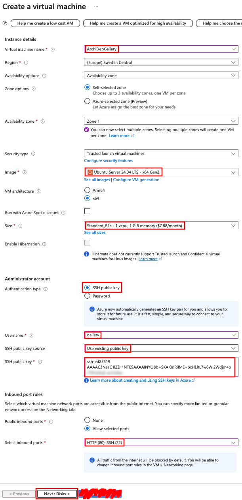

# Security: The Gallery

An exercise to illustrate a security flaw.

<!-- START doctoc generated TOC please keep comment here to allow auto update -->
<!-- DON'T EDIT THIS SECTION, INSTEAD RE-RUN doctoc TO UPDATE -->

- [Get your public SSH key](#get-your-public-ssh-key)
- [Launch a virtual server](#launch-a-virtual-server)
- [Set up the image gallery application](#set-up-the-image-gallery-application)

<!-- END doctoc generated TOC please keep comment here to allow auto update -->

## Get your public SSH key

You can display your public SSH key in your terminal with the following command:

```bash
$> cat ~/.ssh/id_rsa.pub
```

You should copy the output of this command. You will need it later.

## Launch a virtual server

You will launch a virtual server to deploy the vulnerable application.

- Access the [Azure portal](https://portal.azure.com) and go to the **Virtual
  machines** section:

  
- Create a new virtual machine with these settings, then go to the
  **Disks** settings:

  
- Keep the default **Disks** settings.

  Go to the **Networking** settings:

  
- In the **Networking** settings, enable the option to automatically **Delete
  public IP and NIC when VM is deleted**:

  
- Create the VM.

## Set up the image gallery application

Follow the [instructions in this
repository](https://github.com/MediaComem/comem-archidep-gallery).

**Be sure to do this on the gallery server you just launched.** You can connect
to it with `ssh gallery@W.X.Y.Z` (where `W.X.Y.Z` is the IP address of the
server, which you can find in the Azure portal).
