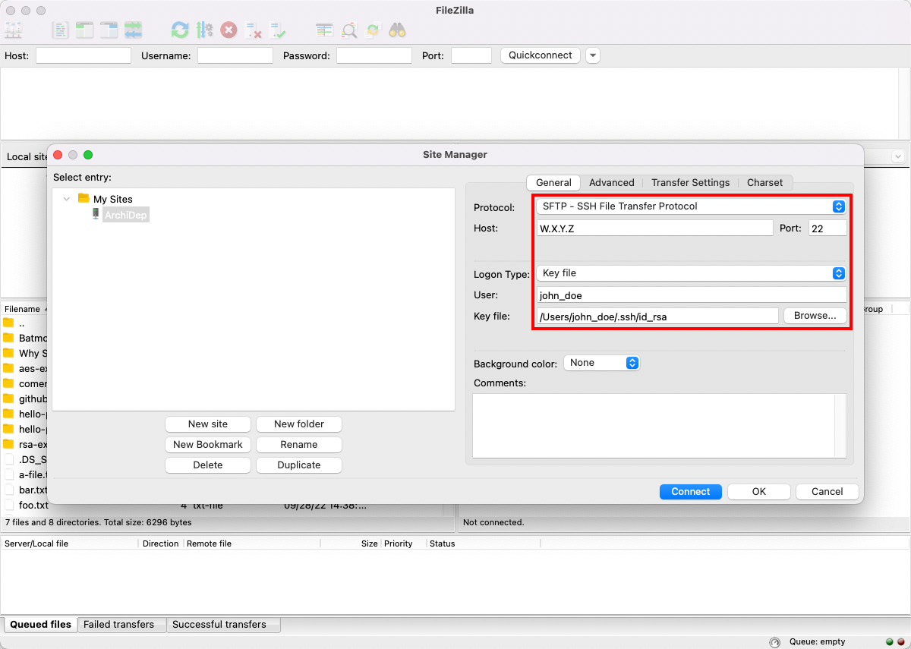

# Deploy a PHP application with SFTP

This guide describes how to deploy a PHP application over SFTP on a server with PHP and MySQL installed,
using the PHP development server.

<!-- START doctoc generated TOC please keep comment here to allow auto update -->
<!-- DON'T EDIT THIS SECTION, INSTEAD RE-RUN doctoc TO UPDATE -->

- [Legend](#legend)
- [:exclamation: Setup](#exclamation-setup)
  - [:exclamation: Install MySQL](#exclamation-install-mysql)
  - [:exclamation: Install PHP](#exclamation-install-php)
- [:exclamation: Use a real password](#exclamation-use-a-real-password)
- [:exclamation: Upload the application](#exclamation-upload-the-application)
- [:exclamation: Initialize the database](#exclamation-initialize-the-database)
  - [:question: Make sure it worked](#question-make-sure-it-worked)
- [:exclamation: Update the configuration](#exclamation-update-the-configuration)
- [:exclamation: Run the PHP development server](#exclamation-run-the-php-development-server)
- [:checkered_flag: What have I done?](#checkered_flag-what-have-i-done)
- [:boom: Troubleshooting](#boom-troubleshooting)
  - [:boom: `SET PASSWORD has no significance` error when running `mysql_secure_installation`](#boom-set-password-has-no-significance-error-when-running-mysql_secure_installation)
  - [:boom: Error running `todolist.sql`](#boom-error-running-todolistsql)
- [:books: Architecture](#books-architecture)

<!-- END doctoc generated TOC please keep comment here to allow auto update -->

## Legend

Parts of this guide are annotated with the following icons:

- :exclamation: A task you **MUST** perform to complete the exercise.
- :question: An optional step that you _may_ perform to make sure that
  everything is working correctly.
- :warning: **Critically important information about the exercise.**
- :gem: Tips on the exercise, reminders about previous exercises, or
  explanations about how this exercise differs from the previous one.
- :books: Additional information about the exercise or the commands and tools
  used.
- :space_invader: More advanced tips on how to save some time.
- :boom: Troubleshooting tips: how to fix common problems you might encounter.
- :checkered_flag: The end of the exercise.

## :exclamation: Setup

Use the previous PHP Todolist Exercice. Clone the [PHP Todolist
Exercice][php-todolist] on your machine if you do not have it. Be sure to use a
version with the 3 SQL queries implemented.

### :exclamation: Install MySQL

**Connect to your server with SSH.**

Update your package lists and install the MySQL database server:

```bash
$> sudo apt update

$> sudo apt install mysql-server
```

> :gem: When the installation of MySQL is complete, APT *may* prompt you to
> reboot and/or to restart outdated daemons (i.e. background services):
>
> 
>
> Simply select "Ok" by pressing the Tab key, then Enter to confirm.
>
> :books: This sometimes happens because most recent Linux versions have
> [unattended upgrades](linux-unattended-upgrades): a tool that automatically
> installs daily security upgrades on your server without human intervention.
> Sometimes, some of the background services running on your server may need to
> be restarted for these upgrades to be applied.
>
> Since you are installing a new background service (the MySQL server) which
> must be started, APT asks whether you want to apply upgrades to other
> background services by restarting them. Rebooting your server would also have
> the effect of restarting these services and applying the security upgrades.

APT should automatically start MySQL after installation. You can check this with
the following command:

```bash
$> sudo systemctl status mysql
```

Secure your installation by running the `mysql_secure_installation` tool that
comes with MySQL. It will ask you several questions to help you improve the
security of your MySQL installation:

```bash
$> sudo mysql_secure_installation

Securing the MySQL server deployment.

Connecting to MySQL using a blank password.

VALIDATE PASSWORD PLUGIN can be used to test passwords
and improve security. It checks the strength of password
and allows the users to set only those passwords which are
secure enough. Would you like to setup VALIDATE PASSWORD plugin?

Press y|Y for Yes, any other key for No: y

There are three levels of password validation policy:

LOW    Length >= 8
MEDIUM Length >= 8, numeric, mixed case, and special characters
STRONG Length >= 8, numeric, mixed case, special characters and dictionary file

Please enter 0 = LOW, 1 = MEDIUM and 2 = STRONG: 1
Please set the password for root here.

New password: ***
Re-enter new password: ***

Estimated strength of the password: 100
Do you wish to continue with the password provided?(Press y|Y for Yes, any other key for No) : y

By default, a MySQL installation has an anonymous user,
allowing anyone to log into MySQL without having to have
a user account created for them. This is intended only for
testing, and to make the installation go a bit smoother.
You should remove them before moving into a production
environment.

Remove anonymous users? (Press y|Y for Yes, any other key for No) : y
Success.

Normally, root should only be allowed to connect from
'localhost'. This ensures that someone cannot guess at
the root password from the network.

Disallow root login remotely? (Press y|Y for Yes, any other key for No) : y
Success.

By default, MySQL comes with a database named 'test' that
anyone can access. This is also intended only for testing,
and should be removed before moving into a production
environment.

Remove test database and access to it? (Press y|Y for Yes, any other key for No) : y
 - Dropping test database...
Success.

 - Removing privileges on test database...
Success.

Reloading the privilege tables will ensure that all changes
made so far will take effect immediately.

Reload privilege tables now? (Press y|Y for Yes, any other key for No) : y
Success.

All done!
```

### :exclamation: Install PHP

Here you will install the bare minimum:

- The PHP FastCGI process manager.
- The PHP MySQL extension.

Simply run this command to install both:

```bash
$> sudo apt install php-fpm php-mysql
```

> :books: Traditionally, PHP is deployed using the [Apache web server][apache],
> which is a generic [web server][web-server] and [reverse proxy][reverse-proxy]
> but is also capable of executing PHP code. To simplify things in this
> exercise, we will not install Apache, but instead execute the PHP application
> directly from the command line using the simpler [PHP development
> server][php-dev-server].

## :exclamation: Use a real password

The `todolist.sql` files creates a `todolist` user with the password
`chAngeMeN0w!` by default. You should change the password to a more secure
value. Make sure that the password you choose is strong enough per the minimum
password requirements you chose when you secured the MySQL installation.

> :books: It is good practice to create a different user and password for each
> application that connects to the MySQL database server. That way, if one of
> the applications is compromised, it cannot access or modify the databases of
> the other applications (provided you configured appropriate access
> privileges).
>
> Notably, you should never use the MySQL root password to connect an
> application to its database. You, the system administrator, should be the only
> person who knows that password.

## :exclamation: Upload the application

**On your local machine**, use an SFTP client like [FileZilla][filezilla] to
upload the application to the server.

Connect the SFTP client to your server using SSH public key authentication. In
FileZilla, open the Site Manager and configure your connection like this:



> :gem: You must select your **private key** (`id_rsa` and not `id_rsa.pub`) in
> FileZilla. The server you are connecting to has your public key. Just like
> when you use SSH on the command line, FileZilla will use your private key to
> prove to the server that you are the owner of your public key.
>
> :gem: On macOS, you can display hidden files and directories (like `.ssh` in
> your home directory) with the shortcut `Cmd-Shift-.`.
>
> :gem: On Windows, FileZilla may ask you to convert your private key to another
> format. You can do so.

Once you are connected to your server with your SFTP client, copy the
application to `/home/john_doe/todolist` (replacing `john_doe` with your Unix
username).

In FileZilla, you can simply drag-and-drop the directory from your machine on
the left to the server on the right. You can then rename it if necessary.

## :exclamation: Initialize the database

**Connect to your server** and go into the uploaded directory:

```bash
$> hostname
john-doe.archidep.ch

$> cd ~/todolist
```

Execute the project's SQL file to create the database and table (it will ask you
for the MySQL root user's password you defined earlier):

```bash
$> sudo mysql < todolist.sql
```

### :question: Make sure it worked

To make sure everything worked, you can check that the table was created in the
MySQL database server. You do not have a phpMyAdmin web interface to administer
the database server, since you are installing everything on your server
yourself, and you did not install that.

Use the following command and SQL queries to first connect to the MySQL database
server as the administrator (the MySQL `root` user), then display the `todo`
table's schema:

```bash
$> sudo mysql

> connect todolist;

> show create table todo;
+-------+----------------------------------------------------+
| Table | Create Table                                       |
+-------+----------------------------------------------------+
| todo  | CREATE TABLE `todo` (
  `id` bigint(20) NOT NULL AUTO_INCREMENT,
  `title` varchar(2048) NOT NULL,
  `done` tinyint(1) NOT NULL DEFAULT '0',
  `created_at` timestamp NOT NULL DEFAULT CURRENT_TIMESTAMP,
  PRIMARY KEY (`id`)
) ENGINE=InnoDB AUTO_INCREMENT=3 DEFAULT CHARSET=latin1 |
+-------+----------------------------------------------------+
1 row in set (0.00 sec)
```

> Everything went well if the table was created, since the creation of that
> table is the last step of the `todolist.sql` script.

You may exit the interactive MySQL console like most shells by typing `exit`.

## :exclamation: Update the configuration

Update the first few lines of the `index.php` file with the correct configuration:

```php
define('BASE_URL', '/');
define('DB_USER', 'todolist');
define('DB_PASS', 'your-secret-password');
define('DB_NAME', 'todolist');
define('DB_HOST', '127.0.0.1');
define('DB_PORT', '3306');
```

> :gem: The `index.php` file **on the server** must be modified. There are
> several ways you can do this:
>
> * Edit the file locally, then copy it to the server again using your SFTP
>   client like FileZilla.
> * Edit the file directly on the server with `nano` or `vim`.
> * Some SFTP clients allow you to open a remote file in your local editor. In
>   FileZilla, right-click a file, select View/Edit, then choose your favorite
>   editor. Make your changes and save the file. FileZilla should automatically
>   prompt you to upload the changes.

## :exclamation: Run the PHP development server

Also in the uploaded directory on the server, run a [PHP development
server][php-dev-server] on port 3000:

```bash
$> php -S 0.0.0.0:3000
```

> :books: You **must really use `0.0.0.0` for the `php -S` command, and not your
> server's IP address**. `0.0.0.0` is not an actual IP address; it is a special
> notation that tells the PHP development server to accept connections on any IP
> address.

You (and everbody else) should be able to access the application in a browser at
your server's IP address and the correct port (e.g. `http://W.X.Y.Z:3000`).

## :checkered_flag: What have I done?

You have **deployed** a PHP application to a server running in the Microsoft
Azure cloud.

The application is now publicly accessible by anyone on the Internet, at your
instance's public IP address.

## :boom: Troubleshooting

Here's a few tips about some problems you may encounter during this exercise.

### :boom: `SET PASSWORD has no significance` error when running `mysql_secure_installation`

You may encounter this error when `mysql_secure_installation` prompts you to set
the password for the MySQL `root` user:

```bash
$> mysql_secure_installation
...

Please set the password for root here.

New password:
Re-enter new password:

Estimated strength of the password: 50
Do you wish to continue with the password provided?(Press y|Y for Yes, any other key for No) : y
 ... Failed! Error: SET PASSWORD has no significance for user 'root'@'localhost'
      as the authentication method used doesn't store authentication data in the
      MySQL server. Please consider using ALTER USER instead if you want to
      change authentication parameters.
```

If that happens, `mysql_secure_installation` will be stuck in a loop. Close your
terminal window and **connect to your server again** in another terminal.

Connect to the MySQL server:

```bash
$> sudo mysql
```

Your prompt should change to reflect the fact that you are connected to the
MySQL server. You can then run the following query:

```
mysql> ALTER USER 'root'@'localhost' IDENTIFIED WITH mysql_native_password BY 'password';
```

Then exit the MySQL server:

```
mysql> exit
```

The `mysql_secure_installation` command should now work.

Once you are done running `mysql_secure_installation`, you can reconfigure MySQL
to use passwordless [socket
authentication][mysql-socket-auth]
(it will ask you for the MySQL root password you just defined):

```bash
$> sudo mysql -p

mysql> ALTER USER 'root'@'localhost' IDENTIFIED WITH auth_socket;

mysql> exit
```

If socket authentication is correctly configured, you should now be able to
connect as the MySQL root user **without a password** with `sudo`:

```bash
$> sudo mysql

mysql> exit
```

> :books: This does not mean that anyone can access MySQL without a password.
> You can do so because you are using `sudo` and have just configured MySQL to
> use [socket authentication][mysql-socket-auth] for its `root` user.
>
> There are two sets of users here: your server has a number of Unix users
> (defined in `/etc/passwd`), one of them being the Unix `root` user. The MySQL
> database server has its own list of MySQL users independent of the system.
> There is also a MySQL user named `root` by default.
>
> By default, the MySQL command will attempt to connect as the MySQL user with
> the same name as the Unix user running the command. You can also specify which
> user to connect as with the `-u` (user) option:
>
> ```bash
> $> whoami
> john_doe
>
> $> mysql               # connect to MySQL as the MySQL "john_doe" user (because
>                        # that is the name of the Unix user running the command)
>
> $> mysql -u alice      # connect to MySQL as the MySQL "alice" user
>
> $> sudo mysql          # connect as the MySQL `root` user (since you temporarily
>                        # become the Unix "root" user when using "sudo")
>
> $> sudo mysql -u root  # equivalent to the previous command
> ```
>
> The first two commands will probably fail:
>
> ```
> ERROR 1045 (28000): Access denied for user 'john_doe'@'localhost' (using password: NO)
> ERROR 1045 (28000): Access denied for user 'alice'@'localhost' (using password: NO)
> ```
>
> This is because MySQL has no `john_doe` or `alice` users (unless you created
> them yourself). It may also be because you are trying to connect as a MySQL
> user who has a password. In this case, you should add the `-p` option to have
> MySQL prompt you for the password when connecting (e.g. `mysql -u alice -p`).
>
> If you followed the instructions above, you have replaced password
> authentication for the MySQL `root` user with the [socket authentication
> method][mysql-socket-auth] which delegates authentication to the Unix system.
> With this method, MySQL will compare the username of the Unix user running the
> `mysql` command with the MySQL user you are trying to connect as. It will only
> allow the connection if both are the same. In this case, you are the Unix
> `root` user when using `sudo`, so it will allow a connection as the MySQL
> `root` user without the need for a password.
>
> (Source of the solution:
> https://www.digitalocean.com/community/tutorials/how-to-install-mysql-on-ubuntu-22-04)

### :boom: Access denied for user 'root'@'localhost' (using password: NO)

If you see this error after running a `sudo mysql` command:

```
ERROR 1045 (28000): Access denied for user 'root'@'localhost' (using password: NO)
```

It means that your MySQL server is configured to require a password for the root
user. You may have forgotten to

* Either add the `-p` option to all `mysql` commands. It will then prompt

### :boom: Error running `todolist.sql`

An error may occur when you execute the SQL queries in the `todolist.sql`
script. For example, MySQL may tell you the `todolist` user's password in the
script is not strong enough, depending on the settings you selected when
securing the MySQL installation.

To start over from scratch, connect to the MySQL server as an administrator and
type the following queries:

```bash
$> sudo mysql

> drop table todolist.todo;
> drop user todolist@localhost;
> drop database todolist;
```

> Some of these commands may cause errors if the `todolist.sql` script could not
> execute entirely. For example, if the script could not create the `todolist`
> user and/or the `todo` table, the first `drop table todolist.todo;` query will
> fail with:
>
> `ERROR 1051 (42S02): Unknown table 'todolist.todo'`
>
> That's fine. Running the 3 queries will make sure you have nothing left that
> may have been created by the `todolist.sql` script, so you can start over with
> a clean state.

## :books: Architecture

This is a simplified architecture of the main running processes and
communication flow at the end of this exercise:


> [Simplified architecture PDF version](sftp-deployment-simplified.pdf).

Compare this with [the same exercise deployed on your local
machine](https://github.com/MediaComem/comem-archidep-php-todo-exercise#architecture).

The following diagram is a more detailed representation also including the
short-lived processes run during the exercise:


> [Detailed architecture PDF version](sftp-deployment.pdf).

[apache]: https://www.apache.org
[filezilla]: https://filezilla-project.org/
[linux-unattended-upgrades]: https://wiki.debian.org/UnattendedUpgrades
[mysql-socket-auth]: https://dev.mysql.com/doc/refman/8.0/en/socket-pluggable-authentication.html
[php-dev-server]: https://www.php.net/manual/en/features.commandline.webserver.php
[php-todolist]: https://github.com/MediaComem/comem-archidep-php-todo-exercise
[reverse-proxy]: https://en.wikipedia.org/wiki/Reverse_proxy
[web-server]: https://en.wikipedia.org/wiki/Web_server
