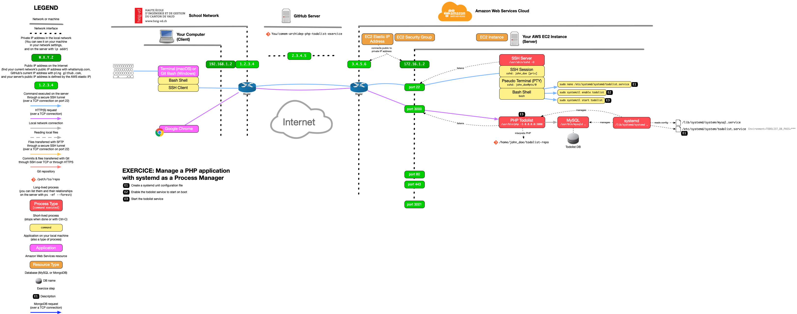

# Manage a PHP application with systemd as a Process Manager

This guide describes how to create a [systemd][systemd] service to run the PHP application.

<!-- START doctoc generated TOC please keep comment here to allow auto update -->
<!-- DON'T EDIT THIS SECTION, INSTEAD RE-RUN doctoc TO UPDATE -->


- [Setup](#setup)
- [Create a systemd unit configuration file](#create-a-systemd-unit-configuration-file)
- [Enable and start the todolist service](#enable-and-start-the-todolist-service)
  - [Troubleshooting](#troubleshooting)
- [Reboot and try again](#reboot-and-try-again)
- [End result](#end-result)

<!-- END doctoc generated TOC please keep comment here to allow auto update -->


## Setup

Make sure you have done the [previous exercise](config-through-environment.md).

Stop your `php -S` command if it is still running.


## Create a systemd unit configuration file

Copy the following configuration, replacing the following values:

* Replace `john_doe` by your username on your server.
* Replace `/home/john_doe` by your home directory on your server.

```
[Unit]

Description=PHP TodoList

# This application should start after MySQL.
After=mysql.service

[Service]

# Command to execute to run the application (the
# absolute path to the executable is required).
ExecStart=/usr/bin/php -S 0.0.0.0:3000

# User account to run the application as.
User=john_doe

# Working directory in which to run the application.
WorkingDirectory=/home/john_doe/todolist-repo

# Environment variables to define when running the
# application (can be repeated).
Environment=TODOLIST_DB_PASS=chAngeMeN0w!

# The application should be restarted if it crashes.
Restart=always

[Install]

# The application should be run once the operating
# system has reached the multi-user runlevel (user
# management and networking have been initialized).
WantedBy=multi-user.target
```

Save it to `/etc/systemd/system/todolist.service` on the server.

> You can edit this file with `nano` on the server with the following command:
> `sudo nano /etc/systemd/system/todolist.service`.


## Enable and start the todolist service

Enable and start your new service:

```bash
$> sudo systemctl enable todolist
$> sudo systemctl start todolist
```

Make sure it is running:

```bash
$> sudo systemctl status todolist
```

You should be able to access the running todolist application in your browser on
your server's IP address and port 3000 (e.g. `1.2.3.4:3000`).

### Troubleshooting

If `sudo systemctl status todolist` indicates a problem with your unit file, be
sure to run `sudo systemctl daemon-reload` after fixing it to take the changes
into account.


## Reboot and try again

Reboot your server:

```bash
$> sudo reboot
```

The todolist application should still be running:

```bash
$> sudo systemctl status todolist
```


## End result



> [PDF version](systemd-deployment.pdf).


[systemd]: https://en.wikipedia.org/wiki/Systemd
