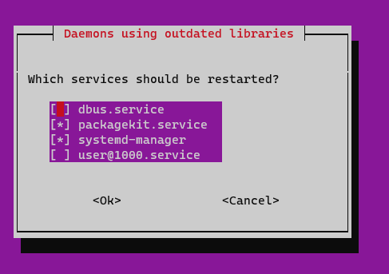

# Deploy WOPR, a Sinatra & Svelte web application with a Redis database

The goal of this exercice is to put in practice the knowledge acquired during
previous exercices to deploy a new application from scratch on your server.

<!-- START doctoc generated TOC please keep comment here to allow auto update -->
<!-- DON'T EDIT THIS SECTION, INSTEAD RE-RUN doctoc TO UPDATE -->

- [The goal](#the-goal)
- [Legend](#legend)
- [The application](#the-application)
  - [:books: What the hell are Ruby, Svelte and Redis?](#books-what-the-hell-are-ruby-svelte-and-redis)
- [:warning: A note about the project's documentation](#warning-a-note-about-the-projects-documentation)
- [:exclamation: Getting started](#exclamation-getting-started)
  - [:exclamation: Fork the repository](#exclamation-fork-the-repository)
  - [:exclamation: Install the requirements](#exclamation-install-the-requirements)
    - [:question: Check that everything has been correctly installed](#question-check-that-everything-has-been-correctly-installed)
  - [:exclamation: Install compilation tools](#exclamation-install-compilation-tools)
  - [:question: Test in development mode](#question-test-in-development-mode)
  - [:exclamation: Run the application in production mode](#exclamation-run-the-application-in-production-mode)
- [:exclamation: Create a systemd service](#exclamation-create-a-systemd-service)
- [:exclamation: Serve the application through nginx](#exclamation-serve-the-application-through-nginx)
- [:exclamation: Provision a TLS certificate](#exclamation-provision-a-tls-certificate)
- [:exclamation: Set up an automated deployment with Git hooks](#exclamation-set-up-an-automated-deployment-with-git-hooks)
  - [:gem: Allow your user to restart the service without a password](#gem-allow-your-user-to-restart-the-service-without-a-password)
  - [:space_invader: Allowing the dedicated `wopr` Unix user to control the Systemd service](#space_invader-allowing-the-dedicated-wopr-unix-user-to-control-the-systemd-service)
  - [:exclamation: Test the automated deployment](#exclamation-test-the-automated-deployment)
- [:checkered_flag: What have I done?](#checkered_flag-what-have-i-done)
- [:boom: Troubleshooting](#boom-troubleshooting)
  - [:boom: `Unable to locate package ...`](#boom-unable-to-locate-package-)
  - [:boom: Daemons using outdated libraries](#boom-daemons-using-outdated-libraries)
  - [:boom: `Command 'bundle' not found`](#boom-command-bundle-not-found)
  - [:boom: `ENOENT open package.json`](#boom-enoent-open-packagejson)
  - [:boom: `Could not locate Gemfile`](#boom-could-not-locate-gemfile)
  - [:boom: `Could not find base64-0.2.0 in any of the sources`](#boom-could-not-find-base64-020-in-any-of-the-sources)
  - [:boom: `rimraf: not found`](#boom-rimraf-not-found)
  - [:boom: `remote: sudo: no tty present and no askpass program specified`](#boom-remote-sudo-no-tty-present-and-no-askpass-program-specified)
  - [:boom: `code=exited, status=200/CHDIR`](#boom-codeexited-status200chdir)
  - [:boom: `code=exited, status=217/USER`](#boom-codeexited-status217user)
  - [:boom: `502 Bad Gateway`](#boom-502-bad-gateway)

<!-- END doctoc generated TOC please keep comment here to allow auto update -->

## The goal

You must deploy the provided application in a similar way as the PHP todolist in
previous exercises:

- Install the language(s) and database necessary to run the application (which
  are different than for the PHP todolist).
- Run the application as a systemd service.
- Serve the application through nginx acting as a reverse proxy.
- Provision a TLS certificate for the application and configure nginx to use it.
- Set up an automated deployment via Git hooks for this application.

Additionally:

- The application **MUST** run in production mode (see its documentation).
- The application **MUST** restart automatically if your server is rebooted
  (i.e. your systemd service must be enabled).
- The application **MUST** be accessible **only through nginx**. It **MUST NOT**
  be exposed directly on a publicly accessible port. In the cloud servers used
  in this course, ports 3000 and 3001 should be open for testing. **DO NOT** use
  these ports in the final setup.
- Clients accessing the application over HTTP **MUST** be redirected to HTTPS.

As an optional bonus challenge:

- Create a dedicated Unix user (e.g. `wopr`) other than your personal user (e.g.
  `john_doe`) to run the application.
- This user should be a system user, not a login user. It should not
  be able to log in with a password, although you can set up SSH public key
  authentication for the automated deployment.
- Clone the project's repository with the dedicated user instead of your
  personal user.
- Configure systemd to run the application as the dedicated user instead of your
  personal user.
- Set up the automated deployment with the dedicated user instead of your
  personal user.

## Legend

Parts of this guide are annotated with the following icons:

- :exclamation: A task you **MUST** perform to complete the exercise.
- :question: An optional step that you _may_ perform to make sure that
  everything is working correctly. But you can skip it because it is not
  necessary.
- :warning: **Critically important information about the exercise.**
- :gem: Tips on the exercise, reminders about previous exercises, or
  explanations about how this exercise differs from the previous one.
- :space_invader: More advanced tips on how to save some time, or tips about the
  bonus challenge.
- :books: Additional information that you can read if you want to know more
  about the commands and tools used during this exercise.
- :checkered_flag: The end of the exercise.
  - :classical_building: The architecture of what you deployed during the
    exercise.
- :boom: Troubleshooting tips: how to fix common problems you might encounter.

## The application

The application you must deploy is a [tic-tac-toe web game][app] where you can
play against the computer. Its code is [available on GitHub][repo].

### :books: What the hell are Ruby, Svelte and Redis?

The application uses the following ~~buzzword salad~~ technologies:

- [Ruby][ruby], a dynamic, open source programming language with a focus on
  simplicity and productivity. It has an elegant syntax that is natural to read
  and easy to write.
- [Sinatra][sinatra], a Ruby DSL for quickly creating web applications with
  minimal effort, for the backend.
- [Svelte][svelte], a JavaScript framework, for the frontend.
- [Redis][redis], an in-memory [NoSQL][nosql] database, for the database.

You do not need to know the specifics of these technologies. Your goal is only
to deploy the application as indicated by the instructions. You will not need to
modify it except for a very small change at the end to test your automated
deployment.

## :warning: A note about the project's documentation

The [project's README][readme] explains how to set up and run the application.
That README is generic: it is not written specifically for this exercise.

The instructions on **this page** explain the exercise step-by-step.

The instructions in the project's README will be useful to you at various
points, but be careful not to blindly copy-paste and execute commands from it
without understanding what you are doing in the context of the exercise.

## :exclamation: Getting started

### :exclamation: Fork the repository

You must [fork][fork] the [application's repository][repo] to your own GitHub
account, because this exercise requires that you make changes to the application
later, after setting up the automated deployment with Git hooks.

:warning: Use your own repository's HTTPS clone URL instead of the one indicated
in the project's README. This way you will have push access to your repository.

### :exclamation: Install the requirements

You may want to start by making sure you have installed all the requirements
described in the [project's README][readme] on your server.

- **How to install Ruby:** there are several methods to install Ruby. You will
  find more information on the [Ruby website][ruby]. You should look for
  installation instructions specific to your operating system (your AWS instance
  is running either Ubuntu 20.04 Focal or Ubuntu 22.04 Jammy). Where possible,
  you should find instructions to install with the apt package manager.

  You will also need to installer [Bundler][bundler], the package manager for
  Ruby. You can do so with the following command:

  ```bash
  $> sudo apt install ruby-bundler
  ```
- **How to install Node.js:** there are several methods to install Node.js. One
  of the simplest is to use the [binary distributions provided by
  NodeSource][node-install]. You should look for installation instructions
  specific to Ubuntu, the Linux distribution used on your server. If possible,
  you should find instructions for the apt package manager (using the `apt` or
  `apt-get` command).
- **To install Redis**, you may follow step 1 of this article:
  https://www.digitalocean.com/community/tutorials/how-to-install-and-secure-redis-on-ubuntu-20-04.

#### :question: Check that everything has been correctly installed

- **Check your ruby installation:** you can check that Ruby has been correctly
  installed with the following command:

  ```bash
  $> ruby -e 'puts "Ruby #{RUBY_VERSION} is installed and working"'
  ```

  You can check that Bundler has been correctly installed by displaying its
  version:

  ```bash
  $> bundle --version
  ```

- **Check your Node.js installation:** you can check that Node.js has been
  correctly installed with the following command:

  ```bash
  $> node -e 'console.log(`Node.js ${process.version} is installed and working`)'
  ```

- **Check your Redis installation:** step 2 of the article mentionned above
  explains how to make sure your Redis server is running.

### :exclamation: Install compilation tools

When installing dependencies for the WOPR application, you will use the `npm`
command to download packages from [npm][npm], a package manager for JavaScript
and [Node.js][node]. Some of these packages may have components programmed in
C/C++ that must be compiled. This is done automatically for you by the `npm`
command, so you don't have to worry about it.

But you do have to make sure that you have [make][make] and a C/C++ compiler
installed so that npm can do its job. You can do that with the following
command:

```bash
$> sudo apt install -y g++ make
```

### :question: Test in development mode

Before attempting to set up the systemd service, nginx configuration and
automated deployment, you can run the application manually in development mode
to make sure it works. The [project's README][readme] explains how to get and run the
application and how to configure it.

:warning: Use your forked repository's HTTPS clone URL instead of the one
indicated in the project's README. This way you will be able to pull the updates
you push later.

You can set the `PORT` environment variable to `3001` for this simple test, as
that is one of the ports that should be open in your AWS instance's firewall.
Run the application on that port and visit http://W.X.Y.Z:3001 to check that it
works (replacing `W.X.Y.Z` by your server's IP address). Stop the application
with `Ctrl-C` once you are done.

> :books: Note that you do not need to configure database access credentials as
> with the PHP todolist. The application tries to connect to Redis with the
> Redis connection URL `redis://localhost:6379/0` by default. This should work
> with a default Redis installation. It works out of the box for two reasons:
> Redis requires no user or password by default, and it's also a schema-less
> NoSQL database.

### :exclamation: Run the application in production mode

Follow the instructions in the [project's README][readme] to run the application
in production mode.

## :exclamation: Create a systemd service

Create and enable a systemd unit file like in the [systemd
exercise][systemd-ex]. Make the necessary changes to run the one chat room
application instead of the PHP todolist.

> - :gem: You will find the correct command to run the application in [the
>   project's `README`][readme]. Remember that systemd requires absolute paths
>   to commands.
> - :gem: You may want to set the `PORT` environment variable to choose the port
>   on which the application will listen. You can use the publicly accessible
>   3001 port temporarily for testing, but you should use another free port that
>   is not exposed to complete the exercise, since one of the requirements is to
>   expose the application only through nginx.

Once you have enabled and started the service, it should start automatically the
next time you restart the server with `sudo reboot`.

> :space_invader: if you know what you are doing, you can already set up the
> automated deployment project structure at this point, so that you can point
> your systemd configuration to the correct directory. That way you will not
> have to modify it later.

## :exclamation: Serve the application through nginx

Create an nginx configuration to serve the application like in the [nginx
PHP-FPM exercise][nginx-php-fpm-ex].

> - :gem: Skip all steps related to PHP FPM, since they are only valid for a PHP
>   application.
> - :gem: The `include` and `fastcgi_pass` directives used in the PHP FPM
>   exercise make no sense for a non-PHP application. You should replace them
>   with a [`proxy_pass`
>   directive](http://nginx.org/en/docs/http/ngx_http_proxy_module.html#proxy_pass).
>   as [presented during the course][nginx-rp-conf].
> - :space_invader: You can also point the nginx configuration directly to the
>   automated deployment structure. That way you will not have to modify it
>   later.

## :exclamation: Provision a TLS certificate

Obtain and configure a TLS certificate to serve the application over HTTPS like
in the [certbot exercise][certbot-ex].

## :exclamation: Set up an automated deployment with Git hooks

Change your deployment so that the application can be automatically updated via
a Git hook like in the [automated deployment exercise][auto-deploy-ex].

Once you have set up the new directories, make sure to update your systemd unit
file to point to the correct directory.

Complete the `post-receive` hook. Compared to the PHP todolist, there are
additional steps which must be performed in the script for the automated
deployment to work correctly:

- Dependencies must be installed again (in case there are new ones).
- The web assets must be re-built so that changes to client-side code are taken
  into account.
- The systemd service must be restarted with `systemctl`. (Ruby code is not
  reinterpreted on-the-fly as with PHP; the process must be restarted so that
  the code is reloaded into memory).

> :gem: In the automated deployment exercice, it is mentionned that the
> application will no longer work after changing the path to the repository in
> the nginx configuration. In the case of the WOPR application, it will
> continue to work, because the application serves its static files on its
> own, without nginx's help.
>
> :books: When using `fastcgi_pass`, nginx is asking the PHP FastCGI Process
> Manager (PHP-FPM) to find and execute the PHP files in the `root` directory
> specified by the configuration. When you change that `root` to a directory
> that is empty (at that stage in the exercise), it will not find the PHP files
> anymore, and return a 404 Not Found error.
>
> :books: When using `proxy_pass`, nginx is simply forwarding the request to the
> given address and port. The application listens on that port and is capable of
> serving its own files, regardless of nginx's configuration. So the application
> will keep working even after changing the `root`.

### :gem: Allow your user to restart the service without a password

In order for the new `post-receive` hook to work, your user must be able to run
`sudo systemctl restart wopr` (assuming you have named your service `wopr`)
without entering a password, otherwise it will not work in a Git hook. This is
because a Git hook is not an interactive program. You are not running it
yourself, so you are not available to enter your password where prompted.

If you are using the administrator user account that came with your Azure VM to
run the application, it already has the right to use `sudo` without a password.

> :books: This has been automatically configured for you in the
> `/etc/sudoers.d/90-cloud-init-users` file.

### :space_invader: Allowing the dedicated `wopr` Unix user to control the Systemd service

If you are trying to complete the bonus challenge, you will need to allow the
`wopr` user run the necessary `sudo systemctl ...` commands without a password
as well.

Make sure your default editor is `nano` (or whichever you are more comfortable
with):

```bash
$> sudo update-alternatives --config editor
```

When you created the `wopr` Unix user, your server created a corresponding Unix
group with the same name by default. Now you will add a file in the
`/etc/sudoers.d` directory to allow users in the `wopr` Unix group to run some
specific commands without a password.

```bash
$> sudo visudo -f /etc/sudoers.d/wopr
```

> :books: The [`visudo` command][visudo] allows you to edit the sudoers file in
> a safe fashion. It will refuse to save a sudoers file with a syntax error
> (which could potentially corrupt your system or lock you out of your
> administrative privileges).

Add the following line to the file:

```
%wopr ALL=(ALL:ALL) NOPASSWD: /bin/systemctl restart wopr, /bin/systemctl status wopr, /bin/systemctl start wopr, /bin/systemctl stop wopr
```

> :books: This line allows any user in the `wopr` group to execute the listed
> commands with `sudo` without having to enter a password (hence the `NOPASSWD`
> option).

Exit with `Ctrl-X` if you are using Nano or with Esc then `:wq` if you are using
Vim.

> :gem: If you are using nano, the filename you are asked to confirm will be
> `/etc/sudoers.d/wopr.tmp` instead of `/etc/sudoers.d/wopr`. This is normal,
> because `visudo` uses a temporary file to validate your changes before saving
> the actual file. You may confirm without changes.

You can test that it works by first switching to the `wopr` user with `sudo su -
wopr` and then running `sudo systemctl status wopr`. It should run the command
without asking you for any password (only for the specific commands listed in
the file your created).

### :exclamation: Test the automated deployment

Clone your fork of the repository to your local machine, make sure you have
added a remote to your server, then commit and push a change to test the
automated deployment.

For example, some of the text displayed in the main page is [in the file
`src/app.svelte`][change].

## :checkered_flag: What have I done?

You have deployed a new backend/frontend web application to your server from
scratch, using the knowledge you acquired during previous deployment exercises.

## :boom: Troubleshooting

Here's a few tips about some problems you may encounter during this exercise.
Note that some of these errors can happen in various situations:

- When running a command manually from your terminal.
- When systemd tries to start your service.
- When your `post-receive` Git hook executes.

### :boom: `Unable to locate package ...`

If you see an error message similar to this:

```bash
$> sudo apt install ruby-full
Reading package lists... Done
Building dependency tree
Reading state information... Done
E: Unable to locate package ruby-full
```

It might be because you have not updated APT's package sources. The list of
available packages must be refreshed manually.

Try running `sudo apt update`, then try installing your package again.

### :boom: Daemons using outdated libraries

When you install a package with APT (e.g. Ruby or Redis), it *may* prompt you to
reboot and/or to restart outdated daemons (i.e. background services):



Simply select "Ok" by pressing the Tab key, then press Enter to confirm.

> :books: This happens because most recent Linux versions have [unattended
> upgrades](linux-unattended-upgrades): a tool that automatically installs daily
> security upgrades on your server without human intervention. Sometimes, some
> of the background services running on your server may need to be restarted for
> these upgrades to be applied.
>
> Since you are installing a new background service (the MySQL server) which
> must be started, APT asks whether you want to apply upgrades to other
> background services by restarting them. Rebooting your server would also have
> the effect of restarting these services and applying the security upgrades.

### :boom: `Command 'bundle' not found`

If you see an error message similar to this:

```bash
$> bundle config set path 'vendor/bundle'

Command 'bundle' not found, but can be installed with:

sudo snap install ruby          # version 3.2.2, or
sudo apt  install ruby-bundler  # version 2.1.4-1

See 'snap info ruby' for additional versions.
```

It is because you have not installed Bundler, the package manager for Ruby. Read
the [requirements section](#exclamation-install-the-requirements) again.

### :boom: `ENOENT open package.json`

If you see an error message similar to this:

```
npm ERR! code ENOENT
npm ERR! syscall open
npm ERR! path /path/to/package.json
```

You are probably executing the `npm ci` command in the wrong directory. It must
be executed in a directory that contains both a `package.json` and
`package-lock.json` files. These files describe a list of npm packages to
install, which the `npm` command will download.

For this exercise, you want to run this command in the directory where the WOPR
application's files are located (as explained in the project's README).

### :boom: `Could not locate Gemfile`

If you see an error message similar to this:

```
Could not locate Gemfile
```

You are probably executing the `bundle install` command in the wrong directory.
It must be executed in a directory that contains a file named `Gemfile`. This
file describes a list of ruby packages to install, which the `bundle` command
will download.

For this exercise, you want to run this command in the directory where the WOPR
application's files are located (as explained in the project's README).

### :boom: `Could not find base64-0.2.0 in any of the sources`

If you see an error message similar to this:

```
Could not find base64-0.2.0 in any of the sources (Bundler::GemNotFound)
```

You are probably trying to execute the WOPR application without having installed
its Ruby dependencies (with the `bundle install --path vendor/bundle` command).

> Note that `bundle install --path vendor/bundle` downloads Ruby packages to a
> `vendor` directory in the current working directory. This means that you must
> run it at least once in each directory from which you want to execute the WOPR
> application.

### :boom: `rimraf: not found`

If you see an error message similar to this:

```
> wopr@1.0.0 build /path/to/wopr
> npm run clean && npm run webpack

> wopr@1.0.0 clean /path/to/wopr
> rimraf public

sh: 1: rimraf: not found
```

You are probably trying to execute the `npm run build` command in the WOPR
application without having installed its JavaScript dependencies (with the `npm ci` command).

> Note that the `npm ci` command downloads npm packages to a `node_modules`
> directory in the current working directory. This means that you must run it at
> least once in each directory from which you want to execute the WOPR
> application.

### :boom: `remote: sudo: no tty present and no askpass program specified`

If you see an error message similar to this when your Git hook is triggered:

```
remote: sudo: no tty present and no askpass program specified
```

It means that you have not performed the following step correctly: [Allow your
user to restart the service without a
password](#allow-your-user-to-restart-the-service-without-a-password). Make sure
that the list of authorized `systemctl` commands in the sudoers file match the
name of your service (if you named your systemd configuration file something
other than `wopr.service`, you must adapt the commands in the sudoers file to
use the correct service name).

> This error occurs because ordinarily, your own Unix user does not have the
> right to execute `sudo systemctl restart wopr` without you entering your
> password to gain administrative rights. A Git hook is executed in a
> non-interactive context: it can only print information, and you cannot
> interact with it (e.g. give it input) while it is running. This means that it
> cannot ask for your password, so any `sudo` command will fail by default.
>
> This is what the error message indicates: `no tty present` means that there is
> no interactive terminal (`tty` comes from the terminology of the 1970s: it
> means a **t**ele**ty**pewriter, which was one of the first terminals).
>
> The instructions mentioned above grant your user the right to execute specific
> `sudo` commands (like `sudo systemctl restart wopr`) without having to enter
> your password. Once that is done, these commands will work from the Git hook
> as well.

### :boom: `code=exited, status=200/CHDIR`

If you see an error message similar to this in your systemd service's status:

```
code=exited, status=200/CHDIR
```

It means that systemd failed to move into the directory you specified (`CHDIR`
means **ch**ange **dir**ectory). Check your systemd configuration file to make
sure that the working directory you have configured is the correct one and
really exists.

### :boom: `code=exited, status=217/USER`

If you see an error message similar to this in your systemd service's status:

```
code=exited, status=217/USER
```

It means that systemd failed to run the service's command with the user you
specified (as indicated by the `USER` error code). Check your systemd
configuration file to make sure that the user you have configured is the correct
one.

### :boom: `502 Bad Gateway`

If you see this error in your browser when trying to access an nginx site you
have configured, it means that nginx cannot reach the proxy address you have
defined. Check your nginx configuration to make sure that you are using the
correct address and port. Are you sure your application is actually listening on
that port?

[app]: https://wopr.archidep.ch
[auto-deploy-ex]: https://github.com/MediaComem/comem-archidep/blob/master/ex/git-automated-deployment.md
[automated-deployment-nginx-update]: https://github.com/MediaComem/comem-archidep/blob/master/ex/git-automated-deployment.md#update-the-todolist-nginx-configuration
[bundler]: https://bundler.io
[certbot-ex]: certbot-deployment.md
[change]: https://github.com/MediaComem/comem-wopr/blob/4b75cc6c2c83c2fce1723ce655a12d5537c0bfbd/src/app.svelte#L26-L30
[fork]: https://docs.github.com/en/get-started/quickstart/fork-a-repo
[make]: https://www.gnu.org/software/make/
[nginx-php-fpm-ex]: nginx-php-fpm-deployment.md
[nginx-rp-conf]: https://mediacomem.github.io/comem-archidep/2020-2021/subjects/reverse-proxy/?home=MediaComem%2Fcomem-archidep%23readme#29
[node]: https://nodejs.org
[node-install]: https://github.com/nodesource/distributions/blob/master/README.md
[nosql]: https://en.wikipedia.org/wiki/NoSQL
[npm]: https://www.npmjs.com
[readme]: https://github.com/MediaComem/comem-wopr#readme
[redis]: https://redis.io
[repo]: https://github.com/MediaComem/comem-wopr
[ruby]: https://www.ruby-lang.org
[sinatra]: http://sinatrarb.com
[svelte]: https://svelte.dev
[systemd-ex]: systemd-deployment.md
