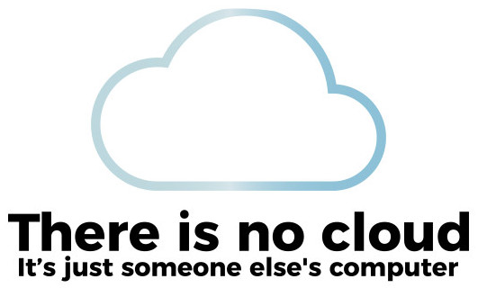
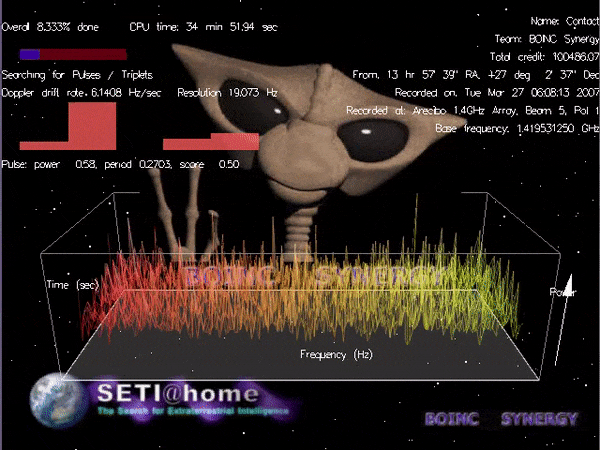
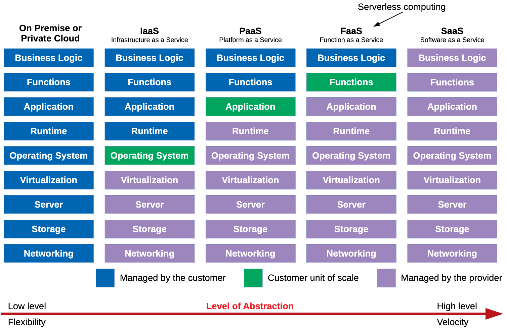
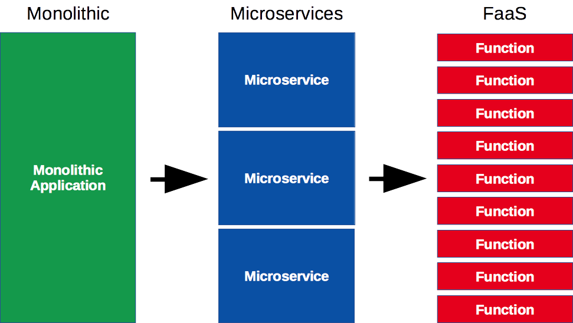
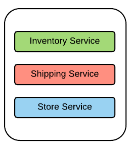

# Cloud Computing

Learn what cloud computing is and about the common service models available today.

<!-- slide-include ../../BANNER.md -->

<!-- START doctoc generated TOC please keep comment here to allow auto update -->
<!-- DON'T EDIT THIS SECTION, INSTEAD RE-RUN doctoc TO UPDATE -->

- [Client-server model](#client-server-model)
  - [Server-side](#server-side)
  - [Types of servers](#types-of-servers)
  - [[Internet hosting][internet-hosting]](#internet-hostinginternet-hosting)
    - [Types of web hosting](#types-of-web-hosting)
  - [[Virtualization][virtualization]](#virtualizationvirtualization)
    - [Virtualized server architecture](#virtualized-server-architecture)
- [Cloud computing](#cloud-computing)
  - [What is cloud computing?](#what-is-cloud-computing)
  - [Why use cloud computing?](#why-use-cloud-computing)
  - [Deployment models](#deployment-models)
    - [Other deployment models](#other-deployment-models)
  - [Public clouds](#public-clouds)
- [Service models](#service-models)
  - [What can I get?](#what-can-i-get)
  - [On premise data center](#on-premise-data-center)
  - [Infrastructure as a Service (IaaS)](#infrastructure-as-a-service-iaas)
    - [How does IaaS work?](#how-does-iaas-work)
  - [Platform as a Service (PaaS)](#platform-as-a-service-paas)
    - [How does PaaS work?](#how-does-paas-work)
  - [Function as a Service (FaaS)](#function-as-a-service-faas)
    - [How does FaaS work?](#how-does-faas-work)
  - [Software as a Service (SaaS)](#software-as-a-service-saas)
  - [Level of abstraction](#level-of-abstraction)
- [Trends](#trends)
  - [Microservices](#microservices)
    - [[Microservice architecture][microservices-in-practice]](#microservice-architecturemicroservices-in-practice)
  - [Serverless computing](#serverless-computing)
- [References](#references)
- [TODO](#todo)

<!-- END doctoc generated TOC please keep comment here to allow auto update -->

## Client-server model

The [client-server model][client-server-model] is one of the main ways distributed and networked computer systems are organized today.
In this model, **servers** share their resources with **clients**, who **request a server's content or services**.

> The communication is not only one way.
> In modern web applications, servers may also **push data to their clients**.

### Server-side

The **server** is what we will focus on.

### Types of servers

A server can provide many different kinds of content or services:

* A [**file server**][file-server] provides shared disk access accessible over
  the network (using protocols such as [FTP][ftp] or [AFP][afp]), to store files
  such as text, image, sound or video.
* A [**database server**][db-server] houses an application that provides
  database services to other computer programs.
* A [**web server**][web-server] can serve contents over the Internet (using
  [HTTP][http]).

  
  
  

These are just a few examples.
There are many [types of servers][server-types] depending on the scenario and the resources you want to provide.
One computer may fulfill one or several of these roles.

### Internet hosting

Not every individual and organization has access to vast computer resources.
Some companies provide [Internet hosting][internet-hosting]: servers that can be
owned or leased by customers.

One common example is [web hosting][web-hosting],
where server space is provided to make websites accessible over the Internet.

#### Types of web hosting

<!-- slide-column -->

[**Shared hosting**][shared-hosting]

Multiple websites (from a few to a few hundred) are placed on the same server
and **share a common pool of resources** (e.g. CPU, RAM).
This is the least expensive and least flexible model.

<!-- slide-column -->

[**Dedicated hosting**][dedicated-hosting]

Customers get full control over their own **physical server(s)**.
They are responsible for the security and maintenance of the server(s).
This offers the most flexibility and best performance.

<!-- slide-column -->

[**Virtual hosting**][virtual-hosting]

Using [virtualization][virtualization], physical server resources can be divided into **virtual servers**.
Customers gain full access to their own virtual space.

### Virtualization

<!-- slide-column -->

**Hardware [virtualization][virtualization]** refers to the creation of a
**virtual machine** that acts like a real computer with an operating system.

A [**hypervisor**][hypervisor] is installed on the **host machine**. It
virtualizes CPU, memory, network and storage.

A virtual machine, also called the **guest machine**, runs another operating
system **isolated** from the host machine.

For example, a computer running Microsoft Windows may host a virtual machine
running an Ubuntu Linux operating system. Ubuntu-based software can be run in
the virtual machine.

<!-- slide-column 55 -->

> Popular virtualization solutions: [KVM][kvm], [Parallels][parallels],
> [VirtualBox][virtualbox], [VMWare][vmware].

#### Virtualized server architecture

Using virtual machines provides several advantages: applications can each run in
an **isolated environment** custom-tailored to their needs (operating system,
libraries, etc), **new virtual servers can be created in minutes**, and
**resource utilization is maximized** instead of hardware running idle.

<!-- slide-column -->

On the other hand, virtual machines require **additional management effort** and
their **performance is not as good** as dedicated servers.

But for many use cases **the benefits outweight the costs**, which is why
virtualization is heavily used in cloud computing.

<!-- slide-column 70 -->

## Cloud computing

<!-- slide-front-matter class: center, middle -->

### What is cloud computing?

<!-- slide-column -->

[Cloud computing][cloud] is nothing new.
It's simply a **pool of configurable computer system resources**.

These resources may be **servers**,
or **infrastructure** for those servers (e.g. network, storage),
or **applications** running on those servers (e.g. web applications).

<!-- slide-column 70 -->

### Why use cloud computing?

Cloud computing resources can be **rapidly provisioned** with **minimal management** effort, allowing great **economies of scale**.

Companies using cloud computing can **focus on their core business** instead of expending resources on computer infrastructure and maintenance.

<!-- slide-column -->

Pay-as-you-go models **minimize up-front computer infrastructure costs**.

They allow to more rapidly **adjust to fluctuating and unpredictable computing demands**.

<!-- slide-column -->

**Customization options are limited** since you do not have complete control over the infrastructure.

**Security and privacy** can be a concern depending on a business's legal requirements.

### Deployment models

<!-- slide-column -->

Cloud infrastructure operated solely **for a single organization**,
managed and hosted internally or by a third party.

These clouds are very capital-intensive (they require physical space, hardware, etc)
but are usually more customizable and secure.

**Providers:** Microsoft, IBM, Dell, VMWare, HP, Cisco, Red Hat.

<!-- slide-column -->

Cloud services **open for public use**, provided over the Internet.

Infrastructure is often shared through virtualization.
Security guarantees are not as strong.
However, costs are low and the solution is highly flexible.

**Platforms:** [Amazon Web Services][aws], [Google Cloud Platform][google-cloud], [Microsoft Azure][azure].

#### Other deployment models

<!-- slide-column -->

There are also **hybrid clouds** composed of two or more clouds bound together
to benefit from the advantages of multiple deployment models.

For example, a platform may store sensitive data on a private cloud, but connect
to other applications on a public cloud for greater flexibility.

<!-- slide-column 55 -->

<!-- slide-container -->

There also are a few [other deployment models][other-deployment-models], for
example **distributed clouds** where computing power can be provided by
volunteers donating the idle processing resources of their computers.

<!-- slide-column 15 -->

&nbsp;

<!-- slide-column 25 -->

<!-- slide-column 45 -->

> For example, [SETI@home][seti] uses volunteers' computers to analyze radio
> signals with the aim of searching for signs of extraterrestrial intelligence.

### Public clouds

<!-- slide-column -->

Most public **cloud computing providers** such as Amazon, Google and Microsoft
**own and operate the infrastructure** at their data center(s), and **provide
cloud resources via the Internet**.

<!-- slide-column 65 -->

<!-- slide-container -->

For example, the [Amazon Web Services][aws] cloud was [initially developed
internally][aws-history] to support Amazon's retail trade. As their computing
needs grew, they felt the need to build a computing infrastructure that was
**completely standardized and automated**, and that would **rely extensively on
web services** for storage and other computing needs.

As that infrastructure grew, Amazon started **selling access to some of their
services**, initially virtual servers, as well as a storage and a message
queuing service. Today Amazon is one of the largest and most popular cloud
services provider.

## Service models

<!-- slide-front-matter class: center, middle -->

### What can I get?

These are the main service models offered by cloud providers:

Model                                | Acronym     | What is provided                                                    | Examples
:---                                 | :---        | :---                                                                | :---
[Infrastructure as a Service][iaas]  | **`IaaS`**  | Virtual machines, servers, storage, load balancers, network, etc.   | [Amazon Web Services][aws], [Google Cloud][google-cloud], [Microsoft Azure][azure]
[Platform as a Service][paas]        | **`PaaS`**  | Execution runtime, database, web server, development tools, etc.    | [Cloud Foundry][cloud-foundry], [Heroku][heroku], [OpenShift][openshift], [Render][render]
[Function as a Service][faas]        | **`FaaS`**  | Event-based hosting of individual functions.                        | [AWS Lambda][aws-lambda], [Azure Functions][azure-functions], [Cloud Functions][cloud-functions]
[Software as a Service][saas]        | **`SaaS`**  | Web applications such as CMS, email, games, etc.                    | [Dropbox][dropbox], [Gmail][gmail], [Slack][slack]

### On premise data center

<!-- slide-column 40 -->

<!-- slide-column -->

As an introduction to cloud service models, this is a representation of the
various technological layers you need to put in place to deploy web applications
in a modern cloud infrastructure.

If you have your own data center, you need to install and configure all of these
layers yourself.

As you will see, the various **cloud service models abstract away part or all**
of these layers, so that you don't have to worry about them.

### Infrastructure as a Service (IaaS)

<!-- slide-column 40 -->

<!-- slide-column -->

[**IaaS**][iaas] provides IT infrastructure like **storage, networks and virtual
machines** from the provider's data center(s).

The customer provides an **operating system image** like [Ubuntu][ubuntu], which
is run on a physical or [virtual machine (VM)][vm] by the provider. The machine
is the **unit of scale**: you pay per machine (usually hourly).

The customer does not manage the physical infrastructure but has **complete
control over the operating system** and can run arbitrary software.

**Setting up the runtime** environment (databases, web servers, monitoring, etc)
for applications **is up to the customer**.

> $6/mo for a 2-[vCPU][vcpu] VM with 1 GB of RAM at [AWS EC2][ec2-pricing].
> €17/mo for a dedicated server with a 2.2 GHz CPU and 32 GB of RAM at
> [OVH][ovh-eco].

#### How does IaaS work?

System administrators connect to virtual machines run by the provider in their
data center(s). They have complete control over the operating system. To run a
website, they must set up the runtime environment themselves.

### Platform as a Service (PaaS)

<!-- slide-column 40 -->

<!-- slide-column -->

[**PaaS**][paas] provides a **managed runtime environment** where customers can
run their applications without having to maintain the associated infrastructure.

All you have to do is provide the **application**. The platform will run it with
the necessary components (e.g. database). You pay per application, often hourly.

This is **quicker** because applications can be deployed with minimal
configuration, without the complexity of setting up the runtime. More time can
be spent on developing the application.

However PaaS is **less flexible** since control of the runtime is limited. It
also tends to be more expensive at larger scales.

> $25/mo for a fully managed production environment with 1 GB or RAM at
> [Heroku][heroku-pricing].

#### How does PaaS work?

Developers send an application, for example a Laravel site written in PHP, to the provider, typically via Git.
The managed runtime environment then detects the type of application and runs it, along with the necessary resources,
and serves it over the Internet.

### Function as a Service (FaaS)

<!-- slide-column 40 -->

<!-- slide-column -->

[**FaaS**][faas] stores **individual functions** and runs them in response to
events. Customers write simple functions that access resources such as a
database, then define when they are run in response to client requests.

This model completely abstracts away the complexity of managing the
infrastructure, setting up the runtime and structuring an application. The
customer has little to no control over these layers. There is no direct need to
manage resources.

In contrast with IaaS and PaaS, nothing is kept running if nothing happens.
Functions are loaded and run as events occur. **Pricing is based on execution
time** (often per millisecond) rather than application uptime.

> $0.0000000021/ms when a function consumes 128 MB of RAM at [AWS
> Lambda][aws-lambda].

#### How does FaaS work?

Developers write individual functions and publish them to the provider.
The platform provides various services to connect these functions together and to various resources for storage, communication, monitoring, etc.

### Software as a Service (SaaS)

<!-- slide-column 40 -->

<!-- slide-column -->

[**SaaS**][saas] provides **on-demand** software over the Internet.

The software is **fully developed, managed and run by the provider**, so the
customer has nothing to do except pay and use it. Pricing is often per user and
monthly.

This model offers the **least flexibility**, as the customer has no control over
the operation or deployment of the software, and limited control over its
configuration.

> $4/mo for a [pro GitHub account][github-pricing]. $10/mo for a [personal
> Dropbox account][dropbox-pricing]. $14/mo for a [premium YouTube
> account][youtube-premium].

### Level of abstraction

These models can be ordered by increasing level of abstraction,
from IaaS being the lowest level and most flexible service model,
to SaaS being the highest level and fastest-to-use service model.

## Trends

<!-- slide-front-matter class: center, middle -->

What's happening in the clouds?

### Microservices

There is a tendency in recent years to try to **decompose** monolithic applications into smaller, more flexible [microservices][microservices]
(a variant of service-oriented architecture).
The [Function-as-a-Service (FaaS)][faas] model is one more step in the same direction.

#### Microservice architecture

<!-- slide-column -->

Enterprise software often offers hundreds of functionalities piled into a single
monolithic application. The deployment, troubleshooting, scaling and upgrading
of such monsters is a nightmare.

In a [microservice architecture][microservices-in-practice], isolating services
allows development to be parallelized as teams can work autonomously on separate
services, or even individual functions. It also faciliates [continous
delivery][cd] as each component can be deployed independently.

<!-- slide-column 25 -->

<!-- slide-container -->

### Serverless computing

The [Function-as-a-Service (FaaS)][faas] is considered to be part of the
[**serverless computing**][serverless] model. The name "serverless" does not
mean that there is no server. It just means that **the server is abstracted**
and managed by the platform provider.

<!-- slide-column -->

* **Productivity**: the developer can focus on developing functions or business
  logic.
* **Cost-effective**: only the resources used are billed
  (whereas PaaS or IaaS resources may be underutilized).
* **Scalable**: the provider automatically scales resources to the demand.

<!-- slide-column -->

* **Greater latency**: infrequently-used code may be "shut down" when not in
  use.
* **Resource limits**: not suited to some workloads like high-performance
  computing.
* **Monitoring and debugging**: identifying performance problems may be more
  difficult than with traditional code.

## References

* [Advantages and Disadvantages of Virtual Server](https://www.esds.co.in/kb/advantages-and-disadvantages-of-virtual-server/)
* [Microservices in Practice][microservices-in-practice]

[afp]: https://en.wikipedia.org/wiki/Apple_Filing_Protocol
[app-server]: https://en.wikipedia.org/wiki/Application_server
[aws]: https://aws.amazon.com
[aws-history]: https://en.wikipedia.org/wiki/Amazon_Web_Services#History
[aws-lambda]: https://aws.amazon.com/lambda/
[azure]: https://azure.microsoft.com
[azure-functions]: https://azure.microsoft.com/en-us/services/functions/
[cd]: https://en.wikipedia.org/wiki/Continuous_delivery
[client-server-model]: https://en.wikipedia.org/wiki/Client%E2%80%93server_model
[cloud]: https://en.wikipedia.org/wiki/Cloud_computing
[cloud-foundry]: https://www.cloudfoundry.org
[cloud-functions]: https://cloud.google.com/functions/
[db-server]: https://en.wikipedia.org/wiki/Database_server
[dedicated-hosting]: https://en.wikipedia.org/wiki/Dedicated_hosting_service
[dropbox]: https://www.dropbox.com
[dropbox-pricing]: https://www.dropbox.com/official-teams-page
[ec2-pricing]: https://aws.amazon.com/ec2/pricing/on-demand/
[faas]: https://en.wikipedia.org/wiki/Function_as_a_service
[file-server]: https://en.wikipedia.org/wiki/File_server
[ftp]: https://en.wikipedia.org/wiki/File_Transfer_Protocol
[github-pricing]: https://github.com/pricing
[gmail]: https://www.google.com/gmail/
[google-cloud]: https://cloud.google.com
[heroku]: https://www.heroku.com
[heroku-pricing]: https://www.heroku.com/pricing
[http]: https://en.wikipedia.org/wiki/HTTP
[hypervisor]: https://en.wikipedia.org/wiki/Hypervisor
[iaas]: https://en.wikipedia.org/wiki/Infrastructure_as_a_service
[internet-hosting]: https://en.wikipedia.org/wiki/Internet_hosting_service
[kvm]: https://www.linux-kvm.org
[microservices]: https://en.wikipedia.org/wiki/Microservices
[microservices-in-practice]: https://medium.com/microservices-in-practice/microservices-in-practice-7a3e85b6624c
[openshift]: https://www.openshift.com
[other-deployment-models]: https://en.wikipedia.org/wiki/Cloud_computing#Others
[ovh-eco]: https://eco.ovhcloud.com
[paas]: https://en.wikipedia.org/wiki/Platform_as_a_service
[parallels]: https://www.parallels.com
[render]: https://render.com
[saas]: https://en.wikipedia.org/wiki/Software_as_a_service
[server-types]: https://en.wikipedia.org/wiki/Server_(computing)#Purpose
[serverless]: https://en.wikipedia.org/wiki/Serverless_computing
[seti]: https://en.wikipedia.org/wiki/SETI@home
[shared-hosting]: https://en.wikipedia.org/wiki/Shared_web_hosting_service
[slack]: https://slack.com
[soa]: https://en.wikipedia.org/wiki/Service-oriented_architecture
[ubuntu]: https://www.ubuntu.com
[vcpu]: https://www.techtarget.com/whatis/definition/virtual-CPU-vCPU
[virtualbox]: https://www.virtualbox.org
[virtual-hosting]: https://en.wikipedia.org/wiki/Virtual_private_server
[virtualization]: https://en.wikipedia.org/wiki/Virtualization
[vm]: https://en.wikipedia.org/wiki/Virtual_machine
[vmware]: https://www.vmware.com
[web-hosting]: https://en.wikipedia.org/wiki/Web_hosting_service
[web-server]: https://en.wikipedia.org/wiki/Web_server
[youtube-premium]: https://www.youtube.com/premium
