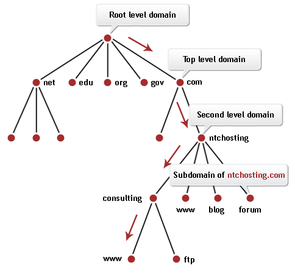
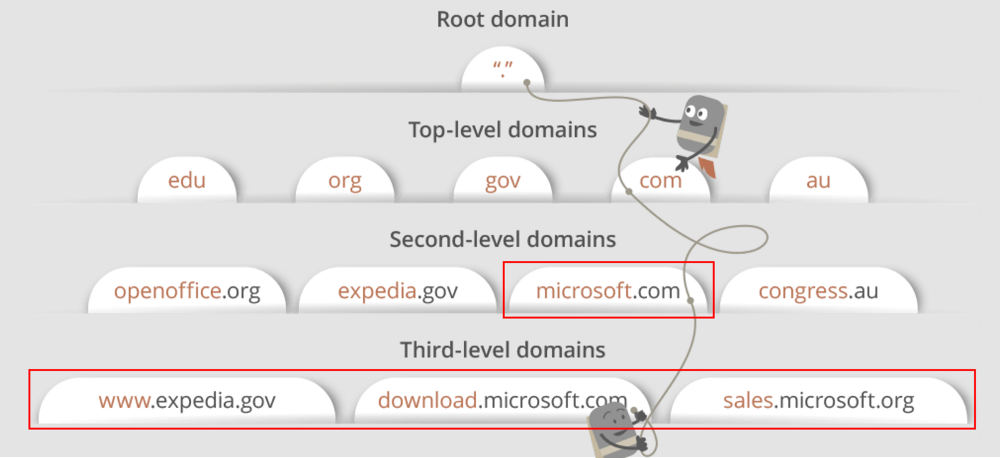
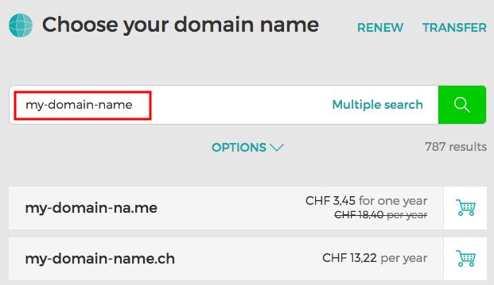
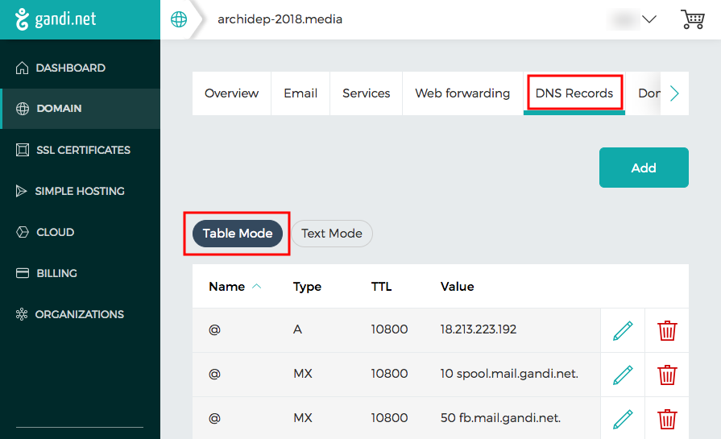
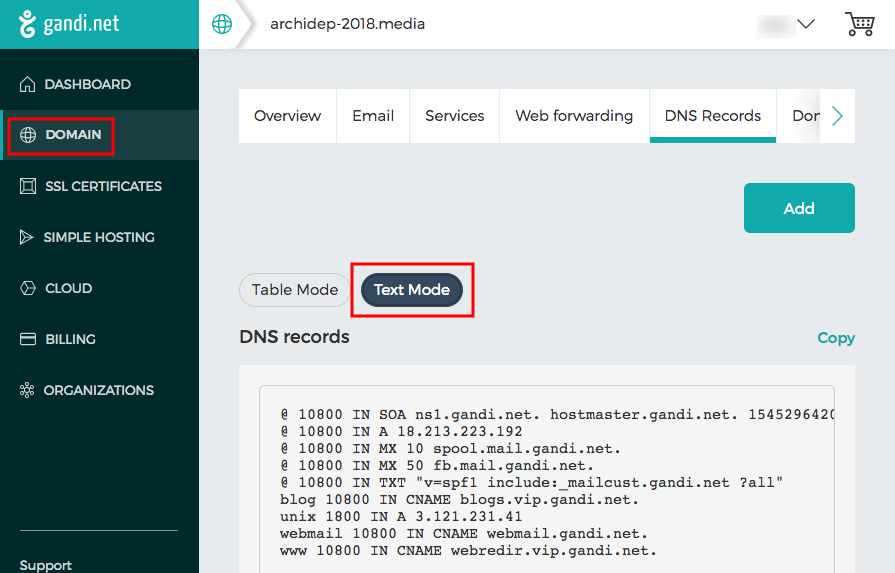
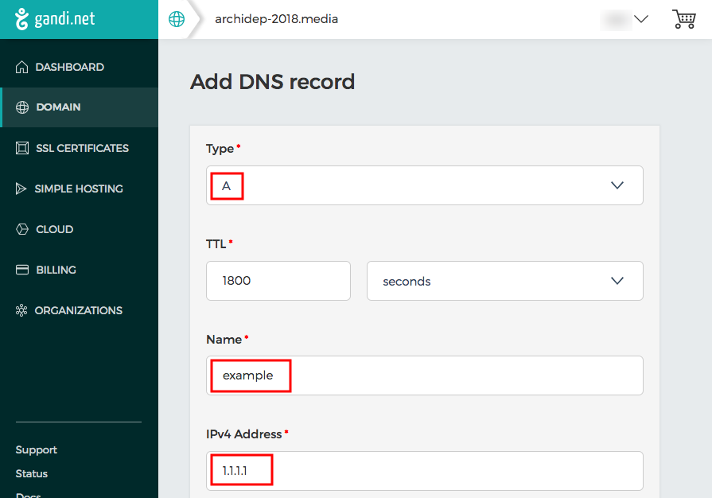

# Domain Name System (DNS)

Learn the basics of the [Domain Name System (DNS)][dns] and configure a domain name for your server with [Gandi.net][gandi].

<!-- slide-include ../../BANNER.md -->

**You will need**

* A server with a public IP address
* A Gandi account that is the administrator or technical contact for a domain

**Recommended reading**

* [Unix Networking](../unix-networking/)

<!-- START doctoc -->
<!-- END doctoc -->


## What is the Domain Name System?

<!-- slide-front-matter class: center, middle -->



### Domain name system

The [**Domain Name System (DNS)**][dns] is a hierarchical decentralized naming system for computers connected to the Internet or a private network.
Most prominently, it **translates human-readable domain names** (like `google.com`) **to numerical IP addresses** (like `40.127.1.70`) needed for locating computers with the underlying network protocols.
The Domain Name System has been an essential component of the functionality of the Internet since 1985.

<p class='center'></p>

### DNS hierarchy

The [Internet Corporation for Assigned Names and Numbers (ICANN)][icann] is responsible for managing [top-level domains (TLDs)][tld] like `.com`.
Management of second-level domains and so on is delegated to other organizations.

<p class='center'></p>

You can buy your own [generic top-level domain][gtld] since 2012 for $185,000.

### DNS zone

A [DNS zone][dns-zone] is a subset of the domain name space for which administrative responsibility has been delegated to a single manager.

<p class='center'></p>

For example, Microsoft has purchased the rights to manage the `microsoft.com` domain and all its subdomains from the manager of the `.com` [top-level domain (TLD)][tld].
Once they have those rights, they can create any number of subdomains for their business needs.

You can also purchase a domain name as an individual, giving you the right to manage that portion of the DNS hierarchy.

### DNS zone file

A [DNS zone file][dns-zone-file] is a text file that describes a [DNS zone][dns-zone].
It contains **mappings between domain name and IP addresses** and other resources, in the form of resource records.

A **resource record** is described by one line in the following format:

```
name   ttl   record class   record type   record data
```

The meaning of each field is:

* `name` - Subdomain name (or `@` for the domain itself).
* `ttl` - Time during which DNS resolution of this record should be cached.
* `record class` - Namespace of the record information, usually `IN` for the Internet.
* `record type` - Type of record.
* `record data` - Record data (depending on the record type).

#### DNS record types

There are multiple [**record types**][dns-record-types].
These are some of the most common:

Type    | Description           | Function
:---    | :---                  | :---
`A`     | Address record        | Maps a domain name to an IPv4 address.
`AAAA`  | IPv5 address record   | Maps a domain name to an IPv6 address.
`CNAME` | Canonical name record | Alias of one name to another (e.g. `www`).
`MX`    | Mail exchange record  | Maps a domain name to a list of message transfer agents.
`SOA`   | Start of authority    | Authoritative information about the zone, e.g. primary name server & email of the domain administrator.
`TXT`   | Text record           | Arbitrary machine-readable data.

#### DNS record example

Let's look at a real example which you might find in a zone file:

```
@   1800   IN   A   18.213.200.101
```

Assuming this is the zone file for the domain `example.com`,
here is how to read that record:

* It is an Internet record (`IN`).
* The `@` name indicates that it concerns the domain `example.com` itself.
* It is an `A` record, meaning that it maps `example.com` to the IPv4 address `18.213.200.101`.
* It defines a cache time of 1800 seconds (20 minutes) during which clients will not perform DNS resolution again if they have the mapping already.

#### DNS subdomain record example

Let's look at another example:

```
blog   1800   IN   A   3.120.180.32
```

Assuming this is the zone file for the domain `example.com`,
here is how to read that record:

* It is an Internet record (`IN`).
* It concerns the subdomain `blog.example.com`.
* It is an `A` record, meaning that it maps `blog.example.com` to the IPv4 address `3.120.180.32`.
* It defines a cache time of 1800 seconds (20 minutes) during which clients will not perform DNS resolution again if they have the mapping already.


## Managing DNS on Gandi.net

<!-- slide-front-matter class: center, middle -->


### Buying a domain name

Most web hosting companies like [Gandi][gandi] allow you to easily check whether a domain name is available,
i.e. whether there is already a manager for that subset of the DNS hierarchy, or if you are free to buy it for yourself.

Check out [their shop][gandi-shop] to see if your dream domain name is available.

<p class='center'></p>

### Configuring a domain

Once you have bought a domain name, you access its management interface from your account:

<p class='center'></p>

### Configuring the domain's DNS zone

Gandi offers many services such as email accounts or SSL certificates.
The one that interests us is the management of the domain's **DNS zone**:

<p class='center'></p>

> By default, Gandi displays the DNS zone in a human-readable table.

#### Seeing the raw DNS zone text

Advanced users can also see and edit the real DNS zone file:

<p class='center'></p>

### Adding a DNS record

The interface allows you to very easily add a DNS record.
For example, this screenshot shows how to add an `example` subdomain pointing to the IP address `1.1.1.1`:

<p class='center'></p>


[dns]: https://en.wikipedia.org/wiki/Domain_Name_System
[dns-record-types]: https://en.wikipedia.org/wiki/List_of_DNS_record_types
[dns-zone]: https://en.wikipedia.org/wiki/DNS_zone
[dns-zone-file]: https://en.wikipedia.org/wiki/Zone_file
[gandi]: https://www.gandi.net/
[gandi-shop]: https://shop.gandi.net/
[gtld]: https://en.wikipedia.org/wiki/Generic_top-level_domain
[icann]: https://en.wikipedia.org/wiki/ICANN
[tld]: https://en.wikipedia.org/wiki/Top-level_domain
