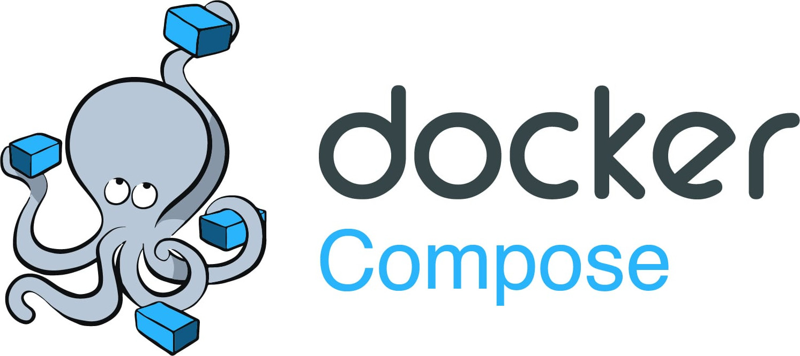
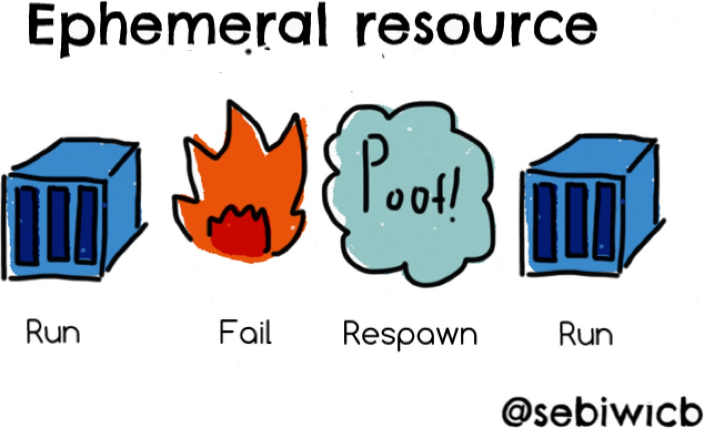
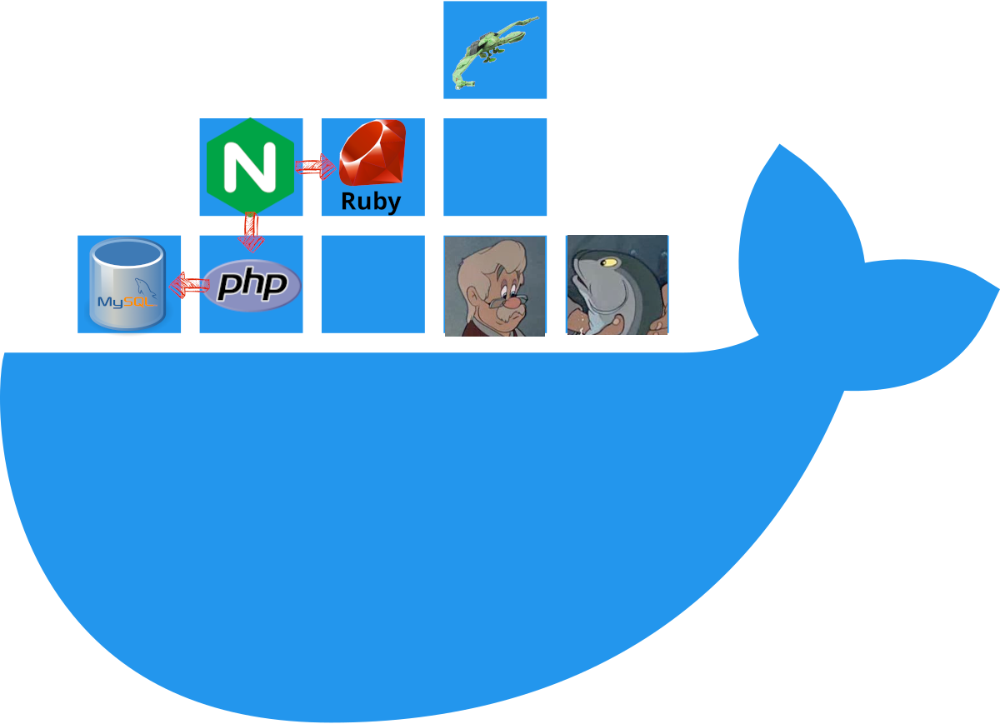

# Docker Compose

<!-- slide-column -->

Learn the basics of [Docker Compose][docker-compose], a tool for defining and
running **multi-container applications**.

<!-- slide-include ../../BANNER.md -->

<!-- slide-column 60 -->



<!-- slide-container -->

**You will need**

* A [Docker][docker] account
* [Docker Desktop][docker-desktop] installed on your machine
  * *[Docker Compose][docker-compose] is included with Docker Desktop*

**Recommended reading**

* [Docker](../docker/)

<!-- START doctoc generated TOC please keep comment here to allow auto update -->
<!-- DON'T EDIT THIS SECTION, INSTEAD RE-RUN doctoc TO UPDATE -->

- [The Docker philosophy](#the-docker-philosophy)
  - [The Docker philosophy: isolation](#the-docker-philosophy-isolation)
  - [The Docker philosophy: microservice architecture](#the-docker-philosophy-microservice-architecture)
- [What is Docker Compose?](#what-is-docker-compose)
  - [The Docker Compose command line](#the-docker-compose-command-line)
- [Why use Docker Compose?](#why-use-docker-compose)
- [Common use cases of Docker Compose](#common-use-cases-of-docker-compose)
- [Going further](#going-further)
- [References](#references)

<!-- END doctoc generated TOC please keep comment here to allow auto update -->


## The Docker philosophy

<!-- slide-column -->

A container is **ephemeral**: The same container may not run in perpetuity. Many
replicas may be launched. New containers will replace crashed ones.

<!-- slide-column 65 -->



<!-- slide-container -->

* Any code running in your container should be included in the image. **If the
  code needs revision, update the image** and run a new container.
* Pass **configuration** via environment variables.
* Do not manage **persistent storage** within containers. Delegate storage to a
  third-party service, another container (e.g. running a database), or mount a
  volume to keep data when a container is created again.

### The Docker philosophy: isolation

> Docker containers are **isolated services**, not VM replacements.

<p class="center">
  
</p>

### The Docker philosophy: microservice architecture

A container should have **only one mission**. Containers allow subdividing the
functions of a system into smaller collaborating pieces.

* A Docker image should **contain what it needs** to provide its service and run
  as quickly as possible, and nothing else! Minimize your dependencies. The
  simpler it is, the more portable it is.
* For maximum efficiency and isolation, each container should address one
specific area of concern and **delegate other functions to other containers**,
  e.g. a web application container will delegate storage to a separate database
  container.


## What is Docker Compose?

<!-- slide-column -->

Docker Compose is a tool for defining and running multi-container applications,
making it easy to manage **services, networks, and volumes** in a single,
comprehensible [YAML][yaml] configuration file called the **Compose file**.

<!-- slide-column -->

```yml
services:

  # Application service
  app:
    build: .
    depends_on:
      - db
    environment:
      DB_URL: postgres://db:5432/app
    ports:
      - "8080:80"
    restart: always

  # Database service
  db:
    image: redis:7.2.4-alpine
    restart: always
    volumes:
      - ./todolist.sql:/init.sql:ro
```

### Compose services

The main unit of work with Docker Compose is a **service**:

* A service is an **abstract definition of a computing resource within an
  application** which can be scaled or replaced independently from other
  components.
* **Services are backed by a set of containers**, run by the platform according
  to replication requirements and placement constraints. As services are backed
  by containers, they are defined by a Docker image and set of runtime
  arguments. All containers within a service are identically created with these
  arguments.

Services are defined in the **Compose file**.

### The Docker Compose command line

Docker Compose is also a **Docker subcommand**. Based on a Compose file, it can:

* Start, stop, and rebuild services
  * `docker compose up [service]`
  * `docker compose stop [service]`
  * `docker compose build [service]`
* View the status of running services
  * `docker compose ps [service]`
* Stream the log output of running services
  * `docker compose logs [--follow] [service]`
* Run a one-off command on a service
  * `docker-compose run <service> <command> [args...]`

## Why use Docker Compose?

* **Simplified control**: Orchestrate multi-container applications in a single
  file, making your application environment easy to replicate.
* **Efficient collaboration**: Compose files are easy to share, facilitating
  collaboration among developers, operations teams, and other stakeholders.
* **Rapid application development**: Compose caches its configuration. When you
  restart a service that has not changed, Compose re-uses the existing
  containers. Re-using containers means that you can make changes to your
  environment very quickly.
* **Portability across environments**: Compose supports variables to customize
  your containers for different environments or users.


## Going further

The following tools are (completely) out of scope for this course, but
interesting to learn about if you want to go further with Docker:

* [Traefik][traefik] is a **reverse proxy developed to integrate with
  microservices** (like Docker Compose services). Using it, you can get rid of
  nginx and its site configuration files. Traefik can interrogate the Docker
  Daemon about running containers and [configure itself
  automatically](https://doc.traefik.io/traefik/providers/docker/).
* [Docker Swarm][swarm] can network a cluster of Docker engines together across
  multiple servers, allowing you to **aggregate separate machines into one giant
  pool of resources**. You can then simply deploy Compose services to the swarm
  and containers will be automatically spawned on one of the cluster's machines.
* If you want to go even further into large-scale Docker deployments, look at
  [Kubernetes][k8s], an open-source system for **automating deployment, scaling,
  and management of containerized applications**. It groups containers that make
  up an application into logical units for easy management and discovery.


## References

* [Docker Compose][docker-compose]
* [Containers philosophy](https://dev.to/iblancasa/containers-philosophy-2714)
* [The First Thing You Should Know When Learning About Docker Containers](https://medium.com/factualopinions/the-first-thing-you-should-know-when-learning-about-docker-containers-e0de29ddb6c3)


[docker]: https://www.docker.com
[docker-compose]: https://docs.docker.com/compose/
[docker-desktop]: https://www.docker.com/products/docker-desktop/
[k8s]: https://kubernetes.io
[swarm]: https://docs.docker.com/engine/swarm/
[traefik]: https://traefik.io
[yaml]: https://yaml.org
