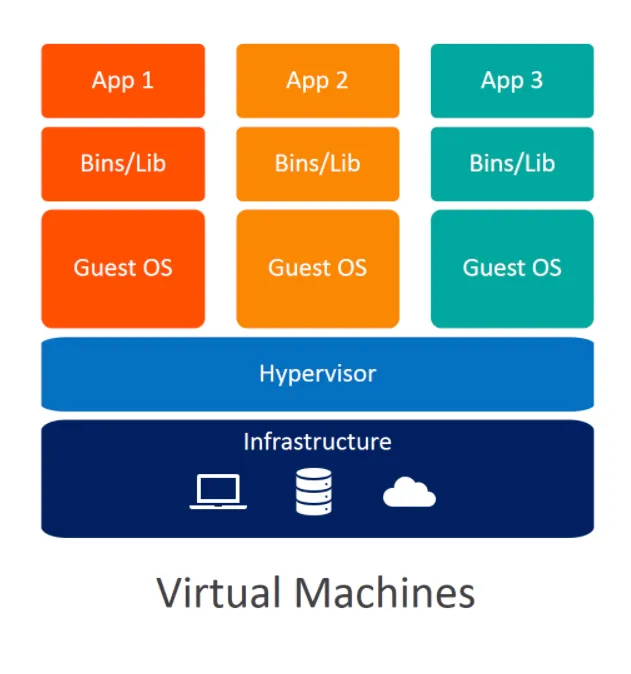
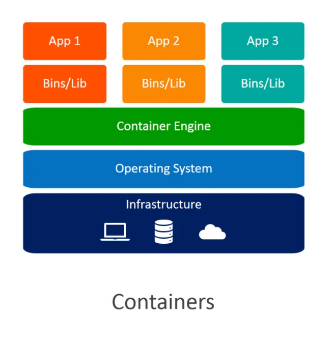
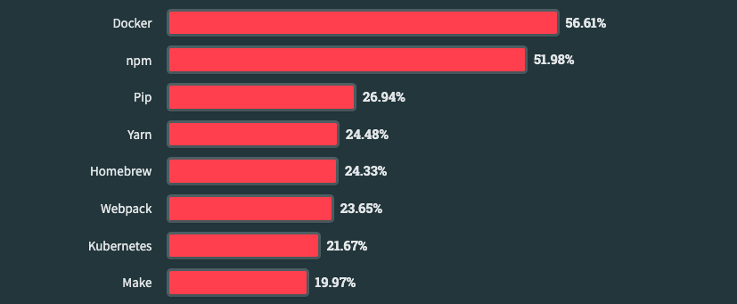
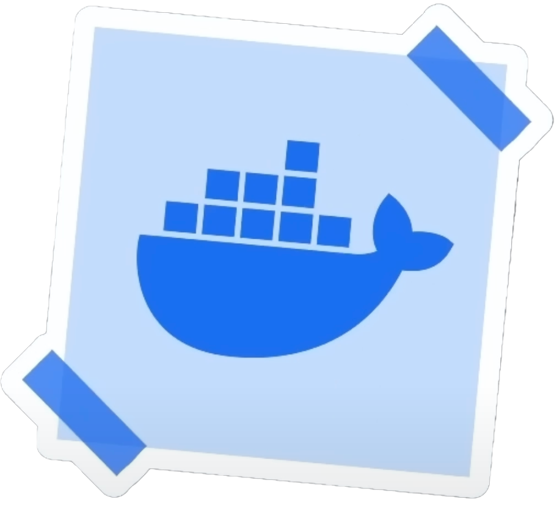
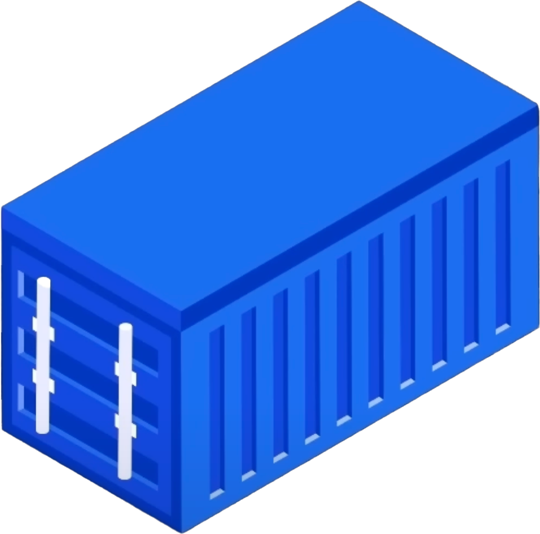
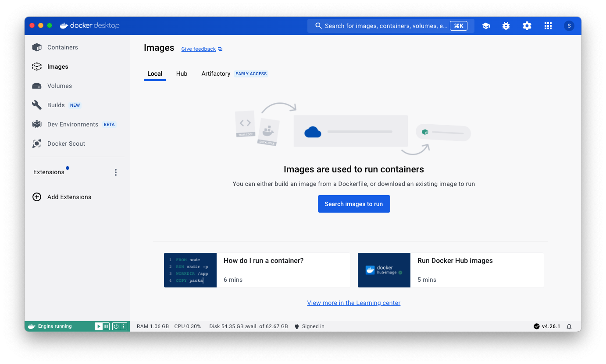
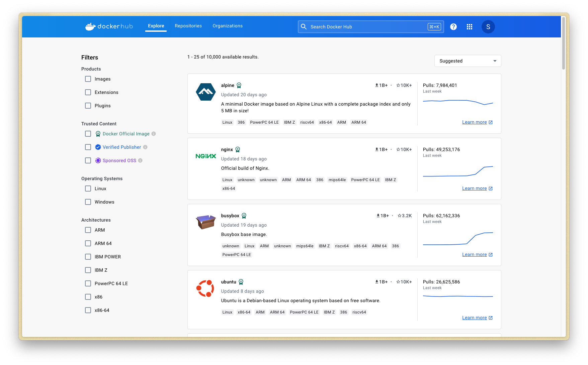

<!-- START doctoc generated TOC please keep comment here to allow auto update -->
<!-- DON'T EDIT THIS SECTION, INSTEAD RE-RUN doctoc TO UPDATE -->

- [Docker](#docker)
  - ["It works on my machine."](#it-works-on-my-machine)
    - [Portability](#portability)
    - [Virtual Machines](#virtual-machines)
    - [Containers](#containers)
    - [What is Docker?](#what-is-docker)
    - [Who uses Docker?](#who-uses-docker)
    - [Why use Docker?](#why-use-docker)
    - [Wait, why not just use good old VMs?](#wait-why-not-just-use-good-old-vms)
  - [Docker concepts](#docker-concepts)
    - [Docker concepts - Images](#docker-concepts---images)
    - [Docker concepts - Containers](#docker-concepts---containers)
  - [Docker Workflow](#docker-workflow)
    - [Docker workflow - Client](#docker-workflow---client)
    - [Docker workflow - Daemon (Host)](#docker-workflow---daemon-host)
    - [Docker workflow - Registry](#docker-workflow---registry)
  - [Running existing Docker images](#running-existing-docker-images)
    - [Running a pre-built image](#running-a-pre-built-image)
    - [Wait. I thought Docker Containers did not contain an OS?](#wait-i-thought-docker-containers-did-not-contain-an-os)
    - [Container management](#container-management)
  - [Creating your own Docker images](#creating-your-own-docker-images)
    - [Dockerfile instructions](#dockerfile-instructions)
    - [Building the image](#building-the-image)
    - [Run a container based on the custom image](#run-a-container-based-on-the-custom-image)

<!-- END doctoc generated TOC please keep comment here to allow auto update -->

# Docker


<!-- slide-column -->

Learn how to containerize your web applications with Docker.

**You will need**

* [Git][git]
* A [GitHub][github] account
* A [Docker][docker] account
* [Docker Desktop][docker-desktop] installed on your machine.

<!-- slide-column -->
<p class='center'></p>


## "It works on my machine."

<!-- slide-front-matter class: center, middle -->

> Have you ever had an application work on one operating system,
> such as MacOS, but not on another? Have you ever struggled to juggle
> different Node.js versions for various web applications? Odds are, you have.

> [Docker][docker] was launched in 2013 with the intent to address this critical
> issue in software development and deployment: **portability**.


### Portability

<!-- slide-column -->

Portability in computing refers to the ability of software to be run on various hardware or operating system environments with little or no modification. This concept has been pivotal in software development for decades, facilitating the adaptation of applications across diverse systems. Before containers and Docker, portability was often achieved through careful coding practices, the use of virtual machines, or cross-platform programming languages and libraries. Why is portability such a challenge?

<!-- slide-column -->
* **Hardware Dependencies**: Different hardware architectures can affect software performance and compatibility.
* **Operating System Variations**: Software that runs on one operating system might not run on another without significant changes.
* **Dependency Management**: Ensuring all the necessary libraries and tools are present and compatible across systems is a major challenge.


### Virtual Machines

<!-- slide-column -->
<p class='center'></p>

<!-- slide-column -->

Virtual machine solve the portability problem by providing isolation and environment consistency. At its core, virtualization involves creating virtual versions of physical resources, such as servers, storage devices, and networks using a hypervisor.

**Hypervisor**: The central component of hardware virtualization is the hypervisor, a software layer that enables multiple operating systems to share a single hardware host.

Virtualization forms the foundation of cloud computing and is pivotal in data center management.


### Containers

<!-- slide-column -->
<p class='center'></p>

<!-- slide-column -->
While VMs are fantastic technology and incredibly useful in numerous scenarios, it doesn't necessarily make sense to package an entire operating system just to get a web application to work.

Containers are an alternative that address this drawback of virtual machines. They tackle the challenges of portability by providing isolation and environment consistency, all while sharing a host system's kernel and without requiring a full operating system for each instance.


### What is Docker?

Docker is an open-source platform that automates the deployment, scaling, and management of applications inside lightweight, portable **containers**. It has revolutionized how developers build, ship, and run applications, making it simpler to create and manage consistent environments.

In essence, Docker streamlines the development lifecycle by allowing developers to work in standardized environments using local containers which provide your applications and services. Docker has become a key component of many toolchains, integrating smoothly with various tools and platforms.


### Who uses Docker?

<p class='center'></p>

Almost everyone.

In the [2023 Stack Overflow Developer Survey][stack-overflow-survey],
56.61% of professional developers reported using Docker. In the fragmented
world of software development, this is a *significant* number, likely second only to [Git][git] in terms of adoption. This indicates that Docker is an essential tool to learn for aspiring developers seeking employment.


### Why use Docker?

* **Environment Consistency**: Apps run the same on your machine, your colleague's machine, and your boss's machine. No more "it works on my machine." It also means everyone executes the same commands to run the app, regardless of the computer. The operating system becomes irrelevant, which makes collaboration and deployment much easier.

* **Portability**: Docker containers can be moved across operating systems without needing to modify the codebase.

* **Isolation**: Docker maintains a clear boundary between your app and its dependencies. That means there are no more clashes between applications. This improves security and makes debugging simpler.

* **Scaling**: You can deploy as many instances of the container as needed.

* **DevOps**: Docker streamlines workflows between coding and deployment.


### Wait, why not just use good old VMs?

|                        | Virtual Machine  | Container                                     |
| :---                   | :---             | :---                                          |
| **Architecture**       | Full OS          | Application and dependencies                  |
| **Isolation**          | Complete isolation| Process-level isolation                       |
| **Performance**        | Slower, but full access to hardware resources | Faster, supports rapid scaling |

As usual, the choice depends on the use case. However, in the context of web development, containers make a lot of sense. They offer the speed and agility required in a dynamic web development environment, where rapid iteration and deployment are key. With their process-level isolation, they provide a balanced approach to security and resource efficiency. Their architecture, which includes only the application and its dependencies, simplifies deployment across different environments.


## Docker concepts
<!-- slide-column -->
<p class='center'></p>
<p class='center'>Images</p>

<!-- slide-column -->
<p class='center'></p>
<p class='center'>Containers</p>


### Docker concepts - Images
<!-- slide-column -->
<p class='center'></p>

<!-- slide-column -->
A Docker image is a **lightweight**, **standalone**, and **executable package** that includes everything needed to run a piece of software:

* Code
* Runtime
* Libraries
* System Tools
* Operating System

Think of a Docker image as a recipe containing both the ingredients and the instructions.


### Docker concepts - Containers
<!-- slide-column -->
<p class='center'></p>

<!-- slide-column -->
A Docker Container is a **runnable instance** of a Docker Image. A Container takes everything specified in the Docker Image and follows its instructions by executing specified commands.

If the image is a recipe, then the container is the completed dish.

Multiple containers can be created from a single Docker Image.


## Docker Workflow

<p class='center'></p>

The Docker workflow encompasses several key components that work together to manage the lifecycle of Docker containers: the **Client**, the **Daemon (Host)**, and the **Registry**.


### Docker workflow - Client
<p class='center'></p>

The [Docker Client][docker-desktop] provides a **user interface** to issue commands to the **Docker Host**.

This interface can be used through the **command line** or with Docker Desktop (pictured above), a GUI implementation of the client.


### Docker workflow - Daemon (Host)

The Docker daemon, or `dockerd`, is the **heart of the Docker platform**, running on the host machine where containers are deployed. It manages the entire lifecycle of Docker containers on the system.

`dockerd` listens for Docker API requests and **manages Docker objects such as images, containers, networks, and volumes**. It's the component that does the heavy lifting of building and running containers.

It is responsible for **pulling images from Docker registries and building new images**. It stores these images locally, providing a cache to speed up future container launches.

`dockerd` also handles **logging and monitoring** of container activity, providing insights into container performance and health.

`dockerd` and the Docker Client are often referred to together as the **Docker Engine**.


### Docker workflow - Registry
<!-- slide-column -->
<p class='center'></p>

<!-- slide-column -->
A Docker Registry is a **storage and content delivery system** that holds named Docker images, available in different tagged versions.

The most well-known registry is **[Docker Hub][docker-hub]**, which is a public, cloud-based registry provided by Docker. Essentially, Docker Hub is to Docker what GitHub is to Git.

Besides Docker Hub, there are other registries like [Amazon ECR (Elastic Container Registry)][amazon-ecr], [Google Artifact Registry][google-artifact-registry], and private, self-hosted options.


## Running existing Docker images
Before proceeding, ensure that you have installed **[Docker Desktop][docker-desktop]**. This software includes everything you'll need to use **Docker**. It's recommended to use the default settings.

The first step is to **download an image** from **Docker Hub** using the [**`docker pull`**][docker-commands-pull] command.

In this example, we'll pull the [**official Ubuntu image**][docker-images-ubuntu]. The download might take some time, but it's **cached** for future use until a new version is released, assuming you're using the latest version.

```bash
$> docker pull ubuntu
Using default tag: latest
latest: Pulling from library/ubuntu
005e2837585d: Pull complete
Digest: sha256:6042500cf4b44023ea1894effe7890666b0c5c7871ed83a97c36c76ae560bb9b
Status: Downloaded newer image for ubuntu:latest
docker.io/library/ubuntu:latest
```
To use a **specific version** of an image, append `:tag_name` to the image name. For example, to pull Ubuntu 23.10 Mantic Minotaur, run `docker pull ubuntu:mantic`. The default tag `latest` refers to the latest long-term support release.


### Running a pre-built image
You can check the images available on your machine by running the [**`docker images`**][docker-commands-images] command.

```bash
$> docker images
REPOSITORY     TAG       IMAGE ID       CREATED          SIZE
ubuntu         latest    da935f064913   4 weeks ago      69.3MB
```

An image downloaded from **Docker Hub** comes pre-built, which means you can directly create a container from it using the [`docker run <image_name>`][docker-commands-run] command.

The `run` command has a myriad of options. Our goal here is to create an **interactive shell** from the image. Thus, we will use the `--interactive` and `--tty` flags in our command (abbreviated to `-it`).

```bash
$> docker run -it ubuntu
root@bf545ce9cbdb:/#
```

As you can see, you can now interact with a containerised version of Ubuntu. Try interacting with the filesystem using standard UNIX commands such as `cd` and `ls`.


### Wait. I thought Docker Containers did not contain an OS?
In a typical **Linux distribution**, you usually get:

* A **bootloader**, which loads a kernel
* A **kernel**, which manages the system and loads an init system
* An **init system**, which sets up and runs everything else
* **Everything else** (binaries, shared libraries, etc.)

The **Docker Engine** replaces the kernel and init system, and the **container** replaces "everything else".

An **Ubuntu Docker image** contains the minimal set of Ubuntu binaries and shared libraries, as well as the `apt` package manager. For instance, `systemd` is not included.


### Container management
You can manage Docker Containers by using a host of commands:

| Command                | Purpose                                                             |
| :---                   | :---                                                                |
| [`docker run IMAGE`][docker-commands-run]            | Create and start a container.         |
| [`docker ps`][docker-commands-ps]                    | Lists running containers.             |
| [`docker stop CONTAINER_ID`][docker-commands-stop]   | Gracefully stops a running container. |
| [`docker start CONTAINER_ID`][docker-commands-start] | Restarts a stopped container.         |
| [`docker rm CONTAINER_ID`][docker-commands-rm]       | Removes a container.                  |
| [`docker exec -it CONTAINER_ID /bin/bash`][docker-commands-exec] | Provides shell access to a running container.  |
| [`docker logs CONTAINER_ID`][docker-commands-logs] | Displays a container's logs.            |
| [`docker stats`][docker-commands-stats]   | Shows a live stream of container(s) resource usage statistics |


## Creating your own Docker images
<!-- slide-column -->
If the goal is to package your applications into **portable and shareable images**, then you must be able to do more than just use existing images from Docker Hub.

Docker can build images by reading the instructions from a [**Dockerfile**][dockerfile-reference]. A Dockerfile is a text document that uses a specific syntax to contain all the instructions necessary to assemble an image.

There are a few rules:
* A Dockerfile must be named **`Dockerfile`**, with no extension.
* A Docker Image must be based on an **existing base image** from official repositories such as [`node`][docker-images-node].


<!-- slide-column -->
```dockerfile
FROM node

WORKDIR /app

COPY . .

ENTRYPOINT node app.js
```


### Dockerfile instructions

| Instruction            | Purpose                                                          |
| :---                   | :---                                                             |
| `FROM image_name`           | Specifies the base image to use for the new image.          |
| `WORKDIR /some/path`   | Sets the working directory for the instructions that follow.     |
| `COPY <src> <dest>`    | Copies files or directories from the build context to the image. |
| `RUN <command>`        | Executes commands in the shell during image builds.              |
| `EXPOSE <port>`        | Port(s) Docker will be listening on at runtime.                  |
| `ENV KEY=VALUE`        | Sets environment variables.                                      |
| `ARG KEY=VALUE`        | Defines build time variables.                                    |
| `USER user`            | Set user and group ID.                                           |
| `CMD <command>`        | The default command to execute when the container starts.        |
| `ENTRYPOINT <command>` | Similar as `CMD`, but cannot be overriden.                       |

To see a full list of Dockerfile instructions, see the [Dockerfile reference][dockerfile-reference].


### Building the image
To build an image, use the `docker build <context>` command followed by a **PATH or URL**. This specifies the build context, which is necessary if you need to copy files from a folder into the container.

It's also recommended to tag your image with a name using the `-t` flag. The example below builds an image from a Dockerfile present in the current working directory.
```bash
$> docker build -t hello-docker .
[+] Building 1.3s (9/9) FINISHED
 => [internal] load build definition from Dockerfile
 => => transferring dockerfile: 94B
 => [internal] load .dockerignore
 => => transferring context: 2B
 => [internal] load metadata for docker.io/library/node:latest
 => [auth] library/node:pull token for registry-1.docker.io
 => [1/3] FROM docker.io/library/node@sha256:73a9c498369c6e6f864359979c8f4895f28323c07411605e6c870d696a0143fa
 => [internal] load build context
 => => transferring context: 56B
 => CACHED [2/3] WORKDIR /app
 => CACHED [3/3] COPY . .
 => exporting to image
 => => exporting layers
 => => writing image sha256:9cc4ea715ff536e18366516d5b5bb403a5633297fab9fb1cd489d1e789a18cd7
 => => naming to docker.io/library/hello-docker
```


### Run a container based on the custom image
Check the image has been created with `docker images`
```bash
$> docker images
REPOSITORY     TAG       IMAGE ID       CREATED       SIZE
hello-docker   latest    9cc4ea715ff5   5 hours ago   1.1GB
```

And create a container from it with `docker run`
```bash
$> docker run hello-docker
Hello Docker!
```

A Docker container operates by running a specific **process, defined by the `CMD` or `ENTRYPOINT` in your Dockerfile**. This process keeps the container alive. The container will remain active as long as this process is running. In our example, the container is running a Node.js script** that logs "Hello Docker!" to the console. Once this script finishes executing and the Node.js runtime exits, the container will also stop running. Running `docker ps` will therefore not display the container you just executed.

```bash
$> docker ps
CONTAINER ID   IMAGE     COMMAND   CREATED   STATUS    PORTS     NAMES
```

[amazon-ecr]: https://aws.amazon.com/ecr/
[docker]: https://www.docker.com/
[docker-commands-build]: https://docs.docker.com/engine/reference/commandline/build/
[docker-commands-exec]: https://docs.docker.com/engine/reference/commandline/exec/
[docker-commands-images]: https://docs.docker.com/engine/reference/commandline/images/
[docker-commands-logs]: https://docs.docker.com/engine/reference/commandline/logs/
[docker-commands-pull]: https://docs.docker.com/engine/reference/commandline/pull/
[docker-commands-ps]: https://docs.docker.com/engine/reference/commandline/ps/
[docker-commands-rm]: https://docs.docker.com/engine/reference/commandline/rm/
[docker-commands-run]: https://docs.docker.com/engine/reference/commandline/run/
[docker-commands-start]: https://docs.docker.com/engine/reference/commandline/start/
[docker-commands-stats]: https://docs.docker.com/engine/reference/commandline/stats/
[docker-commands-stop]: https://docs.docker.com/engine/reference/commandline/stop/
[docker-desktop]: https://www.docker.com/products/docker-desktop/
[docker-engine]: https://docs.docker.com/engine/
[docker-hub]: https://hub.docker.com/
[docker-images-node]: https://hub.docker.com/_/node
[docker-images-ubuntu]: https://hub.docker.com/_/ubuntu
[dockerfile-reference]: https://docs.docker.com/engine/reference/builder/
[git]: https://git-scm.com
[github]: https://github.com
[google-artifact-registry]: https://cloud.google.com/artifact-registry
[render]: https://render.com
[stack-overflow-survey]: https://survey.stackoverflow.co/2023/
