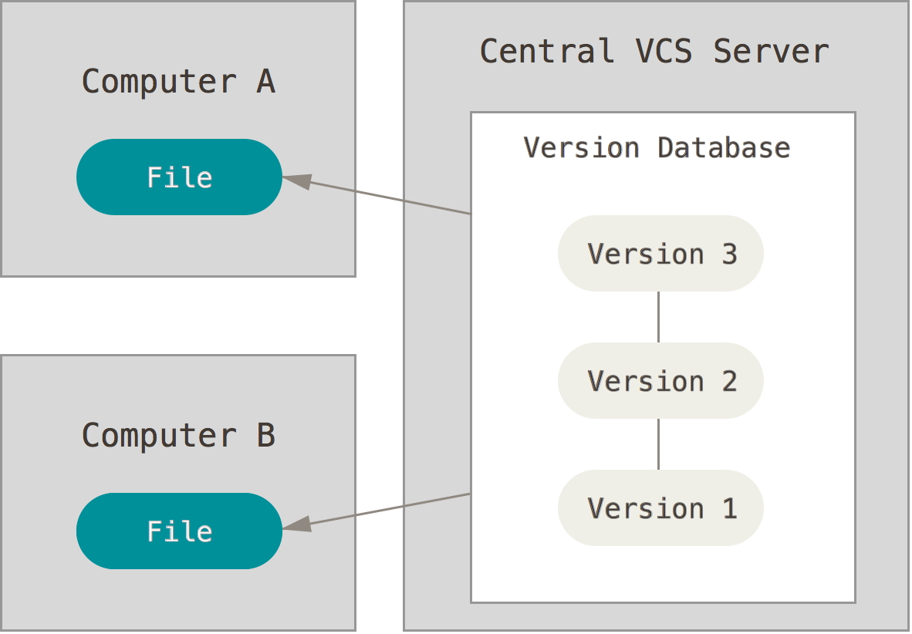

# Git Introduction

Learn the basics of [Git][git], one of the most popular distributed version control systems.
This is a condensed version of the first chapters of the [Git Book](https://git-scm.com/book/en/v2), which you should read if you want more detailed information on the subject.

<!-- slide-include ../../BANNER.md -->

**You will need**

* A Unix CLI

**Recommended reading**

* [Command line](../cli/)

<!-- START doctoc generated TOC please keep comment here to allow auto update -->
<!-- DON'T EDIT THIS SECTION, INSTEAD RE-RUN doctoc TO UPDATE -->


- [What is Git?](#what-is-git)
- [What is version control?](#what-is-version-control)
- [A short history](#a-short-history)
  - [**Local** version control systems](#local-version-control-systems)
  - [**Centralized** version control systems](#centralized-version-control-systems)
  - [**Distributed** version control systems](#distributed-version-control-systems)
- [Git basics](#git-basics)
  - [Snapshots, not differences](#snapshots-not-differences)
  - [Git has integrity](#git-has-integrity)
  - [What's in a Git project?](#whats-in-a-git-project)
  - [The basic Git workflow](#the-basic-git-workflow)
- [Getting started](#getting-started)
  - [Installing Git](#installing-git)
  - [First-time Git setup](#first-time-git-setup)
  - [Creating a new repository](#creating-a-new-repository)
  - [Checking the status of your files](#checking-the-status-of-your-files)
  - [Adding new files](#adding-new-files)
  - [Committing your changes](#committing-your-changes)
  - [Modifying files](#modifying-files)
  - [Moving and removing files](#moving-and-removing-files)
- [Viewing the commit history](#viewing-the-commit-history)
  - [Viewing the changes in the history](#viewing-the-changes-in-the-history)
  - [Other log options](#other-log-options)
- [Ignoring files](#ignoring-files)
  - [Status of ignored files](#status-of-ignored-files)
  - [Committing the ignore file](#committing-the-ignore-file)
- [Undoing things](#undoing-things)
  - [Unmodifying a modified file](#unmodifying-a-modified-file)
  - [Unstaging a staged file](#unstaging-a-staged-file)
  - [Changing the commit message](#changing-the-commit-message)

<!-- END doctoc generated TOC please keep comment here to allow auto update -->


## What is Git?

<a href='https://git-scm.com'></a>

Git is a **version control system (VCS)** originally developed by Linus Torvalds, the creator of Linux.
Its goals are:

* **Speed**
* **Simple** design
* Strong support for **non-linear development** (thousands of parallel branches)
* Fully **distributed**
* Able to handle **large projects** like the Linux kernel efficiently (speed and data size)


## What is version control?

> A system that records changes to a file or set of files over time so that you can recall specific versions later.

<p class='center'></p>

What can I do with it?

* **Revert** specific files (or an entire project) back to a previous state.
* **Compare** changes over time.
* See who last modified something that might be causing a problem, when the issue was introduced, and more.
* **Recover** if you screw things up or lose files.
* **Collaborate** on a project as a distributed team.


## A short history

<!-- slide-front-matter class: center, middle -->


### **Local** version control systems

<!-- slide-column -->

Basically, you **manually** copy your files into other directories to keep old versions.

Systems such as [RCS][rcs] automate this process.

<!-- slide-column -->


<!-- slide-container -->

**But:**

* It's easy to accidentally edit the wrong files
* It's hard to **collaborate** on different versions with other people


### **Centralized** version control systems

<!-- slide-column -->

Systems such as [CVS][cvs] and [Subversion][svn] use a **single central server** that keeps all the versioned files.
and clients get files from there.

Administrators have **fine-grained control** over who can do what.

<!-- slide-column -->



<!-- slide-container -->

**But:**

* The centralized server is a **single point of failure**
* If proper backups are not kept, the history of the project **can be lost**

> (You could also consider storing your files in a shared Dropbox, Google Drive, etc. to be a kind of centralized version control system.
> However, it's doesn't have as many tools for **consulting and manipulating the history** of your project, or to **collaborate on source code**.)


### **Distributed** version control systems

<!-- slide-column -->

Systems such as [Git][git] and [Mercurial][mercurial] are **distributed**.
Clients **fully mirror** the repository, not just the latest snapshot.

* Each client has a **full backup** of the project
* Different [types of collaborative workflows][distributed-workflows] can be used

<!-- slide-column -->


## Git basics

<!-- slide-front-matter class: center, middle -->


### Snapshots, not differences

<!-- slide-column 45 -->

Unlike other version control systems, Git stores its data as **snapshots** instead of file-based changes.

Because Git stores all versions of all files **locally**, most Git operations are almost instantaneous and do not require a connection to a server:

* Browsing the history
* Checking a file's changes from a month ago
* Committing

<!-- slide-column -->

**Changes (Subversion)**


**Snapshots (Git)**


<!-- slide-notes -->

Git thinks of its data more like a set of **snapshots** of a miniature filesystem.

Every time you save the state of your project in Git, it basically takes a picture of what all your files look like at that moment and stores a reference to that snapshot.
To be efficient, **if files have not changed, Git doesn't store the file again**, just a link to the previous identical file it has already stored.
Git thinks about its data more like a stream of snapshots.


### Git has integrity

All Git objects are identified by a [SHA-1][sha1] hash that looks like this:

```
24b9da6552252987aa493b52f8696cd6d3b00373
```

You will see them all over the place in Git.
Often you will only see a prefix (the first 6-7 characters):

```
24b9da6
```

Because all content is hashed, it's impossible for files to be lost or corrupted without Git knowing about it.
This functionality is built into Git at the lowest levels and is integral to its philosophy.


### What's in a Git project?

The file structure in a Git project looks like this:

```txt
my-project:
  .git:
    HEAD
    config
    hooks
    index
    objects
    ...
  file1.txt
  file2.txt
  dir:
    file3.txt
```

A Git project has three main parts:

* The Git directory
* The working directory
* The staging area

#### The Git directory

The Git directory is where Git stores all the **snapshots** of the different **versions** of your files.
This is the most important part of Git, and it is what is copied when you clone a repository from another computer or a server.

It's located in the `.git` directory in the project's directory:

```txt
my-project:
* .git:
*   HEAD
*   config
*   hooks
*   index
*   objects
*   ...
  file1.txt
  file2.txt
  dir:
    file3.txt
```

You should never modify any of the files in this directory yourself;
you could easily corrupt the Git repository.

It is hidden by default, but you can see it on the command line.

#### The working directory (also called the working tree)

The working directory contains the **files you are currently working on**; that is, **one specific version** of your project.
These files are pulled out of the compressed database in the Git directory and placed in your project's directory for you to use or modify:

```txt
*my-project:
  .git:
    HEAD
    config
    hooks
    index
    objects
    ...
* file1.txt
* file2.txt
* dir:
*   file3.txt
```

#### The staging area (also called the index)

The staging area is a file, generally contained in your Git directory, that stores information about **what will go into the next commit (or version)**.

Before file snapshots are **committed** in the Git directory, they must go through the *staging area*:

```txt
my-project:
  .git:
    HEAD
    config
    hooks
*   index
    objects
    ...
  file1.txt
  file2.txt
  dir:
    file3.txt
```


### The basic Git workflow

This is one of the **most important things to remember about Git**:

<p class='center'></p>

* You **check out** a specific version of your files into the *working directory*
* You **modify** files (or add new files) in your *working directory*
* You **stage** the files, adding snapshots of them to your *staging area*
* You do a **commit**, which takes the files as they are in the *staging area* and stores that snapshot permanently to your *Git directory*

#### Using the staging area

New snapshots of files **MUST go through the staging area** to be **committed** into the Git directory.


## Getting started

The rest of this documentation is a tutorial where you will learn how to:

* Configure Git for the first time
* Create a new repository
* Check the status of your files
* Track new files
* Stage and commit modified files
* Move and remove files
* Ignore files


### Installing Git

There are a lot of different ways to use Git:
the original **command line tools** and various **GUIs** of varying capabilities.
But the command line is the only place you can run **all** Git commands with all their options.

If you know how to run the command line version,
you can easily figure out how to use the GUI version,
while the opposite is not necessarily true.
So the **command line** is what we will use.

Some of you may already have Git installed.
Run the following command in a CLI to make sure:

```bash
$> git --version
git version 2.11.0
```

If you don't have it, follow these [installation instructions][install-git] to install Git on your machine.


### First-time Git setup

Now that you have Git, you must configure your **identity**: your user name and e-mail address.
This is important because **every Git commit uses this information**, and it's *immutably* baked into every commit you make.

Use the `git config` command to do this:

```bash
$> git config --global user.name "John Doe"
$> git config --global user.email john.doe@example.com
```

You can also run the command with the `--list` option to check that the settings were successfully applied:

```bash
$> git config --list
user.name=John Doe
user.email=john.doe@example.com
```

> Note that with the `--global` option, Git will store these settings in your user configuration file (`~/.gitconfig`),
> so you only need to do this **once on any given computer**.
> You can also change them at any time by running the commands again.
> Run `cat ~/.gitconfig` to display this file.


### Creating a new repository

Let's get started by creating a directory for our new project:

```bash
$> cd /path/to/projects
$> mkdir hello-project
```

Go into the directory and run `git init` to create a Git repository:

```bash
$> cd hello-project
$> git init
Initialized empty Git repository in ~/hello-project
```

This creates a Git directory (`.git`) with an empty object database.
At this point, nothing in your project is tracked yet.


### Checking the status of your files

The main tool you use to determine which files are in which state is the `git status` command.
If you run it in the repo you just created, you should see something like this:

```bash
$> git status
On branch master

Initial commit

nothing to commit (create/copy files and use "git add" to track)
```

This means you have an empty repo with no commits, and a **clean working directory** – there is nothing there.

As you can see, Git often helps you by telling you what you can do next: you need to start adding some files.

> **The `git status` command is your best friend when using Git.**
> Do not hesitate to use it at any time to check in what state you are.


### Adding new files

In the project's directory, write "Hello World" into a `hello.txt` file and "Hi Bob" into a `hi.txt` file:

```bash
$> echo "Hello World" > hello.txt
$> echo "Hi Bob" > hi.txt
```

Re-run the `git status` command:

```bash
$> git status
On branch master

Initial commit

Untracked files:
  (use "git add <file>..." to include in what will be committed)

  hello.txt
  hi.txt

nothing added to commit but untracked files present (use "git add" to track)
```

Those files are **untracked**.
Git will not include them in the repository unless you **explicitly** tell it to do so.

#### Tracking new files

In order to begin tracking a new file, you must use the `git add` command:

```bash
$> git add hello.txt
$> git add hi.txt
$> git status
On branch master

Initial commit

Changes to be committed:
  (use "git rm --cached <file>..." to unstage)

    new file:   hello.txt
    new file:   hi.txt
```

The files are now **staged**: they will be in the next commit.

**Tips:**

* `git add *.txt` would have added the two files in one command.
* `git add .` would have added all the files in the current directory (recursively).

#### Checking staged changes

Git can show you what you have **staged**:

```diff
$> git diff --staged

diff --git a/hello.txt b/`hello.txt`
new file mode 100644
index 0000000..557db03
--- /dev/null
+++ b/hello.txt
@@ -0,0 +1 @@
+Hello World
diff --git a/hi.txt b/`hi.txt`
new file mode 100644
index 0000000..e5db1d9
--- /dev/null
+++ b/hi.txt
@@ -0,0 +1 @@
+Hello Bob
```

It shows you each staged file and the changes in those files.


### Committing your changes

Now that your staging area is set up the way you want it, you can **commit** your changes with the `git commit` command.
This command takes a `--message` or `-m` option where you should put a short description of the changes you made:

```bash
$> git commit -m "Add hello and hi files"

[master (root-commit) `c90aa36`] Add hello and hi files
 2 files changed, 2 insertions(+)
 create mode 100644 hello.txt
 create mode 100644 hi.txt
```

Note that Git gives you the beginning of the new commit's SHA-1 checksum (`c90aa36` in this example, but it will be different on your machine)
along with change statistics and other information.

```bash
$> git status
On branch master
nothing to commit, working tree clean
```


### Modifying files

Let's make some changes.
Add one line to both files:

```bash
echo "You are beautiful" >> hello.txt
echo "Hi Jane" >> hi.txt
```

And see what Git tells us:

```bash
$> git status
On branch master
Changes not staged for commit:
  (use "git add <file>..." to update what will be committed)
  (use "git checkout -- <file>..." to discard changes in working directory)

  modified:   hello.txt
  modified:   hi.txt

no changes added to commit (use "git add" and/or "git commit -a")
```

Git has identified the **modified files** different from the last commit,
but they are **not staged**, meaning that if you try to commit now, those changes will **not** be committed.

#### Staging modified files

Stage the changes on the `hello.txt` file and check the status:

```bash
$> git add hello.txt

$> git status
On branch master
Changes to be committed:
  (use "git reset HEAD <file>..." to unstage)

  modified:   hello.txt

Changes not staged for commit:
  (use "git add <file>..." to update what will be committed)
  (use "git checkout -- <file>..." to discard changes in working directory)

  modified:   hi.txt
```

If you commit now, only the changes on `hello.txt` will be included in the snapshot, while the changes in `hi.txt` will remain uncommitted.

#### Modifying a staged file

Before committing, let's make another change to `hello.txt` and check the status:

```bash
$> echo "I see trees of green" >> hello.txt

$> git status
On branch master
Changes to be committed:
  (use "git reset HEAD <file>..." to unstage)

  modified:   hello.txt

Changes not staged for commit:
  (use "git add <file>..." to update what will be committed)
  (use "git checkout -- <file>..." to discard changes in working directory)

  modified:   hello.txt
  modified:   hi.txt
```

`hello.txt` is shown both under "Changes to be committed" and "Changes not staged for commit".
What does this mean?

#### Checking staged and unstaged changes

<!-- slide-column 40 -->

Use `git diff` with the `--staged` option to show **staged** changes.

<!-- slide-column -->

```diff
$> git diff --staged
diff --git a/hello.txt b/hello.txt
index 557db03..2136a8e 100644
--- a/hello.txt
+++ b/hello.txt
@@ -1 +1,2 @@
 Hello World
+You are beautiful
```

<!-- slide-container -->

<!-- slide-column 40 -->

You can also use it without the option to see **unstaged** changes.

<!-- slide-column -->

```diff
$> git diff
diff --git a/hello.txt b/hello.txt
index 2136a8e..730ea5a 100644
--- a/hello.txt
+++ b/hello.txt
@@ -1,2 +1,3 @@
 Hello World
 You are beautiful
+I see trees of green
diff --git a/hi.txt b/hi.txt
index e5db1d9..f74a87a 100644
--- a/hi.txt
+++ b/hi.txt
@@ -1 +1,2 @@
 Hello Bob
+Hi Jane
```

#### Staging area versus working directory

This example shows you that the working directory and the staging area and really two separate steps.

* The version of `hello.txt` you have **staged** contains two lines of text ("Hello World" and "You are beautiful").
  This is what will be committed.

* The version of `hello.txt` in the **working directory** has an additional line of text ("I see trees of green") which you added later.
  It will not be included in the next commit unless you stage the file again.

<p class='center'></p>

#### Committing partially staged changes

Commit now:

```bash
$> git commit -m "The world is beautiful"
[master b65ec9c] The world is beautiful
 1 file changed, 1 insertion(+)
```

As expected, the changes we did not stage are still **uncommitted**.

```bash
$> git status
On branch master
Changes not staged for commit:
  (use "git add <file>..." to update what will be committed)
  (use "git checkout -- <file>..." to discard changes in working directory)

  modified:   hello.txt
  modified:   hi.txt

no changes added to commit (use "git add" and/or "git commit -a")
```

Let's fix that:

```bash
$> git add .
$> git commit -m "New lines in hello.txt and hi.txt"
[master dfc6c75] New lines in hello.txt and hi.txt
 2 files changed, 2 insertions(+)
```


### Moving and removing files

Git has a `git mv` and `git rm` command, but nobody uses them for day-to-day work on files.
It's simpler to just move or remove the files yourself:

```bash
$> mv hi.txt people.txt

$> git status
On branch master
Changes not staged for commit:
  (use "git add/rm <file>..." to update what will be committed)
  (use "git checkout -- <file>..." to discard changes in working directory)

  deleted:    hi.txt

Untracked files:
  (use "git add <file>..." to include in what will be committed)

  people.txt

no changes added to commit (use "git add" and/or "git commit -a")
```

#### Adding all changes

You can tell Git to add all changes (additions, modifications and removals):

```bash
$> git add --all

$> git status
On branch master
Changes to be committed:
  (use "git reset HEAD <file>..." to unstage)

  renamed:    hi.txt -> people.txt
```

Note that Git can tell that the file was moved.

Many developers simply modify and manipulate files in their favorite editor or IDE, then use the command above.

You may commit the rename now:

```bash
$> git commit -m "Rename hi.txt to people.txt"
```


## Viewing the commit history

Git has a very powerful `log` command:

```bash
$> git log
commit 739b7c8987d72879f79ac7979as8f9db790a82da
Author: John Doe <john.doe@example.com>
Date:   Mon Jan 23 11:50:09 2017 +0100

    Rename hi.txt to people.txt

commit e753ceb86806b285aa105a846c7295e826439637
Author: John Doe <john.doe@example.com>
Date:   Mon Jan 23 11:50:07 2017 +0100

    New lines in hello.txt and hi.txt

commit 4c56257f622c53f1ddeaf3d58b6729b01b35aedb
Author: John Doe <john.doe@example.com>
Date:   Mon Jan 23 11:50:00 2017 +0100

    The world is beautiful

...
```


### Viewing the changes in the history

With the `--patch` option, you can see that Git shows you the differences you introduced in each commit:

```diff
$> git log --patch
commit e753ceb86806b285aa105a846c7295e826439637
Author: John Doe <john.doe@example.com>
Date:   Mon Jan 23 11:50:07 2017 +0100

    New lines in hello.txt and hi.txt

diff --git a/hello.txt b/hello.txt
index 2136a8e..730ea5a 100644
--- a/hello.txt
+++ b/hello.txt
@@ -1,2 +1,3 @@
 Hello World
 You are beautiful
+I see trees of green
diff --git a/hi.txt b/hi.txt
index e5db1d9..f74a87a 100644
--- a/hi.txt
+++ b/hi.txt
@@ -1 +1,2 @@
 Hello Bob
+Hi Jane
```


### Other log options

The `git log` has many options to customize its output or limit what commits it shows you.
Here are some other useful options:

Option     | Limit to
:-         | :-
`--stat`   | Show the list of changed files
`--pretty` | Show the commit history with a [custom format][git-log-pretty-formats]
`-(n)`     | Only the last n commits
`--after`  | Only commits made after the specified date
`--before` | Only commits made before the specified date
`--author` | Only commits whose author matches the specified string
`--grep`   | Only commits with a commit message containing the string
`-S`       | Only commits adding or removing code matching the string

Use `git help log` or read [the documentation][git-log] to learn more.


## Ignoring files

Sometimes there are files you don't want to commit in your repository:

* Log files
* Dependencies
* Build artifacts

You can tell Git not to track them by adding a `.gitignore` file to your repository.
Create it now with this content:

```
**.log
*node_modules
```


### Status of ignored files

Ignored files are no longer shown when using `git status`:

```bash
$> echo data > app.log

$> git status
On branch master
nothing to commit, working tree clean
```


### Committing the ignore file

Do not forget to add and commit the `.gitignore` file:

```bash
$> git add .gitignore
$> git commit -m "Ignore file"
```

> That way, when you start collaborating with the other developers in your team,
> the same files will be ignored on their machine.


### Global ignore file

There are **some files you might want to always ignore** for all projects on your machine.

For example, macOS creates `.DS_Store` files in directories you open in the Finder.
There is no reason to keep these files in your Git history,
and they are useless on other operating systems.

You can create a **global ignore file** in your home directory to ignore them:

```bash
$> echo ".DS_Store" >> ~/.gitignore
```

Run the following command to configure Git to use this file.
You only have to do it once on each machine:

```bash
$> git config --global core.excludesfile ~/.gitignore
```

`.DS_Store` files will no longer show up in your `git status` output,
and they will not be staged or committed.


## Undoing things

There are several ways of undoing things with Git.
We'll review a few of the tools available.

**_Be careful:_** you can't always undo some of these operations.


### Unmodifying a modified file

Sometimes you make a change and you realize it was wrong or you don't need it anymore.
Git actually tells you what to do to discard that change:

```bash
$> echo "Hi Steve" >> people.txt
$> git status
On branch master
Changes not staged for commit:
  (use "git add <file>..." to update what will be committed)
  `(use "git checkout -- <file>..." to discard changes in working directory)`

  modified:   people.txt

no changes added to commit (use "git add" and/or "git commit -a")
```

Simply use `git checkout` as instructed:

```bash
$> git checkout people.txt

$> git status
On branch master
nothing to commit, working tree clean
```

Note that in this case, **the change is forever lost** as it was never committed.


### Unstaging a staged file

If you have staged a file but realize you don't want it in the next commit anymore, Git also tells you what to do:

```bash
$> echo "Hi Steve" >> people.txt
$> git add people.txt
$> git status
On branch master
Changes to be committed:
  `(use "git reset HEAD <file>..." to unstage)`

  modified:   people.txt
```

Use `git reset` as instructed:

```bash
$> git reset HEAD people.txt
Unstaged changes after reset:
M       people.txt
```

The changes will still be in the file in the working directory.
If you want to completely get rid of them, you can use `git checkout` as shown before.


### Changing the commit message

Oops, you've used the wrong commit message and want to change it?

```bash
$> git commit -m "Fix teh prblme"

$> git commit --amend -m "Fix the problem"
```

If you notice that you've forgotten to stage a file into the commit, you can also amend the commit to include it.
The following commands will only create one commit:

```bash
$> git commit -m "Fix the problem"
$> git add TheFix.java
$> git commit --amend -m "Fix the problem"
```

**Be careful:** this changes the commit and its SHA-1 hash.
You should not do this if you have already shared this commit with others.


[cvs]: https://en.wikipedia.org/wiki/Concurrent_Versions_System
[distributed-workflows]: https://git-scm.com/book/en/v2/Distributed-Git-Distributed-Workflows
[dsstore]: https://en.wikipedia.org/wiki/.DS_Store
[git]: https://git-scm.com/
[git-log]: https://git-scm.com/book/en/v2/Git-Basics-Viewing-the-Commit-History
[git-log-pretty-formats]: https://git-scm.com/docs/git-log#_pretty_formats
[install-git]: https://git-scm.com/book/en/v2/Getting-Started-Installing-Git
[mercurial]: https://www.mercurial-scm.org/
[rcs]: https://en.wikipedia.org/wiki/Revision_Control_System
[sha1]: https://en.wikipedia.org/wiki/SHA-1
[svn]: https://subversion.apache.org/
