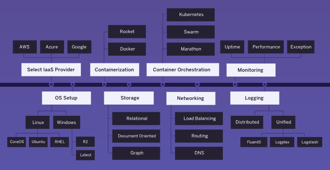

# Platform-as-a-Service (PaaS)

Learn to deploy web applications on Platform-as-a-Service (PaaS) cloud
application platforms such as [GitHub Pages][github-pages], [Netlify][netlify]
and [Render][render].

<!-- slide-include ../../BANNER.md -->

**You will need**

* [Git][git]
* A free [GitHub][github] account

**Recommended reading**

* [Command line](../cli/)
* [Git](../git/), [Git branching](../git-branching/), [Collaborating with
  Git](../git-collaborating), [Git hooks](../git-hooks)

<!-- START doctoc generated TOC please keep comment here to allow auto update -->
<!-- DON'T EDIT THIS SECTION, INSTEAD RE-RUN doctoc TO UPDATE -->

- [What is Heroku?](#what-is-heroku)
  - [Cloud service models](#cloud-service-models)
  - [Infrastructure as a Service (IaaS)](#infrastructure-as-a-service-iaas)
  - [Platform as a Service (PaaS)](#platform-as-a-service-paas)
  - [How does Heroku work?](#how-does-heroku-work)
- [Getting started on Heroku with Node.js](#getting-started-on-heroku-with-nodejs)
  - [Create an Express app](#create-an-express-app)
  - [Make it a Git repository](#make-it-a-git-repository)
  - [Do you have a credit card?](#do-you-have-a-credit-card)
  - [Create the app on Heroku (**with credit card**)](#create-the-app-on-heroku-with-credit-card)
  - [Use an existing Heroku app (**without credit card**)](#use-an-existing-heroku-app-without-credit-card)
  - [Go to your dashboard](#go-to-your-dashboard)
  - [Provision database add-ons](#provision-database-add-ons)
  - [Configure your database URL from the environment](#configure-your-database-url-from-the-environment)
  - [Deploy it](#deploy-it)
  - [How?](#how)
  - [When do I pay?](#when-do-i-pay)
  - [Databases](#databases)
- [Troubleshooting](#troubleshooting)
- [Configuration](#configuration)
  - [Server listening port configuration](#server-listening-port-configuration)
  - [Accessing environment variables in Node.js](#accessing-environment-variables-in-nodejs)
  - [Setting environment variables locally](#setting-environment-variables-locally)
  - [Setting environment variables on Heroku](#setting-environment-variables-on-heroku)
- [Resources](#resources)

<!-- END doctoc generated TOC please keep comment here to allow auto update -->

## What is PaaS?

<!-- slide-front-matter class: center, middle -->

> **Platform-as-a-Service (PaaS)** is a **cloud deployment** service model where
> the developer deploys applications without the complexity of building and
> maintaing the infrastructure.

> [Heroku][heroku], one of the first cloud platforms, has been in development
> since June 2007, when it supported only the Ruby programming language, but now
> supports Java, **Node.js**, Scala, Clojure, Python, PHP, and Go. Today there
> are many alternatives such as [Netlify][netlify], [Fly][fly] or
> [Render][render].

### Cloud service models

Cloud-computing providers offer their services according to **different models**, some of which are listed below:

| Service models                      | What they provide         | Examples                                 |
| :---------------------------------- | :------------------------ | :--------------------------------------- |
| [Infrastructure as a Service][iaas] | Servers, virtual machines | Amazon EC2, Azure (Microsoft), Rackspace |
| [*Platform as a Service*][paas]     | *Runtime environments*    | Heroku, OpenShift, Netlify, Fly, Render  |
| [Software as a Service][saas]       | Online services           | Gmail                                    |
| [Functions as a Service][faas]      | Serverless environments   | Amazon Lambda, OpenWhisk (IBM)           |

### Infrastructure as a Service (IaaS)

With traditional cloud providers, you have to **set up, maintain and operate** the **infrastructure** on which your applications are run:

You'll often need a professional **system administrator** to do that for sizable projects.

### Platform as a Service (PaaS)

The goal of PaaS platforms is to get **straight to building applications**.

* Higher-level programming
* Reduced complexity
* Effective deployment with built-in infrastructure
* Easier maintenance
* Scaling

It's also a part of the [DevOps][devops] movement where software **dev**elopers increasingly step into the world of **op**eration**s** and vice-versa.

### How does a PaaS platform work?

PaaS platforms usually run your applications inside **containers** on a fully
**managed runtime environment**.

As a developer, you will deploy your **code** written with your favorite
programming language and framework to a **build system** which automatically
performs the necessary steps to build and deploy your application.

The various other components required to run and deploy your applications, such
as the **database** and **reverse proxy** are installed and configured for you.
The **system and language** stacks are **monitored, patched, and upgraded**, so
it's always ready and up-to-date.

### Is it magic?

A PaaS platform will often assume you are following the **conventions** of the
language or framework you're using. For example, when deploying a Node.js
application, many PaaS platforms assume:

* You are using npm, the Node.js Package Manager, and have a `package.json`
  file.
* The dependencies for your application can be installed by executing `npm
  install`.
* Your application can be run by executing `npm start`.

Similar conventions exist for each language supported by Heroku (e.g. using
Maven for Java, Composer for PHP, Bundler for Ruby).

As for automation, it is usually achieved through [Git hooks][git-hooks]. New
versions of your application will be **automatically deployed every time you
push your latest commits**.

### How do I use a PaaS platform?

You will usually **deploy by pushing your commits to a remote Git repository**,
hosted either directly on the PaaS platform you are using, or on GitHub (or your
favorite hosting service) if the PaaS platform supports it.

Many PaaS platforms offer **free plans with restrictions**. For example, Render
lets you use one free PostgreSQL database for 90 days. You can of course whip
out your credit card and pay to use it longer, or to have more
storage/power/etc.

When you need to **configure your application**, PaaS platforms will usually
allow you to define **environment variables** through a web interface. These
variables will be provided to your application when it is deployed.

Some PaaS platforms provide **command line tools** to help make and manage your
deployments. For example, there is the [Heroku CLI][heroku-cli] and the [Netlify
CLI][netlify-cli].

[dev-center]: https://devcenter.heroku.com
[devops]: https://en.wikipedia.org/wiki/DevOps
[env-vars]: https://en.wikipedia.org/wiki/Environment_variable
[express]: https://expressjs.com
[express-generator]: https://www.npmjs.com/package/express-generator
[faas]: https://en.wikipedia.org/wiki/Function_as_a_Service
[fly]: https://fly.io
[free-dyno-hours]: https://devcenter.heroku.com/articles/free-dyno-hours
[getting-started]: https://devcenter.heroku.com/articles/getting-started-with-nodejs#introduction
[git]: https://git-scm.com
[git-hooks]: https://git-scm.com/book/gr/v2/Customizing-Git-Git-Hooks
[github]: https://github.com
[github-pages]: https://pages.github.com
[heroku]: https://www.heroku.com/home
[heroku-cleardb]: https://devcenter.heroku.com/articles/cleardb
[heroku-cli]: https://devcenter.heroku.com/articles/heroku-cli
[heroku-dashboard]: https://dashboard.heroku.com
[heroku-postgres]: https://devcenter.heroku.com/articles/heroku-postgresql
[heroku-redis]: https://devcenter.heroku.com/articles/heroku-redis
[iaas]: https://en.wikipedia.org/wiki/Cloud_computing
[netlify]: https://www.netlify.com
[netlify-cli]: https://docs.netlify.com/cli/get-started/
[node]: https://nodejs.org/en/
[node-process-env]: https://nodejs.org/api/process.html#process_process_env
[paas]: https://en.wikipedia.org/wiki/Platform_as_a_service
[php-getenv]: https://www.php.net/manual/en/function.getenv.php
[pricing]: https://www.heroku.com/pricing
[render]: https://render.com
[saas]: https://en.wikipedia.org/wiki/Software_as_a_service
