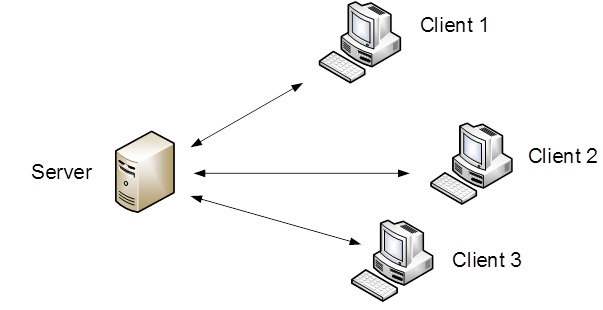
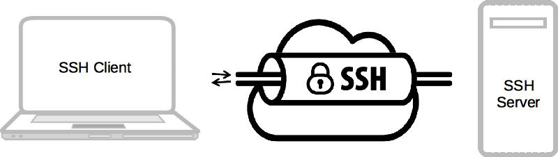
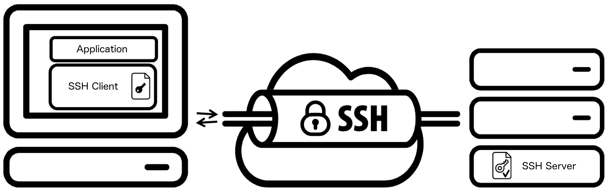
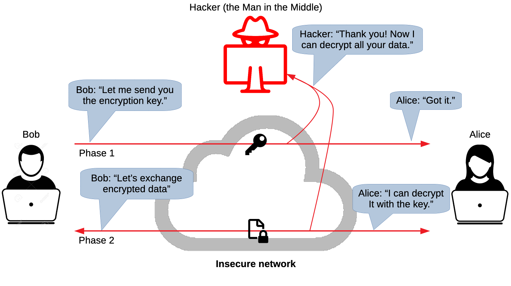
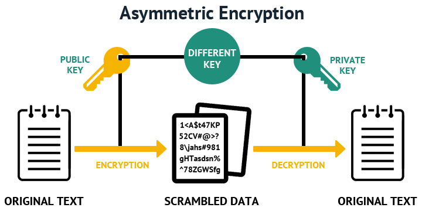
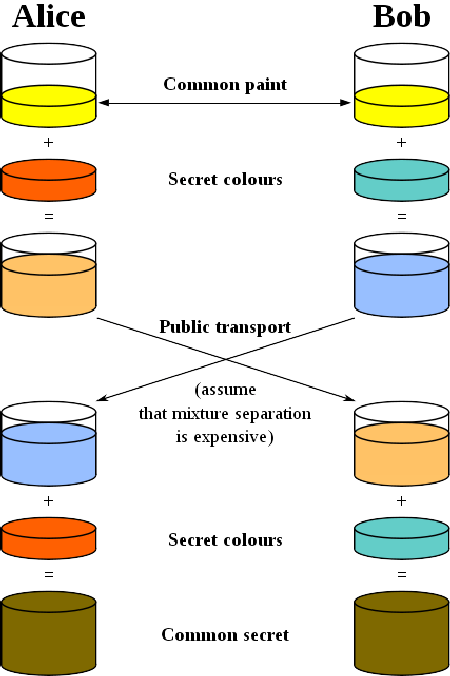
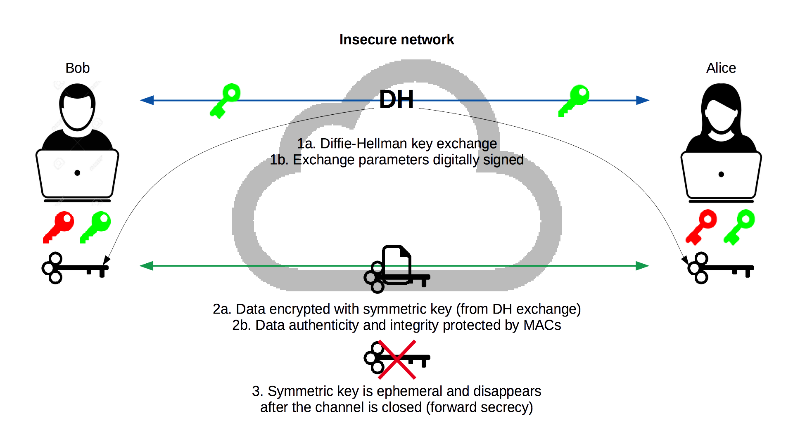
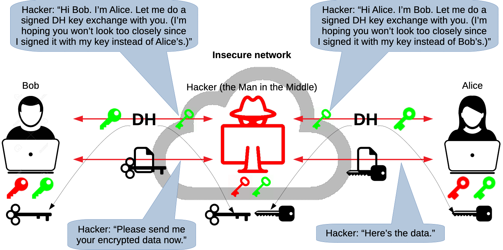
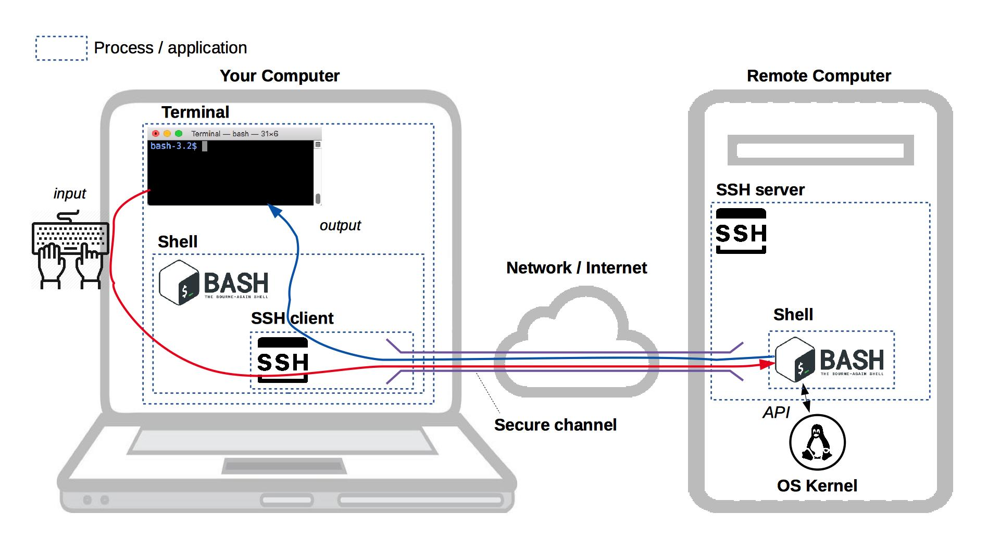

# Secure Shell (SSH)

Learn about the SSH cryptographic network protocol and how to use the SSH command line tool to connect to other computers.

<!-- slide-include ../../BANNER.md -->

**You will need**

* A Unix CLI

**Recommended reading**

* [Command Line Introduction](../cli/)

<!-- START doctoc generated TOC please keep comment here to allow auto update -->
<!-- DON'T EDIT THIS SECTION, INSTEAD RE-RUN doctoc TO UPDATE -->


- [What is SSH?](#what-is-ssh)
  - [How does it work?](#how-does-it-work)
  - [How is it secure?](#how-is-it-secure)
- [Secure channel](#secure-channel)
  - [Symmetric encryption](#symmetric-encryption)
  - [Asymmetric cryptography](#asymmetric-cryptography)
  - [Asymmetric encryption](#asymmetric-encryption)
  - [Asymmetric key exchange](#asymmetric-key-exchange)
  - [Man-in-the-Middle attack on Diffie-Hellman](#man-in-the-middle-attack-on-diffie-hellman)
  - [Asymmetric digital signature](#asymmetric-digital-signature)
  - [Cryptographic hash functions](#cryptographic-hash-functions)
  - [Combining it all together in SSH](#combining-it-all-together-in-ssh)
- [The `ssh` command](#the-ssh-command)
- [SSH known hosts](#ssh-known-hosts)
  - [Are you really the SSH server I'm looking for?](#are-you-really-the-ssh-server-im-looking-for)
  - [Known hosts file](#known-hosts-file)
- [Password authentication](#password-authentication)
- [Logging in with SSH](#logging-in-with-ssh)
  - [Typing commands while connected through SSH](#typing-commands-while-connected-through-ssh)
  - [Disconnecting](#disconnecting)
  - [Where am I?](#where-am-i)
- [Logging in or running a command](#logging-in-or-running-a-command)
- [Public key authentication](#public-key-authentication)
  - [How does it work?](#how-does-it-work-1)
  - [Do I already have a key pair?](#do-i-already-have-a-key-pair)
  - [The `ssh-keygen` command](#the-ssh-keygen-command)
  - [How does public key authentication work?](#how-does-public-key-authentication-work)
  - [The `authorized_keys` file](#the-authorized_keys-file)
  - [Using multiple keys](#using-multiple-keys)
  - [Key management](#key-management)
- [SSH for other network services](#ssh-for-other-network-services)
  - [Using `scp`](#using-scp)
  - [Using SFTP](#using-sftp)
- [SSH agent](#ssh-agent)
  - [Running an SSH agent](#running-an-ssh-agent)
  - [Using the SSH agent](#using-the-ssh-agent)
- [References](#references)

<!-- END doctoc generated TOC please keep comment here to allow auto update -->


## What is SSH?

<!-- slide-front-matter class: center, middle -->

> SSH is a **cryptographic network protocol** for operating network services **securely over an unsecured network**.

> Its main uses are **remote command-line login** and **securing network services like Git or FTP**.

### How does it work?

SSH is a **client-server** protocol.

<p class='center'></p>

Using an SSH client, a user (or application) on machine A can connect to an SSH server running on machine B,
either to log in (with a command line shell) or to execute programs.

### How is it secure?

<!-- slide-column -->

**Step 1:** SSH establishes a **secure channel** using various **cryptographic techniques**.
This is handled automatically by the SSH client and server.

<!-- slide-column 50 -->

<p class='center'></p>

<!-- slide-container -->

<!-- slide-column -->

**Step 2:** The user or service that wants to connect to the SSH server must **authenticate** to gain access,
for example with a password.

<p class='center'></p>

**Step 3:** The logged-in user or service can do stuff on the server.

> Note that steps 1 and 2 are **separate and unrelated processes**.


## Secure channel

SSH establishes a **secure channel** between two computers **over an insecure network** (e.g. a local network or the internet).

<p class='center'></p>

Establishing and using this secure channel requires a combination of:

* [**Symmetric encryption**][symmetric-encryption]
* [**Asymmetric cryptography**][pubkey]
  * A **key exchange** method
  * **Digital signatures**
* [**Hash-based Message Authentication Codes (HMAC)**][hmac]

### Symmetric encryption

[Symmetric-key algorithms][symmetric-encryption] can be used to encrypt communications between two or more parties using a **shared secret**.
[AES][aes] is one such algorithm.

<p class='center'></p>

**Assuming all parties possess the secret key**, they can encrypt data, send it over an insecure network, and decrypt it on the other side.
An attacker who intercepts the data **cannot decrypt it without the key** (unless a weakness is found in the algorithm or [its implementation][enigma-operating-shortcomings]).

#### Example: symmetric encryption with AES

> **Windows users using Git Bash** may want to open a new shell with the command `winpty bash` before attempting to reproduce these examples.
> This is because of a [bug in Git Bash](https://github.com/mintty/mintty/issues/540) which causes problems with some interactive commands.

Create a **plaintext** file containing the words "too many secrets":

```bash
$> cd /path/to/projects

$> mkdir aes-example

$> cd aes-example

$> echo 'too many secrets' > plaintext.txt
```

You may encrypt that file with the [OpenSSL library][openssl] (installed on most computers).
Executing the following command pipeline will prompt you for an encryption key:

```bash
$> cat plaintext.txt | openssl aes-256-cbc > ciphertext.aes
enter aes-256-cbc encryption password:
Verifying - enter aes-256-cbc encryption password:
```

#### Example: symmetric encryption with AES (decryption)

The resulting `ciphertext.aes` file cannot be decrypted without the key.
Executing the following command pipeline and entering the same key as before when prompted will decrypt it:

```bash
$> cat ciphertext.aes | openssl aes-256-cbc -d
enter aes-256-cbc decryption password:
too many secrets
```

#### Symmetric encryption over an insecure network

Both parties must already possess the shared encryption key to perform symmetric cryptography.
It used to be **physically transferred**,
for example in the form of the codebooks used to operate the German [Enigma machine][enigma] during World War II.
But that is **impractical for modern computer networks**.
And **sending the key over the insecure network risks it being compromised** by a [Man-in-the-Middle attack][mitm].

<p class='center'></p>

### Asymmetric cryptography

[Public-key or asymmetric cryptography][pubkey] is any cryptographic system that uses pairs of keys:
**public keys** which may be disseminated widely, while **private keys** which are known only to the owner.
It has several use cases:

<!-- slide-column -->

**Encryption**

Encrypt and decrypt data.


<!-- slide-column -->

**Key exchange**

Securely exchange shared secret keys.


<!-- slide-column -->

**Digital Signatures**

Verify identity and protect against tampering.


#### How does asymmetric cryptography work?

There is a mathematical relationship between a public and private key,
based on problems that currently admit no efficient solution
such as [integer factorization][integer-factorization], [discrete logarithm][discrete-logarithm] and [elliptic curve][elliptic-curve] relationships.

Here's a [mathematical example][pubkey-math] based on integer factorization.

Basically, these problems allow a private-public key pair to have the following properties:

* It is easy and **computationally economical to generate a key pair**.
* It is too **computationally expensive to find the private key** from its paired public key.
* Possession of the the private key allows you to solve complex mathematical problems based on the public key,
  thus **proving that you own that public key**.

Effective security only requires keeping the private key private;
**the public key can be openly distributed without compromising security**.

### Asymmetric encryption

<p class='center'></p>

One use case of asymmetric cryptography is **asymmetric encryption**, where the **sender encrypts a message with the recipient's public key**.
The message can only be **decripted by the recipient using the matching private key**.

#### Example: asymmetric encryption with RSA (key pair)

Let's try encryption with [RSA][rsa] this time, an asymmetric algorithm.
To do that, we need to generate a **key pair, i.e. a private and public key**.
The following commands will generate first a private key in a file named `private.pem`,
then a corresponding public key in a file named `public.pem`:

```bash
$> cd /path/to/projects

$> mkdir rsa-example

$> cd rsa-example

$> openssl genrsa -out private.pem 1024
Generating RSA private key, 1024 bit long modulus
.............++++++
.................................++++++
e is 65537 (0x10001)

$> openssl rsa -in private.pem -out public.pem -outform PEM -pubout
writing RSA key

$> ls
private.pem public.pem
```

#### Example: asymmetric encryption with RSA (encryption)

Create a file containing your **plaintext**:

```bash
$> echo 'too many secrets' > plaintext.txt
```

**Encrypt it with the public key** using the OpenSSL library:

```bash
$> openssl rsautl -encrypt -inkey public.pem -pubin \
   -in plaintext.txt -out ciphertext.rsa
```

In addition to your key pair, you should have two additional files containing the plaintext and ciphertext:

```bash
$> ls
ciphertext.rsa plaintext.txt private.pem public.pem
```

#### Example: asymmetric encryption with RSA (decryption)

The ciphertext can now be **decrypted with the corresponding private key**:

```bash
$> openssl rsautl -decrypt -inkey private.pem -in ciphertext.rsa
too many secrets
```

Note that you **cannot decrypt the ciphertext using the public key**:

```bash
$> openssl rsautl -decrypt -inkey public.pem -in ciphertext.rsa
unable to load Private Key [...]
```

Of course, a hacker using **another private key cannot decrypt it either**:

```bash
$> openssl genrsa -out hacker-private.pem 1024
Generating RSA private key, 1024 bit long modulus [...]

$> openssl rsautl -decrypt -inkey hacker-private.pem -in ciphertext.rsa
RSA operation error [...]
```

Hence, you can encrypt data and send it to another party provided that you have their public key.
**No single shared key needs to be exchanged** (the private key remains a secret known only to the recipient).

#### Asymmetric encryption and forward secrecy

Asymmetric encryption protects data sent over an insecure network from attackers,
but **only as long as the private keys remain private**.
It does not provide **forward secrecy**, meaning that if the private keys are compromised in the future,
all data encrypted in the past is also compromised.


### Asymmetric key exchange

So far we learned that:

* Symmetric encryption works but provides no solution
  to the problem of securely transmitting the shared secret key.
* Asymmetric encryption works even better as it does not require a shared secret key,
  but it does not provide forward secrecy.

Additionally, it's important to note that **symmetric encryption is much faster than asymmetric encryption**.
It's also less complex and can easily be implemented as hardware (most modern processors support hardware-accelerated AES encryption).

Ideally, we would want to be able to share a fast symmetric encryption key without transmitting it physically or over the network.
This is where asymmetric cryptography comes to the rescue again.
Encryption is not all it can do; it can also do **key exchange**.

The [Diffie-Hellman Key Exchange][dh], invented in 1976 by Whitfield Diffie and Martin Hellman,
was one of the first public key exchange protocols allowing users to **securely exchange secret keys**
even if an attacker is monitoring the communication channel.

#### Diffie-Hellman key exchange

<!-- slide-column -->

This conceptual diagram illustrates the general idea behind the protocol:

* Alice and Bob choose a **random, public starting color** (yellow).
* Then they choose a **secret color known only to themselves** (orange and blue-green).
* Then they **mix their own secret color with the mutually shared color**,
  (resulting in orange-tan and light-blue), and **publicly exchange** the two mixed colors.
* Finally, Alice and Bob **mix the color he or she received** from each other **with his or her own private color** (yellow-brown).

<!-- slide-column 35 -->



<!-- slide-container -->

The result is a final color mixture that is **identical to the partner's final color mixture**,
and which was never shared publicly.
When using large numbers rather than colors,
it would be computationally difficult for a third party to determine the secret numbers.

### Man-in-the-Middle attack on Diffie-Hellman

The Diffie-Hellman key exchange solves the problem of transmitting
the shared secret key over the network by computing it using asymmetric cryptography.
It is therefore never transmitted.

However, **a Man-in-the-Middle attack is still possible** if the attacker can position himself
between the two parties to **intercept and relay all communications**.


### Asymmetric digital signature

One of the other main uses of asymmetric cryptography is performing **digital signatures**.
A signature proves that the message came from a particular sender.

<!-- slide-column -->

* Assuming **Alice wants to send a message to Bob**,
  she can **use her private key to create a digital signature based on the message**,
  and send both the message and the signature to Bob.
* Anyone with **Alice's public key can prove that Alice sent that message**
  (only the corresponding private key could have generated a valid signature for that message).
* **The message cannot be tampered with without detection**,
  as the digital signature will no longer be valid
  (since it based on both the private key and the message).

<!-- slide-column 30 -->


<!-- slide-container -->

> Note that a digital signature **does not provide confidentiality**.
> Although the message is protected from tampering, it is **not encrypted**.

#### Example: digital signature with RSA (signing)

In the same directory as the previous example (asymmetric encryption with RSA),
create a `message.txt` file with the message that we want to digitally sign:

```bash
$> echo "Hello Bob, I like you" > message.txt
```

The following OpenSSL command will use the private key file `private.pem` (from the previous example)
and generate a digital signature based on the message file `message.txt`.
The signature will be stored in the file `signature.rsa`.

```bash
$> openssl dgst -sha256 -sign private.pem -out signature.rsa message.txt
```

If you open the file, you can see that it's simly binary data.
You can see it base64-encoded with the following command:

```bash
$> openssl base64 -in signature.rsa
```

#### Example: digital signature with RSA (verifying)

The following command uses the public key to check that the signature is valid for the message:

```bash
$> openssl dgst -sha256 -verify public.pem -signature signature.rsa message.txt
Verified OK
```

If you modify the message file and run the command again,
it will detect that the digital signature no longer matches the message:

```bash
$> openssl dgst -sha256 -verify public.pem -signature signature.rsa message.txt
Verification Failure
```

### Cryptographic hash functions

<!-- slide-column -->

A [cryptographic hash function][hash] is a [hash function][hash-non-crypto] that has the following properties:

* The same message always results in the same hash (deterministic).
* Computing the hash value of any message is quick.
* It is infeasible to generate a message from its hash value except by trying all possible messages (one-way).

<!-- slide-column 45 -->


<!-- slide-container -->

* A small change to a message should change the hash value so extensively that the new hash value appears uncorrelated with the old hash value.
* It is infeasible to find two different messages with the same hash value (collisions).

SSH uses [Message Authentication Codes (MAC)][mac], which are based on cryptographic hash functions,
to protect both the data integrity and authenticity of all messages sent through the secure channel.

### Combining it all together in SSH

SSH uses most of the previous cryptographic techniques together to achieve as secure a channel as possible:



#### Man-in-the-Middle attack on SSH



#### Threats countered

SSH counters the following threats:

* **Eavesdropping:** an attacker can intercept but not decrypt communications going through SSH's secure channel.
* **Connection hijacking:** an active attacker can hijack TCP connections due to a weakness in TCP.
  SSH's integrity checking detects this and shuts down the connection without using the corrupted data.
* **DNS and IP spoofing:** an attacker may hack your naming service to direct you to the wrong machine.
* **Man-in-the-Middle attack:** an attacker may intercept all traffic between you and the real target machine.

The last two are countered by the asymmetric digital signature performed by the server on the DH key exchange,
**as long as the client actually checks the server-supplied public key**.
Otherwise, there is no guarantee that the server is genuine.

#### Threats not countered

SSH does not counter the following threats

<!-- slide-column -->

* **Password cracking:** if password authentication is enabled,
  a weak password might be easily brute-forced or obtained through [side-channel attacks][side-channel].
  Consider using public key authentication instead to mitigate some of these risks.

<!-- slide-column -->


<!-- slide-container -->

* **IP/TCP denial of service:** since SSH operates on top of TCP,
  it is vulnerable to some attacks against weaknesses in TCP and IP,
  such as [SYN flood][syn-flood].
* **Traffic analysis:** although the encrypted traffic cannot be read,
  an attacker can still glean a great deal of information by simply analyzing
  the amount of data, the source and target addresses, and the timing.
* **Carelessness and coffee spills:** SSH doesn't protect you if you write
  your password on a post-it note and paste it on your computer screen.


## The `ssh` command

The `ssh` command is available on most Unix-like systems (e.g. Linux & macOS) and in Unix shells on Windows (e.g. Git Bash or WSL):
Its basic syntax is:

```
ssh [user@]hostname [command]
```

Here's a few examples:

* `ssh example.com` - Connect to the SSH server at `example.com` and log in (with the same username as in your current shell).
* `ssh jdoe@example.com` - Connect to the SSH server at `example.com` and log in as user `jdoe`.
* `ssh 192.168.50.4 hostname` - Run the `hostname` command as user `jdoe` on the SSH server at `192.168.50.4`.

Run `man ssh` to see available options (or just `ssh` in Git Bash).


## SSH known hosts

When you connect to an SSH server for the first time,
you will most likely get a message similar to this:

```bash
$> ssh example.com
The authenticity of host 'example.com (192.168.50.4)' can't be established.
ECDSA key fingerprint is SHA256:colYVucS/YU0JSK7woiLAf5ChPgJYAR1BWJlET2EwDI=
Are you sure you want to continue connecting (yes/no)?
```

What does this mean? *I thought SSH was **secure**?*

### Are you really the SSH server I'm looking for?

As we've seen, when SSH establishes a secure channel,
a Diffie-Hellman asymmetric key exchange will occur to agree on a secret symmetric encryption key.
To secure this exchange, the server will perform an asymmetric digital signature
so that no attacker can impersonate the server.

To verify the signature, **your SSH client will ask the server for its public key**.
**This is where a man-in-the-middle attack is possible.**
SSH warns you that someone is sending you a public key,
but it has no way of verifying whether it's actually the server's public key,
or whether it's the public key of an attacker performing a man-in-the-middle attack.

Basically, **SSH makes the following guarantee**:

* Once you have established a secure channel to a given server,
  no third party can decrypt your communications.
  Forward secrecy is also guaranteed in the event your credentials are compromised in the future.

**SSH does not guarantee** that:

* You are connecting to the correct server.
  You may be connecting to an attacker's server.

#### How can I solve this problem?

If you are using SSH to transmit sensitive data,
**you should check that the server's public key is the correct one before connecting.**

One way to do this is to use the **key fingerprint** that is shown to you when first connecting.
The key fingerprint is a [cryptographic hash][hash] of the public key:

```bash
ECDSA key fingerprint is SHA256:colYVucS/YU0JSK7woiLAf5ChPgJYAR1BWJlET2EwDI=
```

Some services that allow you to connect over SSH, like GitHub,
[publish their SSH key fingerprints on their website][github-fingerprints]
so that users may check them.
In other cases, the key may be physically transmitted to you, or dictated over the phone.

You should **check that both fingerprints match** before proceeding with the connection.
If it does not, either you typed the wrong server address, or an attacker is trying to hack your connection.

### Known hosts file

If you accept the connection, SSH will save the server's address and public key in its **known hosts file**.
You can see the contents of this file with the following command:

```bash
$> cat ~/.ssh/known_hosts
example.com,192.168.50.4 ecdsa-sha2-nistp256 eTJtK2wrRzhW5RQzUHprbFJa...
```

The format of each line in this file is `[domain],[ipaddr] algorithm pubkey`.

The line above means that when SSH connects to `example.com` at IP address `192.168.50.4`,
it expects the server to send this specific public key (`eTJtK2wrRzhW5RQzUHprbFJa...`)
using the [ECDSA][ecdsa] algorithm
(another asymmetric algorithm like RSA, based on elliptic curve cryptography).

#### Adding public keys to the known hosts file

Another solution to SSH man-in-the-middle attacks when first connecting
is to put the server's public key in the known hosts file yourself.

If you have previously obtained the server's public key (the full key, not just the fingerprint),
you can **add it to the known hosts file** before attempting to connect.

If you do that, SSH will consider that the server is already a *known host*,
and will not prompt you to accept the public key.

#### Preventing future man-in-the-middle attacks

The known hosts file has another purpose.
Once SSH knows to expect a specific public key for a given domain or IP address,
it will warn you if that public key changes:

```
$> ssh 192.168.50.4
@@@@@@@@@@@@@@@@@@@@@@@@@@@@@@@@@@@@@@@@@@@@@@@@@@@@@@@@@@@
@    WARNING: REMOTE HOST IDENTIFICATION HAS CHANGED!     @
@@@@@@@@@@@@@@@@@@@@@@@@@@@@@@@@@@@@@@@@@@@@@@@@@@@@@@@@@@@
IT IS POSSIBLE THAT SOMEONE IS DOING SOMETHING NASTY!
Someone could be eavesdropping on you right now (man-in-the-middle attack)!
It is also possible that a host key has just been changed.
The fingerprint for the ECDSA key sent by the remote host is
SHA256:FUwFoK/hcqRAvJgDFmljwOur8t/mhfbm4tfIxdaVTQ==.
Please contact your system administrator.
Add correct host key in /path/to/.ssh/known_hosts to get rid of this message.
Offending ECDSA key in /path/to/.ssh/known_hosts:33
ECDSA host key for 192.168.50.4 has changed and you have requested strict checking.
Host key verification failed.
```

As the message mentions, either the server changed its SSH key pair,
or **an attacker may be intercepting your communications**.

If you're sure it's not an attack, for example if you know the server actually changed its key pair,
you can eliminate this warning by putting the correct public key in the known hosts file
(or by removing the offending line).


## Password authentication

Establishing a secure channel is one thing,
but that only ensures an attacker cannot intercept communications.
Once the channel is established, you must still **authenticate**,
i.e. **prove that you are in fact the user you are attempting to log in as**.

How you authenticate depends on how the SSH server is configured.
**Password authentication** is one method.
When enabled, the SSH server will prompt you for the correct password;
in this example, the password of the user named `jdoe` in the server's user database:

```bash
$> ssh jdoe@192.168.50.4

The authenticity of host '192.168.50.4 (192.168.50.4)' can't be established.
ECDSA key fingerprint is SHA256:E4GYJCEoz+G5wv+EdkPyRLytgP7aTj9BS9lr1d38Xg==.
Are you sure you want to continue connecting (yes/no)? yes
Warning: Permanently added '192.168.50.4' (ECDSA) to the list of known hosts.

jdoe@192.168.50.4's password:
```

> Most SSH clients will not display anything while you type your password.
> Simply press `Enter` when you're done to submit it.


## Logging in with SSH

If you run the `ssh` command with no extra arguments and authenticate with your password,
**SSH will run the default [shell][shell]** configured for that user, typically [Bash][bash] on Linux servers:

```bash
$> ssh jdoe@192.168.50.4
jdoe@192.168.50.4's password:
Welcome to Ubuntu 18.04.1 LTS (GNU/Linux 4.15.0-33-generic x86_64)

  System information as of Fri Sep  7 13:16:56 UTC 2018
  ...

$
```

> Note that you may have a different command line prompt once you are connected,
in this example `$` instead of `$>`.

### Typing commands while connected through SSH

You are now **connected to a Bash shell running on the server**.
Anything you type is encrypted through SSH's secure channel and interpreted by that shell.
Any data it outputs is sent back through the channel and displayed in your terminal.

<p class='center'></p>

### Disconnecting

Disconnect with the command `exit` (or with `Ctrl-D` on Linux or macOS).
You should be back to the shell running on your local computer, with your usual prompt:

```bash
$ exit
Connection to 192.168.50.4 closed.

$>
```

### Where am I?

Sometimes, you might forget what shell your terminal is connected to.
Is it a shell on your local machine or one running on the server?

If you're not sure, the `hostname` command may help you.
It prints the network name of the current machine:

```bash
$> hostname
MyComputer.local

$> ssh jdoe@192.168.50.4
jdoe@192.168.50.4's password:

$ hostname
example.com
```

In this example, the local computer is named `MyComputer.local`,
while the server is named `example.com`.

As you can see, the `hostname` command returns different results before and after connecting to the server with SSH,
because it's running on your local machine the first time, but is running on the server the second time.


## Logging in or running a command

When you execute `ssh` with the `[command]` option,
it will execute the command and close the connection as soon as that command is done.

Run this from your local shell:

```bash
$> hostname
MyComputer.local

$> ssh jdoe@192.168.50.4 echo Hello World
Hello World

$> hostname
MyComputer.local
```

As you can see, you are still in your local shell.
The connection was closed as soon as the `echo` command completed.


## Public key authentication

Password authentication works, but it has some drawbacks:

* Attackers may try to [brute force][brute-force] your password.
* If an attacker succeeds in performing a man-in-the-middle attack
  (for example if you forget to check the public key the first time you connect),
  he may steal your password.
* If the server is compromised, an attacker may modify the SSH server
  to steal your password.

As explained earlier, SSH uses asymmetric cryptography (among other techniques) to establish its secure channel.
It's **also possible to use asymmetric cryptography to authenticate**.

### How does it work?

If you have a **private-public key pair**, you can **give your public key to the server**.
Using **your private key**, your SSH client **can prove to the SSH server that you are the owner of that public key**.

This has advantages over password authentication:

* It's virtually impossible to brute-force
  (it is larger and probably has much more [entropy][entropy] than your password).
* Your private key will not be compromised by a man-in-the-middle attack or if the server is compromised,
  as it is never transmitted to the server, only used to solve mathematical problems based on the public key.

> Note that **public key authentication is only as secure as the file containing your private key**.
> If you publish that file anywhere or allow your local machine to be compromised,
> the attacker will be able to impersonate you on any server or service where you put your public key.

### Do I already have a key pair?

By default, SSH keys are stored in the `.ssh` directory in your home directory.
You can list its contents with this `ls` command:

```bash
$> ls ~/.ssh
id_rsa  id_rsa.pub
```

If you have the `id_rsa` and `id_rsa.pub` files, you're good to go,
since SSH expects to find your main RSA private key at `~/.ssh/id_rsa`.
(You might also have a default key pair using another algorithm,
such as an ECDSA key pair with files named `id_ecdsa` and `id_ecdsa.pub`.)

If the directory doesn't exist or is empty, you don't have a key pair yet.

You may have a key with a different name, e.g. `github_rsa` & `github_rsa.pub`,
as is sometimes generated by some software.
You can use this key if you want, but since it doesn't have the default name,
you will have to add a `-i ~/.ssh/github_rsa` option to all your SSH commands.
Generating a new key with the default name for command line use would probably be easier.

> On Windows, you can display hidden files to access your `.ssh` directory manually.
> On macOS, type `open ~/.ssh` in your Terminal.

### The `ssh-keygen` command

The `ssh-keygen` command is usually installed along with SSH and can generate a key pair for you.
It will ask you a couple of questions about the key:

* Where do you want to save it?
  Simply press enter to use the proposed default location (`~/.ssh/id_rsa` for an RSA key).
* What password do you want to protect the key with?
  Enter a password or simply press enter to use no password.

> **Should I protect my key with a password?**
>
> If you enter no password, your key will be stored in the clear.
> This will be convenient as you will not have to enter a password when you use it.
> However, any malicious code you allow to run on your machine could easily steal it.
>
> If your key is protected by a password,
> you can run an [SSH agent][ssh-agent] to unlock it only once per session instead of every time you use it.

#### Generate a private-public key pair

Simply running `ssh-keygen` with no arguments will ask you the required information and generate a new RSA key pair:

```bash
$> ssh-keygen
Generating public/private rsa key pair.
Enter file in which to save the key (/home/jdoe/.ssh/id_rsa):
Created directory '/home/jdoe/.ssh'.
Enter passphrase (empty for no passphrase):
Enter same passphrase again:
Your identification has been saved in /home/jdoe/.ssh/id_rsa.
Your public key has been saved in /home/jdoe/.ssh/id_rsa.pub.
The key fingerprint is:
SHA256:MmwL9n4KOUCuLoyvGJ7nWRDXjTSGAXO8AcCNVqmDJH0 jdoe@497820feb22a
The key's randomart image is:
+---[RSA 2048]----+
|.o===oo+         |
|.=.oE++ +        |
|= oo .oo .       |
|.=  oo           |
|  +.o = S        |
| . o.= +         |
|=   +.o          |
|*o..o+  .        |
|+*+o  oo         |
+----[SHA256]-----+
```

### How does public key authentication work?

To authenticate you, the server will need your **public key**.
That way, you will be able to prove, using your **private key**, that you are the owner of that public key.

> Remember, **your private key MUST remain private** (i.e. the `id_rsa` file).
> You should **never** give it to any person, server or web service.
> Only give your public key (i.e. the `id_rsa.pub` file).

### The `authorized_keys` file

To authenticate you, the SSH server will look for the **authorized keys** file for your user account (there is one for each user).
By default, the path to this file is `~/.ssh/authorized_keys` on the computer where the SSH server is running (not your local machine).

This file is simply a list of the public keys that should be granted access to that account
(provided that you can prove ownership of the key):

```
ssh-rsa AAAAB3NzaC1yc2E... key1
ssh-rsa fE2deXdtagpHXsa... key2
...
```

You can see its contents by running `cat ~/.ssh/authorized_keys` on the target machine.

It may not exist yet if you have never authenticated with a public key.

#### Using `ssh-copy-id`

The `ssh-copy-id` uses the same syntax as the `ssh` command to connect to another computer (e.g. `ssh-copy-id jdoe@192.168.50.4`).
Instead of opening a new shell, however, it will **copy your local public key(s) to your user account's
`authorized_keys` file** on the target computer.

You will probably have to enter your password, so `ssh-copy-id` can log in and copy your key.
But once that is done, **SSH should switch to public key authentication** and you should not have to enter your password again to log in.
SSH will use your private key to authenticate you instead.
(You may have to enter your private key's password though, if it is protected by one.)

Log out and connect again with `ssh` to see it in action.

> You can also create the `authorized_keys` file manually.
> Note that both the file and its parent directory must have permissions that make it accessible only to your user account,
> or the SSH server will refuse to use it for security reasons.
> The following commands can set up the file on the target machine:
>
>     $> mkdir -p ~/.ssh && chmod 700 ~/.ssh
>     $> touch ~/.ssh/authorized_keys && chmod 600 ~/.ssh/authorized_keys

### Using multiple keys

You may have multiple key pairs:

* Some key pairs may have been generated by other programs or web services.
  For example, some Git user interfaces generate a key pair to access GitHub,
  or Amazon Web Services' Elastic Compute Cloud (EC2) generates key pairs to give you access to their virtual machines.
* You may manually generate a key pair with a non-default name by specifying a different filename when running `ssh-keygen`.

Having multiple key pairs may be part of a security strategy to limit the access an attacker might gain if one of them is compromised.

To use a specific key pair, use the `ssh` command's `-i` option,
which allows you to choose the private key file you want to use:

```bash
$> ssh -i ~/.ssh/custom_key_rsa jdoe@192.168.50.4
```

> Note: it is the private key file you want to use with the `-i` option, not the public key,
> as the private key is the one your SSH client will use to prove that it owns the public key.

### Key management

A few tips on managing your key pairs:

* You may disseminate your **public key** freely to authenticate to other computers or services.
* **NEVER give your private key to anyone**.
* Conversely, you may copy your private key to another computer of yours if you want it to have the same access to other computers or services.
* You may want to **back up your private and public key files** (`id_rsa` and `id_rsa.pub`)
  so that you don't have to regenerate a pair if you lose your computer or switch to another computer.
  (You would then have to replace the old public key with the new one everywhere you used it.)
* Use `ssh-copy-id` to copy your public key to other computers to use public key authentication instead of password authentication.
* For web services using public key authentication (e.g. GitHub),
  you usually have to manually copy the public key file's contents (`id_rsa.pub`) and provide it to them in your account's settings.
* **If a private key is compromised** (e.g. your computer is stolen),
  you should **remove the corresponding public key** from computers and web services you have copied it to.


## SSH for other network services

As mentionned initially, SSH is a network protocol.
It can be used not only for command line login, but to secure other network services.

A few examples are:

* [Secure Copy (`scp`)][scp] - A means of securely transferring computer files between a local and remote host.
* [rsync][rsync] - Utility for efficiently transferring and synchronizing files across computer systems.
* [SSH File Transfer Protocol (SFTP)][sftp] - Network protocol that provides file access, file transfer and file management.
* [Git][git] - Version control system that can use SSH (among other protocols) to transfer versioned data.

### Using `scp`

In principle, the `scp` command works like the Unix `cp` (copy) command, except that it can copy files to and from other computers that have an SSH server running,
using the SSH syntax for connection:

```bash
$> echo bar > foo.txt
$> scp foo.txt jdoe@192.168.50.4:foo.txt
foo.txt 100% 4 0.6KB/s 00:00
```

This command copies your local `foo.txt` file to the home directory of the `jdoe` user account on the remote computer.
You can check that the file was indeed copied with a quick SSH command:

```bash
$> ssh jdoe@192.168.50.4 cat foo.txt
bar
```

You can also copy files from the remote computer to your local computer:

```bash
$> scp jdoe@10.192.167.228:foo.txt foo2.txt
foo.txt 100% 4 5.7KB/s 00:00

$> cat foo2.txt
bar
```

#### Secure copy tips

Here's a few additional examples of how to use the `scp` command:

* `scp foo.txt jdoe@192.168.50.4:bar.txt`

  Copy the local file `foo.txt` to a file named `bar.txt` in `jdoe`'s home directory on the remote computer.
* `scp foo.txt jdoe@192.168.50.4:`

  Copy the file to `jdoe`'s home directory with the same filename.
* `scp foo.txt jdoe@192.168.50.4:/tmp/foo.txt`

  Copy the file to the absolute path `/tmp/foo.txt` on the remote computer.
* `scp jdoe@192.168.50.4:foo.txt jsmith@192.168.50.5:bar.txt`

  Copy the file from one remote computer to another.
* `scp -r foo jdoe@192.168.50.4:foo`

  Recursively copy the contents of directory `foo` to the remote computer.

### Using SFTP

[SFTP][sftp] is an alternative to the original [FTP][ftp] protocol to transfer files.
Since FTP is [insecure][ftp-security] (e.g. passwords are sent unencrypted),
SFTP is an alternative that goes through SSH's secure channel and therefore poses fewer security risks.

Most modern FTP clients support SFTP.
Here's a couple:

* [Cyberduck][cyberduck]
* [WinSCP][winscp]

Many code editors also have SFTP support available through plugins.


## SSH agent

If you use a **private key that is password-protected**,
you lose part of the convenience of public key authentication:
you don't have to enter a password to authenticate to the server,
but **you still have to enter the key's password** to unlock it.

The `ssh-agent` command can help you there.
It runs a helper program that will let you unlock your private key(s) once,
then use it multiple times without entering the password again each time.

### Running an SSH agent

There are several ways to run an SSH agent.
You can run it in the background:

* [Single sign-on using SSH][ssh-agent-run]
* [Generating a new SSH key and adding it to the ssh-agent (GitHub)][ssh-agent-run-github]

Or you can run an agent and have it start a new shell for you:

```bash
$> ssh-agent bash
```

> The advantage of this last technique is that the agent will automatically quit when you exit the shell,
> which is good since it's not necessarily a good idea to keep an SSH agent running forever [for security reasons][ssh-agent-security].

### Using the SSH agent

The associated `ssh-add` command will take your default private key (e.g. `~/.ssh/id_rsa`)
and prompt you for your password to unlock it:

```bash
$> ssh-add
Enter passphrase for /Users/jdoe/.ssh/id_rsa:
Identity added: /Users/jdoe/.ssh/id_rsa (/Users/jdoe/.ssh/id_rsa)
```

The **unlocked key** is now **kept in memory by the agent**.
The `ssh` command (and other SSH-related commands like `scp`)
will not prompt you for that key's password as long as the agent keeps running.

If you want to load another key than the default one, you can specify its path:

```bash
$> ssh-add /path/to/custom_id_rsa
```


## References

* [How does SSH Work](https://www.hostinger.com/tutorials/ssh-tutorial-how-does-ssh-work)
* [Demystifying Symmetric and Asymmetric Methods of Encryption](https://www.cheapsslshop.com/blog/demystifying-symmetric-and-asymmetric-methods-of-encryption)
* [Diffie-Hellman Key Exchange][dh]
* [Simplest Explanation of the Math Behind Public Key Cryptography][pubkey-math]
* [SSH, The Secure Shell: The Definitive Guide](https://books.google.ch/books/about/SSH_The_Secure_Shell_The_Definitive_Guid.html?id=9FSaScltd-kC&redir_esc=y)


[aes]: https://en.wikipedia.org/wiki/Advanced_Encryption_Standard
[authorized_keys]: https://www.ssh.com/ssh/authorized_keys/openssh
[bash]: https://en.wikipedia.org/wiki/Bash_(Unix_shell)
[brute-force]: https://en.wikipedia.org/wiki/Brute-force_attack
[cyberduck]: https://cyberduck.io/
[dh]: https://en.wikipedia.org/wiki/Diffie%E2%80%93Hellman_key_exchange
[discrete-logarithm]: https://en.wikipedia.org/wiki/Discrete_logarithm
[ecdsa]: https://en.wikipedia.org/wiki/Elliptic_Curve_Digital_Signature_Algorithm
[elliptic-curve]: https://en.wikipedia.org/wiki/Elliptic-curve_cryptography
[enigma]: https://en.wikipedia.org/wiki/Enigma_machine#Operation
[enigma-operating-shortcomings]: https://en.wikipedia.org/wiki/Cryptanalysis_of_the_Enigma#Operating_shortcomings
[entropy]: https://en.wikipedia.org/wiki/Password_strength#Entropy_as_a_measure_of_password_strength
[forward-secrecy]: https://en.wikipedia.org/wiki/Forward_secrecy
[ftp]: https://en.wikipedia.org/wiki/File_Transfer_Protocol
[ftp-security]: https://en.wikipedia.org/wiki/File_Transfer_Protocol#Security
[github-fingerprints]: https://help.github.com/articles/github-s-ssh-key-fingerprints/
[git]: https://git-scm.com
[hash]: https://en.wikipedia.org/wiki/Cryptographic_hash_function
[hash-non-crypto]: https://en.wikipedia.org/wiki/Hash_function
[hmac]: https://en.wikipedia.org/wiki/HMAC
[integer-factorization]: https://en.wikipedia.org/wiki/Integer_factorization
[key-exchange]: https://en.wikipedia.org/wiki/Key_exchange
[mac]: https://en.wikipedia.org/wiki/Message_authentication_code
[mitm]: https://en.wikipedia.org/wiki/Man-in-the-middle_attack
[openssl]: https://www.openssl.org
[pubkey]: https://en.wikipedia.org/wiki/Public-key_cryptography
[pubkey-math]: https://www.onebigfluke.com/2013/11/public-key-crypto-math-explained.html
[rsa]: https://en.wikipedia.org/wiki/RSA_(cryptosystem)
[rsync]: https://en.wikipedia.org/wiki/Rsync
[scp]: https://en.wikipedia.org/wiki/Secure_copy
[sftp]: https://en.wikipedia.org/wiki/SSH_File_Transfer_Protocol
[shell]: https://en.wikipedia.org/wiki/Shell_(computing)
[ssh-agent]: https://kb.iu.edu/d/aeww
[ssh-agent-run]: https://www.ssh.com/ssh/agent
[ssh-agent-run-github]: https://help.github.com/articles/generating-a-new-ssh-key-and-adding-it-to-the-ssh-agent/
[ssh-agent-security]: https://www.commandprompt.com/blog/security_considerations_while_using_ssh-agent/
[side-channel]: https://en.wikipedia.org/wiki/Cryptanalysis#Side-channel_attacks
[symmetric-encryption]: https://en.wikipedia.org/wiki/Symmetric-key_algorithm
[syn-flood]: https://en.wikipedia.org/wiki/SYN_flood
[winscp]: https://winscp.net/
