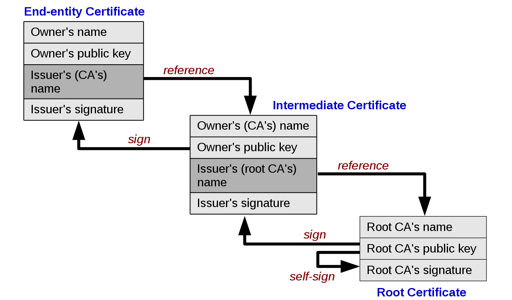
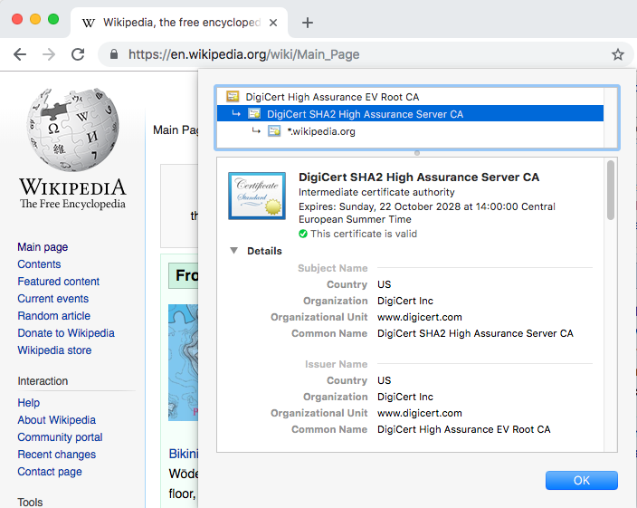

# TLS/SSL Certificates

Learn about SSL certificates, how to create your own and how to request some from [Let's Encrypt][letsencrypt].

<!-- slide-include ../../BANNER.md -->

**You will need**

* A Unix CLI
* A server with an Ubuntu operating system a public IP address
  * A website deployed on that server behind an [nginx][nginx] reverse proxy

**Recommended reading**

* [Reverse Proxying](../reverse-proxy/)

<!-- START doctoc -->
<!-- END doctoc -->


## What is a TLS or SSL certificate?

<!-- slide-front-matter class: center, middle -->

<p class='center'></p>

### Public key certificates

A [**public key certificate**][pubkey-certificate] is an electronic document
that proves the ownership of a public key using [public key cryptography][pubkey].

A [**TLS or SSL certificate**][tls-certificate] is a type of public key certificate
that allows a computer such as a **web server** to prove that it owns a public key.

> SSL is the original Secure Sockets Layer protocol first published in 1995 and which is now deprecated.
> TLS is the newer and more secure [Transport Layer Security][tls] protocol first published in 1999,
> its latest version being TLS 1.3 published in 2018 (at the time of writing).
> Although TLS is used today, TLS certificates are sometimes still called "SSL certificates".

A TLS certificate is linked to one or multiple domain name:

* For example `google.com` or `www.microsoft.com`.
* It could also be `*.example.com`.
  In this case, it's a **wildcard certificate** valid for all matching subdomains.

### What is a TLS certificate good for?

A TLS certificate is one of the components that allows a server to **communicate securely over HTTPS** using the TLS protocol.

<p class='center'></p>

* The client and server agree on a [cipher suite][cipher-suite] (cipher and hash functions) they both support.
* The server provides its TLS certificate and the client confirms its validity.
* A symmetric encryption key is exchanged using the asymmetric [Diffie-Hellman key exchange][dh].
* The client and server can now communicate securely by using symmetric encryption to encrypt all traffic.


## Validity of TLS certificates

Your browser will not simply accept any TLS certificate as valid.
You can generate your own TLS certificate to test this.

On your server, run the following commands:

```bash
$> `mkdir ~/certificate`

$> `cd ~/certificate`

$> `openssl req -newkey rsa:2048 -nodes -keyout key.pem \`
   `-x509 -days 365 -out certificate.pem`

Generating a 2048 bit RSA private key
...
You are about to be asked to enter information that will be incorporated
into your certificate request.
...
Country Name (2 letter code) [AU]:CH
State or Province Name (full name) [Some-State]:Vaud
Locality Name (eg, city) []:Yverdon
Organization Name (eg, company) [Internet Widgits Pty Ltd]:HEIG-VD
Organizational Unit Name (eg, section) []:
Common Name (e.g. server FQDN or YOUR name) []:john-doe.archidep-2018.media
Email Address []:john.doe@heig-vd.ch
```

### What's in a TLS certificate?

The previous command generated two files:

* A **TLS certificate** in the `certificate.pem` file.
* A **private key** in the `key.pem` file.

```bash
$> `ls`
certificate.pem key.pem
```

The `certificate.pem` file is simply a Base64-encoded plain text file:

```bash
$> `cat certificate/certificate.pem`
-----BEGIN CERTIFICATE-----
MIID7jCCAtagAwIBAgIJAPPUhT7FLeLRMA0GCSqGSIb3DQEBCwUAMIGLMQswCQYD
VQQGEwJDSDENMAsGA1UECAwEVmF1ZDEQMA4GA1UEBwwHWXZlcmRvbjEQMA4GA1UE
...
```

#### Decoding the contents of a TLS certificate

A TLS certificate is not encrypted.
You can decode its contents with the following command:

```bash
$> `openssl x509 -text -noout -in certificate.pem`
Certificate:
    Data:
        Version: 3 (0x2)
        Serial Number:
            ef:ea:3a:93:c5:74:a8:e7
    Signature Algorithm: sha256WithRSAEncryption
        Issuer: C = CH, ST = Vaud, L = Yverdon, O = HEIG-VD,
                CN = john-doe.archidep-2018.media,
                emailAddress = john-doe@heig-vd.ch
        Validity
            Not Before: Jan 15 14:28:11 2019 GMT
            Not After : Jan 15 14:28:11 2020 GMT
...
```

### Configuring nginx to use you TLS certificate

Assuming you already have a website deployed with nginx, add the following lines to its configuration file:

```bash
server {

  listen 80;
* listen 443 ssl;
* ssl_certificate /home/john_doe/certificate/certificate.pem;
* ssl_certificate_key /home/john_doe/certificate/key.pem;
* ssl_protocols TLSv1 TLSv1.1 TLSv1.2;
* ssl_ciphers HIGH:!aNULL:!MD5;

  server_name john-doe.archidep-2018.media;
  root /home/john_doe/my-website;
  index index.html;
}
```

Reload nginx's configuration with `sudo nginx -s reload`.

> The `listen 443 ssl` directive instructs nginx to also listen on port 443 (HTTPS) for this site.
> The [`ssl_certificate`][nginx-ssl-certificate-directive] directive makes it serve the specified TLS certificate file to clients.
> The [`ssl_certificate_key`][nginx-ssl-certificate-key-directive] directive makes it
> use the private key in the specified file to perform the asymmetric cryptography in the TLS protocol.

### Invalid certificate authority

If you access your website with this configuration, you will see the following:

<p class='center'></p>

In this example, Chrome indicates that there is an error of type `NET::ERR_CERT_AUTHORITY_INVALID` error.
This means that there is no valid **certificate authority** that guarantees that this certificate is valid.

#### Self-signed root certificate

Your TLS certificate is not valid because is is a **self-signed** certificate.

<p class='center'></p>

As you can see, the certificate details indicates that it is a **root certificate**,
meaning that no other certificate authority guarantees its validity.
Since you signed it yourself (by running the earlier `openssl req` command),
and you are not a valid certificate authority, it is considered invalid by your browser.

### How to make a certificate valid

To be valid, a TLS certificate must be **signed by a valid certificate authority**.
This signature is a [digital signature][digital-signature] using [public key cryptography][pubkey]:

* The certificate authority has a **private and public key pair**.
* They will **use their private key to create a signature** of your certificate.
* They will **distribute their public key** so that anyone in possession of your certificate and their public key can **verify the signature**.

Of course, the certificate authority that signed your certificate must prove that it owns the public key that is being distributed.
To do this, it provides a public key certificate of its own, similar to your own TLS certificate.

### Chain of trust

Your TLS certificate and various other public key certificates are thus linked together in a **chain of trust**:

<p class='center'></p>

Each certificate, starting with your own **end-user certificate**
(or end-entity certificate) is signed by the next certificate authority,
proving its validity to the client.
This is a type of [public key infrastructure][pki].

#### Viewing a certificate's chain of trust

Browsers allow you to view a TLS certificate's chain of trust:

<p class='center'></p>

#### Intermediate certificates

In this example, there are 3 certificates in the chain, but there could be more.
All certificates in the middle are **intermediate certificate authorities**:

<p class='center'></p>

#### Root certificate authorities

The **root certificate authority** is the one at the top of the chain:

<p class='center'></p>

### Root certificate validity

As you can see in the chain of trust diagram, the **root certificate** is self-signed:
there is no inherent difference between it and a certificate you have generated yourself with `openssl req`.

<p class='center'></p>

How then does the browser know that a root certificate authority is valid?

#### Trusted CA Certificate Lists

Browsers and operating systems have **hardcoded lists of root certificates** that are considered to be **trusted**.
For example:

* [Trusted Root Certificates in iOS][ios-root-ca-list]
* [Trusted Root Certificates in Mozilla Firefox][mozilla-root-ca-list]

When your browser checks a TLS's certificate chain of trust,
it expects the chain's root certificate to be one of the **already trusted** ones;
otherwise, the TLS certificate is deemed invalid.

In other words, if you want to launch a new company to issue valid TLS certificates,
you must contact Mozilla, Apple, Microsoft, etc. to have them include your new root certificate
in their programs:

* [Apple Root Program][apple-root-ca]
* [Microsoft Root Program][microsoft-root-ca]
* [Mozilla Root Program][mozilla-root-ca]
* [Oracle Root Program][oracle-root-ca]


## Obtaining a TLS certificate

To obtain a valid TLS certificate, you need to request one from a [**certification authority (CA)**][ca].
In 2018, the 3 most popular CAs are:

* [IdenTrust][identrust]
* [Comodo][comodo]
* [DigiCert][digicert]

Before the certification authority will give you a signed, valid TLS certificate,
they will make you go through **domain validation**.
In other words, they will ask you to **prove that you are the legitimate owner of the domain**
indicated in the certificate.

### Domain validation

There are multiple techniques to do that.
For example, assuming that you own the domain `example.com`
and request a TLS certificate for that domain from a CA:

* **HTTP validation:** the CA can ask you to put a file at `http://example.com/abc.txt` containing a random validation token.
  Doing this proves that you control the server which serves the content for the domain.
* **DNS validation:** the CA can ask you to create a custom DNS record for your domain.
  Doing this proves that you control the DNS zone file for the domain.
* **Email validation:** the CA can send you a mail with a validation link at `admin@example.com`.
  Following the link proves that you are the administrator of the domain,
  since only you could manage that email address.

### Purchasing TLS certificates

Some certificate authorities sell you TLS certificates.
What you pay for is:

* **Compatibility:** Not all root certificates are as widespread.
  Some may be present in more browsers and operating systems.
  By paying more, you may get a certificate that is certified to be compatible with more clients.
* **Warranty:** Many certificate authorities will pay you a given sum of money
  if your security is compromised because of a weakness in their TLS certificate.
  You may increase that warranty by purchasing a more expensive certificate.
* **[Extended Validation Certificate (EV)][ev-certificate]:**
  Certificate authorities can validate that a legal entity is the owner of a domain,
  enabling the browser to display a so-called "green-bar certificate".

  

### Let's Encrypt

[Let's Encrypt][letsencrypt] is a **free, automated, and open certificate authority (CA)**, run for the public's benefit.
It is a service provided by the [Internet Security Research Group (ISRG)][isrg].
The key principles behind Let's Encrypt are:

* **Free:** Anyone who owns a domain name can use Let's Encrypt to obtain a valid TLS certificate at zero cost.
* **Automatic:** Software running on a web server can painlessly obtain a certificate,
  securely configure it for use, and automatically take care of renewal.
* **Secure:** Let's Encrypt will serve as a platform for advancing TLS security best practices,
  both on the CA side and by helping site operators properly secure their servers.
* **Transparent:** All certificates issued or revoked will be publicly recorded and available for anyone to inspect.
* **Open:** The automatic issuance and renewal protocol will be published as an open standard that others can adopt.
* **Cooperative:** Much like the underlying Internet protocols themselves,
  Let's Encrypt is a joint effort to benefit the community, beyond the control of any one organization.

#### Certbot

[Certbot][certbot] is a tool made by the [Electronic Frontier Foundation (EFF)][eff].
It can be installed on any Linux server and will:

* Help you **obtain Let's Encrypt certificates**.
* **Configure your web server,** such as [Apache][apache] or [nginx][nginx],
  to use the certificates.
* Set up **automatic renewal** for these certificates.


## References

* [Public-key Certificate][pubkey-certificate]
  * [Public Key Cryptography][pubkey]
  * [Chain of Trust][chain-of-trust]
* [Certificate Authority (CA)][ca]
  * [Let's Encrypt][letsencrypt]
* [Generating a self-signed certificate using OpenSSL][self-signed]
* [Nginx - Configuring HTTPS servers][nginx-ssl]


[apache]: https://www.apache.org
[apple-root-ca]: https://www.apple.com/certificateauthority/ca_program.html
[ca]: https://en.wikipedia.org/wiki/Certificate_authority
[certbot]: https://certbot.eff.org/
[chain-of-trust]: https://en.wikipedia.org/wiki/Chain_of_trust
[cipher-suite]: https://en.wikipedia.org/wiki/Cipher_suite
[comodo]: https://www.comodo.com
[dh]: https://en.wikipedia.org/wiki/Diffie%E2%80%93Hellman_key_exchange
[digicert]: https://www.digicert.com
[digital-signature]: https://en.wikipedia.org/wiki/Digital_signature
[eff]: https://www.eff.org
[ev-certificate]: https://en.wikipedia.org/wiki/Extended_Validation_Certificate
[identrust]: https://www.identrust.com
[ios-root-ca-list]: https://support.apple.com/en-gb/HT204132
[isrg]: https://letsencrypt.org/isrg/
[letsencrypt]: https://letsencrypt.org/
[microsoft-root-ca]: https://docs.microsoft.com/en-us/previous-versions//cc751157(v=technet.10)
[mozilla-root-ca]: https://www.mozilla.org/en-US/about/governance/policies/security-group/certs/policy/
[mozilla-root-ca-list]: https://wiki.mozilla.org/CA/Included_Certificates
[nginx]: http://nginx.org/
[nginx-ssl]: http://nginx.org/en/docs/http/configuring_https_servers.html
[nginx-ssl-certificate-directive]: http://nginx.org/en/docs/http/ngx_http_ssl_module.html#ssl_certificate
[nginx-ssl-certificate-key-directive]: http://nginx.org/en/docs/http/ngx_http_ssl_module.html#ssl_certificate_key
[oracle-root-ca]: https://www.oracle.com/technetwork/java/javase/javasecarootcertsprogram-1876540.html
[pki]: https://en.wikipedia.org/wiki/Public_key_infrastructure
[pubkey]: https://en.wikipedia.org/wiki/Public-key_cryptography
[pubkey-certificate]: https://en.wikipedia.org/wiki/Public_key_certificate
[self-signed]: https://www.ibm.com/support/knowledgecenter/en/SSWHYP_4.0.0/com.ibm.apimgmt.cmc.doc/task_apionprem_gernerate_self_signed_openSSL.html
[tls]: https://en.wikipedia.org/wiki/Transport_Layer_Security
[tls-certificate]: https://en.wikipedia.org/wiki/Public_key_certificate#TLS/SSL_server_certificate
[tls-procedure]: https://en.wikipedia.org/wiki/Transport_Layer_Security#Description
