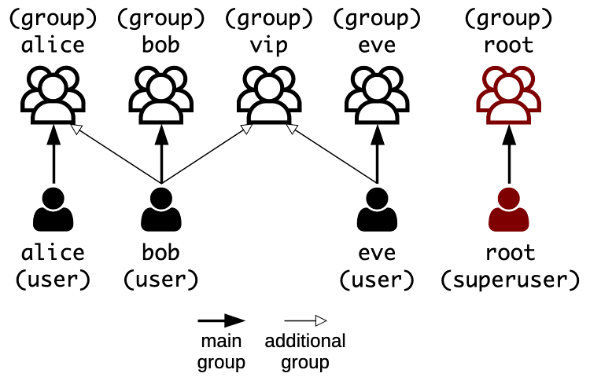

# Unix Administration

Learn the basics of Unix and Unix-like operating systems like Linux, and how to manage them from the command line.

<!-- slide-include ../../BANNER.md -->


## File system

The **file system** controls how data is stored and retrieved.
Without it, information on a storage medium such as a hard drive would be one large body of data,
with no way to tell where one piece of information stops and the next begins.

Various file systems exit:

| Operating system or device type | Common file systems |
| :---                            | :---                |
| Linux                           | ext2, ext3, ext4    |
| macOS                           | HFS, APFS           |
| Windows                         | NTFS                |
| USB                             | FAT, exFAT          |

### Case-sensitivity

One of the differences between File systems is how they would treat these file names:

* `a-file.txt`
* `A-file.txt`
* `A-fIlE.txt`
* `A-FILE.txt`

When you use macOS or Windows, your file system is probably HFS, APFS or NTFS.
These file systems are **case-insensitive**, meaning that all the file names above represent the same file.
You **cannot create both `a-file.txt` and `A-FILE.txt` in the same directory**.
As far as the file system is concerned, that's the same file.

When you use Linux, your file system is probably in the [Extended File System (ext)][ext] family.
It is a **case-sensitive** file system.
The 4 names above represent **4 different files**.

It is important to know this difference when you are transferring files between different file systems.

### File hierarchy

In Unix-like systems, the file system is said to be **rooted**,
meaning that there is **always one root**, denoted by the path `/`.

Separate volumes such as disk partitions, removable media and network shares belong to the same file hierarchy
(unlike Windows for example, where each drive has a letter that is the root of its file system tree).

Such volumes can be **mounted** on a directory, causing the volume's file system tree to appear as that directory in the larger tree.

#### Inspecting volumes

The `df` (**d**isk **f**ree) shows you all volumes and the available space on each of them
(the `-h` option displays size in a human-readable format instead of the raw number of bytes):

```bash
$> df -h
Filesystem      Size  Used Avail Use% Mounted on
tmpfs            99M  608K   98M   1% /run
/dev/sda1       9.7G  1.4G  8.3G  15% /
tmpfs           493M     0  493M   0% /dev/shm
tmpfs           5.0M     0  5.0M   0% /run/lock
tmpfs           493M     0  493M   0% /sys/fs/cgroup
/dev/sdb1        50G   19G   28G  41% /network-drive
```

You can see that **there is only one root (`/`)**,
and that all other volumes are **mounted** somewhere in the file hierarchy.

For example, the last line represents a network drive mounted under the `/network-drive` directory.
The [`/etc/fstab` file (**f**ile **s**ystems **tab**le)][fstab] defines mounted volumes.

#### Common Unix directories

| Directory | Description                                                 |
| :---      | :---                                                        |
| `/bin`    | Fundamental binaries like `ls` or `cp`.                     |
| `/boot`   | Files required to successfully boot.                        |
| `/dev`    | Devices, i.e. file representations of (pseudo-)peripherals. |
| `/etc`    | System-wide configuration files.                            |
| `/home`   | User home directories.                                      |
| `/lib`    | Shared libraries needed by programs in `/bin`.              |
| `/media`  | Default mount point for removable devices (USB, etc).       |
| `/opt`    | Locally installed software.                                 |
| `/root`   | Home directory of the `root` superuser.                     |
| `/sbin`   | System binaries (for system administration).                |
| `/tmp`    | Temporary files not expected to survive a reboot.           |
| `/usr`    | Non-system-critical executables, libraries and resources.   |
| `/var`    | Variable files (e.g. lock/log files, databases).            |

> From [Unix Filesystem Conventional Directory Layout][unix-layout].

### Unix file types

Unix-like systems have regular files and directories like most other systems.
But in addition to these, it represents various other things as files.

| Type                          | Description                                                           |
| :---                          | :---                                                                  |
| File                          | A regular file.                                                       |
| Directory                     | A directory containing one or more files.                             |
| [Symbolic link][unix-symlink] | A reference to another file.                                          |
| [Named pipe][unix-named-pipe] | A connector from the output of one process to the input of another.   |
| [Socket][unix-socket]         | A bidirectional endpoint for inter-process communication.             |
| [Device][unix-device-file]    | Representations of physical or logical peripherals (e.g. hard drive). |


## Unix users

Unix and Unix-like systems like Linux are multi-user systems,
meaning that more than one user can have access to the system at the same time.

A **user** is **anyone who uses the system**.
This may be:

* A **person**, like Alice or Bob.
* A **system service**, like a MySQL database or an SSH server.

A Unix system maintains a list of user accounts representing these people and system services,
each with a different **name** such as `alice`, `bob` or `sshd`.
Each of these user accounts is also identified by a **numerical user ID (or UID)**.

> Note that one person may have multiple user accounts on a Unix system,
> as long as they each have a different name.

### User access

Managing users is done for the purpose of security by limiting access in certain ways, such as file permissions.

The **superuser**, named `root`, has complete access to the system and its configuration.
It is intended for administrative use only.

Unix also has the notion of **groups**.
Much like a user account, a group is identified by a **name** and by a **numerical group ID (or GID)**.
Each user belongs to a **main group**, and can also be **added to other groups**,
which grants that user all privileges assigned to each group.

<!-- slide-column -->

> A Unix system usually creates a main group for each user, with the same name as the user.
> For example, user `alice` has the `alice` group as its main group.
>
> This provides a quick way of giving `bob` access to `alice`'s files
> by adding him to the `alice` group, if necessary.

<!-- slide-column 45 -->



### Permissions

Someone who logs in on a Unix system can use any file their user account is permitted to access.
The system determines whether or not a user or group can access a file based on the permissions assigned to it.

There are **three different permissions** for file, directories and executables.
They are represented by one character:

| Permission | Description                                                                                  |
| :---       | :---                                                                                         |
| `r`        | A given category of user can **read** a file or list a directory.                            |
| `w`        | A given category of user can **write** to a file or create/delete files in a directory.      |
| `x`        | A given category of user can **execute** the contents of a file or **traverse** a directory. |

Additionally, the symbol `-` (a hyphen) indicates that no access is permitted.

#### User categories

Each of the three permissions are assigned to three different categories of users:

| Category | Description                                                |
| :---     | :---                                                       |
| `owner`  | The **user** who owns the file.                            |
| `group`  | The **group** that owns the file (any user in that group). |
| `other`  | Any other user with access to the system.                  |

#### Checking file permissions

When you run the `ls` command with the **`-l` option** (long format),
you can see more information about files, including their **type and permissions**:

```bash
$> ls -l
drwxr-xr-x 2 root root 4096 Sep  7 12:16 some-directory
-rwxr-x--- 1 root vip   755 Jan 18  2018 some-executable
-rw-r----- 1 bob  bob   321 Jan 18  2018 some-file
lrwxrwxrwx 1 bob  bob   39  Jan 18  2018 some-link -> some-file
```

Column 1 represents the permissions assigned to the file, while columns 3 and 4 represent their ownership.
The first 10-letter column can be separated into one letter for the type of file,
and three 3-letter groups for owner, group and other permissions respectively:

```
TYPE  OWNER PERM  GROUP PERM  OTHER PERM  OWNER  GROUP
d     rwx         r-x         r-x         root   root  ... some-directory
-     rwx         r-x         ---         root   vip   ... some-executable
-     rw-         r--         ---         bob    bob   ... some-file
l     rwx         rwx         rwx         bob    bob   ... some-link -> some-file
```

> There are [other file types][unix-file-types] like named pipes (`p`), sockets (`s`) and device files (`b` or `c`),
> but they are outside the scope of this course.


## Administrative access

Many administrative tasks such as installing packages, managing users or changing file permissions
can only be performed by the `root` user.

If you have the `root` user's password (or an authorized public key), you can **log in as root** directly.
But **you should avoid it** as often as possible.

It is **dangereous to log in as `root`**.
One wrong move and you could irreversibly damage the system.
For example:

* Delete a system-critical file or files.
* Change permissions on system-critical executables.
* Lock yourself out of the system (e.g. by disabling SSH on a server).

### The `sudo` command

The `sudo` command (which means "**s**uper**user** **do**") offers another approach to giving users administrative access.

When **trusted users** precede an administrative command with `sudo`,
they are prompted for **their own password**.
Once authenticated, the administrative command is **executed as if by the `root` user**.

```bash
$> ls -la /root
ls: cannot open directory '/root': Permission denied

$> sudo ls -la /root
[sudo] password for jdoe:
drwx------  4 root root 4096 Sep 12 14:53 .
drwxr-xr-x 24 root root 4096 Sep 12 14:44 ..
-rw-------  1 root root  137 Sep 11 09:51 .bash_history
-rw-r--r--  1 root root 3106 Apr  9 11:10 .bashrc
...
```

> Only trusted users can use `sudo`.
> Unauthorized usage will be [reported][xkcd-incident].
> The relevant logs can be checked with `sudo journalctl $(which sudo)`
> (if you are a trusted user).

#### The sudoers file

The `/etc/sudoers` file defines which users are trusted to use sudo.
This is a classic example (the basic syntax is [described here][sudoers]):

```
Defaults        env_reset
Defaults        secure_path="/usr/local/sbin:/usr/local/bin:..."

root    ALL=(ALL:ALL) ALL
%admin ALL=(ALL) ALL
%sudo   ALL=(ALL:ALL) ALL
```

This configuration allows members of the `sudo` group to execute any command
(i.e. they are trusted users).

> **WARNING:** **NEVER edit this file by hand**,
> as you will break the `sudo` command if you introduce syntax errors into the file.
> Use the `visudo` command which will not let you save unless the file is valid.

> With these defaults settings common to most Unix systems,
> you can simply add a user to the `sudo` group to make them trusted `sudo` users.

### The `su` command

The `su` command (which means "**s**witch **u**ser") is also a common administrative tool.
As its name indicates, it can be used to log in as another user.
If you are a trusted sudoer, you can use it to become another user:

```bash
$> whoami
bob

$> ls -la /home/alice
ls: cannot open directory '/home/alice': Permission denied

*$> sudo su -l alice
[sudo] password for bob:

$> whoami
alice
```

> The `-l` option of the `su` command makes sure you get a **login shell**,
> i.e. an environment similar to what you get when actually logging in.
> If you don't use it, you will have a minimal shell environment that might be missing some things.

#### Performing tasks as another user

The previous `su` command opens a new shell in which you are logged in as `alice`.
You can do whatever you need to do with the files accessible only to `alice`,
then go back to your previous shell with `exit`:

```bash
$> ls -la /home/alice
total 20
drwxr-x--- 2 alice alice 4096 Sep 12 16:35 .
drwxr-xr-x 6 root  root  4096 Sep 12 16:35 ..
-rw-r--r-- 1 alice alice  220 Apr  4 18:30 .bash_logout
...

$> echo foo > ~/bar.txt

$> cat /home/alice/bar.txt
foo

$> exit

$> whoami
bob
```

#### Performing administrative tasks as root

You can also use the `su` command to log in as `root`.
You can perform any necessary administrative tasks without `sudo` (since you are `root`),
then again go back to your previous shell with `exit`:

```bash
$> sudo su -l root

$> whoami
root

$> journalctl $(which sudo)
...

$> exit

$> whoami
bob
```

> **WARNING:** as mentionned before, be careful not to break the system when you are `root`.


### User database files

These files define what user accounts and groups are available on a Unix system:

| File           | Contents                                                                                                                                              |
| :---           | :---                                                                                                                                                  |
| `/etc/passwd`  | List of user accounts, as well as their primary group, home directory and default shell (it originally also contained user passwords, hence the name) |
| `/etc/shadow`  | Hashes of user passwords (more secure than storing them in word-readable `/etc/passwd`)                                                               |
| `/etc/group`   | List of groups and their members                                                                                                                      |
| `/etc/gshadow` | Hashes of group passwords (optional), group administrators                                                                                            |

You should **never edit these files by hand**.

Unix systems provides various **system administration commands** for this purpose, such as `useradd`, `passwd` and `groupadd` for Linux.

#### The `/etc/passwd` file

Each line in [`/etc/passwd`][etc-passwd] defines a user account, with data separated by semicolons:

```
jdoe:x:500:500:jdoe:/home/jdoe:/bin/bash
```

* **Username** (`jdoe`) - The name of the user account (used to log in).
* **Password** (`x`) - User password (or `x` if the password is stored in `/etc/shadow`).
* **User ID (UID)** (`500`) - The numerical equivalent of the username.
* **Group ID (GID)** (`500`) - The numerical equivalent of the user's primary group name (often the same as the UID for most users, on a Unix system with default settings).
* **GECOS** (`jdoe`) - Historical field used to store extra information (usually the user's full name).
* **Home directory** (`/home/jdoe`) - The absolute path to the user's home directory.
* **Shell** (`/bin/bash`) - The program automatically launched whenever the user logs in (e.g. on a terminal or through SSH).
  This can be used to prevent some users, like system users, from logging in (e.g. by using `/bin/false` or `/usr/sbin/nologin`).

#### The `/etc/group` file

Each line in [`/etc/group`][etc-group] defines a group, also semicolon-separated:

```
vip:x:512:bob,eve
```

* **Group name** (`vip`) - The name of the group.
* **Group password** (`x`) - Optional group password (or `x` if the password is stored in `/etc/gshadow`).
  If specified, allows users not part of the group to join it with the correct password.
* **Group ID (GID)** (`512`) - The numerical equivalent of the group name.
* **Member list** (`bob,eve`) - A comma-separated list of the users belonging to the group.

#### The shadow files

Both `/etc/passwd` and `/etc/group` must be **readable by anyone** on a Unix system,
because they are used by many programs to perform the translation from username to UID and from group name to GID.

It is therefore bad practice to store passwords in these files, even encrypted or hashed.
Any user might copy them and attempt a brute-force attack (which could be done on a separate, dedicated infrastructure).

Therefore, the corresponding shadow files exist:

* [`/etc/shadow`][etc-shadow] stores password hashes for user accounts, and other security-related data such as password expiration dates.
* [`/etc/gshadow`][etc-gshadow] stores password hashes for groups, and other security-related such as who is the group administrator.

These files are only readable by the `root` user
(or any user that belongs to the `root` or `shadow` groups).


## User management

The following commands can be used to create, modify and delete users:

| Command    | Purpose                                                                                            |
| :---       | :---                                                                                               |
| `useradd`  | Create a new user account (and by default, a corresponding group).                                 |
| `usermod`  | Modify an existing user account.                                                                   |
| `userdel`  | Delete a user account.                                                                             |
| `deluser`  | Friendlier frontend to the `userdel` command. Delete a user account or remove a user from a group. |
| `groupadd` | Create a new group.                                                                                |
| `groupmod` | Modify an existing group.                                                                          |
| `groupdel` | Delete a group.                                                                                    |
| `passwd`   | Change (or set) a user's password.                                                                 |

Use `man COMMAND` to read their manual, e.g. `man useradd`.

> Note that these commands are specific to [Ubuntu][ubuntu].
> They might differ slightly in other Linux distributions or other Unix systems.

### Creating a login user

To create a **login user** (e.g. a user that can be used by an actual person to log in to the machine),
you will need to use the `useradd` and `passwd` command:

```bash
$> sudo useradd -m -s /bin/bash jdoe

$> sudo passwd jdoe
Enter new UNIX password:
Retype new UNIX password:
passwd: password updated successfully
```

The `-m` option to the `useradd` commands instructs it to also create a home directory for the user,
which by default will be `/home/jdoe` in this case.

The `-s` option specifies the user's login shell.
Since it defaults to a simple [Bourne shell][sh] (`/bin/sh`) on most systems,
in this example we use the more advanced [Bash shell][bash] (`/bin/bash`) for the user's convenience.

> It is possible to give an encrypted password directly to the `useradd` command with the `-p` option instead of using `passwd`,
> but it's bad practice because running commands can be seen by other users with `ps`.

#### Checking the created login user

You can see the newly created user (and corresponding group)
by looking at the last line of the relevant user database files:

```bash
$> tail -n 1 /etc/passwd
jdoe:x:1004:1004::/home/jdoe:/bin/bash

$> tail -n 1 /etc/group
jdoe:x:1004:
```

> Note that on a typical Linux, regular users will have UIDs starting at 1000 and incremented every time a new user is created.
> This is defined by the `UID_MIN` and `UID_MAX` options in the `/etc/login.defs` file.

### Creating a system user

To create a **system user** (e.g. a technical user that will need to run an application or service, but does not need to log in),
the `useradd` command is sufficient:

```bash
$> sudo useradd --system -s /usr/sbin/nologin jdoe
```

The user is created a bit differently with the `--system` option:

* No aging information is stored in `/etc/shadow`.
* The UID/GID is chosen in a different range, to help quickly differentiate system users from login users.

> You can also add the `-m` option if necessary.
> Some applications or services might expect the user to have a home directory.

#### Checking the created system user

Check the user database files again:

```bash
$> tail -n 1 /etc/passwd
myapp:x:999:999::/home/myapp:/usr/sbin/nologin

$> tail -n 1 /etc/group
myapp:x:999:
```

(Note that a home directory is configured even if it wasn't created.
This is not an issue.)

> System users use a different UID range by default,
> specified by the `SYS_UID_MIN` and `SYS_UID_MAX` options in the `/etc/login.defs` file.

You can try to use `su` to try to switch to that user.
It won't work:

```bash
$> sudo su -l myapp
No directory, logging in with HOME=/
This account is currently not available.
```

> If you really need to log in as that user for administative purposes,
> the `su` command allows you to change the shell.
> For this example, the command would be `sudo su -l -s /bin/bash myapp`.

### Difference between login and system users

There is **no fundamental difference between a login and a system user**.
It's simply an organizational distinction to make life easier for system administrators.

* Both login and system users are stored in the same user database files with the same format.
* A login user can log in because it has a password and a login shell.
* A system user has no password and no login shell and therefore cannot log in.
* A system user has a UID in a different range by default.
  (This difference can be utilized by the GUI,
  for example to omit system users when populating a username dropdown list at login.)

> You can even transform a login user into a system user and vice-versa through judicious use of the `usermod` command.

### Other useful user management commands

Here's a few command examples for common administrative tasks:

| Example                             | Effect                                                                                                                                                     |
| :---                                | :---                                                                                                                                                       |
| `usermod -a -G vip jdoe`            | Add user `jdoe` to group `vip`.                                                                                                                            |
| `deluser jdoe vip`                  | Remove user `jdoe` from group `vip`.                                                                                                                       |
| `userdel -r jdoe`                   | Remove user `jdoe` and its home directory.                                                                                                                 |
| `passwd --lock jdoe`                | Remove the password for user `jdoe` (note that it may still be possible for that user to log in using other authentication methods, such as a public key). |
| `usermod -s /usr/sbin/nologin jdoe` | Lock user `jdoe` out of the system (note that this will not disconnect the user if already connected, but it prevents future logins).                      |


## Permission management

The following commands can be used to change the ownership or permissions of files:

| Command | Purpose                                                                     |
| :---    | :---                                                                        |
| `chmod` | Change the **mode** (another name for file permissions) of a file or files. |
| `chown` | Change the **owner** (and optionally the group) of a file or files.         |

Use `man COMMAND` to read their manual, e.g. `man chmod`.

### The `chown` command

The `chown` command is quite simple to use.
The following command changes the owner of `file.txt` to `alice`:

```bash
$> sudo chown alice file.txt
```

The following command changes the owner of `file.txt` to `bob` and its group to `vip`:

```bash
$> sudo chown bob:vip file.txt
```

You can also recursively change the owner and group of a directory and all its files:

```bash
$> sudo chown -R bob:bob /home/bob
```

> **WARNING:** be **extremely careful when changing ownership recursively**.
> Changing the ownership of system-critical files may break your system.
> **Make sure you typed the correct path.**

### The `chmod` command

The [`chmod` command][chmod] is used to change file permissions and is a little more complicated.
It has two syntaxes to specify which permissions you want: **symbolic modes** and **octal modes**.

With **symbolic modes**, you specify which permissions you want with letters similar to those shown by `ls -l`,
and you have more control over which specific permissions you want to add or remove:

```bash
$> sudo chmod ug+x script.sh
$> sudo chmod a-w readonly.txt
$> sudo chmod o-rwx secret.txt
```

With **octal modes**, you specify all of a file's permissions at once.
You cannot add a remove a specific permission without also setting the others:

```bash
$> sudo chmod 755 executable.sh
$> sudo chmod 640 secret.txt
```

#### Symbolic modes

The symbolic syntax of the `chmod` command is:

```
chmod [references][operator][modes] file
```

The `[references]` correspond to user categories:

| Reference | Category | Description                               |
| :---      | :---     | :---                                      |
| `u`       | Owner    | The user who owns the file                |
| `g`       | Group    | The group that owns the file.             |
| `o`       | Others   | Any other user with access to the system. |
| `a`       | All      | All three of the above, same as `ugo`.    |

The available `[operators]` are:

| Operator | Description                                                          |
| :---     | :---                                                                 |
| `+`      | Add the specified permissions to the specified category of users.    |
| `-`      | Remove the specified modes from the specified category of users.     |
| `=`      | Set exactly the specified modes for the specified category of users. |

#### Using symbolic modes

The symbolic syntax basically allows you to specify:

* What permissions (modes) you want to change (`r`, `w` or `x`).
* What kind of change you want to do (`+`, `-` or `=`).
* What category of user you want to apply these changes to (`u`, `g`, `o` or `a`).

For example, the following command adds `r` (read) and `w` (write) permissions to `u` (the owner of the file):

```bash
$> sudo chmod u+rw file.txt
```

The following command sets the permissions for `g` (the group of the file) to `r` (read) and `x` (execute):

```bash
$> sudo chmod g=rx file.txt
```

#### Octal modes

Unix file permissions can be represented in [octal (base-8) notation][octal-modes]:

| Octal | Permissions             | Modes | Binary |
| :---  | :---                    | :---  | :---   |
| 7     | read, write and execute | `rwx` | 111    |
| 6     | read and write          | `rw-` | 110    |
| 5     | read and execute        | `r-x` | 101    |
| 4     | **read only**           | `r--` | 100    |
| 3     | write and execute       | `-wx` | 011    |
| 2     | **write only**          | `-w-` | 010    |
| 1     | **execute only**        | `--x` | 001    |
| 0     | none                    | `---` | 000    |

You can represent an entire file's permissions with 3 octal digits:

* `755` is equivalent to `rwxr-xr-x`.
* `751` is equivalent to `rwxr-x--x`.
* `640` is equivalent to `rw-r-----`.

#### Using octal modes

The octal syntax does not allow you to make a granular change to a specific permissions (e.g. `u+x`).
However, it does allow you to easily change an entire file's permissions in one command.

For example, the following command sets permissions `rwxr-xr-x` to `script.sh`:

```bash
$> sudo chmod 755 script.sh
```

The following command sets permissions `rw-r-----` to `secret.txt`:

```bash
$> sudo chmod 640 secret.txt
```


## References

* [Red Hat Enterprise Linux - Introduction to System Administration](https://access.redhat.com/documentation/en-US/Red_Hat_Enterprise_Linux/4/html/Introduction_To_System_Administration/)
* [Red Hat Enterprise Linux - Security Guide](https://access.redhat.com/documentation/en-US/Red_Hat_Enterprise_Linux/4/html/Security_Guide/)


## TODO

* https://en.wikipedia.org/wiki/Everything_is_a_file
* Ports
  * netcat
  * HTTP request
  * https://www.networkworld.com/article/2693416/unix-networking-basics-for-the-beginner.html
* Magic files
* POSIX (https://en.wikipedia.org/wiki/POSIX)
* Useful commands
  * Find files
  * whoami
  * id
* Package management
* Environment variables


[bash]: https://en.wikipedia.org/wiki/Bash_(Unix_shell)
[chmod]: https://en.wikipedia.org/wiki/Chmod
[etc-group]: https://access.redhat.com/documentation/en-US/Red_Hat_Enterprise_Linux/4/html/Introduction_To_System_Administration/s3-acctspgrps-group.html
[etc-gshadow]: https://access.redhat.com/documentation/en-US/Red_Hat_Enterprise_Linux/4/html/Introduction_To_System_Administration/s3-acctsgrps-gshadow.html
[etc-passwd]: https://access.redhat.com/documentation/en-US/Red_Hat_Enterprise_Linux/4/html/Introduction_To_System_Administration/s2-acctsgrps-files.html
[etc-shadow]: https://access.redhat.com/documentation/en-US/Red_Hat_Enterprise_Linux/4/html/Introduction_To_System_Administration/s3-acctsgrps-shadow.html
[ext]: https://en.wikipedia.org/wiki/Extended_file_system
[fstab]: https://en.wikipedia.org/wiki/Fstab
[octal-modes]: https://en.wikipedia.org/wiki/File_system_permissions#Numeric_notation
[sh]: https://en.wikipedia.org/wiki/Bourne_shell
[sudoers]: http://toroid.org/sudoers-syntax
[ubuntu]: https://www.ubuntu.com/
[unix-device-file]: https://en.wikipedia.org/wiki/Device_file
[unix-file-types]: https://en.wikipedia.org/wiki/Unix_file_types
[unix-layout]: https://en.wikipedia.org/wiki/Unix_filesystem#Conventional_directory_layout
[unix-named-pipe]: https://en.wikipedia.org/wiki/Named_pipe
[unix-socket]: https://en.wikipedia.org/wiki/Unix_domain_socket
[unix-symlink]: https://en.wikipedia.org/wiki/Symbolic_link
[xkcd-incident]: https://xkcd.com/838/
