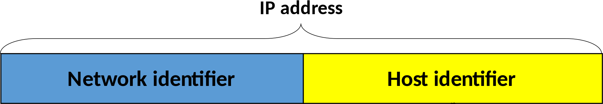
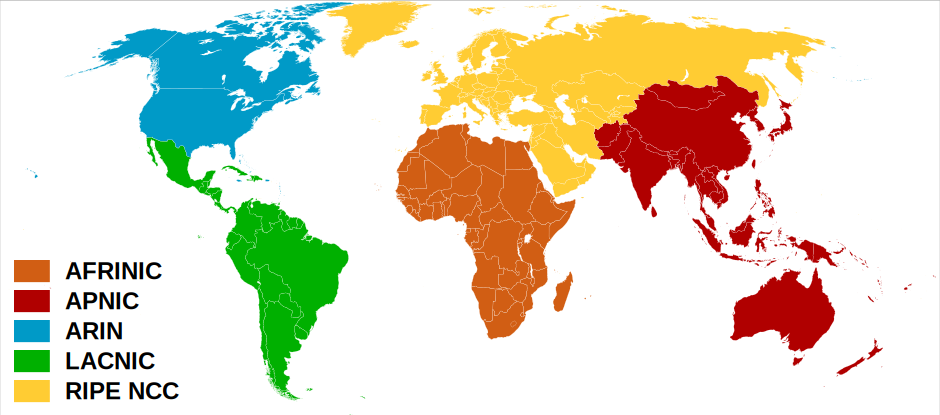
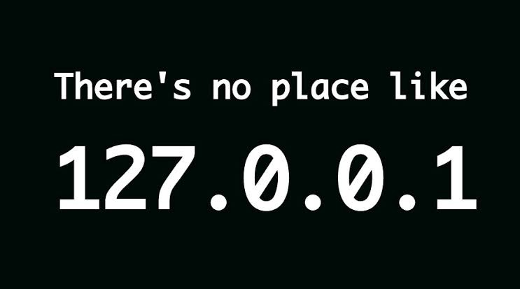
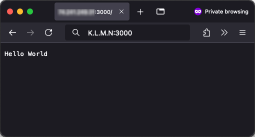
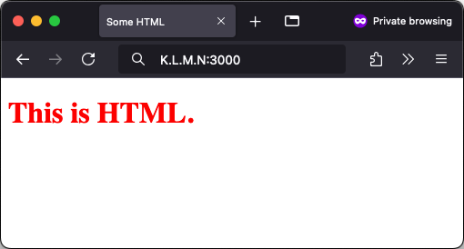

# Unix Networking

Learn the basics of Unix networking and how to make TCP connections.

<!-- slide-include ../../BANNER.md -->

**You will need**

* A Unix CLI
* An Ubuntu server with a public IP address to connect to

**Recommended reading**

* [Unix Basics & Administration](../unix-admin/)
* [Unix Processes](../unix-processes/)

<!-- START doctoc generated TOC please keep comment here to allow auto update -->
<!-- DON'T EDIT THIS SECTION, INSTEAD RE-RUN doctoc TO UPDATE -->

- [Computer networking](#computer-networking)
  - [OSI model](#osi-model)
  - [TCP/IP model](#tcpip-model)
  - [OSI vs TCP/IP](#osi-vs-tcpip)
    - [ARPANET circa 1977](#arpanet-circa-1977)
  - [IP addressing](#ip-addressing)
    - [IPv4 structure](#ipv4-structure)
    - [IPv6](#ipv6)
    - [IPv6 structure](#ipv6-structure)
    - [IP networks](#ip-networks)
    - [IP global networks](#ip-global-networks)
    - [IP local networks](#ip-local-networks)
    - [Reserved address spaces](#reserved-address-spaces)
    - [Netmasks and CIDRs](#netmasks-and-cidrs)
    - [There's no place like 127.0.0.1](#theres-no-place-like-127001)
    - [0.0.0.0 is everyone](#0000-is-everyone)
    - [Network address translation](#network-address-translation)
  - [Ports](#ports)
    - [Multiplexing](#multiplexing)
    - [Registered port numbers](#registered-port-numbers)
    - [Well-known & dynamic ports](#well-known--dynamic-ports)
  - [Domain name system](#domain-name-system)
    - [DNS hierarchy](#dns-hierarchy)
- [Unix networking](#unix-networking)
  - [The `ip` command](#the-ip-command)
  - [The `ping` command](#the-ping-command)
  - [The `ss` command](#the-ss-command)
  - [The `nc` command](#the-nc-command)
- [Making connections](#making-connections)
  - [Raw TCP connection](#raw-tcp-connection)
  - [HTTP request](#http-request)
    - [Making an HTTP request to Google](#making-an-http-request-to-google)
    - [Following Google's redirect](#following-googles-redirect)
  - [HTTP response](#http-response)
    - [Making an HTTP request with a browser](#making-an-http-request-with-a-browser)
    - [Sending an HTTP response with plain text](#sending-an-http-response-with-plain-text)
    - [Sending an HTTP response with HTML](#sending-an-http-response-with-html)
- [Other useful commands](#other-useful-commands)
  - [The `traceroute` command](#the-traceroute-command)
  - [The `mtr` command](#the-mtr-command)
- [References](#references)

<!-- END doctoc generated TOC please keep comment here to allow auto update -->


## Computer networking

<!-- slide-front-matter class: center, middle -->


> This is a diagram of the first internetworked TCP connection made between
> sites in the US, the UK and Norway in 1977.

### OSI model

The [**O**pen **S**ystems **I**nterconnection (OSI) model][osi] standardizes
communications between computing systems, allowing interoperability with
standard protocols.

<p class='center'></p>

A layer serves the layer above it and is served by the layer below it.

### TCP/IP model

The [internet protocol suite][tcp-ip] is the conceptual model used on the
Internet and on similar computer networks. It is commonly known as TCP/IP since
the **T**ransmission **C**ontrol **P**rotocol (TCP) and the **I**nternet
**P**rotocol (IP) are its foundational protocols.

<p class='center'></p>

> It was originally developed for [ARPANET][arpanet].

### OSI vs TCP/IP

The OSI and TCP/IP models describe the same technologies, but categorize them a little differently.

<p class='center'></p>

The OSI model is used more as a theoretical construct to reason about networking systems,
while the TCP/IP model is more in line with how Internet protocols are designed and used in practice.

### ARPANET circa 1977

<!-- slide-front-matter class: center, middle, image-header -->


### IP addressing

The [**I**nternet **P**rotocol (IP)][ip] is the principal communications
protocol of the Internet. It allows delivering packets from a source host to a
destination host based solely on IP addresses. It is a **network layer**
protocol (OSI layer 3).

**V**ersion **4** of the protocol ([**IPv4**][ipv4]), in use since 1983, uses a
32-bit address space, meaning that there are 2<sup>32</sup> or about 4.3 billion
possible addresses.

That's a 32-bit IPv4 address in binary:

```
    `10101100000100001111111000000001`
```

#### IPv4 structure

Of course that's a little hard to remember or even write down, so an IPv4
address is typically represented in 4 dotted decimal notation, with each octet
(8 bits) containing a value between 0 and 255 (i.e. 2<sup>8</sup>
possibilities).

This is the same address in dotted decimal notation: `172.16.254.1`

<p class='center'></p>

#### IPv6

**V**ersion **6** of the protocol ([**IPv6**][ipv6]) was developed more recently
because the world is running out of IPv4 addresses (~4 billion IPv4 addresses is
not enough in the [Internet of Things (IoT)][iot] world). It's an [internet
standard][internet-standard] since 2017.

Here's a 128-bit IPv6 address in binary:

```
    `0000000100100011010001010110011110001001101010111100110111101111`
    `0000000100100011010001010110011110001001101010111100110111101111`
```

> 2<sup>128</sup> possibilities is about 340
> [undecillion](https://en.wikipedia.org/wiki/Undecillion) (yes, that's a word)
> addresses, or 3.4 with 38 zeros. At least we won't have a [year 2038
> bug](https://en.wikipedia.org/wiki/Year_2038_problem).

#### IPv6 structure

IPv6 adresses are typically represented as 8 groups of 4 [hexadecimal][hex]
digits. Here's the same address in hexadecimal format:
`0123:4567:89ab:cdef:0123:4567:89ab:cdef`

<p class='center'></p>

#### IP networks

Each computer that is publicly accessible on the Internet has a **public IP address**.
To facilite routing, IP addresses are logically divided into networks.

<p class='center'></p>

For example, assuming we use the address `10101100000100001111111000000001`, or
`172.16.254.1` in dotted decimal notation, and a prefix of 16 bits:

* The **network identifier or prefix** would be the first 16 bits:
  `1010110000010000`, or in decimal notation `172.16`
* The **host identifier** would be the last 16 bits: `1111111000000001` or in
  decimal notation `254.1`

This allows the physical routing devices that are part of the Internet to direct
traffic to the correct geographical area and machine(s).

#### IP global networks

The [**I**nternet **A**ssigned **N**umbers **A**uthority (IANA)][iana] is the
organization responsible for dividing the Internet itself into global networks,
each administered by regional organizations.

The [**R**egional **I**nternet **R**egistries (RIR)][rir], in turn, follow their
regional policies to delegate resources to their customers, which include
[**I**nternet **S**ervice **P**roviders (ISP)][isp] (e.g. Swisscom).

<p class="center"></p>

You can find the list of registered networks in the [IPv4 Address Space
Registry][iana-ipv4] and [IPv6 Address Space Registry][iana-ipv6].

#### IP local networks

[Subnetting][subnet] can be used to further improve efficiency in the utilization of the relatively small address space available.

<p class='center'></p>

Instead of having thousands of computers in the same network all able to directly contact each other,
subnetting allows organizations to create smaller, isolated networks with fewer computers.

This can be used to define **complex network structures** within an organization or to **improve security**.

#### Reserved address spaces

There are a few [reserved IP address ranges][reserved-ip-addresses]. Some are
**reserved for private networks**. In these ranges you **cannot communicate with
public machines** without a NAT [gateway][gateway] or [proxy][proxy].

There are three reserved private ranges in the IPv4 address space:

.compact-table[

First address | Last address    | [Netmask][subnet] | [CIDR][cidr] | Addresses
:------------ | :-------------- | :---------------- | :----------- | :----------------------------
10.0.0.0      | 10.255.255.255  | 255.0.0.0         | /8           | 2<sup>24</sup> or ~16 million
172.16.0.0    | 172.31.255.255  | 255.240.0.0       | /12          | 2<sup>20</sup> or ~1 million
192.168.0.0   | 192.168.255.255 | 255.255.0.0       | /16          | 2<sup>16</sup> or 65536

]

Additionally, the following range is **reserved for a virtual network
interface**, allowing networking applications running on the same machine to
communicate with one another:

.compact-table[

First address | Last address    | [Netmask][subnet] | [CIDR][cidr] | Addresses
:------------ | :-------------- | :---------------- | :----------- | :----------------------------
127.0.0.0     | 127.255.255.255 | 255.0.0.0         | /8           | 2<sup>24</sup> or ~16 million

]

#### Netmasks and CIDRs

A [netmask][subnet] is a notation to define an IPv4 network. Let's take the
example of a random address `192.168.50.4` in the third private address range
with the netmask `255.255.0.0`:

|                 | Binary                                | Decimal        |
| :-------------- | :------------------------------------ | :------------- |
| IP address      | `11000000.10101000.00110010.00000100` | `192.168.50.4` |
| **Netmask**     | `11111111.11111111.00000000.00000000` | `255.255.0.0`  |
| Network prefix  | `11000000.10101000.00000000.00000000` | `192.168`      |
| Host identifier | `00000000.00000000.00110010.00000100` | `50.4`         |

Look at the netmask in binary form. The leading `1`s indicate the bits used for
the network prefix and the trailing `0`s indicate the bits used for the host
identifier. A netmask is always a sequence of `1`s followed by a sequence of
`0`s.

[CIDR][cidr] is another more compact notation that expresses the same thing.
Writing `192.168.50.4/16` means that the first 16 bits of the address are used
as the network prefix. It is therefore equivalent to `192.168.50.4` with the
netmask of `255.255.0.0` above. Similarly, `10.0.0.0/8` is equivalent to
`10.0.0.0` with a netmask of `255.0.0.0` (i.e. the first 8 bits are the network
prefix).

#### There's no place like 127.0.0.1

`localhost` is a hostname that refers to the current computer used to access it.
It normally resolves to the IPv4 [loopback][loopback] address `127.0.0.1`, and
to the IPv6 loopback address `::1`.

When you or a program makes a request to `localhost` or `127.0.0.1`, you are
contacting your own computer, bypassing network hardware but otherwise behaving
the same way as any other network call.

<p class='center'></p>

#### 0.0.0.0 is everyone

You will sometimes encounter  [`0.0.0.0`][0000]. This is not an actual IP
address.

One computer can have several IP addresses. Processes that listen for incoming
requests (e.g. a database or a web server) generally allow you to **restrict
which IP address they can be reached on**. You may only want to accept requests
to one specific address.

When you want to allow anyone to reach the process on any IP address the
computer may have, you can sometimes use **`0.0.0.0`** as a special notation
that means "**all IP addresses on the local machine**". The IPv6 equivalent is
`::`.

#### Network address translation

[**N**etwork **A**ddress **T**ranslation (NAT)][nat] is a method of **remapping
one IP address space into another** as traffic goes through a routing device.

<!-- slide-column 40 -->

It is very commonly used for **IP masquerading**, a technique that hides an
entire IP address range (such as private IP addresses) behind a single public IP
address. The router typically translates the private IP addresses of computers
in an organization's network into a single public IP address assigned to the
organization and vice-versa.

<!-- slide-column -->


<!-- slide-container -->

Other computers on the Internet see the traffic as originating from the routing
device with the public IP address instead of the hidden computer in the private
network. This technique helps conserve IPv4 address space.

### Ports

In computer networking, a port is an **endpoint of communication** associated
with an IP address and protocol type. The most commonly used protocols that use
ports are the [**T**ransmission **C**ontrol **P**rotocol (TCP)][tcp] and the
[**U**ser **D**atagram **P**rotocol (UDP)][udp], which are **transport layer**
protocols (OSI layer 4).

A port is represented as an unsigned 16-bit number, from 0 to 65535
(2<sup>16</sup> - 1).

A port number is always associated with an IP address and the type of transport
protocol used for communication. For example, when a browser displays a web
page, it is making a TCP (or UDP) connection to an IP address on port 80 (HTTP)
or 443 (HTTPS).

You can see this information if you access a web page with a command-line HTTP
client like [cURL][curl]:

```bash
$> curl -v https://google.com
...
** Connected to google.com (142.250.203.110) port 443
...
```

#### Multiplexing

<!-- slide-column 45 -->

A typical computer can be reached at one IP address.

However, one client can **open many connections at the same time to a given IP
address and server port** (up to 65535, one for each source port). A client can
also open multiple connections to **different ports** at the same time. Ports
allow [multiplexing][multiplexing] at one network address.

<!-- slide-column -->


<!-- slide-container -->

For example, a client may open 4 simultaneous TCP connections to a server:

* On port 22 to connect with an SSH client
* On port 25 to retrieve mails with the SMTP protocol
* On port 443 to request a web page with a browser using the HTTPS protocol
* On port 443 (again) to simultaneously retrieve a JavaScript file using the
  HTTPS protocol

#### Registered port numbers

The [**I**nternet **A**ssigned **N**umbers **A**uthority (IANA)][iana] maintains
a list of the [official assignments of port numbers][iana-ports] for specific
uses, although this is not always respected in practice.

Here are some of the most common:

.compact-table[

Port  | Use
:---- | :----------------------------------------------------------------------
21    | [**F**ile **T**ransfer **P**rotocol (FTP)][ftp]
22    | [**S**ecure **Sh**ell (SSH)][ssh]
25    | [**S**imple **M**ail **T**ransfer **P**rotocol (SMTP)][smtp]
53    | [**D**omain **N**ame **S**ystem (DNS)][dns]
80    | [**H**yper**t**ext **T**ransfer **P**rotocol (HTTP)][http]
443   | [**H**yper**t**ext **T**ransfer **P**rotocol **S**ecure (HTTPS)][https]
3306  | [MySQL][mysql] database
5432  | [PostgreSQL][postgresql] database
27017 | [MongoDB][mongodb] database

]

See the [full list][registered-ports].

#### Well-known & dynamic ports

The port numbers in the range from 0 to 1023 are the **well-known ports** or
**system ports**. They are used by system processes that provide widely used
types of network services, such as SSH or DNS.

<!-- slide-column -->

On Unix operating systems, a process must execute with **superuser privileges**
to be able to bind a network socket on a well-known port.

<!-- slide-column 70 -->


<!-- slide-container -->

> The port numbers in the range from 49152 to 65535 are **dynamic or private
> ports** that cannot be registered with IANA. This range is used for private or
> customized services, for temporary purposes, and for automatic allocation of
> [ephemeral ports][ephemeral-ports].

### Domain name system

The [**D**omain **N**ame **S**ystem (DNS)][dns] is a hierarchical decentralized
naming system for computers connected to the Internet or a private network. Most
prominently, it **translates human-readable domain names** (like `google.com`)
**to numerical IP addresses** (like `40.127.1.70`) needed for locating computers
with the underlying network protocols. The Domain Name System has been an
essential component of the functionality of the Internet since 1985.

<p class='center'></p>

#### DNS hierarchy

The [**I**nternet **C**orporation for **A**ssigned **N**ames and **N**umbers
(ICANN)][icann] is responsible for managing [**t**op-**l**evel **d**omains
(TLDs)][tld] like `.com` or `.ch`. Management of second-level domains and so on
is delegated to other organizations like [domain name registrars][registrar]
(e.g. [GoDaddy][godaddy], [Infomaniak][infomaniak]).

<p class='center'></p>

You can buy your own [generic top-level domain][gtld] since 2012 for $185000. Do
you want a `.pizza`, `.ninja` or `.unicorn` website? Apparently [some people
do](https://memeburn.com/2012/06/40-ridiculous-new-generic-top-level-domains/).


## Unix networking

<!-- slide-front-matter class: center, middle -->


> Useful commands for unix networking

### The `ip` command

The [**`ip`** command][ip-command] is used to manipulate and display IP network
information:

```bash
$> ip address
1: `lo`: <LOOPBACK,UP,LOWER_UP> mtu 65536 qdisc noqueue ...
    link/loopback 00:00:00:00:00:00 brd 00:00:00:00:00:00
    inet `127.0.0.1`/8 scope host lo
       valid_lft forever preferred_lft forever
    inet6 `::1`/128 scope host
       valid_lft forever preferred_lft forever
2: `eth0`: <BROADCAST,MULTICAST,UP,LOWER_UP> mtu 9001 ...
    link/ether 06:5f:44:85:36:92 brd ff:ff:ff:ff:ff:ff
    inet `172.31.39.219`/20 brd 172.31.47.255 scope global dynamic eth0
       valid_lft 2665sec preferred_lft 2665sec
    inet6 `fe80::45f:44ff:fe85:3692`/64 scope link
       valid_lft forever preferred_lft forever
```

In this sample output, there are **two network interfaces**:

* The [virtual **lo**opback interface][loopback] (`lo`) through which
  applications can communicate on the computer itself without actually hitting
  the network
* A physical **Eth**ernet interface (`eth0`) which has the private IP address
  `172.31.39.219` (i.e. the computer's address in its local network)

### The `ping` command

The [`ping` command][ping] tests the reachability of a host on an IP network. It
measures the **r**ound-**t**rip **t**ime (`rtt`) for messages sent to a computer
and echoed back. The name comes from [active sonar][ping-sonar] terminology that
sends a pulse of sound and listens for the echo to detect objects under water.

It uses the [**I**nternet **C**ontrol **M**essage **P**rotocol (ICMP)][icmp], a
**network layer** protocol (OSI layer 3).

```bash
$> ping -c 1 google.com
PING `google.com` (`172.217.21.238`) 56(84) bytes of data.
64 bytes from 172.217.21.238: icmp_seq=1 ttl=53 time=`1.12 ms`

--- google.com ping statistics ---
1 packets transmitted, 1 received, 0% packet loss, time 0ms
rtt min/avg/max/mdev = 1.125/1.125/1.125/0.000 ms
```

In this example, you can see that the domain name `google.com` was translated to the public IP address `172.217.21.238` by the Domain Name System,
and that the round-trip to that computer took about 1.12 milliseconds.

> The `-c 1` (or **c**ount) option tells ping to send only one ping. Remove it
> to keep pinging once per second.

### The `ss` command

The [**s**ocket **s**tatistics (`ss`) command][ss] (or the older `netstat` command) displays information about the open [**network sockets**][socket] on the computer.

> A socket is the software representation of a network communication's endpoint.
> For a TCP connection in an IP network, it corresponds to a connection made on an IP address and port number.

```bash
$> ss -tlpn
State   Recv-Q  Send-Q  Local Address:Port  Peer Address:Port  Process
LISTEN  0       80          127.0.0.1:3306       0.0.0.0:*     mysqld...
LISTEN  0       128     127.0.0.53%lo:53         0.0.0.0:*     systemd-resolve...
LISTEN  0       128           0.0.0.0:22         0.0.0.0:*     sshd...
LISTEN  0       128              [::]:22            [::]:*     sshd...
```

The above command lists the processes listening for TCP connections. In this
example, we can see that there is a MySQL database listening on port 3306, a DNS
resolver on port 53, and an SSH server on port 22.

> On some systems, you may need to add the `-e` (**e**xtended) option to display
> process information. You can remove the `-n` (or `--numeric`) option to see
> service names (e.g. `ssh` instead of `22`). The other options are `-t` for
> TCP, `-l` to only display listening sockets, and `-p` to show the processes.

### The `nc` command

The [**n**et**c**at (`nc`) command][nc] can read from and write to network
connections using TCP or UDP.

```bash
$> nc -zv -w 2 google.com 80
Connection to google.com 80 port [tcp/http] succeeded!
$> nc -zv -w 2 google.com 81
nc: connect to google.com port 81 (tcp) timed out: Operation now in progress
nc: connect to google.com port 81 (tcp) failed: Network is unreachable
$> nc -zv -w 2 google.com 443
Connection to google.com 443 port [tcp/http] succeeded!
```

For example, the above two commands check whether ports 80, 81 and 443 are open
on the computer reached by resolving the domain name `google.com`.

> The `-z` (**z**ero bytes) option tells netcat to close the connection as soon
> as it opens, the `-v` option enables more **v**erbose output, and the `-w 2`
> tels netcat to **w**ait at most 2 seconds before giving up.


## Making connections

<!-- slide-front-matter class: center, middle -->

<p class='center'></p>

### Raw TCP connection

Let's assume Bob's server has the public IP address `W.X.Y.Z`.

<!-- slide-column -->

Bob should use `nc` to **l**isten (`-l`) for TCP connections on port 3000:

```bash
$> nc -l 3000
```

<!-- slide-column -->

Alice should use `nc` to connect to TCP port 3000 on Bob's server:

```bash
$> nc W.X.Y.Z 3000
```

<!-- slide-container -->

If Bob types some text ("Hello", highlighted in yellow) and presses `Enter` to
send it, it should be displayed in Alice's terminal. Similarly, if Alice types
and sends some text ("World", also highlighted), it should appear in Bob's
terminal:

<!-- slide-column -->

```bash
$> nc -l 3000
*Hello
World
```

<!-- slide-column -->

```bash
$> nc W.X.Y.Z 3000
Hello
*World
```

<!-- slide-container -->

You have a two-way TCP connection running.

### HTTP request

Playing with TCP is all well and good, but it's a little low level.
Let's do something that your browser does every day: an HTTP request.

Find out Google's IP address (`O.P.Q.R` in this example):

```bash
$> ping -c 1 google.com
PING google.com (`O.P.Q.R`) 56(84) bytes of data.
64 bytes from google.com (O.P.Q.R): icmp_seq=1 ttl=53 time=0.890 ms
...
```

As a reminder, a basic [HTTP request][http-req] looks like this:

```
GET /path HTTP/1.1
Header1: Value1
Header2: Value2
```

The first line, the status line, indicates the [HTTP method][http-methods], resource path and protocol version.
The next lines are [headers][http-headers] to send additional parameters to the server.

#### Making an HTTP request to Google

Open a TCP connection to the Google IP address you previously found:

```bash
$> nc O.P.Q.R 80
```

Type the following lines exactly, **followed by two new empty lines** to
terminate the message:

```
GET / HTTP/1.1
Host: google.com
```

You have just sent an HTTP request to one of Google's servers,
asking for the website `google.com` with the `Host` header.
It should respond with something like this:

```
HTTP/1.1 301 Moved Permanently
Location: http://www.google.com/
...
```

By responding with the HTTP status code [`301 Moved Permanently`][http-301],
Google's server is telling you that the website `google.com` has permanently
moved to `www.google.com`.

#### Following Google's redirect

The connection should still be open. You can make another request, this time to
`www.google.com`, by typing the following lines exactly, again **followed by two
new empty lines**:

```
GET / HTTP/1.1
Host: www.google.com
```

This time the server should send you Google's home page with the HTTP status
[`200 OK`][http-200] to indicate that everything is fine, in HTML format as
indicated by the [`Content-Type` header][http-content-type]:

```
HTTP/1.1 200 OK
Date: Wed, 05 Dec 2018 17:33:14 GMT
Content-Type: text/html; charset=ISO-8859-1
...

<!doctype html>
<html itemscope="" itemtype="http://schema.org/WebPage" lang="en">
...
</html>
```

### HTTP response

Let's make a real-world request with an actual browser this time.

Listen for TCP connections on your server on port 3000:

```bash
$> nc -l 3000
```

#### Making an HTTP request with a browser

Assuming that your server has the public IP address `K.L.M.N`,
visit `http://K.L.M.N:3000` in your browser.

Your browser will make an HTTP request to the computer at IP address `K.L.M.N` on port `3000`.
You should see the request in the terminal where netcat is running:

```
GET / HTTP/1.1
Host: K.L.M.N:3000
Connection: keep-alive
Cache-Control: max-age=0
Upgrade-Insecure-Requests: 1
User-Agent: Mozilla/5.0 (Macintosh; Intel Mac OS X 10_12_6)
            AppleWebKit/537.36 (KHTML, like Gecko) Chrome/70.0.3538.110
            Safari/537.36
Accept: text/html,application/xhtml+xml,application/xml;q=0.9,
        image/webp,image/apng,*/*;q=0.8
Accept-Encoding: gzip, deflate
Accept-Language: en-US,en;q=0.9,fr;q=0.8,pt;q=0.7
```

> ⚠️ This currently works with Firefox but not with Chrome (because the latter
> fires a non-human-readable HTTP 2 request which appears as binary).

#### Sending an HTTP response with plain text

Type or copy-paste the following text into the terminal:

```
HTTP/1.1 200 OK
Content-Type: text/plain

Hello World
```

Stop netcat with `Ctrl-C`. The client should display the text once the
connection has been closed:

<p class="center"></p>

#### Sending an HTTP response with HTML

Re-run the netcat command on the server:

```bash
$> nc -l 3000
```

Re-visit `http://K.L.M.N:3000` in your browser,
then type or copy-paste the following text into the terminal once you have received the request:

<!-- slide-column 55 -->

```
HTTP/1.1 200 OK
Content-Type: text/html

<!DOCTYPE html>
<html lang="en">
  <head>
    <meta charset="utf-8">
    <title>Some HTML</title>
    <style>body { color: red; }</style>
  </head>
  <body>
    <h1>This is HTML.</h1>
  &lt;/body&gt;
&lt;/html&gt;
```

<!-- slide-column -->



Stop netcat with `Ctrl-C`. You should see the red HTML text appear in your
browser.


## Other useful commands

<!-- slide-front-matter class: center, middle -->


### The `traceroute` command

The [`traceroute` command][traceroute] displays the path and transit delays of packets across an IP network.

```bash
$> traceroute google.com
traceroute to google.com (172.217.22.78), 30 hops max, 60 byte packets
 1  example.amazonaws.com (54.93.0.48)  18.214 ms ...
 2  100.66.0.184 (100.66.0.184)  13.718 ms ...
 3  100.66.0.91 (100.66.0.91)  25.227 ms ...
 ...
 7  52.93.111.27 (52.93.111.27)  18.485 ms ...
 8  74.125.49.104 (74.125.49.104)  0.740 ms ...
 9  108.170.251.129 (108.170.251.129)  1.636 ms ...
10  72.14.232.35 (72.14.232.35)  0.689 ms ...
11  google.com (172.217.22.78) 0.583 ms ...
```

<!-- slide-column -->

Router addresses can be superimposed upon maps of their physical locations.
This example shows a request from New Zealand to an IP in Massachusetts which takes a route that passes through Europe.

<!-- slide-column -->


### The `mtr` command

The [`mtr` command][mtr], originally named **M**att's **t**race**r**oute,
combines the `ping` and `traceroute` utilities into a single network diagnostic
tool.

```bash
$> mtr google.com
                           My traceroute  [v0.92]
ip-172-31-39-219 (172.31.39.219)                   2018-12-05T15:55:42+0000
 Host                            Loss%   Snt   Last   Avg  Best  Wrst StDev
 1. ???
 2. ???
 3. ???
 4. 100.65.1.225                 0.0%    13    0.4   0.5   0.4   1.1   0.2
 5. 52.93.23.133                 0.0%    13    3.9   1.8   1.4   3.9   0.8
 6. 54.239.107.138               0.0%    13    1.9   2.7   1.8   7.2   1.7
 7. 52.93.111.11                 0.0%    13    1.6   2.3   1.4   9.9   2.3
 8. 209.85.149.182               0.0%    13    3.2   3.9   1.5  22.5   5.8
 9. 108.170.252.1                0.0%    13    2.4   2.3   2.1   3.0   0.2
10. 66.249.95.169                0.0%    13    2.2   2.2   1.8   3.4   0.5
11. google.com                   0.0%    13    1.2   1.2   1.2   1.5   0.1
```


## References

* [Internet Protocol][ip]
  * [IP address](https://en.wikipedia.org/wiki/IP_address)
     * [IPv4][ipv4] & [IPv6][ipv6]
     * [Subnetworks][subnet]
     * [Network Address Translation (NAT)][nat]
  * [Ports][port]
     * [List of TCP and UDP port numbers][registered-ports]
* [Ops School Curriculum](http://www.opsschool.org)
  * [Networking 101](http://www.opsschool.org/networking_101.html)
  * [Networking 202](http://www.opsschool.org/networking_201.html)
* [Unix Networking Basics for the Beginner](https://www.networkworld.com/article/2693416/unix-networking-basics-for-the-beginner.html)
* [Unix Top Networking Commands and What They Tell You](https://www.networkworld.com/article/2697039/unix-top-networking-commands-and-what-they-tell-you.html)
* [What happens when you type google.com into your browser and press enter?](https://github.com/alex/what-happens-when)


[0000]: https://en.wikipedia.org/wiki/0.0.0.0
[arpanet]: https://en.wikipedia.org/wiki/ARPANET
[cidr]: https://en.wikipedia.org/wiki/Classless_Inter-Domain_Routing
[curl]: https://curl.haxx.se
[dns]: https://en.wikipedia.org/wiki/Domain_Name_System
[ephemeral-ports]: https://en.wikipedia.org/wiki/Ephemeral_port
[ftp]: https://en.wikipedia.org/wiki/File_Transfer_Protocol
[gateway]: https://en.wikipedia.org/wiki/Gateway_(telecommunications)
[godaddy]: https://www.godaddy.com
[gtld]: https://en.wikipedia.org/wiki/Generic_top-level_domain
[hex]: https://en.wikipedia.org/wiki/Hexadecimal
[http]: https://en.wikipedia.org/wiki/HTTP
[http-200]: https://httpstatuses.com/200
[http-301]: https://httpstatuses.com/301
[http-content-type]: https://developer.mozilla.org/en-US/docs/Web/HTTP/Headers/Content-Type
[http-headers]: https://en.wikipedia.org/wiki/List_of_HTTP_header_fields
[http-methods]: https://developer.mozilla.org/en-US/docs/Web/HTTP/Methods
[http-req]: https://developer.mozilla.org/en-US/docs/Web/HTTP/Messages#HTTP_Requests
[http-res]: https://developer.mozilla.org/en-US/docs/Web/HTTP/Messages#HTTP_Responses
[https]: https://en.wikipedia.org/wiki/HTTPS
[iana]: https://www.iana.org
[iana-ipv4]: https://www.iana.org/assignments/ipv4-address-space/ipv4-address-space.xhtml
[iana-ipv6]: https://www.iana.org/assignments/ipv6-address-space/ipv6-address-space.xhtml
[iana-ports]: https://www.iana.org/assignments/service-names-port-numbers/service-names-port-numbers.xhtml
[icann]: https://en.wikipedia.org/wiki/ICANN
[icmp]: https://en.wikipedia.org/wiki/Internet_Control_Message_Protocol
[infomaniak]: https://www.infomaniak.com
[internet-standard]: https://en.wikipedia.org/wiki/Internet_Standard
[iot]: https://en.wikipedia.org/wiki/Internet_of_things
[ip]: https://en.wikipedia.org/wiki/Internet_Protocol
[ip-command]: https://man7.org/linux/man-pages/man8/ip.8.html
[ipv4]: https://en.wikipedia.org/wiki/IPv4
[ipv6]: https://en.wikipedia.org/wiki/IPv6
[isp]: https://en.wikipedia.org/wiki/Internet_service_provider
[loopback]: https://en.wikipedia.org/wiki/Loopback#Virtual_loopback_interface
[mongodb]: https://www.mongodb.com
[mtr]: https://en.wikipedia.org/wiki/MTR_(software)
[multiplexing]: https://en.wikipedia.org/wiki/Multiplexing
[mysql]: https://www.mysql.com
[nat]: https://en.wikipedia.org/wiki/Network_address_translation
[nc]: https://en.wikipedia.org/wiki/Netcat
[osi]: https://en.wikipedia.org/wiki/OSI_model
[ping]: https://en.wikipedia.org/wiki/Ping_(networking_utility)
[ping-sonar]: https://en.wikipedia.org/wiki/Sonar#Active_sonar
[port]: https://en.wikipedia.org/wiki/Port_(computer_networking)
[postgresql]: https://www.postgresql.org
[proxy]: https://en.wikipedia.org/wiki/Proxy_server
[registered-ports]: https://en.wikipedia.org/wiki/List_of_TCP_and_UDP_port_numbers
[registrar]: https://en.wikipedia.org/wiki/Domain_name_registrar
[reserved-ip-addresses]: https://en.wikipedia.org/wiki/Reserved_IP_addresses
[rir]: https://en.wikipedia.org/wiki/Regional_Internet_registry
[socket]: https://en.wikipedia.org/wiki/Network_socket
[ss]: http://man7.org/linux/man-pages/man8/ss.8.html
[ssh]: https://en.wikipedia.org/wiki/Secure_Shell
[smtp]: https://en.wikipedia.org/wiki/Simple_Mail_Transfer_Protocol
[subnet]: https://en.wikipedia.org/wiki/Subnetwork
[tcp]: https://en.wikipedia.org/wiki/Transmission_Control_Protocol
[tcp-ip]: https://en.wikipedia.org/wiki/Internet_protocol_suite
[tld]: https://en.wikipedia.org/wiki/Top-level_domain
[traceroute]: https://en.wikipedia.org/wiki/Traceroute
[udp]: https://en.wikipedia.org/wiki/User_Datagram_Protocol
