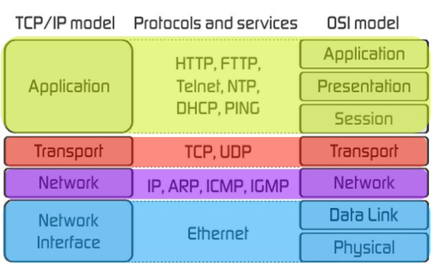

# Unix Networking

Learn the basics of Unix networking and how to make TCP connections.

<!-- slide-include ../../BANNER.md -->

**You will need**

* A Unix CLI
* An Ubuntu server with a public IP address to connect to

**Recommended reading**

* [Unix Administration](../unix-admin/)
* [Unix Processes](../unix-processes/)

<!-- START doctoc -->
<!-- END doctoc -->


## Computer networking

<!-- slide-front-matter class: center, middle -->


### OSI model

The [Open Systems Interconnection (OSI) model][osi] standardizes communications between computing system, allowing interoperability with standard protocols.

<p class='center'></p>

A layer serves the layer above it and is served by the layer below it.

### TCP/IP model

The [internet protocol suite][tcp-ip] is the conceptual model used on the Internet and similar computer networks.
It is commonly known as TCP/IP since the Transmission Control Protocol (TCP) and the Internet Protocol (IP) are its foundational protocols.

<p class='center'></p>

It was originally developed for [ARPANET][arpanet].

### OSI vs. TCP/IP

The OSI and TCP/IP models describe the same technologies, but categorize them a little differently.

<p class='center'></p>

The OSI model is used more as a theoretical construct to reason about networking systems,
while the TCP/IP model is more in line with how Internet protocols are designed and used in practice.

### IP addressing

The [Internet Protocol (IP)][ip] is the principal communications protocol of the Internet.
It allows delivering packets from a source host to a destination host based solely on IP addresses.
It is a **network layer** protocol (OSI layer 3).

Version 4 of the protocol ([**IPv4**][ipv4]), in use since 1983, uses a 32-bit address space typically represented in 4 dotted decimal notation,
with each octet containing a value between 0 and 255:

```
    `10.199.0.5`
```

Version 6 of the protocol ([**IPv6**][ipv6]) was developed more recently because the world is running out of IPv4 addresses
(4 billion IPv4 addresses is not enough in the [Internet of Things (IoT)][iot] world).
It's an [internet standard][internet-standard] since 2017.

It uses a 128-bit address space typically represented as 8 groups of 4 hexadecimal digits:

```
    `2001:0db8:0000:cbad:4321:0000:0000:1234`
```

#### IP networks

Each computer that is publicly accessible on the Internet has a **public IP address**.
To facilite routing, IP addresses are logically divided into networks.

<p class='center'></p>

For example, assuming we use the address `40.127.1.70` and a prefix of 16 bits:

* The **network prefix or identifier** would be the first 16 bits: `40.127`.
* The **host identifier** would be the last 16 bits: `1.70`.

This allows the physical routing devices that are part of the Internet to direct traffic to the correct geographical area and machine(s).

> The [Internet Assigned Numbers Authority (IANA)][iana] is the organization responsible for dividing the Internet itself into global networks,
> each in turn administered by regional organizations.
> You can find the list of registered networks in the [IPv4 Address Space Registry][iana-ipv4] and [IPv6 Address Space Registry][iana-ipv6].

#### Subnetworks

[Subnetting][subnet] can be used to further improve efficiency in the utilization of the relatively small address space available.

<p class='center'></p>

Instead of having thousands of computers in the same network all able to directly contact each other,
subnetting allows organizations to create smaller, isolated networks with fewer computers.

This can be used to define **complex network structures** within an organization or to **improve security**.

#### Reserved address spaces

Certain ranges of IP addresses are **reserved for private networks**.
In this address space you **cannot communicate with public machines** without a NAT gateway or proxy.

There are three reserved ranges in the IPv4 address space:

First address | Last address    | [Netmask][subnet] | [CIDR][cidr]
:---          | :---            | :---              | :---
10.0.0.0      | 10.255.255.255  | 255.0.0.0         | /8
172.16.0.0    | 172.31.255.255  | 255.240.0.0       | /12
192.168.0.0   | 192.168.255.255 | 255.255.0.0       | /16

Additionally, the following range is **reserved for a virtual network interface**,
allowing networking applications running on the same machine to communicate with one another:

First address | Last address    | [Netmask][subnet] | [CIDR][cidr]
:---          | :---            | :---              | :---
127.0.0.1     | 127.255.255.255 | 255.0.0.0         | /8

#### Network address translation

[Network address translation (NAT)][nat] is a method of **remapping one IP address space into another** as traffic goes through a routing device.

<!-- slide-column 40 -->

It is very commonly used for **IP masquerading**, a technique that hides an entire IP address space (such as private IP addresses) behind a single public IP address.
The router typically translates the private IP addresses of computers in an organization's network into a single public IP address assigned to the organization.

<!-- slide-column -->


<!-- slide-container -->

Other computers on the Internet see the traffic as originating from the routing device with the public IP address instead of the hidden computer in the private network.
This technique helps conserve IPv4 address space.

### Ports

In computer networking, a port is an **endpoint of communication** associated with an IP address and protocol type.
The most commonly used protocols that use ports are the [Transmission Control Protocol (TCP)][tcp] and the [User Datagram Protocol (UDP)][udp],
which are **transport layer** protocols (OSI layer 4).

A port is represented as an unsigned 16-bit number, from 0 to 65535.

For example, when a browser displays a web page, it could be making a TCP connection to a computer with IP address 40.127.1.70 on port 80.

#### Multiplexing

<!-- slide-column 45 -->

A typical computer only has one IP address.
One client can only open one connection at a time on a given IP address and port on a server.

However, ports allow the same client to initiate **multiple connections at the same time** as long as they are made to **different ports**.

<!-- slide-column -->


<!-- slide-container -->

For example, a client may open 3 simultaneous TCP connections to a server:

* On port 22 to connect with an SSH client.
* On port 25 to retrieve mails with the SMTP protocol.
* On port 80 to request a web page with a browser using the HTTP protocol.

#### Registered port numbers

The [Internet Assigned Numbers Authority (IANA)][iana] maintains a list of the [official assignments of port numbers][iana-ports] for specific uses,
although this is not always respected in practice.

Here are some of the most common:

Port    | Use
:---    | :---
20, 21  | FTP
22      | SSH
25      | SMTP
53      | DNS
80, 443 | HTTP
3306    | MySQL database
5432    | PostgreSQL database
27017   | MongoDB database

See the [full list][registered-ports].

#### Well-known ports

The port numbers in the range from 0 to 1023 are the **well-known ports** or **system ports**.
They are used by system processes that provide widely used types of network services, such as SSH or DNS.

On Unix-like operating systems, a process must execute with **superuser privileges** to be able to bind a network socket on a well-known port.

### Domain name system

The **Domain Name System (DNS)** is a hierarchical decentralized naming system for computers connected to the Internet or a private network.
Most prominently, it **translates human-readable domain names** (like `google.com`) **to numerical IP addresses** (like `40.127.1.70`) needed for locating computers with the underlying network protocols.
The Domain Name System has been an essential component of the functionality of the Internet since 1985.

<p class='center'></p>

#### DNS hierarchy

The [Internet Corporation for Assigned Names and Numbers (ICANN)][icann] is responsible for managing [top-level domains (TLDs)][tld] like `.com`.
Management of second-level domains and so on is delegated to other organizations.

<p class='center'></p>

You can buy your own [generic top-level domain][gtld] since 2012 for $185,000.


## Unix networking

<!-- slide-front-matter class: center, middle -->


> Useful commands for unix networking.

### The `ip` command

The **`ip`** command is used to manipulate and display IP network information.
Type `ip address` to check your computer's IP address(es).

```bash
$> ip address
1: `lo`: <LOOPBACK,UP,LOWER_UP> mtu 65536 qdisc noqueue ...
    link/loopback 00:00:00:00:00:00 brd 00:00:00:00:00:00
    inet `127.0.0.1`/8 scope host lo
       valid_lft forever preferred_lft forever
    inet6 `::1`/128 scope host 
       valid_lft forever preferred_lft forever
2: `eth0`: <BROADCAST,MULTICAST,UP,LOWER_UP> mtu 9001 ...
    link/ether 06:5f:44:85:36:92 brd ff:ff:ff:ff:ff:ff
    inet `172.31.39.219`/20 brd 172.31.47.255 scope global dynamic eth0
       valid_lft 2665sec preferred_lft 2665sec
    inet6 `fe80::45f:44ff:fe85:3692`/64 scope link 
       valid_lft forever preferred_lft forever
```

In this sample output, there are **two network interfaces**:

* The [virtual loopback interface][loopback] (`lo`) through which applications can communicate when executing on the computer itself.
* A physical Ethernet interface (`eth0`), which has the private IP address `172.31.39.219`.
  This is the computer's address in its local network.

### The `ping` command

The [`ping` command][ping] tests the reachability of a host on an IP network.
It measures the round-trip time for messages sent to a computer and echoed back.
The name comes from [active sonar][ping-sonar] terminology that sends a pulse of sound and listens for the echo to detect objects under water.

It uses the [Internet Control Message Protocol (ICMP)][icmp], a **network layer** protocol (OSI layer 3).

```bash
$> ping -c 1 google.com
PING `google.com` (`172.217.21.238`) 56(84) bytes of data.
64 bytes from example.net (172.217.21.238): icmp_seq=1 ttl=53 time=`1.12 ms`

--- google.com ping statistics ---
1 packets transmitted, 1 received, 0% packet loss, time 0ms
rtt min/avg/max/mdev = 1.125/1.125/1.125/0.000 ms
```

In this example, you can see that the domain name `google.com` was translated to the public IP address `172.217.21.238` by the Domain Name System,
and that the round-trip to that computer took 1.12 milliseconds.

> Remove the `-c 1` option to keep pinging once per second.

### The `traceroute` command

The [`traceroute` command][traceroute] displays the path and transit delays of packets across an IP network.

```bash
$> traceroute google.com
traceroute to google.com (172.217.22.78), 30 hops max, 60 byte packets
 1  example.amazonaws.com (54.93.0.48)  18.214 ms ...
 2  100.66.0.184 (100.66.0.184)  13.718 ms ...
 3  100.66.0.91 (100.66.0.91)  25.227 ms ...
 ...
 7  52.93.111.27 (52.93.111.27)  18.485 ms ...
 8  74.125.49.104 (74.125.49.104)  0.740 ms ...
 9  108.170.251.129 (108.170.251.129)  1.636 ms ...
10  72.14.232.35 (72.14.232.35)  0.689 ms ...
11  example.net (172.217.22.78) 0.583 ms ...
```

<!-- slide-column -->

Router addresses can be superimposed upon maps of their physical locations.
This example shows a request from New Zealand to an IP in Massachusetts which takes a route that passes through Europe.

<!-- slide-column -->


### The `mtr` command

The `mtr` command, originally named **M**att's **tr**aceroute, combines the `ping` and `traceroute` utilities into a single network diagnostic tool.

```bash
$> mtr google.com
                           My traceroute  [v0.92]
ip-172-31-39-219 (172.31.39.219)                   2018-12-05T15:55:42+0000
 Host                            Loss%   Snt   Last   Avg  Best  Wrst StDev
 1. ???
 2. ???
 3. ???
 4. 100.65.1.225                 0.0%    13    0.4   0.5   0.4   1.1   0.2
 5. 52.93.23.133                 0.0%    13    3.9   1.8   1.4   3.9   0.8
 6. 54.239.107.138               0.0%    13    1.9   2.7   1.8   7.2   1.7
 7. 52.93.111.11                 0.0%    13    1.6   2.3   1.4   9.9   2.3
 8. 209.85.149.182               0.0%    13    3.2   3.9   1.5  22.5   5.8
 9. 108.170.252.1                0.0%    13    2.4   2.3   2.1   3.0   0.2
10. 66.249.95.169                0.0%    13    2.2   2.2   1.8   3.4   0.5
11. example.net                  0.0%    13    1.2   1.2   1.2   1.5   0.1
```

### The `ss` command

The [**s**ocket **s**tatistics (`ss`) command][ss] (or the older `netstat` command) displays information about the open [**network sockets**][socket] on the computer.

> A socket is the software representation of a network communication's endpoint.
> For a TCP connection in an IP network, it corresponds to a connection made on an IP address and port number.

```bash
$> ss -tlpn
State   Recv-Q  Send-Q  Local Address:Port  Peer Address:Port
LISTEN  0       80          127.0.0.1:3306       0.0.0.0:*     mysqld...
LISTEN  0       128     127.0.0.53%lo:53         0.0.0.0:*     systemd-resolve...
LISTEN  0       128           0.0.0.0:22         0.0.0.0:*     sshd...
LISTEN  0       128              [::]:22            [::]:*     sshd...
```

The above command shows which processes are listening for TCP connections.
In this example, we can see that there is a MySQL database listening on port 3306,
a DNS resolver on port 53, and an SSH server on port 22.

### The `nc` command

The [**n**et**c**at (`nc`) command][nc] can read from and write to network connections using TCP or UDP.

```bash
$> nc -zv -w 5 google.com 80
Connection to google.com 80 port [tcp/http] succeeded!
$> nc -zv -w 5 google.com 81
nc: connect to google.com port 81 (tcp) timed out: Operation now in progress
nc: connect to google.com port 81 (tcp) failed: Network is unreachable
```

For example, the above 2 commands check whether port 80 and 81 are open on the computer reached by resolving the domain name `google.com`.


## Making connections

<!-- slide-front-matter class: center, middle -->

<p class='center'></p>

### Raw TCP connection

Assuming Bob's server has the public IP address `1.1.1.1` and Alice's server has the public IP address `2.2.2.2`.

<!-- slide-column -->

Bob should use `nc` to listen for TCP connections on port 3000:

```bash
$> nc -l 3000
```

If Bob types some text and presses Enter to send it,
it should be displayed in Alice's terminal.

```bash
$> nc -l 3000
*Hello
World
```

<!-- slide-column -->

Alice should use `nc` to connect to TCP port 3000 on Bob's server:

```bash
$> nc 1.1.1.1 3000
```

Similarly, if Alice types and sends some text, it should appear in Bob's terminal:

```bash
$> nc 1.1.1.1 3000
Hello
*World
```

<!-- slide-container -->

You have a two-way TCP connection running.

### HTTP request

Playing with TCP is all well and good, but it's a little low level.
Let's do something that your browser does every day: an HTTP request.

Find out Google's IP address (`3.3.3.3` in this example):

```bash
$> ping -c 1 google.com
PING google.com (`3.3.3.3`) 56(84) bytes of data.
64 bytes from example.net (3.3.3.3): icmp_seq=1 ttl=53 time=0.890 ms
...
```

As a reminder, a basic [HTTP request][http-req] looks like this:

```
GET /path HTTP/1.1
Header1: Value1
Header2: Value2
```

The first line, the status line, indicates the [HTTP method][http-methods], resource path and protocol version.
The next lines are [headers][http-headers] to send additional parameters to the server.

#### Making an HTTP request to Google

Open a TCP connection to the Google IP address you previously found:

```bash
$> nc 3.3.3.3 80
```

Type the following lines exactly, followed by **two new lines** to terminate the message:

```
GET / HTTP/1.1
Host: google.com
```

You have just sent an HTTP request to one of Google's servers,
asking for the website `google.com` with the `Host` header.
It should respond with something like this:

```
HTTP/1.1 301 Moved Permanently
Location: http://www.google.com/
...
```

By responding with the HTTP status code [301 Moved Permanently][http-301],
Google's server is telling you that the website `google.com` has permanently moved to `www.google.com`.

#### Following Google's redirect

The connection should still be open.
You can make another request, this time to `www.google.com`,
by typing the following lines exactly, again followed by **two new lines**:

```
GET / HTTP/1.1
Host: www.google.com
```

This time the server should send you Google's home page,
in HTML format as indicated by the `Content-Type` header:

```
HTTP/1.1 200 OK
Date: Wed, 05 Dec 2018 17:33:14 GMT
Content-Type: text/html; charset=ISO-8859-1
...

<!doctype html>
<html itemscope="" itemtype="http://schema.org/WebPage" lang="de">
...
</html>
```

### HTTP response

Let's make a real-world request with an actual browser this time.

Listen for TCP connections on your server on port 3000:

```bash
$> nc -l 3000
```

#### Making an HTTP request with a browser

Assuming that your server has the public IP address `4.4.4.4`,
visit `http://4.4.4.4:3000` in your browser.

Your browser will make an HTTP request to the computer at IP address `4.4.4.4` on port `3000`.
You should see the request in the terminal where netcat is running:

```
GET / HTTP/1.1
Host: 3.121.150.168:3000
Connection: keep-alive
Cache-Control: max-age=0
Upgrade-Insecure-Requests: 1
User-Agent: Mozilla/5.0 (Macintosh; Intel Mac OS X 10_12_6) AppleWebKit/537.36 (KHTML, like Gecko) Chrome/70.0.3538.110 Safari/537.36
Accept: text/html,application/xhtml+xml,application/xml;q=0.9,image/webp,image/apng,*/*;q=0.8
Accept-Encoding: gzip, deflate
Accept-Language: en-US,en;q=0.9,fr;q=0.8,pt;q=0.7
```

#### Sending a plain text HTTP response

Type or copy-paste the following text into the terminal:

```
HTTP/1.1 200 OK
Content-Type: text/plain

Hello World
```

Stop netcat with Ctrl-C.
The client should display the text once the connection has been closed.

#### Sending an HTTP response with HTML

Re-run the netcat command on the server:

```bash
$> nc -l 3000
```

Re-visit `http://4.4.4.4:3000` in your browser,
then type or copy-paste the following text into the terminal once you have received the request:

```
HTTP/1.1 200 OK
Content-Type: text/html

<!DOCTYPE html>
<html lang="en">
  <head>
    <meta charset="utf-8">
    <title>Some HTML</title>
    <style>body { color: red; }</style>
  </head>
  <body>
    <h1>This is HTML</h1>
  &lt;/body&gt;
&lt;/html&gt;
```

Stop netcat with Ctrl-C.
You should see the HTML text appear in your browser.


## References

* [Internet Protocol][ip]
  * [IP address](https://en.wikipedia.org/wiki/IP_address)
     * [IPv4][ipv4] & [IPv6][ipv6]
     * [Subnetworks][subnet]
     * [Network Address Translation (NAT)][nat]
  * [Ports][port]
     * [List of TCP and UDP port numbers][registered-ports]
* [Ops School Curriculum](http://www.opsschool.org/)
  * [Networking 101](http://www.opsschool.org/en/latest/networking_101.html)
  * [Networking 202](http://www.opsschool.org/en/latest/networking_201.html)
* [Unix Networking Basics for the Beginner](https://www.networkworld.com/article/2693416/unix-networking-basics-for-the-beginner.html)
* [Unix Top Networking Commands and What They Tell You](https://www.networkworld.com/article/2697039/unix-top-networking-commands-and-what-they-tell-you.html)
* [What happens when you type google.com into your browser and press enter?](https://github.com/alex/what-happens-when)


[arpanet]: https://en.wikipedia.org/wiki/ARPANET
[cidr]: https://en.wikipedia.org/wiki/Classless_Inter-Domain_Routing
[dns]: https://en.wikipedia.org/wiki/Domain_Name_System
[gtld]: https://en.wikipedia.org/wiki/Generic_top-level_domain
[http-301]: https://httpstatuses.com/301
[http-headers]: https://en.wikipedia.org/wiki/List_of_HTTP_header_fields
[http-methods]: https://developer.mozilla.org/en-US/docs/Web/HTTP/Methods
[http-req]: https://developer.mozilla.org/en-US/docs/Web/HTTP/Messages#HTTP_Requests
[http-res]: https://developer.mozilla.org/en-US/docs/Web/HTTP/Messages#HTTP_Responses
[iana]: https://www.iana.org
[iana-ipv4]: https://www.iana.org/assignments/ipv4-address-space/ipv4-address-space.xhtml
[iana-ipv6]: https://www.iana.org/assignments/ipv6-address-space/ipv6-address-space.xhtml
[iana-ports]: https://www.iana.org/assignments/service-names-port-numbers/service-names-port-numbers.xhtml
[icann]: https://en.wikipedia.org/wiki/ICANN
[icmp]: https://en.wikipedia.org/wiki/Internet_Control_Message_Protocol
[internet-standard]: https://en.wikipedia.org/wiki/Internet_Standard
[iot]: https://en.wikipedia.org/wiki/Internet_of_things
[ip]: https://en.wikipedia.org/wiki/Internet_Protocol
[ipv4]: https://en.wikipedia.org/wiki/IPv4
[ipv6]: https://en.wikipedia.org/wiki/IPv6
[loopback]: https://en.wikipedia.org/wiki/Loopback#Virtual_loopback_interface
[mtr]: https://en.wikipedia.org/wiki/MTR_(software)
[nat]: https://en.wikipedia.org/wiki/Network_address_translation
[nc]: https://en.wikipedia.org/wiki/Netcat
[osi]: https://en.wikipedia.org/wiki/OSI_model
[ping]: https://en.wikipedia.org/wiki/Ping_(networking_utility)
[ping-sonar]: https://en.wikipedia.org/wiki/Sonar#Active_sonar
[port]: https://en.wikipedia.org/wiki/Port_(computer_networking)
[registered-ports]: https://en.wikipedia.org/wiki/List_of_TCP_and_UDP_port_numbers
[socket]: https://en.wikipedia.org/wiki/Network_socket
[ss]: http://man7.org/linux/man-pages/man8/ss.8.html
[subnet]: https://en.wikipedia.org/wiki/Subnetwork
[tcp]: https://en.wikipedia.org/wiki/Transmission_Control_Protocol
[tcp-ip]: https://en.wikipedia.org/wiki/Internet_protocol_suite
[tld]: https://en.wikipedia.org/wiki/Top-level_domain
[traceroute]: https://en.wikipedia.org/wiki/Traceroute
[udp]: https://en.wikipedia.org/wiki/User_Datagram_Protocol
