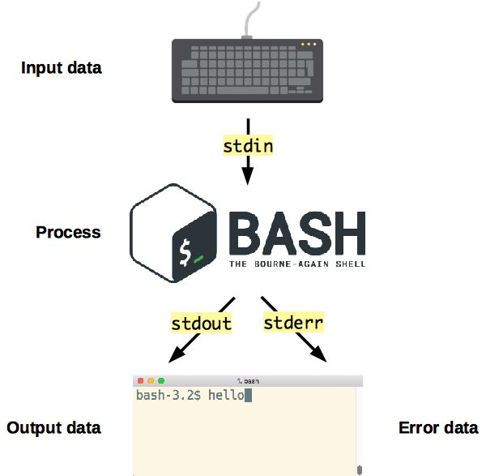

# Unix Processes

Learn about processes in Unix operating systems, as well as how to manage them and make them communicate.

<!-- slide-include ../../BANNER.md -->

**You will need**

* A Unix CLI
* An Ubuntu server to connect to

**Recommended reading**

* [Command Line Introduction](../cli/)
* [Secure Shell (SSH)](../ssh/)

<!-- START doctoc -->
<!-- END doctoc -->


## What is a process?

A [process][process] is an **instance of a computer program that is being executed**.

<!-- slide-column -->

This is a C **program**.
A program is a passive collection of **instructions stored on disk**:

```c
 #include <stdio.h>

int main()
{
   printf("Hello, World!");
   return 0;
}
```

<!-- slide-column -->

A **process** is the actual **execution of a program** that has been loaded into memory:

<p class='center'>
  
  
</p>

<!-- slide-container -->

**Every time you run an executable** file or an application, **a process is created**.
Simple programs only need one process.
More complex applications may launch other child processes for greater performance.
For example, most modern browsers will run at least one child process per tab.


### Unix processes

Processes work differently depending on the operating system.
We will focus on processes in Unix-like systems,
which have the following features:

| Feature                     | Description                                                                                                         |
| :---                        | :---                                                                                                                |
| [Process ID (PID)][pid]     | A number uniquely identifying a process at a given time.                                                            |
| [Exit status][exit-status]  | A number given when a process exits, indicating whether it was successful.                                          |
| [Standard streams][streams] | Preconnected input and output communication channels between a process and its environment.                         |
| [Pipelines][pipes]          | A way to chain processes in sequence by their standard streams, a form of [inter-process communication (IPC)][ipc]. |
| [Signals][signals]          | Notifications sent to a process, a form of [inter-process communication (IPC)][ipc].                                |

> These features have been standardized for Unix-like systems
> as the [Portable Operating System Interface (POSIX)][posix].


## Process ID

<!-- slide-front-matter class: center, middle -->

> Identifying running processes.

<p class='center'></p>

### What is a process identifier?

Any process that is created in a Unix-like system is assigned an **identifier (or PID)**.
This ID can be used to reference the process, for example to terminate it with the `kill` command.
Each new process gets the next available PID.

PIDs are sometimes reused as processes die and are created again,
but **at any given time, a PID uniquely identifies a specific process**.

The process with PID 0 is the **system process**,
the most low-level process managed directly by the kernel.

The first thing it does is run the **[init process][init]**, which naturally gets PID 1 (the next available PID).
The init process is responsible for initializing the system.
Most other processes are either launched by the init process directly, or by one of its children.

All processes retain a reference to the **parent process** that launched it.
The ID of the parent process is commonly called **PPID (parent process ID)**.

### The `ps` command

The `ps` (**p**rocess **s**tatus) command displays currently-running processes:

```bash
$> ps
  PID TTY          TIME CMD
14926 pts/0    00:00:00 bash
14939 pts/0    00:00:00 ps
```

You can obtain more information with the `-f` (full format) option:

```bash
$> ps -f
UID        PID  PPID  C STIME TTY          TIME CMD
root     15237 15158  1 17:48 pts/0    00:00:00 -bash
root     15251 15237  0 17:48 pts/0    00:00:00 ps -f
```

#### Listing all processes

Of course, there are more than 2 processes running on your computer.
Add the `-e` (every) option to see all running processes.
The list will be much longer.
This is an abbreviated example:

```bash
$> ps -ef
UID        PID  PPID  C STIME TTY          TIME CMD
root         1     0  0 09:38 ?        00:00:30 /sbin/init
root         2     0  0 09:38 ?        00:00:30 [kthread]
...
root       402     1  0 09:39 ?        00:00:00 /lib/systemd/systemd-journald
syslog     912     1  0 09:39 ?        00:00:00 /usr/sbin/rsyslogd -n
root      1006     1  0 09:39 ?        00:00:00 /usr/sbin/cron -f
...
root      1700     1  0 Sep11 ?        00:00:00 /usr/sbin/sshd -D
jdoe      3350  1700  0 17:52 ?        00:00:00 sshd: jdoe@pts/0
jdoe      3378  3350  0 15:32 pts/0    00:00:00 -bash
jdoe      3567  3378  0 15:51 pts/0    00:00:00 `ps -ef`
```

> Note that the command you just ran, `ps -ef`, is in the process list (at the bottom in this example).
> This is because it was running while it was listing the other processes.

#### Process tree

On some Linux distributions like Ubuntu,
the `ps` command also accepts a `--forest` option which visually shows the relationship between processes and their parent:

```bash
$> ps -ef --forest
UID        PID  PPID  C STIME TTY          TIME CMD
...
root      1700     1  0 Sep11 ?        00:00:00 /usr/sbin/sshd -D
jdoe      3350  1700  0 17:52 ?        00:00:00  \_ sshd: jdoe@pts/0
jdoe      3378  3350  0 15:32 pts/0    00:00:00      \_ -bash
jdoe      3567  3378  0 15:51 pts/0    00:00:00          \_ ps -ef
```

You can clearly see that:

* Process 1700, the SSH server (`d` is for [daemon][daemon]),
  was launched by the init process (PID 1) and is run by `root`.
* Process 3350 was launched by the SSH server when you connected.
  It represents your terminal device, named `pts/0` here.
* Process 3378 is the bash login shell that was launched when you connected
  and is attached to terminal `pts/0`.
* Process 3567 is the `ps` command you launched from the shell.

### Running more processes

Let's run some other processes and see if we can list them.

Open a new terminal on your local machine and connect to the same server.

If you go back to the first terminal and run the `ps` command again,
you should see both virtual terminal processes corresponding to your 2 terminals,
as well as the 2 bash shells running within them:

```bash
$> ps -ef --forest
...
root      1700     1  0 Sep11 ?        00:00:00 /usr/sbin/sshd -D
jdoe      3350  1700  0 18:21 ?        00:00:00  \_ sshd: jdoe@pts/0
jdoe      3378  3350  0 18:21 pts/0    00:00:00  |   \_ -bash
jdoe      3801  3378  0 18:22 pts/0    00:00:00  |       \_ ps -ef --forest
jdoe      3789  1700  0 18:21 ?        00:00:00  \_ sshd: jdoe@pts/1
jdoe      3791  3789  0 18:21 pts/1    00:00:00      \_ -bash
```

#### Sleeping process

Run a `sleep` command in the second terminal:

```bash
$> sleep 1000
```

It launches a process that does nothing for 1000 seconds, but keeps running.

It will block your terminal during that time,
so go back to the other terminal and run the following `ps` command,
with an additional `-u jdoe` option to filter only processes belonging to your user:

```bash
$> ps -f -u jdoe --forest
UID        PID  PPID  C STIME TTY          TIME CMD
...
jdoe      3350  1700  0 09:39 ?        00:00:00 sshd: jdoe@pts/0
jdoe      3378  3350  0 09:39 pts/0    00:00:00  \_ -bash
jdoe      3823  3378  0 16:41 pts/0    00:00:00      \_ ps -f -u jdoe --forest
jdoe      3789  1700  0 15:32 ?        00:00:00 sshd: jdoe@pts/1
jdoe      3791  3789  0 15:32 pts/1    00:00:00  \_ -bash
jdoe      3812  3791  0 16:31 pts/1    00:00:00      \_ `sleep 1000`
```

You can indeed see the running process started with the `sleep` command.
You can stop it with `Ctrl-C` (in the terminal when it's running) when you're done.

### Other monitoring commands

Here are other ways to inspect processes and have more information on their resource consumption:

* The [`top` command][top] (meaning **t**able **o**f **p**rocesses) show processes along with CPU and memory consumption.
  It's an interactive command you can exit with `q`.
* The [`htop` command][htop] does the same thing, but is prettier
  (although not all Linux distributions have it installed by default).
* The [`free` command][free] is not directly related to processes,
  but it helps you know how much memory is remaining on your system.

```bash
$> free -m
              total        used        free      shared  buff/cache   available
Mem:            985          90         534           0         359         751
Swap:             0           0           0
```


## Exit status

<!-- slide-front-matter class: center, middle -->

> How children indicate success to their parent.

<p class='center'></p>

### What is an exit status?

The **exit status** of a process is a small number (typically from 0 to 255) passed
from a child process to its parent process when it has finished executing.

It is meant to allow the child process to indicate how or why it exited.

It's common practice for the exit status of Unix/Linux programs to be **0 to indicate success**,
and **greater than 0 to indicate an error**
(it is sometimes also called an *error level*).

### Retrieving the exit status in a shell

In a typical shell like [Bash][bash],
you can retrieve the exit status of last executed command from the special variable `$?`:

```bash
$> ls /
...

$> echo $?
0

$> ls file-that-does-not-exist
ls: cannot access 'file-that-does-not-exist': No such file or directory

$> echo $?
2
```

### Retrieving the exit status in code

This is not a feature that is limited to command line use.
When running a program from an application, you can also obtain the exit status.

For example:

* By using the `&$return_var` reference when calling PHP's [`exec` function][php-exec].
* By calling the [`Process#exitValue()` method][java-process-exit-value] after calling `Runtime#exec(String command)` in Java.
* By listening to the `close` event when calling Node.js's [`spawn` function][node-spawn].

### Meaning of exit statuses

The meaning of exit statuses is unique to the program you are running.
For example, the manual of the `ls` command documents the following values:

```bash
Exit status:
  0      if OK,
  1      if minor problems (e.g., cannot access subdirectory),
  2      if serious trouble (e.g., cannot access command-line argument).
```

But this will be different for other programs or applications.

The only thing you can rely on for the majority of programs
is that **0 is good, anything else is probably bad**.


## Standard streams

<!-- slide-front-matter class: center, middle -->

> **Standard streams** are preconnected input and output
> communication channels between a process and its environment.

<p class='center'></p>

### The good old days

In **pre-Unix** systems, programs had to **explicitly connect to input and output devices**.
This was done differently for each device (e.g. magnetic tape drive, disk drive, printer, etc) and operating system.
For example, IBM mainframes used a [job control language (JCL)][jcl] to establish connections between programs and devices.

<!-- slide-column 25 -->

**Unix file copy**

`cp a.txt b.txt`

<!-- slide-column -->

**JCL copy instructions for [OS/360][os360]**

```
//IS198CPY JOB (IS198T30500),'COPY JOB',CLASS=L,MSGCLASS=X
//COPY01   EXEC PGM=IEBGENER
//SYSPRINT DD SYSOUT=*
//SYSUT1   DD DSN=a.txt,DISP=SHR
//SYSUT2   DD DSN=b.txt,
//            DISP=(NEW,CATLG,DELETE),
//            SPACE=(CYL,(40,5),RLSE),
//            DCB=(LRECL=115,BLKSIZE=1150)
//SYSIN  DD DUMMY
```

### Unix streams

Unix introduced **abstract devices** and the concept of a **data stream**:
an ordered sequence of data bytes which can be read until the end of file (EOF).

A program may also write bytes as desired and need not declare how many there will be or how to group them.
The data going through a stream may be **text** with any encoding **or binary data**.

This was groundbreaking at the time because a program no longer had to know or care what kind of device it is communicating with,
as had been the case until then.

#### stdin, stdout & stderr

Any new Unix process is **automatically connected** to the following streams out of the box:

Stream          | Shorthand | Description
:---            | :---      | :---
Standard input  | `stdin`   | Stream **data** (often text) **going into a program**.
Standard output | `stdout`  | Stream where a program writes its **output data**.
Standard error  | `stderr`  | Another output stream programs can use to output **error messages or diagnostics**. It is independent from standard output, allowing output and errors to be distinguished.

> There are 2 output streams in order to solve the [semipredicate problem][semipredicate]:
> it's difficult to distinguish between actual output data and error messages
> if both are in the form of text and displayed in the same place.

#### Streams, the keyboard, and the terminal

<!-- slide-column 45 -->

Another Unix breakthrough was to **automatically associate**:

* The **input stream** with your **terminal keyboard**;
* The **output and error streams** with your **terminal display**.

This is done by default unless a program chooses to do otherwise.

For example, when your favorite shell, e.g. [Bash][bash], is running,
it automatically receives keyboard input, and its output data and errors are automatically displayed in the terminal.

<!-- slide-column -->



#### Stream inheritance

A child will **automatically inherit the standard streams of its parent process**
(unless redirected, more on that later).

For example, when you run an `ls` command,
you do not have to specify that the resulting list of directories should be displayed in the terminal.
The standard output of the parent process, in this case your shell (e.g. Bash) is inherited by the `ls` process.

Similarly, when you run an SSH client with the `ssh` command to communicate with another machine,
you do not have to explicitly connect your keyboard input to this new process.
As it's a child process of the shell, it inherits the same standard input.

#### Optional input stream

A process is not obligated to use its input or output streams.
For example, **the `ls` command** produces output (or an error) but **takes no input**
(it has arguments, but that does not come from the input data stream).

<p class='center'></p>

#### Optional output stream

**The `cd` command** takes no input and **produces no output** either,
although it can produce an error.

<p class='center'></p>

### Stream redirection

The standard streams can be **redirected**.

Redirection means capturing output from a file or command,
and sending it as input to another file or command.

Any Unix process has a number of [file descriptors][fd].
They are an abstract indicator used to access a file or other input/output resource such as a pipe or socket.

The first 3 file descriptors correspond to the standard streams by default:

File descriptor | Stream
:---            | :---
`0`             | Standard input (`stdin`)
`1`             | Standard output (`stdout`)
`2`             | Standard error (`stderr`)

### Redirect standard output stream

The `>` shell operator **redirects an output stream**.

For example, the following line runs the `ls` command,
but instead of displaying the result in the terminal,
the **standard output stream (file descriptor `1`) is redirected** to the file `data.txt`.

```bash
$> ls -a `1> data.txt`
```

#### How to use standard output redirection

You can do the same with any command that produces output:

```bash
$> echo Hello `1> data.txt`
```

Note that the `>` operator **overwrites the file**.
Use `>>` instead to **append to the end of the file**:

```bash
$> echo World `1>> data.txt`
```

If you specify no file descriptor, **standard output is redirected by default**:

```bash
$> echo Hello `> data.txt`
$> echo Again `>> data.txt`
```

### Redirect standard error stream

Note that error messages are not redirected using the redirect operator like in the previous example.
They are still displayed in the terminal and the file remains empty:

```bash
$> ls unknown-file `> error.txt`
ls: unknown-file: No such file or directory

$> cat error.txt
```

This is because **most commands send errors to the standard error stream (file descriptor `2`)** instead of the standard output stream.

If you want to redirect the error message to a file, you must **redirect the standard error stream instead**:

```bash
$> ls unknown-file `2> error.txt`

$> cat error.txt
ls: unknown-file: No such file or directory
```

### Both standard output and error streams

Some commands will **send data to both output streams** (standard output and standard error).
As we've seen, both are displayed in the terminal by default.

For example, the `curl` (**C**lient **URL**) command is used to make HTTP requests.
By default, it only outputs the HTTP response body to the standard output stream,
but with the `-v` option it also prints diagnostics information to the standard error stream:

```bash
$> `curl -L -v https://git.io/fAp8D`
  % Total    % Received % Xferd  Average Speed   Time    Time     Time  Current
                                 Dload  Upload   Total   Spent    Left  Speed
  0     0    0     0    0     0      0      0 --:--:-- --:--:-- --:--:--     0
 TCP_NODELAY set
 Connected to git.io (54.152.127.232) port 443 (#0)
...
Hello World
...
```

Here, `Hello World` is the output data, while the rest of the output is the diagnostics information on the standard error stream.

#### Redirect standard output stream (curl)

This example demonstrates how the **standard output and error streams** can be **redirected separately**.

The following version redirects standard output to the file `curl-output.txt`.
As you can see, the `Hello World` output data is no longer displayed since it has been redirected to the file,
but the diagnostics information printed on the standard error stream is still displayed:

```bash
$> curl -L -v https://git.io/fAp8D `> curl-output.txt`
  % Total    % Received % Xferd  Average Speed   Time    Time     Time  Current
                                 Dload  Upload   Total   Spent    Left  Speed
  0     0    0     0    0     0      0      0 --:--:-- --:--:-- --:--:--     0
 TCP_NODELAY set
 Connected to git.io (54.152.127.232) port 443 (#0)
...

$> ls
curl-output.txt

$> cat curl-output.txt
Hello World
```

#### Redirect standard error stream (curl)

The following version redirects standard error to the file `curl-error.txt`.
This time, the `Hello World` output data is displayed in the terminal as with the initial command,
but the diagnostics information has been redirected to the file:

```bash
$> curl -L -v https://git.io/fAp8D `2> curl-error.txt`
Hello World

$> ls
curl-error.txt curl-output.txt

$> cat curl-error.txt
  % Total    % Received % Xferd  Average Speed   Time    Time     Time  Current
                                 Dload  Upload   Total   Spent    Left  Speed
  0     0    0     0    0     0      0      0 --:--:-- --:--:-- --:--:--     0
 TCP_NODELAY set
 Connected to git.io (54.152.127.232) port 443 (#0)
...
```

#### Redirect both standard output and error streams (curl)

You can **perform both redirections at once** in one command:

```bash
$> curl -L -v https://git.io/fAp8D `> curl-output.txt 2> curl-error.txt`

$> ls
curl-error.txt curl-output.txt

$> cat curl-error.txt
  % Total    % Received % Xferd  Average Speed   Time    Time     Time  Current
                                 Dload  Upload   Total   Spent    Left  Speed
  0     0    0     0    0     0      0      0 --:--:-- --:--:-- --:--:--     0
 TCP_NODELAY set
 Connected to git.io (54.152.127.232) port 443 (#0)
...

$> cat curl-output.txt
Hello World
```

#### Combine standard output and error streams (curl)

In some situations, you might want to **redirect all of a command's output**
(both the standard output stream and error stream) to the same file.

You can do that with the `&>` operator:

```bash
$> curl -L -v https://git.io/fAp8D `&> curl-result.txt`

$> cat curl-result.txt
  % Total    % Received % Xferd  Average Speed   Time    Time     Time  Current
                                 Dload  Upload   Total   Spent    Left  Speed
  0     0    0     0    0     0      0      0 --:--:-- --:--:-- --:--:--     0
 TCP_NODELAY set
 Connected to git.io (54.152.127.232) port 443 (#0)
...
Hello World
...
```

> `&> file.txt` is equivalent to using both `1> file.txt` and `2> file.txt`.

### Discard an output stream

Sometimes you might not be interested in one of the output streams.

For example, let's say you want to display the diagnostics information from a `curl` command to identify a network issue,
but you **don't care about the standard output**.
You don't want to have to delete a useless file either.

#### The `/dev/null` device

The file `/dev/null` is available on all Unix-like systems and is a [**null device**][null-device] (sometimes also called a *black hole*).
It's a [Unix device file][device-file] that you can write anything to, but that will discard all received data.

It never contains anything:

```bash
$> cat /dev/null
```

Even after you write to it:

```bash
$> echo Hello World > /dev/null

$> cat /dev/null
```

#### Redirect a stream to the null device

When you don't care about an output stream, you can simply **redirect it to the null device**.
In this example, the standard output stream is redirected to the null device, and therefore discarded,
while the standard error stream is displayed normally:

```bash
$> curl -L -v https://git.io/fAp8D `> /dev/null`
  % Total    % Received % Xferd  Average Speed   Time    Time     Time  Current
                                 Dload  Upload   Total   Spent    Left  Speed
  0     0    0     0    0     0      0      0 --:--:-- --:--:-- --:--:--     0
 TCP_NODELAY set
 Connected to git.io (54.152.127.232) port 443 (#0)
...
```

> Please send complaints to `/dev/null`.

#### Other redirections to the null device

You can also redirect the standard error stream to the null device:

```bash
$> curl -L -v https://git.io/fAp8D `2> /dev/null`
Hello World
```

Or you can redirect both output streams.
In this case, all output, diagnostics information and error messages will be discarded:

```bash
$> curl -L -v https://git.io/fAp8D `&> /dev/null`
```

### Redirect one output stream to another

You can also redirect one output stream into another output stream.

<!-- slide-column -->

For example, the `echo` command prints its data to the standard output stream by default:

<!-- slide-column -->

```bash
$> echo Hello World
Hello World

$> echo Hello World > /dev/null

$> echo Hello World 2> /dev/null
Hello World
```

<!-- slide-container -->

The `i>&j` operator redirects file descriptor `i` to file descriptor `j`.

<!-- slide-column -->

This `echo` command has its data redirected to the standard error stream:

<!-- slide-column 60 -->

```bash
$> echo Hello World `1>&2`
Hello World

$> echo Hello World `> /dev/null 1>&2`
Hello World

$> echo Hello World `2> /dev/null 1>&2`
```

<!-- slide-container -->

> This can be useful if you're writing a shell script
and want to print error messages to the standard error stream.

### Redirect standard input stream

Just as a command's output can be redirected to a file, its **input can be redirected from a file**.

Let's create a file for this example:

```bash
$> echo foo > bar.txt
```

<!-- slide-column -->

The `cat` command can read a file by having it specified as an argument:

<!-- slide-column -->

```bash
$> cat bar.txt
foo
```

<!-- slide-container -->

<!-- slide-column -->

If given no argument, it will **read and display the data from its standard input stream** (as you type on your keyboard and press `Enter`):

<!-- slide-column -->

```bash
$> cat
Hello
Hello
World
World
```

<!-- slide-container -->

<!-- slide-column -->

The `<` operator will **redirect a file into a command's standard input stream**:

<!-- slide-column -->

```bash
$> cat `< bar.txt`
foo
```

#### Here documents

The `<<` operator also performs **standard input stream redirection** but is a bit different.
It's called a [**here document**][here-document]
and can be used to to send multiline input to a command,
preserving line breaks and other whitespace.

Typing the following command `cat` command starts a here document delimited by the string `EOF`:

```bash
$> cat `<< EOF`
Hello
World
EOF
```

> After you type the first line, you won't get a prompt back.
> The here document remains open and you can type more text.
> Typing `EOF` again and pressing `Enter` closes the document.

The same text you typed will be printed by `cat`, with line breaks preserved:

```
Hello
World
```


## Pipelines

<!-- slide-front-matter class: center, middle -->

> The [**Unix philosophy**][unix-philosophy]: the power of a system comes more from the relationships among programs than from the programs themselves.

<p class='center'></p>

### What is a pipeline?

Remember that all Unix systems standardize the following:

* All processes have a standard input stream.
* All processes have a standard output stream.
* Data streams transport text or binary data.

Therefore, the **standard output stream** of process A can be **connected to the standard input stream** of another process B.

<p class='center'></p>

Processes can be **chained into a pipeline, each process transforming data and passing it to the next process**.

### A simple pipeline

The `|` operator (a vertical pipe) is used to connect two processes together.

Let's use two commands, one that prints text as output and one that reads text as input:

<!-- slide-column -->

* The `ls` (**l**i**s**t) command produces a list of files and directories.
* The `wc` (**w**ord **c**ount) command can count words, lines, characters or bytes.
  With the `-l` option, it counts the number of lines in its input.

You can pipe them together like this:

```bash
$> ls -a | wc -l
```

This **redirects (pipes) the output of the `ls` command into the input of the `wc` command**.

<!-- slide-column -->


### The Unix philosophy

Pipelines are one of the core features of Unix-like systems.

Because **Unix programs** can be easily chained together,
they **tend to be simpler and smaller**.
Complex tasks can be achieved by chaining many small programs together.

This is, in a few words, the [Unix philosophy][unix-philosophy]:

* Write programs that **do one thing and do it well**.
* Write programs to **work together**.
* Write programs to **handle text streams**, because that is a universal interface.

> Although many programs handle text streams, others also handle binary streams.
> For example, the [ImageMagick][imagemagick] library can process images.

### A more complex pipeline

This command pipeline combines 5 different commands,
processing the text data at each step and passing it along to the next command to arrive at the final result.
**Each of these commands only knows how to do one thing**:

<!-- slide-column 40 -->

```bash
$> `find . -type f | \`
   `sed 's/.*\///' | \`
   `egrep ".+\.[^\.]+$" | \`
   `sed 's/.*\.//' | \`
   `sort | \`
   `uniq -c`

 147 jpg
10925 js
2158 json
  15 less
  45 map
1515 md
```

<!-- slide-column -->

* `find` is used to recursively list all files in the current directory.
* `sed` (**s**tream **ed**itor) is used to obtain the files' basenames.
* `egrep` is used to filter out names that do not have an extension.
* `sed` is used again to transform basenames into just their extension.
* `sort` is used to sort the resulting list alphabetically.
* `uniq` is used to group identical adjacent lines and count them.

The final result is a list of file extensions and the number of files with that extension.

### Trying it out

Here's a link to a file containing some text: https://git.io/fAjRa

Download it to your computer with the following command:

```bash
$> curl -L https://git.io/fAjRa > rainbow.txt
```

#### Pipelines and redirections

Start by simply displaying the file:

```bash
$> cat rainbow.txt
Somewhere over the rainbow
...
```

**Use command pipelines and stream redirections to**:

* Count the number of lines and characters in the text.
* Print the lines of the text containing the word `rainbow`.
  * Do the same but without any duplicates
* Print the second word of each line in the text.
* Compress the text and save it to `rainbow.txt.gz`.
* Count the number of times the letter `e` or the word `the` is used.
* Display a list of the unique words in the text along with the number of times each word is used,
  sorted from the least used to the most used.

> For example, `cat rainbow.txt | wc -w` counts the number of words in the text.

#### Your tools

Here are commands you might find useful for the exercise.
They all operate on the data received from their standard input stream,
and print the result on their standard output stream,
so they can be piped into each other:

.commands-table[

Command                             | Description
:---                                | :---
`cut -d ' ' -f <n>`                 | Select word in column `<n>` of each line (using one space as the delimiter).
`fold -w 1`                         | Print one character by line.
`grep <letterOrWord>`               | Select only lines that contain a given letter or word, e.g. `grep foo`.
`gzip -c`                           | Compress data.
`sort`                              | Sort lines alphabetically.
`tr '[:upper:]' '[:lower:]'`        | Convert all uppercase characters to lowercase.
`tr -s '[[:punct:][:space:]]' '\n'` | Split by word.
`uniq [-c]`                         | Filter out repeated lines (`-c` also counts them).
`wc [-l] [-w] [-m]`                 | Count lines, words or characters.

]


## Signals

<!-- slide-front-matter class: center, middle -->

> Sending notifications to processes, and then killing them.

<p class='center'></p>

### What is a signal?

A signal is an **asynchronous notification sent to a process** to notify it that an event has occurred.

<p class='center'></p>

If the process has registered a **signal handler** for that specific signal, it is executed.
Otherwise the **default signal handler** is executed.

### Common Unix signals

A signal is defined by the `SIG` prefix followed by a mnemonic name for the signal.
Some signals also have a standard number assigned to them.
Here are the most commonly encountered Unix signals:

Signal     | Number | Default handler       | Description
:---       | ---:   | :---                  | :---
`SIGHUP`   | 1      | Terminate             | Hangup.
`SIGINT`   | 2      | Terminate             | Terminal interrupt signal.
`SIGKILL`  | 9      | Terminate             | Kill (cannot be caught or ignored).
`SIGQUIT`  | 3      | Terminate (core dump) | Terminal quit signal.
`SIGTERM`  | 15     | Terminate             | Termination signal.
`SIGUSR1`  | -      | Terminate             | User-defined signal 1.
`SIGUSR2`  | -      | Terminate             | User-defined signal 2.
`SIGWINCH` | -      | Ignore                | Terminal window size changed.

Here's a more complete list: [POSIX signals][signals-list].

#### The terminal interrupt signal (`SIGINT`)

When you type `Ctrl-C` in your terminal to terminate a running process, you are actually using Unix signals.

The shortcut is interpreted by your shell,
which then sends a **terminal interrupt signal**, or **`SIGINT`**, to the running process.

Most processes handle that signal by terminating (altough some don't respond to it, like some interactive helps, e.g. `man ls`).

### The `kill` command

The `kill` command **sends a signal to a process**.

Since the default signal handler for most signals is to terminate the process,
it often has that effect, hence the name "kill".

Its syntax is:

```
kill [-<SIGNAL>] <PID>
kill [-s <SIGNAL>] <PID>
```

.commands-table[

Command             | Effect
:---                | :---
`kill 10000`        | Send the **default `SIGTERM` signal** to process with PID `10000`.
`kill -s HUP 10000` | Send the `SIGHUP` signal to that same process.
`kill -HUP 10000`   | Equivalent to the previous command.
`kill -1 10000`     | Equivalent to the previous command (1 is the official POSIX number for `SIGHUP`).

]

#### Trapping signals

This command will run a
[badly behaved script](https://gist.github.com/AlphaHydrae/162f28e3e2bd9355a95914e04cd4dd0c/91dda64d9e0ca26168d25195a189ca6a69a14ee6)
which traps and ignores all signals sent to it:

```bash
$> curl -s -L https://git.io/fxTKY|sh -s
Hi, I'm running with PID 10000
Try and kill me!
```

Since it ignores the `SIGINT` signal among others,
you will not be able to stop it with `Ctrl-C`.

Open another terminal and try to kill the process by referring to its PID
(which is `10000` in this example but will be different on your machine):

```bash
$> kill 10000
$> kill -s HUP 10000
$> kill -s QUIT 10000
$> kill -s USR1 10000
```

The script will simply log that it is ignoring your signal and continue executing.

#### The `KILL` signal

There is one signal that cannot be ignored: **the `KILL` signal**.

Although a process can detect the signal and attempt to perform additional operations,
**the OS will permanently kill the process** shortly after it is received,
and the process can do nothing to prevent it.

Send a `KILL` signal to the process with the same PID as before:

```bash
$> kill -s KILL 10000
```

The script will finally have the decency to die.

### Unix signals in the real world

Many widely-used programs react to Unix signals, for example:

* [Nginx][nginx-signals]
* [PostgreSQL][postgres-signals]
* [OpenSSH][sshd-signals]

<!-- slide-column -->

A common example is the `SIGHUP` signal.
Originally it was meant to indicate that the modem hanged up.

That's not relevant to programs not directly connected to a terminal, but some programs repurposed it for another use.

Many background services like Nginx and PostgreSQL will reload their configuration (without shutting down) when receiving that signal.
Many other tools follow this convention.

<!-- slide-column 30 -->


## References

* [I/O Redirection (The Linux Documentation Project)](https://www.tldp.org/LDP/abs/html/io-redirection.html)
* [Here Documents (The Linux Documentation Project)][here-document]
* [Unix/Linux - Shell Input/Output Redirections](https://www.tutorialspoint.com/unix/unix-io-redirections.htm)
* [Signals - Unix fundamentals 201 - Ops School Curriculum](http://www.opsschool.org/en/latest/unix_signals.html)


[bash]: https://en.wikipedia.org/wiki/Bash_(Unix_shell)
[daemon]: https://en.wikipedia.org/wiki/Daemon_(computing)
[device-file]: https://en.wikipedia.org/wiki/Device_file
[exit-status]: https://en.wikipedia.org/wiki/Exit_status
[fd]: https://en.wikipedia.org/wiki/File_descriptor
[free]: https://www.howtoforge.com/linux-free-command/
[here-document]: http://tldp.org/LDP/abs/html/here-docs.html
[htop]: https://hisham.hm/htop/
[imagemagick]: https://en.wikipedia.org/wiki/ImageMagick
[init]: https://en.wikipedia.org/wiki/Init
[ipc]: https://en.wikipedia.org/wiki/Inter-process_communication
[java-process-exit-value]: https://docs.oracle.com/javase/7/docs/api/java/lang/Process.html#exitValue()
[jcl]: https://en.wikipedia.org/wiki/Job_Control_Language
[nginx-signals]: http://nginx.org/en/docs/control.html
[node-spawn]: https://nodejs.org/api/child_process.html#child_process_child_process_spawn_command_args_options
[null-device]: https://en.wikipedia.org/wiki/Null_device
[os360]: https://en.wikipedia.org/wiki/OS/360_and_successors
[php-exec]: http://php.net/manual/en/function.exec.php
[pid]: https://en.wikipedia.org/wiki/Process_identifier
[pipes]: https://en.wikipedia.org/wiki/Pipeline_(Unix)
[posix]: https://en.wikipedia.org/wiki/POSIX
[postgres-signals]: https://www.postgresql.org/docs/current/static/app-postgres.html#id-1.9.5.13.9
[process]: https://en.wikipedia.org/wiki/Process_(computing)
[ps-fields]: https://kb.iu.edu/d/afnv
[semipredicate]: https://en.wikipedia.org/wiki/Semipredicate_problem#Multivalued_return
[signals]: https://en.wikipedia.org/wiki/Signal_(IPC)
[signals-list]: https://en.wikipedia.org/wiki/Signal_(IPC)#POSIX_signals
[sshd-signals]: https://linux.die.net/man/8/sshd
[streams]: https://en.wikipedia.org/wiki/Standard_streams
[top]: https://linux.die.net/man/1/top
[unix-philosophy]: https://en.wikipedia.org/wiki/Unix_philosophy
